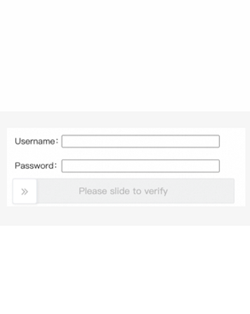

import Tabs from '@theme/Tabs';
import TabItem from '@theme/TabItem';
import ParamItem from '@theme/ParamItem';
import MethodItem from '@theme/MethodItem';
import ImageWrap from '@theme/ImageWrap';
import ImagesLayout from '@theme/ImagesLayout';
import MethodDescription from '@theme/MethodDescription'
import PriceBlock from '@theme/PriceBlock';
import PriceBlockWrap from '@theme/PriceBlockWrap';
import { ArticleHead } from '../../src/theme/ArticleHead';

<ArticleHead slug="captchas/alibaba-task" />

# Alibaba Cloud Captcha

<PriceBlockWrap>
  <PriceBlock title="Alibaba Captcha" captchaId="alibabacaptcha"/>
</PriceBlockWrap>

## Примеры заданий

Ниже представлены примеры типов заданий Alibaba Captcha, которые на данный момент поддерживаются сервисом CapMonster Cloud:

<ImagesLayout gap="16px" columns={3}>
  <ImageWrap title="Puzzle"></ImageWrap>
  <ImageWrap title="Image restoration"></ImageWrap>
  <ImageWrap title="Click"></ImageWrap>
</ImagesLayout>

<ImagesLayout gap="16px" columns={3}>
  <ImageWrap title="Slider"></ImageWrap>
  <ImageWrap title="Checkbox"></ImageWrap>
</ImagesLayout>

:::warning **Внимание!**
CapMonster Cloud по умолчанию работает через встроенные прокси — они уже включены в стоимость. Указывать собственные прокси требуется только в тех случаях, когда сайт не принимает токен или доступ к встроенным сервисам ограничен.

Если прокси с авторизацией по IP, то необходимо добавить адрес **65.21.190.34** в белый список.
:::

## Параметры запроса

<div className="bordered-panel">

  <ParamItem title="type" required type="string" />
  **CustomTask**

  ---

  <ParamItem title="class" required type="string" />
  **alibaba**

   --- 

  <ParamItem title="websiteURL" required type="string" />
  Полный URL страницы с капчей.

  ---

  <ParamItem title="sceneId (внутри metadata)" required type="string" />

  Идентификатор сценария капчи, передаётся в следующем формате: `"sceneId":"1ww7426c4"`— **значение указано в качестве примера**. <br />
  Используйте собственное значение — инструкции по его получению приведены в [соответствующем разделе](#sceneid)

  ---
  <ParamItem title="prefix (внутри metadata)" required type="string" />

  Параметр инициализации капчи, передаётся в URL запроса, используемого для загрузки текста задания на странице.<br />
  Например, если URL имеет вид: `https://dlw3kug.captcha-open.example.aliyuncs.com/`, то значение параметра `prefix` соответствует поддомену — `dlw3kug`.

---

<div style={{
  border: "1px solid #b1b1b1ff",
  borderRadius: "8px",
  padding: "12px",
  margin: "12px 0"
}}>

**Для некоторых сайтов требуется передавать дополнительные параметры:** 

Указывайте данные параметры только при их наличии на сайте (*см. подробнее в разделе [Работа с сайтами, содержащими расширенные параметры](#работа-с-сайтами-содержащими-расширенные-параметры)*).

<ParamItem title="userId (внутри metadata)" type="string" />
Уникальный идентификатор пользователя или сессии на стороне сайта. <br />
Пример: `HpadJlQnz2zSKcSmjXBaqQvjYUvP4jMJIk/ZwGNDNiM=`

---

<ParamItem title="userUserId (внутри metadata)" type="string" />
Дополнительный (вторичный) идентификатор пользователя. <br />
Пример: `/uSXKkVFuuwxXA21/MpXGxpLStWBEup1B3jjlMUWwNE=`

---

<ParamItem title="verifyType (внутри metadata)" type="string" />
Версия или тип механизма проверки капчи. <br />
Пример: `1.0`

---

<ParamItem title="region (внутри metadata)" type="string" />
Регион сервера или дата-центра, через который обрабатывается капча. <br />
Пример: `sgp`

---

<ParamItem title="UserCertifyId (внутри metadata)" type="string" />
Уникальный ID проверки, связанный с текущей сессией капчи. <br />
Пример: `0a03e59417757735511105780e2a5e`

---

<ParamItem title="apiGetLib (внутри metadata)" type="string" />
Ссылка на JS-библиотеку капчи, используемую сайтом. Значение формируется на стороне клиента и может генерироваться динамически при каждом рендеринге страницы. <br />
Пример: `https://o.example.com/captcha-frontend/aliyunCaptcha/AliyunCaptcha.js?t=2041`

---

<ParamItem title="punishUrl (внутри metadata)" type="string" />

Полная ссылка на страницу проверки, полученная от целевого сайта.

Параметр используется для сайтов, где Alibaba возвращает отдельную ссылку `/punish` для прохождения проверки. Передавайте ссылку полностью, включая параметры запроса. <br />

Пример: `https://example.com:443//api/example/testlogin/_____tmd_____/punish?x5secdata=xgf6888e6c4d5d8115ka6bba95967ab87aa13767f97ccadf409d1782833032a-388365139a1244837524abakc3dafclick33ba7696f04104647438bcba5be532d2833__bx__example.com:443/api/example/testlogin/&x5step=2&action=captchaclick&pureCaptcha=`

*Инструкции по получению ссылки см. в разделе **Как найти все нужные параметры для создания задачи** → **[punishUrl](#punishurl)**.*

---

<ParamItem title="cookieRequired (внутри metadata)" type="boolean" />

Возвращает cookies вместе с результатом решения CAPTCHA.

Используйте значение `true` только для сайтов, использующих **Alibaba WAF** или **Amazon WAF**, где после успешного прохождения проверки требуется получить cookies.

По умолчанию параметр не используется.

---

</div>

  <ParamItem title="userAgent" type="string" />
  User-Agent браузера. Используйте текущее значение, поддерживаемое CapMonster Cloud: `userAgentPlaceholder`<br />

Получить актуальное значение можно по адресу: [https://capmonster.cloud/api/useragent/actual](https://capmonster.cloud/api/useragent/actual).

  ---

  <ParamItem title="proxyType" type="string" />
  **http** - обычный http/https прокси;<br />
  **https** - попробуйте эту опцию, только если "http" не работает (требуется для некоторых кастомных прокси);<br />
  **socks4** - socks4 прокси;<br />
  **socks5** - socks5 прокси.

  ---

  <ParamItem title="proxyAddress" type="string" />
  <p>
    IP адрес прокси IPv4/IPv6. Не допускается:
    - использование прозрачных прокси (там где можно видеть IP клиента);
    - использование прокси на локальных машинах.
  </p>

  ---

  <ParamItem title="proxyPort" type="integer" />
  Порт прокси.

  ---

  <ParamItem title="proxyLogin" type="string" />
  Логин прокси-сервера.

  ---

  <ParamItem title="proxyPassword" type="string" />
  Пароль прокси-сервера.

  ---

</div>

## Метод создания задачи

    <MethodItem>
    ```http
    https://api.capmonster.cloud/createTask
    ```
    </MethodItem><br />
    
:::info Альтернативный адрес метода

Для пользователей из России также доступен:

```text
https://ru.api.capmonster.cloud/createTask
```
Подробнее в разделе [createTask](/docs/api/methods/create-task/).

:::

### Обычный вариант (без дополнительных параметров)

<Tabs className="full-width-tabs filled-tabs request-tabs" groupId="captcha-type">
  <TabItem value="proxyless" label="CustomTask" default className="method-panel">
    <MethodDescription>
      
      **Пример запроса**
```json
{
  "clientKey": "API_KEY",
  "task": {
    "type": "CustomTask",
    "class": "alibaba",
    "websiteURL": "https://www.example.com",
    "userAgent": "userAgentPlaceholder",
    "metadata": {
      "sceneId": "your-scene-id",
      "prefix": "your-prefix"
    }
  }
}     
```

      **Пример ответа**
      ```json
      {
        "errorId": 0,
        "taskId": 407533077
      }
      ```
    </MethodDescription>
  </TabItem>

    <TabItem value="proxy" label="CustomTask (с прокси)" className="method-panel">
    {/* <MethodItem>
      ```http
      https://api.capmonster.cloud/createTask
      ```
    </MethodItem> */}
    <MethodDescription>
      
      **Пример запроса**
```json
{
  "clientKey": "API_KEY",
  "task": {
    "type": "CustomTask",
    "class": "alibaba",
    "websiteURL": "https://www.example.com",
    "userAgent": "userAgentPlaceholder",
    "metadata": {
      "sceneId": "your-scene-id",
      "prefix": "your-prefix"
    },
    "proxyType": "your-proxy-type",
    "proxyAddress": "your-proxy-address",
    "proxyPort": 1234,
    "proxyLogin": "your-proxy-login",
    "proxyPassword": "your-proxy-password"
  }
}
```

      **Пример ответа**
      ```json
      {
        "errorId": 0,
        "taskId": 407533077
      }
      ```
    </MethodDescription>
  </TabItem>
</Tabs>

---

### Вариант с расширенными параметрами (`userId`, `userUserId`, `verifyType` и др.):

<Tabs className="full-width-tabs filled-tabs request-tabs" groupId="captcha-type">
  <TabItem value="proxyless" label="CustomTask (без прокси)" default className="method-panel">
    {/* <MethodItem>
    ```http
    https://api.capmonster.cloud/createTask
    ```
    </MethodItem> */}
    <MethodDescription>
      
      **Пример запроса**
```json
{
  "clientKey": "API_KEY",
  "task": {
    "type": "CustomTask",
    "class": "alibaba",
    "websiteURL": "https://www.example.com",
    "userAgent": "userAgentPlaceholder",
    "metadata": {
      "sceneId": "your-scene-id",
      "prefix": "your-prefix",
      "userId": "your-user-id",
      "userUserId": "your-user-user-id",
      "verifyType": "your-verify-type",
      "region": "your-region",
      "UserCertifyId": "your-user-certify-id",
      "apiGetLib": "https://o.example.com/captcha-frontend/aliyunCaptcha/AliyunCaptcha.js?t=2041"
    }
  }
}     
```

      **Пример ответа**
      ```json
      {
        "errorId": 0,
        "taskId": 407533077
      }
      ```
    </MethodDescription>
  </TabItem>

    <TabItem value="proxy" label="CustomTask (с прокси)" className="method-panel">
    {/* <MethodItem>
      ```http
      https://api.capmonster.cloud/createTask
      ```
    </MethodItem> */}
    <MethodDescription>
      
      **Пример запроса**
```json
{
  "clientKey": "API_KEY",
  "task": {
    "type": "CustomTask",
    "class": "alibaba",
    "websiteURL": "https://www.example.com",
    "userAgent": "userAgentPlaceholder",
    "metadata": {
      "sceneId": "your-scene-id",
      "prefix": "your-prefix",
      "userId": "your-user-id",
      "userUserId": "your-user-user-id",
      "verifyType": "your-verify-type",
      "region": "your-region",
      "UserCertifyId": "your-user-certify-id",
      "apiGetLib": "https://o.example.com/captcha-frontend/aliyunCaptcha/AliyunCaptcha.js?t=2041"
    },
    "proxyType": "your-proxy-type",
    "proxyAddress": "your-proxy-address",
    "proxyPort": 1234,
    "proxyLogin": "your-proxy-login",
    "proxyPassword": "your-proxy-password"
  }
}
```

      **Пример ответа**
      ```json
      {
        "errorId": 0,
        "taskId": 407533077
      }
      ```
    </MethodDescription>
  </TabItem>
</Tabs>

### Вариант с `punishUrl`

На некоторых сайтах с защитой Alibaba проверка вызывается через отдельную ссылку `/punish`. В этом случае передайте полученный URL в параметре `punishUrl` (внутри `metadata`).

Внутри Alibaba Punish могут использоваться такие варианты проверок, как выбор подходящих изображений или слайдер.

<Tabs className="full-width-tabs filled-tabs request-tabs" groupId="captcha-type">
  <TabItem value="punish-proxyless" label="CustomTask (без прокси)" default className="method-panel">
    <MethodDescription>

      **Пример запроса**

```json
{
  "clientKey": "API_KEY",
  "task": {
    "type": "CustomTask",
    "class": "alibaba",
    "websiteURL": "https://www.example.com",
    "userAgent": "userAgentPlaceholder",
    "metadata": {
      "punishUrl": "https://example.com/_____tmd_____/punish?x5secdata=your-x5secdata&x5step=2"
    }
  }
}
```

      **Пример ответа**

```json
{
  "errorId": 0,
  "taskId": 407533077
}
```

    </MethodDescription>
  </TabItem>

  <TabItem value="punish-proxy" label="CustomTask (с прокси)" className="method-panel">
    <MethodDescription>

      **Пример запроса**

```json
{
  "clientKey": "API_KEY",
  "task": {
    "type": "CustomTask",
    "class": "alibaba",
    "websiteURL": "https://www.example.com",
    "userAgent": "userAgentPlaceholder",
    "metadata": {
      "punishUrl": "https://example.com/_____tmd_____/punish?x5secdata=your-x5secdata&x5step=2"
    },
    "proxyType": "your-proxy-type",
    "proxyAddress": "your-proxy-address",
    "proxyPort": 1234,
    "proxyLogin": "your-proxy-login",
    "proxyPassword": "your-proxy-password"
  }
}
```

      **Пример ответа**

```json
{
  "errorId": 0,
  "taskId": 407533077
}
```

    </MethodDescription>
  </TabItem>
</Tabs>

---

### Вариант с возвратом cookies (`cookieRequired`)

Для некоторых сайтов, использующих **Alibaba WAF** или **Amazon WAF**, после успешного решения необходимо получить cookies, которые затем используются при последующих запросах.

Для этого добавьте в объект `metadata` параметр:

```json
{
  "cookieRequired": true
}
````

<Tabs className="full-width-tabs filled-tabs request-tabs" groupId="captcha-type">
  <TabItem value="proxyless" label="CustomTask (без прокси)" default className="method-panel">

    <MethodDescription>

  **Пример запроса**

```json
{
  "clientKey": "API_KEY",
  "task": {
    "type": "CustomTask",
    "class": "alibaba",
    "websiteURL": "https://example.com",
    "userAgent": "userAgentPlaceholder",
    "metadata": {
      "prefix": "your-prefix",
      "sceneId": "your-scene-id",
      "userId": "your-user-id",
      "userUserId": "your-user-user-id",
      "verifyType": "1.0",
      "region": "sgp",
      "UserCertifyId": "your-user-certify-id",
      "apiGetLib": "https://o.example.com/captcha-frontend/aliyunCaptcha/AliyunCaptcha.js?t=2041",
      "cookieRequired": true
    }
  }
}
```

  **Пример ответа**

```json
{
  "errorId": 0,
  "taskId": 407533077
}
```
</MethodDescription>

  </TabItem>

  <TabItem value="proxy" label="CustomTask (с прокси)" className="method-panel">
    {/* <MethodItem>
      ```http
      https://api.capmonster.cloud/createTask
      ```
    </MethodItem> */}
    <MethodDescription>

  **Пример запроса**

```json
{
  "clientKey": "API_KEY",
  "task": {
    "type": "CustomTask",
    "class": "alibaba",
    "websiteURL": "https://example.com",
    "userAgent": "userAgentPlaceholder",
    "metadata": {
      "prefix": "your-prefix",
      "sceneId": "your-scene-id",
      "userId": "your-user-id",
      "userUserId": "your-user-user-id",
      "verifyType": "1.0",
      "region": "sgp",
      "UserCertifyId": "your-user-certify-id",
      "apiGetLib": "https://o.example.com/captcha-frontend/aliyunCaptcha/AliyunCaptcha.js?t=2041",
      "cookieRequired": true
    },
    "proxyType": "your-proxy-type",
    "proxyAddress": "your-proxy-address",
    "proxyPort": 1234,
    "proxyLogin": "your-proxy-login",
    "proxyPassword": "your-proxy-password"
  }
}
```
  **Пример ответа**

```json
{
  "errorId": 0,
  "taskId": 407533077
}
```
</MethodDescription>

  </TabItem>
</Tabs>

## Метод получения результата задачи

Используйте метод [getTaskResult](../api/methods/get-task-result.mdx), чтобы получить решение Alibaba CAPTCHA.

<MethodItem>

```http
https://api.capmonster.cloud/getTaskResult
```

</MethodItem>
<br />

:::info Альтернативный адрес метода

Для пользователей из России также доступен:

```text
https://ru.api.capmonster.cloud/getTaskResult
```

Подробнее в разделе [getTaskResult](/docs/api/methods/get-task-result/).

:::

<MethodDescription>

**Пример запроса**

```json
{
  "clientKey": "API_KEY",
  "taskId": 407533077
}
```

**Пример ответа**

```json
{
  "errorId": 0,
  "errorCode": null,
  "errorDescription": null,
  "status": "ready",
  "solution": {
    "data": {
      "tokens": "{\"sceneId\":\"1ww7426c4\",\"certifyId\":\"kBjCxX2W2c\",\"deviceToken\":\"U0dfV0VCIzM3...wOGJkMjY=\",\"data\":\"JRMnX3B...EUQdCpLkqSj7THYNf3dn\"}"
    }
  }
}
```

</MethodDescription>

Если в запросе было указано `"cookieRequired": true`, ответ дополнительно содержит cookies, сгруппированные по доменам. Это также относится к задачам с `punishUrl`. Используйте cookies из объекта `solution.domains` при последующих запросах к соответствующему домену вместе с результатом решения CAPTCHA.

<MethodDescription>

**Пример ответа**
```json
{
  "errorId": 0,
  "errorCode": null,
  "errorDescription": null,
  "status": "ready",
  "solution": {
    "domains": {
      "example.com": {
        "cookies": {
          "arms_uid": "23906d34-14da-4ddb-b651-b4d72d5376e1",
          "sca": "ec12103d",
          "atpsida": "b8cd8cc0185b...1196_1",
          "cna": "vJsNIxNBKGMCAax0zMDiXVu1",
          "cbc": "T2gAde24vOm4...wkkwYA=",
          "x5sec": "7b2274223a...227d",
          "tfstk": "gPEnRZi0vyuB...ECvCA."
        }
      }
    }
  }
}
```
</MethodDescription>


## Как найти все нужные параметры для создания задачи

### `sceneId`

Можно получить после одного успешного прохождения капчи:

1. Пройдите капчу вручную на сайте.
2. Откройте **DevTools** → вкладка **Network**.
3. Найдите запрос, отправляемый после успешного решения (например: verify, check, validate).
4. В **Payload** или **Response** найдите параметр `sceneId` (`CaptchaSceneId` или `sId`).


Также данный параметр можно найти с помощью поиска по сетевым запросам:

1. Откройте страницу с капчей, перейдите в **DevTools** → вкладка **Network**.
3. Выполните поиск (Ctrl + F) по ключу `sceneId`или `CaptchaSceneId`.


---

### `prefix`

Можно получить из URL запроса, который используется на сайте для передачи текста задания капчи:

1. Откройте страницу с капчей.
2. Найдите запрос, связанный с загрузкой задания (обычно через **DevTools** → **Network**).

<br /> 

---

### `punishUrl`

`punishUrl` — это URL проверки Alibaba, который возвращается при срабатывании защиты на целевом сайте.

Обычно такой URL можно получить из сетевого запроса, в ответе которого присутствует ошибка:

```text
FAIL_SYS_USER_VALIDATE
```

#### Получение через DevTools

1. Откройте целевую страницу и выполните действие, которое вызывает проверку Alibaba.
2. Откройте **DevTools** → **Network**.
3. Найдите запрос, отправленный в момент срабатывания защиты. Для поиска можно ориентироваться на ответ с ошибкой `FAIL_SYS_USER_VALIDATE`.
4. Откройте найденный запрос и перейдите на вкладку **Preview**. В ответе найдите поле `data` — оно содержит URL проверки, который необходимо использовать как `punishUrl`.

<br />

5. Также целевой URL можно найти во вкладке **Response**.

<br />

6. Скопируйте URL полностью и передайте его в параметре `punishUrl` (внутри `metadata`) при создании задачи.

Полученный URL должен содержать порт (например, `443`), путь `_____tmd_____/punish`, а также параметры `x5secdata`, `x5step`, `action` и `pureCaptcha`. 

Формат ссылки:

```text
https://example.com:443//api/example/testlogin/_____tmd_____/punish?x5secdata=xgf6888e6c4d5d8115ka6bba95967ab87aa13767f97ccadf409d1782833032a-388365139a1244837524abakc3dafclick33ba7696f04104647438bcba5be532d2833__bx__example.com:443/api/example/testlogin/&x5step=2&action=captchaclick&pureCaptcha=
```
<br />

#### Автоматическое получение `punishUrl`

`punishUrl` также можно получить программно одним из следующих способов:

* через HTTP-запросы — если известны URL API, метод, header и другие параметры запроса;
* через Playwright — если необходимо отследить запрос непосредственно в браузере.

В некоторых случаях сначала возвращается промежуточный URL с `x5secdata` и `x5step`, а после его обработки — итоговый `punishUrl` с параметрами `action` и `pureCaptcha`.

Для HTTP-запросов используйте параметры фактического запроса целевого сайта. В браузерном сценарии укажите нужную страницу и выполните действие, вызывающее Alibaba Punish.

:::warning Важно
Примеры показывают общий принцип получения `punishUrl`. Замените URL, headers и другие значения на актуальные данные целевого сайта.
:::

<Tabs className="full-width-tabs filled-tabs request-tabs" groupId="captcha-type">

  <TabItem value="js" label="JavaScript (Node.js)" default className="method-panel">
<details>
      <summary>Показать код (через HTTP-запросы)</summary>

```js
const USER_AGENT =
  "userAgentPlaceholder";

const TIMEOUT = 30000;

/* ================= НАСТРОЙКИ ЗАПРОСА ================= */
// Все значения ниже приведены как пример
// Укажите параметры фактического запроса целевого сайта
// При необходимости добавьте дополнительные headers, например origin, referer и accept-language

const REQUEST_CONFIG = {
  pageUrl: "https://example.com/login",

  url: "https://api.example.com/login?fromSite=example&appName=example-app",

  method: "POST",

  // Query-параметры запроса, например: логин, email,
  // номер телефона или другие значения
  params: {
    value: "example"
  },

  headers: {
    accept: "application/json, text/plain, */*",
    "content-type": "application/json",
    "user-agent": USER_AGENT,
    origin: "https://example.com",
    referer: "https://example.com/login",
  },
};

/* ================= ОБЩАЯ ЛОГИКА ================= */

function isPunishUrl(url) {
  return typeof url === "string" && url.includes("_____tmd_____/punish");
}

function hasParam(url, name) {
  try {
    return new URL(url).searchParams.has(name);
  } catch {
    return false;
  }
}

function isFinalPunishUrl(url) {
  return (
    isPunishUrl(url) &&
    ["x5secdata", "x5step", "action", "pureCaptcha"].every((name) =>
      hasParam(url, name),
    )
  );
}

function cookiesToHeader(cookies = {}) {
  return Object.entries(cookies)
    .map(([name, value]) => `${name}=${value}`)
    .join("; ");
}

function extractFromHtml(html, baseUrl) {
  const match = html.match(
    /(?:["']url["']\s*:\s*["']([^"']+)["'])|(https?:\/\/[^\s"'<>]+\/_____tmd_____\/punish\?[^\s"'<>]+)/i,
  );

  if (!match) {
    return null;
  }

  const value = (match[1] || match[2])
    .replace(/\\\//g, "/")
    .replace(/&amp;/g, "&")
    .replace(/&#x3D;|&#61;/gi, "=");

  try {
    const url = new URL(value, baseUrl).href;
    return isPunishUrl(url) ? url : null;
  } catch {
    return null;
  }
}

async function extractPunishUrl(response) {
  const text = await response.text();

  try {
    const url = JSON.parse(text)?.data?.url;

    if (isPunishUrl(url)) {
      return url;
    }
  } catch {}

  return extractFromHtml(text, response.url);
}

async function sendRequest(config) {
  const url = new URL(config.url);

  for (const [name, value] of Object.entries(config.params || {})) {
    if (value != null) {
      url.searchParams.set(name, value);
    }
  }

  const headers = {
    ...(config.headers || {}),
  };

  const cookie = cookiesToHeader(config.cookies);

  if (cookie) {
    headers.cookie = cookie;
  }

  const method = (config.method || "GET").toUpperCase();

  const options = {
    method,
    headers,
    signal: AbortSignal.timeout(TIMEOUT),
  };

  if (method !== "GET" && method !== "HEAD") {
    if (config.json != null) {
      options.body = JSON.stringify(config.json);
    } else if (config.data != null) {
      options.body = config.data;
    }
  }

  const response = await fetch(url, options);

  if (!response.ok) {
    throw new Error(`HTTP ${response.status} ${response.statusText}`);
  }

  return response;
}

async function resolvePunishUrl(response, config, maxSteps = 3) {
  const visited = new Set();

  for (let step = 0; step < maxSteps; step++) {
    const punishUrl = await extractPunishUrl(response);

    if (!punishUrl) {
      throw new Error("punishUrl не найден в ответе");
    }

    if (visited.has(punishUrl)) {
      throw new Error("Обнаружен повторяющийся punishUrl");
    }

    visited.add(punishUrl);

    if (isFinalPunishUrl(punishUrl)) {
      return punishUrl;
    }

    const headers = {
      accept: "text/html,application/xhtml+xml,application/xml;q=0.9,*/*;q=0.8",
      "user-agent": USER_AGENT,
      referer: config.pageUrl,
    };

    const cookie = cookiesToHeader(config.cookies);

    if (cookie) {
      headers.cookie = cookie;
    }

    response = await fetch(punishUrl, {
      headers,
      signal: AbortSignal.timeout(TIMEOUT),
    });

    if (!response.ok) {
      throw new Error(`HTTP ${response.status} ${response.statusText}`);
    }
  }

  throw new Error("Не удалось получить итоговый punishUrl");
}

async function main() {
  try {
    const response = await sendRequest(REQUEST_CONFIG);

    const punishUrl = await resolvePunishUrl(response, REQUEST_CONFIG);

    console.log("Итоговый punishUrl:");
    console.log(punishUrl);
  } catch (error) {
    console.error("Не удалось получить punishUrl:");
    console.error(error.message);
  }
}

main();
```
</details>

<details>
      <summary>Показать код (через Playwright)</summary>
```js
const { chromium } = require("playwright");

// Страница, на которой используется Alibaba Punish
const PAGE_URL = "https://example.com/";

const TIMEOUT = 180000;

function isPunishUrl(url) {
  return (
    typeof url === "string" &&
    url.includes("_____tmd_____/punish")
  );
}

function hasParam(url, name) {
  try {
    return new URL(url).searchParams.has(name);
  } catch {
    return false;
  }
}

function isFinalPunishUrl(url) {
  return (
    isPunishUrl(url) &&
    hasParam(url, "x5secdata") &&
    hasParam(url, "x5step") &&
    hasParam(url, "action") &&
    hasParam(url, "pureCaptcha")
  );
}

function addHttpsPort(url) {
  if (
    typeof url !== "string" ||
    !url.startsWith("https://")
  ) {
    return url;
  }

  if (/^https:\/\/[^/]+:\d+(?:\/|$)/i.test(url)) {
    return url;
  }

  return url.replace(
    /^https:\/\/([^/]+)/i,
    "https://$1:443"
  );
}

function waitForPunishUrl(page) {
  return new Promise((resolve, reject) => {
    let finalPunishUrl = null;

    const timer = setTimeout(() => {
      cleanup();

      reject(
        new Error(
          "Итоговый punishUrl не найден"
        )
      );
    }, TIMEOUT);

    function cleanup() {
      clearTimeout(timer);

      page.off("request", onRequest);
      page.off("response", onResponse);
    }

    function processUrl(url) {
      if (
        finalPunishUrl ||
        !isFinalPunishUrl(url)
      ) {
        return;
      }

      finalPunishUrl =
        addHttpsPort(url);

      cleanup();
      resolve(finalPunishUrl);
    }

    function onRequest(request) {
      processUrl(
        request.url()
      );
    }

    function onResponse(response) {
      processUrl(
        response.url()
      );
    }

    page.on("request", onRequest);
    page.on("response", onResponse);
  });
}

async function main() {
  const browser = await chromium.launch({
    headless: false,
  });

  const context =
    await browser.newContext();

  const page =
    await context.newPage();

  const punishUrlPromise =
    waitForPunishUrl(page);

  await page.goto(
    PAGE_URL,
    {
      waitUntil: "domcontentloaded",
    }
  );

  console.log(
    "Выполните действие на странице, которое вызывает проверку Alibaba"
  );

  try {
    const punishUrl =
      await punishUrlPromise;

    console.log(
      "Итоговый punishUrl:"
    );

    console.log(punishUrl);
  } catch (error) {
    console.error(
      "Не удалось получить punishUrl:"
    );

    console.error(
      error.message
    );
  }

  await browser.close();
}

main().catch(console.error);
```

</details>

  </TabItem>

  <TabItem value="python" label="Python" className="method-panel">
  <details>
      <summary>Показать код (через HTTP-запросы)</summary>
```python
import re
from urllib.parse import urljoin

import requests


USER_AGENT = "userAgentPlaceholder"

TIMEOUT = 30

# ================= НАСТРОЙКИ ЗАПРОСА =================
# Все значения ниже приведены как пример
# Укажите параметры фактического запроса целевого сайта
# При необходимости добавьте дополнительные headers, например origin, referer и accept-language

REQUEST_CONFIG = {
    "page_url": "https://example.com/login",

    "url": "https://api.example.com/login?fromSite=example&appName=example-app",

    "method": "POST",

    # Query-параметры запроса, например: логин, email,
    # номер телефона или другие значения
    "params": {
        "value": "example",
    },

    "headers": {
        "accept": "application/json, text/plain, */*",
        "content-type": "application/json",
        "user-agent": USER_AGENT,
        "origin": "https://example.com",
        "referer": "https://example.com/login",
    },
}

# ================= ОБЩАЯ ЛОГИКА =================


def is_punish_url(url):
    return (
        isinstance(url, str)
        and "_____tmd_____/punish" in url
    )


def has_param(url, name):
    return bool(
        isinstance(url, str)
        and re.search(
            rf"(?:[?&]){re.escape(name)}(?:=|&|$)",
            url,
        )
    )


def is_final_punish_url(url):
    return (
        is_punish_url(url)
        and all(
            has_param(url, name)
            for name in (
                "x5secdata",
                "x5step",
                "action",
                "pureCaptcha",
            )
        )
    )


def cookies_to_header(cookies=None):
    return "; ".join(
        f"{name}={value}"
        for name, value in (cookies or {}).items()
    )


def extract_from_html(html, base_url):
    match = re.search(
        r'''(?:["']url["']\s*:\s*["']([^"']+)["'])'''
        r'''|(https?://[^\s"'<>]+/_____tmd_____/punish\?[^\s"'<>]+)''',
        html,
        flags=re.IGNORECASE,
    )

    if not match:
        return None

    value = (
        (match.group(1) or match.group(2))
        .replace("\\/", "/")
        .replace("&amp;", "&")
        .replace("&#x3D;", "=")
        .replace("&#61;", "=")
    )

    url = urljoin(base_url, value)

    return url if is_punish_url(url) else None


def extract_punish_url(response):
    text = response.text

    try:
        data = response.json()
        url = data.get("data", {}).get("url")

        if is_punish_url(url):
            return url
    except (ValueError, AttributeError):
        pass

    return extract_from_html(
        text,
        response.url,
    )


def send_request(config):
    headers = dict(
        config.get("headers", {})
    )

    cookie = cookies_to_header(
        config.get("cookies")
    )

    if cookie:
        headers["cookie"] = cookie

    response = requests.request(
        method=config.get("method", "GET"),
        url=config["url"],
        params=config.get("params"),
        headers=headers,
        json=config.get("json"),
        data=config.get("data"),
        timeout=TIMEOUT,
    )

    response.raise_for_status()

    return response


def resolve_punish_url(
    response,
    config,
    max_steps=3,
):
    visited = set()

    for _ in range(max_steps):
        punish_url = extract_punish_url(
            response
        )

        if not punish_url:
            raise RuntimeError(
                "punishUrl не найден в ответе"
            )

        if punish_url in visited:
            raise RuntimeError(
                "Обнаружен повторяющийся punishUrl"
            )

        visited.add(punish_url)

        if is_final_punish_url(punish_url):
            return punish_url

        headers = {
            "accept": (
                "text/html,application/xhtml+xml,"
                "application/xml;q=0.9,*/*;q=0.8"
            ),
            "user-agent": USER_AGENT,
            "referer": config["page_url"],
        }

        cookie = cookies_to_header(
            config.get("cookies")
        )

        if cookie:
            headers["cookie"] = cookie

        response = requests.get(
            punish_url,
            headers=headers,
            timeout=TIMEOUT,
        )

        response.raise_for_status()

    raise RuntimeError(
        "Не удалось получить итоговый punishUrl"
    )


def main():
    try:
        response = send_request(
            REQUEST_CONFIG
        )

        punish_url = resolve_punish_url(
            response,
            REQUEST_CONFIG,
        )

        print("Итоговый punishUrl:")
        print(punish_url)

    except Exception as error:
        print("Не удалось получить punishUrl:")
        print(error)


if __name__ == "__main__":
    main()
```
</details>

<details>
      <summary>Показать код (через Playwright)</summary>
```python
import re
import time
from playwright.sync_api import sync_playwright

# Страница, на которой используется Alibaba Punish
PAGE_URL = "https://example.com/"

TIMEOUT = 180

def is_punish_url(url):
    return (
        isinstance(url, str)
        and "_____tmd_____/punish" in url
    )

def has_param(url, name):
    return bool(
        isinstance(url, str)
        and re.search(
            rf"(?:[?&]){re.escape(name)}(?:=|&|$)",
            url,
        )
    )

def is_final_punish_url(url):
    return (
        is_punish_url(url)
        and has_param(url, "x5secdata")
        and has_param(url, "x5step")
        and has_param(url, "action")
        and has_param(url, "pureCaptcha")
    )

def find_punish_url(data):
    if isinstance(data, str):
        return data if is_final_punish_url(data) else None

    if isinstance(data, dict):
        for value in data.values():
            url = find_punish_url(value)
            if url:
                return url

    if isinstance(data, list):
        for value in data:
            url = find_punish_url(value)
            if url:
                return url

    return None

def main():
    with sync_playwright() as playwright:
        browser = playwright.chromium.launch(
            headless=False
        )

        context = browser.new_context()
        page = context.new_page()

        final_punish_url = {"value": None}

        def process_url(url):
            if (
                not final_punish_url["value"]
                and is_final_punish_url(url)
            ):
                final_punish_url["value"] = url

        def process_response(response):
            process_url(response.url)

            if final_punish_url["value"]:
                return

            try:
                url = find_punish_url(
                    response.json()
                )

                if url:
                    final_punish_url["value"] = url
            except:
                pass

        context.on(
            "request",
            lambda request: process_url(request.url),
        )

        context.on(
            "response",
            process_response,
        )

        page.goto(
            PAGE_URL,
            wait_until="domcontentloaded",
        )

        print(
            "Выполните действие на странице, "
            "которое вызывает проверку Alibaba"
        )

        start = time.time()

        while (
            not final_punish_url["value"]
            and time.time() - start < TIMEOUT
        ):
            page.wait_for_timeout(500)

        if final_punish_url["value"]:
            print("Итоговый punishUrl:")
            print(final_punish_url["value"])
        else:
            print("Итоговый punishUrl не найден")

        browser.close()

if __name__ == "__main__":
    main()
```

</details>

  </TabItem>

</Tabs>

---

## Работа с сайтами, содержащими расширенные параметры

### Извлечение и подготовка параметров капчи

Данный раздел описывает общий процесс извлечения необходимых параметров, решения капчи и повторного выполнения авторизации на целевом сайте.

1. Первоначальный запрос на авторизацию:

```http
POST https://example.com/api/v2/auths/signin
```
Отправляются данные пользователя:

```json
{
  "email": "example@gmail.com",
  "password": "hashed_password"
}
```
*Примеры заголовков см. в разделе [Примеры автоматического решения капчи](#примеры-автоматического-решения-капчи)*.

2. Определение ответа сервера. Сервер может вернуть два типа ответа:

  - 2.1 Обычный JSON (капчи нет):

```json
{
  "success": false,
  "data": {
    "code": "Bad_Request",
    "details": "The email or password provided is incorrect..."
  }
}
```
Это означает, что капча не требуется и запрос обработан стандартно.

  - 2.2 Ответ с капчей (сервер возвращает HTML страницу вместо JSON):

```html
<!doctype html>
<meta charset="UTF-8">
<meta name="aliyun_waf_aa" content="...">
<meta name="aliyun_waf_bb" content="...">
...
```
3. Внутри страницы находится объект со следующими данными:

```javascript
var requestInfo = {
  data,
  region,
  sceneId,
  token,
  traceid,
  type,
  userId,
  userUserId
}
```

Из объекта необходимо извлечь следующие параметры, используемые для решения капчи:

* `userId`
* `userUserId`
* `verifyType` (соответствует `type`)
* `region`
* `UserCertifyId` (соответствует `traceid`)
<br /> 
>**Важно:** дополнительно необходимо сохранить значения авторизационных параметров `token` и `traceid`. Они используются в последующих запросах авторизации как `u_atoken` и `u_asig` соответственно.
<br /> 
4. Пример формирования ссылки на JS капчи:

```javascript
this.currentDate = new Date()

this.AliyunGeneratedDynamicJS =
  `https://o.example.com/captcha-frontend/aliyunCaptcha/AliyunCaptcha.js?t=${
    this.currentDate.getFullYear() +
    (this.currentDate.getMonth() + 1) +
    this.currentDate.getDate() +
    this.currentDate.getHours()
  }`
```

5. Формирование `metadata` и запроса для решения капчи.

Эти данные передаются в наш сервис для решения капчи: 

>**Важно:** все указанные значения приведены исключительно в качестве примера. Перед использованием замените их на актуальные данные для вашего проекта.

```json
{
    "metadata": {
      "sceneId": "1ww7426c4",
      "prefix": "dlw3kug",
      "userId": "HpadJlQnz2zSKcSmjXBaqQvjYUvP4jMJIk/ZwGNDNiM=",
      "userUserId": "/uSXKkVFuuwxXA21/MpXGxpLStWBEup1B3jjlMUWwNE=",
      "verifyType": "1.0",
      "region": "sgp",
      "UserCertifyId": "0a03e59417757735511105780e2a5e",
      "apiGetLib": "https://o.example.com/captcha-frontend/aliyunCaptcha/AliyunCaptcha.js?t=2041"
    }
  }
}     
```

6. Получение решения капчи и повторная отправка запроса на авторизацию с ранее сохранёнными параметрами `u_atoken` и `u_asig`:

```http
POST https://example.com/api/v2/auths/signin?u_atoken=...&u_asig=...&u_aref=undefined
```
В случае успешного выполнения капчи сервер возвращает результат авторизации (*см. пункт 2.1*). 

---

### Примеры автоматического решения капчи 

:::warning Важно
Примеры носят демонстрационный характер и показывают общую логику работы с вашим сайтом, использующим защиту Alibaba Cloud Captcha. В реальных проектах код может потребовать адаптации под конкретный сайт, его запросы и заголовки.

Важные данные (API‑ключи, настройки прокси и т.п.) рекомендуется хранить в `.env` или переменных окружения.
:::

<Tabs className="full-width-tabs filled-tabs request-tabs" groupId="captcha-type">

  <TabItem value="js" label="JavaScript" default className="method-panel">
<details>
      <summary>Показать код (Node.js)</summary>
```js
import "dotenv/config";
import fs from "fs";

import { gotScraping } from "got-scraping";

function parse(text, start, end, isJson = true) {
  const startIndex = text.indexOf(start);
  if (startIndex === -1) return null;

  const contentStart = startIndex + start.length;
  const endIndex = text.indexOf(end, contentStart);
  if (endIndex === -1) return null;

  let extracted = text.substring(contentStart, endIndex).trim();

  extracted = extracted.replace(/\n/g, "").trim();

  let jsonStr = extracted
    .replace(/(['"])?([a-zA-Z0-9_]+)(['"])?:/g, '"$2":')
    .replace(/'/g, '"');

  try {
    return isJson ? JSON.parse(jsonStr) : jsonStr;
  } catch (err) {
    console.error("Не удалось распарсить JSON:", err.message);
    console.error("Попытка распарсить:", jsonStr);
    return null;
  }
}

function buildProxyLine(proxyUrl) {
  if (!proxyUrl) return undefined;

  const parts = proxyUrl.split(":");

  // Обработка формата protocol:ip:port (3 части)
  if (parts.length === 3) {
    const [protocol, ip, port] = parts;
    return { proxyLine: `${protocol}://${ip}:${port}`, protocol, ip, port };
  }

  // Обработка формата protocol:username:password:ip:port (5 частей)
  if (parts.length === 5) {
    const [protocol, username, password, ip, port] = parts;
    return {
      proxyLine: `${protocol}://${username}:${password}@${ip}:${port}`,
      protocol,
      ip,
      port,
      username,
      password,
    };
  }

  // Некорректный формат
  return undefined;
}

const proxyUrl =
  process.env.proxyUrl || "http:username:password:127.0.0.1:9029"; // Замените на параметры вашего прокси или задайте в .env файле
const proxyLine = buildProxyLine(proxyUrl);
const delay = (ms) => new Promise((res) => setTimeout(res, ms));

class Worker {
  constructor() {
    this.providerVendorSolverUrl = "https://api.capmonster.cloud";
    this.API_KEY = process.env.apiKey || "YOUR_API_KEY"; // Замените на ваш API ключ CapMonster Cloud

    this.currentDate = new Date();
    // Здесь формируется динамическая ссылка на JS капчи
    this.AliyunGeneratedDynamicJS = `https://o.example.com/captcha-frontend/aliyunCaptcha/AliyunCaptcha.js?t=${this.currentDate.getFullYear() + (this.currentDate.getMonth() + 1) + this.currentDate.getDate() + this.currentDate.getHours()}`;

    this.websiteUrl = "https://example.com/auth"; // Замените на URL страницы с капчей
    this.userAgent =
      "userAgentPlaceholder";
  }

  async executor() {
    console.log(`Получение параметров капчи....`);
    const RequireAuthorizationResponses =
      await this.getAuthorizationResponses();
    console.log("Успешно получены страницы с капчей");
    const requireParamsCaptchas = await this.requireParamsCaptchasData(
      RequireAuthorizationResponses,
    );
    console.log(`Параметры капчи: `, requireParamsCaptchas);
    const AlibabaSolvedResult = await this.requireAlibabaSolverResponse(
      requireParamsCaptchas,
    );
    console.log(
      `Результат решения капчи: `,
      AlibabaSolvedResult?.solution?.data?.tokens,
    );
    const RequireAuthorizationResponsesAfterCaptchaBypass =
      await this.sendAuthrozationsRequest();
    console.log(RequireAuthorizationResponsesAfterCaptchaBypass);
  }

  async sendAuthrozationsRequest() {
    const response = await gotScraping.post(
      `https://example.com/api/v2/auths/signin?u_atoken=${this.AuthorizationParams.u_atoken}&u_asig=${this.AuthorizationParams.u_asig}&u_aref=undefined`,
      {
        body: JSON.stringify({
          email: "example@gmail.com",
          password:
            "e2577eeb61dc2197dfe94816d731f2941ccd0b66de8dc97aacb377bfe8476970",
        }),
        headers: {
          Accept: "application/json, text/plain, */*",
          "Accept-Encoding": "gzip, deflate, br, zstd",
          "Accept-Language": "en-US,en;q=0.9",
          "Content-Type": "application/json",
          Origin: "https://example.com",
          Pragma: "no-cache",
          Referer: "https://example.com/auth",
          Timezone: "Thu Apr 09 2026 23:29:23 GMT+0300",
          "User-Agent":
            "userAgentPlaceholder",
          Version: "0.2.36",
          "X-Request-Id": "2b4a7a52-d273-4049-a826-156aae856fe5",
          "bx-v": "2.5.36",
          "sec-ch-ua":
            '"Chromium";v="151", "Not-A.Brand";v="24", "Google Chrome";v="151"',
          "sec-ch-ua-mobile": "?0",
          "sec-ch-ua-platform": '"Windows"',
          source: "web",
        },
      },
    );

    return response.body;
  }

  async getAuthorizationResponses() {
    const response = await gotScraping.post(
      `https://example.com/api/v2/auths/signin`, // Замените на актуальный URL для авторизации на сайте, который вызывает капчу
      {
        body: JSON.stringify({
          email: "example@gmail.com",
          password:
            "e2577eeb61dc2197dfe94816d731f2941ccd0b66de8dc97aacb377bfe8476970",
        }),
        headers: {
          Accept: "application/json, text/plain, */*",
          "Accept-Encoding": "gzip, deflate, br, zstd",
          "Accept-Language": "en-US,en;q=0.9",
          "Content-Type": "application/json",
          Origin: "https://example.com",  // Замените на актуальный Origin сайта
          Pragma: "no-cache",
          Referer: "https://example.com/auth", // Замените на актуальный Referer сайта
          Timezone: "Thu Apr 09 2026 23:29:23 GMT+0300",
          "User-Agent":
            "userAgentPlaceholder",
          Version: "0.2.36",
          "X-Request-Id": "2b4a7a52-d273-4049-a826-156aae856fe5",
          "bx-v": "2.5.36",
          "sec-ch-ua":
            '"Chromium";v="151", "Not-A.Brand";v="24", "Google Chrome";v="151"',
          "sec-ch-ua-mobile": "?0",
          "sec-ch-ua-platform": '"Windows"',
          source: "web",
        },
      },
    );

    if (response.body.includes("requestInfo")) {
      console.log("Ответ с капчей успешно получен:");
      fs.writeFileSync("./baseResponse.txt", response.body);
      console.log(response.body.substring(0, 150));
      return response.body;
    }
    console.log(response.body);
    return await this.getAuthorizationResponses();
  }

  async requireAlibabaSolverResponse(captchaMetadataParams) {
    let cmReqData = {
      type: "CustomTask",
      class: "alibaba",
      websiteURL: this.websiteUrl,
      websiteKey: "customTask",
      userAgent: this.userAgent,
    };
    if (captchaMetadataParams) {
      cmReqData.metadata = captchaMetadataParams;
    }
    const response = await gotScraping.post(
      `${this.providerVendorSolverUrl}/createTask`,
      {
        body: JSON.stringify({ clientKey: this.API_KEY, task: cmReqData }),
        headers: {
          "Content-Type": "application/json",
        },
      },
    );
    let JSON_responseData = JSON.parse(response.body);
    if (JSON_responseData.errorId) throw new Error("JSON.TaskId.error");
    let taskId = JSON_responseData.taskId;
    let responseData;

    while (true) {
      let cmTaskRes = { clientKey: this.API_KEY, taskId: taskId };
      let task_response = await gotScraping.post(
        `${this.providerVendorSolverUrl}/getTaskResult`,
        {
          body: JSON.stringify(cmTaskRes),
          headers: {
            "Content-Type": "application/json",
          },
        },
      );
      let JSON_responseDataTaskResponse = JSON.parse(task_response.body);
      if (JSON_responseDataTaskResponse.status !== "processing") {
        responseData = JSON_responseDataTaskResponse;
        break;
      }
      await delay(5000);
    }
    return responseData;
  }

  async requireParamsCaptchasData(responsesCaptchaPage) {
    const JsonData = parse(
      responsesCaptchaPage,
      ':none">var requestInfo = ',
      ";",
      true,
    );
    // Сохраните авторизационные параметры для последующего использования при повторной отправке запроса на авторизацию
    this.AuthorizationParams = {
      u_atoken: JsonData.token,
      u_asig: JsonData.traceid,
    };
    return {
      prefix: "57d98d02303c01e7d2f7814c75224396",
      sceneId: JsonData.sceneId,
      userId: JsonData.userId,
      userUserId: JsonData.userUserId,
      verifyType: "1.0",
      region: JsonData.region,
      UserCertifyId: JsonData.traceid,
      apiGetLib: this.AliyunGeneratedDynamicJS,
    };
  }
}

new Worker().executor();
```
</details>
  </TabItem>

<TabItem value="python" label="Python" default className="method-panel">
<details>
      <summary>Показать код</summary>
```python
import os
import json
import time
import re
import requests
from datetime import datetime


def parse(text, start, end, is_json=True):
    start_index = text.find(start)
    if start_index == -1:
        return None

    content_start = start_index + len(start)
    end_index = text.find(end, content_start)
    if end_index == -1:
        return None

    extracted = text[content_start:end_index].strip()
    extracted = extracted.replace("\n", "").strip()

    json_str = re.sub(r"(['\"])?([a-zA-Z0-9_]+)(['\"])?:", r'"\2":', extracted)
    json_str = json_str.replace("'", '"')

    try:
        return json.loads(json_str) if is_json else json_str
    except Exception as e:
        print("Не удалось распарсить JSON:", str(e))
        print("Попытка распарсить:", json_str)
        return None


def build_proxy(proxy_url: str):
    """
    Поддержка:
    protocol:ip:port
    protocol:username:password:ip:port
    """

    if not proxy_url:
        return None

    parts = proxy_url.split(":")

    if len(parts) == 3:
        protocol, ip, port = parts
        proxy_line = f"{protocol}://{ip}:{port}"
        return {
            "http": proxy_line,
            "https": proxy_line,
        }

    if len(parts) == 5:
        protocol, username, password, ip, port = parts
        proxy_line = f"{protocol}://{username}:{password}@{ip}:{port}"
        return {
            "http": proxy_line,
            "https": proxy_line,
        }

    return None


class Worker:
    def __init__(self):
        self.provider_vendor_solver_url = "https://api.capmonster.cloud"
        self.api_key = os.getenv("API_KEY", "YOUR_API_KEY")  # Замените на ваш API ключ CapMonster Cloud

        now = datetime.now()
        self.aliyun_generated_dynamic_js = (
          # Здесь формируется динамическая ссылка на JS капчи
            "https://o.example.com/captcha-frontend/aliyunCaptcha/AliyunCaptcha.js?"
            f"t={now.year}{now.month}{now.day}{now.hour}"
        )

        self.website_url = "https://example.com/auth"  # Замените на URL страницы с капчей
        self.user_agent = (
            "userAgentPlaceholder"
        )

        self.authorization_params = {}

        # ===================== PROXY =====================
        proxy_url = os.getenv(
            "proxyUrl",
            "http:username:password:127.0.0.1:9029" # Замените на параметры вашего прокси или задайте в .env файле
        )

        self.proxies = build_proxy(proxy_url)

        self.session = requests.Session()

        # подключаем прокси к session (ВАЖНО)
        if self.proxies:
            self.session.proxies.update(self.proxies)

        self.headers = {
            "Accept": "application/json, text/plain, */*",
            "Accept-Encoding": "gzip, deflate, br, zstd",
            "Accept-Language": "en-US,en;q=0.9",
            "Content-Type": "application/json",
            "Origin": "https://example.com",  # Замените на актуальный Origin сайта
            "Pragma": "no-cache",
            "Referer": "https://example.com/auth",  # Замените на актуальный Referer сайта
            "Timezone": "Thu Apr 09 2026 23:29:23 GMT+0300",
            "User-Agent": self.user_agent,
            "Version": "0.2.36",
            "X-Request-Id": "2b4a7a52-d273-4049-a826-156aae856fe5",
            "bx-v": "2.5.36",
            "sec-ch-ua": '"Chromium";v="151", "Not-A.Brand";v="24", "Google Chrome";v="151"',
            "sec-ch-ua-mobile": "?0",
            "sec-ch-ua-platform": '"Windows"',
            "source": "web",
        }

    def executor(self):
        print("Получение параметров капчи....")

        captcha_page = self.get_authorization_responses()

        print("Успешно получены страницы с капчей")

        captcha_params = self.require_params_captchas_data(captcha_page)

        print("Параметры капчи:", captcha_params)

        solved = self.require_alibaba_solver_response(captcha_params)

        print("Результат решения капчи:", solved)

        final_response = self.send_authorization_request()

        print(final_response)

    def get_authorization_responses(self):
        url = "https://example.com/api/v2/auths/signin" # Замените на актуальный URL для авторизации на сайте, который вызывает капчу

        payload = {
            "email": "example@gmail.com",
            "password": "e2577eeb61dc2197dfe94816d731f2941ccd0b66de8dc97aacb377bfe8476970",
        }

        while True:
            response = self.session.post(
                url,
                headers=self.headers,
                data=json.dumps(payload),
            )

            text = response.text

            if "requestInfo" in text:
                print("Ответ с капчей успешно получен")
                with open("baseResponse.txt", "w", encoding="utf-8") as f:
                    f.write(text)

                print(text[:150])
                return text

            print("no captcha -> retry")

    def require_params_captchas_data(self, html):
        json_data = parse(html, ':none">var requestInfo = ', ";", True)

        # Сохраните авторизационные параметры для последующего использования при повторной отправке запроса на авторизацию
        self.authorization_params = {
            "u_atoken": json_data["token"],
            "u_asig": json_data["traceid"],
        }

        return {
            "prefix": "57d98d02303c01e7d2f7814c75224396",
            "sceneId": json_data["sceneId"],
            "userId": json_data["userId"],
            "userUserId": json_data["userUserId"],
            "verifyType": "1.0",
            "region": json_data["region"],
            "UserCertifyId": json_data["traceid"],
            "apiGetLib": self.aliyun_generated_dynamic_js,
        }

    def require_alibaba_solver_response(self, metadata):
        task_payload = {
            "clientKey": self.api_key,
            "task": {
                "type": "CustomTask",
                "class": "alibaba",
                "websiteURL": self.website_url,
                "websiteKey": "customTask",
                "userAgent": self.user_agent,
                "metadata": metadata,
            },
        }

        response = requests.post(
            f"{self.provider_vendor_solver_url}/createTask",
            json=task_payload,
        )

        data = response.json()

        if data.get("errorId"):
            raise Exception("Ошибка создания задачи")

        task_id = data["taskId"]

        while True:
            result = requests.post(
                f"{self.provider_vendor_solver_url}/getTaskResult",
                json={"clientKey": self.api_key, "taskId": task_id},
            ).json()

            if result["status"] != "processing":
                return result

            time.sleep(5)

    def send_authorization_request(self):
        url = (
            "https://example.com/api/v2/auths/signin"
            f"?u_atoken={self.authorization_params['u_atoken']}"
            f"&u_asig={self.authorization_params['u_asig']}"
            "&u_aref=undefined"
        )

        payload = {
            "email": "example@gmail.com",
            "password": "e2577eeb61dc2197dfe94816d731f2941ccd0b66de8dc97aacb377bfe8476970",
        }

        response = self.session.post(
            url,
            headers=self.headers,
            data=json.dumps(payload),
        )

        return response.text


if __name__ == "__main__":
    Worker().executor()
``` 
</details>
  </TabItem>
  </Tabs>

## Используйте библиотеку SDK

<Tabs className="full-width-tabs filled-tabs request-tabs" groupId="captcha-type">

  <TabItem value="js1" label="JavaScript" default className="method-panel">
  <details>
      <summary>Показать код (для браузера)</summary>
```js
// https://github.com/CapMonsterCloud/capmonster-nodejs-captcha-solver

import {
  CapMonsterCloudClientFactory,
  ClientOptions,
  AlibabaRequest
} from "@zennolab_com/capmonstercloud-client";

document.addEventListener("DOMContentLoaded", async () => {

  const API_KEY = "YOUR_API_KEY"; // Укажите ваш API-ключ CapMonster Cloud

  const client = CapMonsterCloudClientFactory.Create(
    new ClientOptions({ clientKey: API_KEY })
  );

  // Базовый пример без прокси
  // CapMonster Cloud автоматически использует собственные прокси
  let alibabaRequest = new AlibabaRequest({
    websiteURL: "https://yourwebsite.com/page-with-alibaba",
    userAgent: "userAgentPlaceholder",
    metadata: {
      sceneId: "your-scene-id",
      prefix: "your-prefix",
    },
  });

  // Пример с использованием вашего прокси
  // Раскомментируйте этот блок, если хотите использовать свой прокси
  /*
  const proxy = {
    proxyType: "http",
    proxyAddress: "123.45.67.89",
    proxyPort: 8080,
    proxyLogin: "username",
    proxyPassword: "password",
  };

  alibabaRequest = new AlibabaRequest({
    websiteURL: "https://yourwebsite.com/page-with-alibaba",
    userAgent: "userAgentPlaceholder",
    metadata: {
      sceneId: "your-scene-id",
      prefix: "your-prefix",
    },
    proxy,
  });
  */

  // При необходимости можно проверить баланс
  const balance = await client.getBalance();
  console.log("Balance:", balance);

  const result = await client.Solve(alibabaRequest);
  console.log("Solution:", result.solution);
});
```
</details>

<details>
      <summary>Показать код (Node.js)</summary>
```JavaScript
// https://github.com/CapMonsterCloud/capmonster-nodejs-captcha-solver

const {
  CapMonsterCloudClientFactory,
  ClientOptions,
  AlibabaRequest,
} = require("@zennolab_com/capmonstercloud-client");

const API_KEY = "YOUR_API_KEY"; // Укажите ваш API-ключ CapMonster Cloud

async function solveAlibaba() {
  const client = CapMonsterCloudClientFactory.Create(
    new ClientOptions({ clientKey: API_KEY }),
  );

  // Базовый пример без прокси
  // CapMonster Cloud автоматически использует собственные прокси
  let alibabaRequest = new AlibabaRequest({
    websiteURL: "https://yourwebsite.com/page-with-alibaba",
    userAgent: "userAgentPlaceholder",
    metadata: {
      sceneId: "your-scene-id",
      prefix: "your-prefix",
    },
  });

  // Пример с использованием вашего прокси
  // Раскомментируйте этот блок, если хотите использовать свой прокси
  /*
  const proxy = {
    proxyType: "http",
    proxyAddress: "123.45.67.89",
    proxyPort: 8080,
    proxyLogin: "username",
    proxyPassword: "password",
  };

  alibabaRequest = new AlibabaRequest({
    websiteURL: "https://yourwebsite.com/page-with-alibaba",
    userAgent: "userAgentPlaceholder",
    metadata: {
      sceneId: "your-scene-id",
      prefix: "your-prefix",
    },
    proxy,
  });
  */

  // При необходимости можно проверить баланс
  const balance = await client.getBalance();
  console.log("Balance:", balance);

  const result = await client.Solve(alibabaRequest);
  console.log("Solution:", result.solution);
}

solveAlibaba().catch(console.error);
```

</details>
  </TabItem>

  <TabItem value="python1" label="Python" default className="method-panel">
<details>
      <summary>Показать код</summary>
```python
# https://github.com/CapMonsterCloud/capmonster-python-captcha-solver

import asyncio

from capmonstercloudclient import CapMonsterClient, ClientOptions
from capmonstercloudclient.requests import AlibabaCustomTaskRequest
# Импортируйте ProxyInfo, если планируете использовать собственный прокси
from capmonstercloudclient.requests.proxy_info import ProxyInfo

API_KEY = "YOUR_API_KEY"  # Укажите ваш API-ключ CapMonster Cloud


async def solve_alibaba():
    client = CapMonsterClient(
        options=ClientOptions(api_key=API_KEY)
    )

    # Базовый пример без прокси
    # CapMonster Cloud автоматически использует собственные прокси
    alibaba_request = AlibabaCustomTaskRequest(
        websiteUrl="https://yourwebsite.com/page-with-alibaba",
        userAgent="userAgentPlaceholder",
        metadata={
            "sceneId": "your-scene-id",
            "prefix": "your-prefix",
        },
    )

    # Пример с использованием вашего прокси
    # Раскомментируйте этот блок, если хотите использовать свой прокси
    """
    proxy = ProxyInfo(
        proxyType="http",
        proxyAddress="123.45.67.89",
        proxyPort=8080,
        proxyLogin="username",
        proxyPassword="password",
    )

    alibaba_request = AlibabaCustomTaskRequest(
        websiteUrl="https://yourwebsite.com/page-with-alibaba",
        userAgent="userAgentPlaceholder",
        metadata={
            "sceneId": "your-scene-id",
            "prefix": "your-prefix",
        },
        proxy=proxy,
    )
    """

    # При необходимости можно проверить баланс
    balance = await client.get_balance()
    print("Balance:", balance)

    result = await client.solve_captcha(alibaba_request)
    print("Solution:", result)


asyncio.run(solve_alibaba())
```
</details>
  </TabItem>

  <TabItem value="csharp1" label="C#" className="method-panel">

<details>
      <summary>Показать код</summary>
```csharp
// https://github.com/CapMonsterCloud/capmonster-dotnet-captcha-solver

using System;
using System.Threading.Tasks;
using Newtonsoft.Json;
using Zennolab.CapMonsterCloud;
using Zennolab.CapMonsterCloud.Requests;

class Program
{
    static async Task Main(string[] args)
    {
        // Укажите ваш API-ключ CapMonster Cloud
        var clientOptions = new ClientOptions
        {
            ClientKey = "YOUR_API_KEY"
        };

        var cmCloudClient = CapMonsterCloudClientFactory.Create(clientOptions);

        // Базовый пример без прокси
        // CapMonster Cloud автоматически использует собственные прокси
        var alibabaRequest = new AlibabaCustomTaskRequest(
            "your-scene-id",
            "your-prefix"
        )
        {
            WebsiteUrl = "https://yourwebsite.com/page-with-alibaba",
            UserAgent = "userAgentPlaceholder"
        };

        // Пример с использованием вашего прокси
        // Раскомментируйте этот блок, если хотите использовать свой прокси
        /*
        alibabaRequest = new AlibabaCustomTaskRequest(
            "your-scene-id",
            "your-prefix"
        )
        {
            WebsiteUrl = "https://yourwebsite.com/page-with-alibaba",
            UserAgent = "userAgentPlaceholder",

            Proxy = new ProxyContainer(
                "123.45.67.89",
                8080,
                ProxyType.Http,
                "username",
                "password"
            )
        };
        */

        // При необходимости можно проверить баланс
        var balance = await cmCloudClient.GetBalanceAsync();
        Console.WriteLine("Balance: " + balance);

        var alibabaResult = await cmCloudClient.SolveAsync(alibabaRequest);

        Console.WriteLine("Solution:");
        Console.WriteLine(
            JsonConvert.SerializeObject(
                alibabaResult.Solution,
                Formatting.Indented
            )
        );
    }
}
```
</details>

  </TabItem>

</Tabs>  