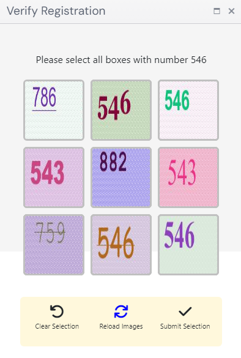

import Tabs from '@theme/Tabs';
import TabItem from '@theme/TabItem';
import ParamItem from '@theme/ParamItem';
import MethodItem from '@theme/MethodItem';
import MethodDescription from '@theme/MethodDescription'
import PriceBlock from '@theme/PriceBlock';
import PriceBlockWrap from '@theme/PriceBlockWrap';
import BlogLink from '@theme/BlogLink';
import { ArticleHead } from '../../../../src/theme/ArticleHead';

<ArticleHead slug="captchas/compleximage/bls" />

# bls


<PriceBlockWrap>
  <PriceBlock  captchaId="complex-rec_bls" />
</PriceBlockWrap>

:::warning **Внимание!**
Использование прокси-серверов для данной задачи не требуется.
:::

В запросе необходимо передать 9 изображений в формате base64. <br />
Также внутри `metadata` передаётся значение `TaskArgument`.

<BlogLink url="https://capmonster.cloud/ru/blog/news/bls-solve-extension" />

---

## Параметры запроса

<br />
<span style={{ fontSize: "15px", fontWeight: 700 }}>
>  ВАЖНО: получайте base64 изображений непосредственно перед созданием задачи, чтобы избежать ошибок при решении (см. раздел [Как получить base64](#как-получить-base64)).
</span>
<br />

<TabItem value="proxyless" label="ComplexImageTask (без прокси)" default className="bordered-panel">
    <ParamItem title="type" required type="string" />
    **ComplexImageTask**

    ---

    <ParamItem title="class" required type="string" />
    **recognition**

    ---

    <ParamItem title="imagesBase64" required type="array" />
    Массив изображений в кодировке base64.

    ---

    <ParamItem title="Task (внутри metadata)" required type="string" />
    Название задания: `"bls_3x3"`

    ---

    <ParamItem title="TaskArgument (внутри metadata)" required type="string" />
    Значение числа, которое нужно найти на изображениях. Например: `"123"`

</TabItem>

---

## Создание задачи

<TabItem value="proxyless" label="ComplexImageTask (без прокси)" default className="method-panel">
	<MethodItem>
		```http
		https://api.capmonster.cloud/createTask
		```
	</MethodItem>
	<MethodDescription>
      **Запрос**
      ```json
      {
        "clientKey":{{API_key}},
        "task": 
        {
          "type": "ComplexImageTask",
          "class": "recognition",
          "imagesBase64": [
            "image1_to_base64",
            "image2_to_base64",
            "image3_to_base64",
            "image4_to_base64",
            "image5_to_base64",
            "image6_to_base64",
            "image7_to_base64",
            "image8_to_base64",
            "image9_to_base64"
          ],
          "metadata": {
            "Task": "bls_3x3",
            "TaskArgument": "123"
          }
        }
      }
      ```

    	Пример задания:

    	

    	Передавать сконвертированные в base64 картинки:

    	
    	
    	
    	
    	
    	
    	
    	
    	

    	Для данного примера: "TaskArgument": "546"

    	**Ответ**
    	```json
    	{
    	  "errorId":0,
    	  "taskId":143998457
    	}
    	```
    </MethodDescription>

</TabItem>

---

## Получение результата задачи

<TabItem value="proxyless" label="ComplexImageTask (без прокси)" default className="method-panel-full">
	<MethodItem>
		```http
		https://api.capmonster.cloud/getTaskResult
		```
	</MethodItem>
	<MethodDescription>
		**Запрос**
		```json
		{
		  "clientKey":"API_KEY",
		  "taskId": 143998457
		}
		```
		**Ответ:**
		массив значений с элементами `true` или `false`, в зависимости от того, является ли число на картинке искомым аргументом или нет.  
```json
{
  "errorId": 0,
  "status": "ready",
  "errorCode": null,
  "errorDescription": null,
  "solution": {
    "answer": [true, true, false, false, true, false, false, true, true],
    "metadata": {
      "AnswerType": "Grid"
    }
  }
}      
```
</MethodDescription>


</TabItem>

## Альтернативный способ решения (bls_text)

Вместо автоматического режима определения совпадений (`bls_3x3`) возможно использовать распознавание текста для каждого изображения отдельно — это даёт больше гибкости и позволяет точнее контролировать процесс обработки.

Данный подход реализуется через задачу `ImageToTextTask` с модулем `bls_text` (*см. раздел [Передача имени модуля](/api/module-name.mdx)*). В этом режиме **каждое изображение обрабатывается как отдельная капча**, а результатом является распознанное текстовое значение.

### Принцип работы

1. Капча разбивается на отдельные изображения (9 элементов сетки).
2. Каждое изображение отправляется как отдельная задача `ImageToTextTask`.
3. В ответе возвращается распознанный текст (число).
4. Полученные значения сравниваются с целевым, после чего определяется список подходящих изображений.

### Пример запроса

<TabItem value="proxyless" label="ComplexImageTask (без прокси)" default className="method-panel">
	<MethodItem>
		```http
		https://api.capmonster.cloud/createTask
		```
	</MethodItem>
	<MethodDescription>
      **Запрос**

```json
{
  "clientKey": "API_KEY",
  "task": {
    "type": "ImageToTextTask",
    "capMonsterModule": "bls_text",
    "body": "/9j/4AAQSkZJRgABAQAAAQABAAD/2wBDAA...CruPHGc8nk5z+HtRQB//9k="
  }
}
```

**Пример ответа**    

```json
{
  "errorId": 0,
  "status": "ready",
  "errorCode": null,
  "errorDescription": null,
  "solution": {
    "text": "123"
  }
}
```
    </MethodDescription>
</TabItem>

### Пример автоматического решения bls_text

В примере каждая картинка отправляется отдельно как `ImageToTextTask` с модулем `bls_text`, после чего результаты распознавания собираются и обрабатываются. Вы получаете текст для каждого изображения и можете самостоятельно определять дальнейшую логику — например, сравнивать значения с целевым (`target`), фильтровать, комбинировать и реализовывать любую другую обработку в зависимости от задачи.

<details>
      <summary>Показать код (Node.js)</summary>
```javascript
const API_KEY = "API_KEY";
const CREATE_TASK_URL = "https://api.capmonster.cloud/createTask";
const GET_RESULT_URL = "https://api.capmonster.cloud/getTaskResult";

const target = "546";

// 9 картинок (передавайте каждую в формате: "/9j/4AAQSkZJ...6UUAf/Z")
const images = [
  "base64_img_1",
  "base64_img_2",
  "base64_img_3",
  "base64_img_4",
  "base64_img_5",
  "base64_img_6",
  "base64_img_7",
  "base64_img_8",
  "base64_img_9",
];

// создание задачи (ОДНА картинка)
async function createTask(imageBase64) {
  const payload = {
    clientKey: API_KEY,
    task: {
      type: "ImageToTextTask",
      capMonsterModule: "bls_text",
      body: imageBase64,
    },
  };

  console.log("=== REQUEST ===");
  console.log(JSON.stringify(payload, null, 2));

  const res = await fetch(CREATE_TASK_URL, {
    method: "POST",
    body: JSON.stringify(payload),
  });

  const data = await res.json();

  console.log("=== CREATE RESPONSE ===");
  console.log(JSON.stringify(data, null, 2));

  if (data.errorId !== 0) {
    throw new Error(data.errorDescription);
  }

  return data.taskId;
}

// ожидание результата
async function getResult(taskId) {
  while (true) {
    const res = await fetch(GET_RESULT_URL, {
      method: "POST",
      body: JSON.stringify({
        clientKey: API_KEY,
        taskId,
      }),
    });

    const data = await res.json();

    if (data.errorId !== 0) {
      throw new Error(data.errorDescription);
    }

    if (data.status === "ready") {
      return data.solution.text;
    }

    await new Promise((r) => setTimeout(r, 1500));
  }
}

// основная логика
async function solveBlsText() {
  try {
    // 1. создаём задачи
    const taskIds = await Promise.all(images.map((img) => createTask(img)));

    // 2. получаем результаты
    const results = await Promise.all(taskIds.map((id) => getResult(id)));

    // 3. реализуем дальнейшие действия, например, сравниваем с target
    const answer = results.map((text) => text === target);

    console.log("RESULTS:", results);
    console.log("ANSWER:", answer);

    return answer;
  } catch (err) {
    console.error("ERROR:", err.message);
  }
}

solveBlsText();
```
</details>


## Как получить Base64

Изображения на страницах могут быть представлены либо в виде ссылки (URL), либо сразу закодированы в формате Base64. Чтобы найти нужное значение, кликните правой кнопкой мыши по изображению, выберите **Просмотреть код** (**Inspect**) и внимательно изучите раздел **Элементы** или сетку сетевых запросов – там вы сможете обнаружить ссылку или закодированное содержимое.

1. Откройте ваш сайт, где отображается капча, в браузере.
2. Правой кнопкой кликните по элементу капчи и выберите **Inspect**.


