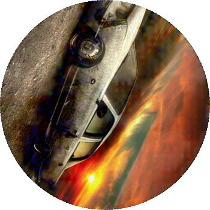

import Tabs from '@theme/Tabs';
import TabItem from '@theme/TabItem';
import ParamItem from '@theme/ParamItem';
import MethodItem from '@theme/MethodItem';
import MethodDescription from '@theme/MethodDescription'
import PriceBlock from '@theme/PriceBlock';
import PriceBlockWrap from '@theme/PriceBlockWrap';
import { ArticleHead } from '../../../../src/theme/ArticleHead';

<ArticleHead slug="captchas/compleximage/baidu" />

# baidu


<PriceBlockWrap>
  <PriceBlock title="baidu" captchaId="complex-rec_baidu" />
</PriceBlockWrap>

:::warning **Внимание!**
Использование прокси-серверов для данной задачи не требуется.
:::
<br />

В запросе необходимо передать одно изображение в формате base64.

## Параметры запроса

<br />
<span style={{ fontSize: "15px", fontWeight: 700 }}>
>  ВАЖНО: получайте base64 изображения непосредственно перед созданием задачи, чтобы избежать ошибок при решении (см. раздел [Как получить base64](#как-получить-base64)).
</span>
<br />

<TabItem value="proxyless" label="ComplexImageTask (без прокси)" default className="bordered-panel">
    <ParamItem title="type" required type="string" />
    **ComplexImageTask**

    ---

    <ParamItem title="class" required type="string" />
    **recognition**

    ---

    <ParamItem title="imagesBase64" required type="array" />
    Изображение в кодировке base64.

    ---

    <ParamItem title="Task (внутри metadata)" required type="string" />
    Название задания: `"baidu"`

</TabItem>

## Создание задачи

:::warning **Внимание!**
В начале процесса решения возможны временные *unsolvable*-ответы. Это **не является ошибкой** - капча продолжит успешно решаться после инициализации.  
:::

<TabItem value="proxyless" label="ComplexImageTask (без прокси)" default className="method-panel">
	<MethodItem>
		```http
		https://api.capmonster.cloud/createTask
		```
	</MethodItem>
	<MethodDescription>
      **Запрос**
      ```json
      {
        "clientKey": "API_KEY",
        "task": 
        {
          "type": "ComplexImageTask",
          "class": "recognition",
          "imagesBase64": ["base64"],
          "metadata": {
            "Task": "baidu"
          }
        }
      }
      ```

    	Пример задания:

    	

        **Ответ**
        ```json
        {
          "errorId":0,
          "taskId":143998457
        }
        ```
    </MethodDescription>

</TabItem>

## Получение результата задачи

<TabItem value="proxyless" label="ComplexImageTask (без прокси)" default className="method-panel-full">
	<MethodItem>
		```http
		https://api.capmonster.cloud/getTaskResult
		```
	</MethodItem>
	<MethodDescription>
      **Запрос**
      ```json
      {
        "clientKey":"API_KEY",
        "taskId": 143998457
      }
      ```
		**Ответ:** градусы, на которые необходимо повернуть картинку по часовой стрелке.
      ```json
      {
        "solution":
        {
          "answer":[297],
          "metadata":{"AnswerType":"NumericArray"}
        },
        "cost":0.0005,
        "status":"ready",
        "errorId":0,
        "errorCode":null,
        "errorDescription":null
      }
      ```
	</MethodDescription>
    </TabItem>

## Как получить Base64

Изображения на страницах могут быть представлены либо в виде ссылки (URL), либо сразу закодированы в формате Base64. Чтобы найти нужное значение, кликните правой кнопкой мыши по изображению, выберите **Просмотреть код** (**Inspect**) и внимательно изучите раздел **Элементы** или сетку сетевых запросов – там вы сможете обнаружить ссылку или закодированное содержимое.

1. Откройте ваш сайт, где отображается капча, в браузере.
2. Правой кнопкой кликните по элементу капчи и выберите **Inspect**.

