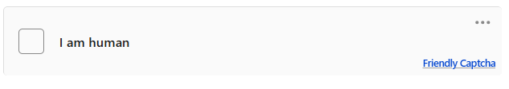
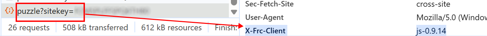
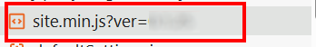

import Tabs from '@theme/Tabs';
import TabItem from '@theme/TabItem';
import ParamItem from '@theme/ParamItem';
import MethodItem from '@theme/MethodItem';
import ImageWrap from '@theme/ImageWrap';
import ImagesLayout from '@theme/ImagesLayout';
import MethodDescription from '@theme/MethodDescription'
import PriceBlock from '@theme/PriceBlock';
import PriceBlockWrap from '@theme/PriceBlockWrap';
import { ArticleHead } from '../../src/theme/ArticleHead';

<ArticleHead slug="captchas/friendly-task" />

# Friendly Captcha

<PriceBlockWrap>
  <PriceBlock title="Friendly Captcha" captchaId="friendly"/>
</PriceBlockWrap>



:::warning **Внимание!**
CapMonster Cloud по умолчанию работает через встроенные прокси — они уже включены в стоимость. Указывать собственные прокси требуется только в тех случаях, когда сайт не принимает токен или доступ к встроенным сервисам ограничен.

Если прокси с авторизацией по IP, то необходимо добавить адрес **65.21.190.34** в белый список.
:::

## Параметры запроса

<TabItem value="proxy" label="CustomTask (при использовании прокси)" className="bordered-panel">

  <ParamItem title="type" required type="string" />
  **CustomTask**

  ---

  <ParamItem title="class" required type="string" />
  **friendly**

   --- 

  <ParamItem title="websiteURL" required type="string" />
  Полный URL страницы с капчей.

  ---

  <ParamItem title="websiteKey" required type="string" />
  Ключ Friendly Captcha (*см. раздел [Как найти значение sitekey](#как-найти-значение-sitekey)*).
  
  ---

  <ParamItem title="apiGetLib (внутри metadata)" required type="string" />
  Ссылка на JS-файл. Указывайте URL JS-файла в зависимости от версии капчи:

* **V1:**
  `apiGetLib` = `https://cdn.jsdelivr.net/npm/friendly-challenge@X.Y.Z/widget.module.min.js`, где `X.Y.Z` — версия клиента из заголовка `x-frc-client`.

* **V2:**
  `apiGetLib` = URL файла `site.min.js`, который загружается на странице.


*Подробнее см. в разделах [Метод создания задачи](#метод-создания-задачи) и [Как определить версию Friendly Captcha](#как-определить-версию-friendly-captcha).*

  ---

  <ParamItem title="userAgent" type="string" />
  User-Agent браузера. <br />
  **Передавайте только актуальный UA от ОС Windows. Сейчас таковым является**: `userAgentPlaceholder`

  ---

  <ParamItem title="proxyType" type="string" />
  **http** - обычный http/https прокси;<br />
  **https** - попробуйте эту опцию, только если "http" не работает (требуется для некоторых кастомных прокси);<br />
  **socks4** - socks4 прокси;<br />
  **socks5** - socks5 прокси.

  ---

  <ParamItem title="proxyAddress" type="string" />
  <p>
    IP адрес прокси IPv4/IPv6. Не допускается:
    - использование прозрачных прокси (там где можно видеть IP клиента);
    - использование прокси на локальных машинах.
  </p>

  ---

  <ParamItem title="proxyPort" type="integer" />
  Порт прокси.

  ---

  <ParamItem title="proxyLogin" type="string" />
  Логин прокси-сервера.

  ---

  <ParamItem title="proxyPassword" type="string" />
  Пароль прокси-сервера.

  ---

</TabItem>

## Метод создания задачи

Используйте значение параметра `apiGetLib` в `metadata`, соответствующее версии Friendly Captcha.

**Например:**

Для **V1**
  ```json
  "apiGetLib": "https://cdn.jsdelivr.net/npm/friendly-challenge@0.9.19/widget.module.min.js"
```

Для **V2**
  ```json
  "apiGetLib": "https://example.com/wp-content/plugins/friendly-captcha/public/vendor/v2/site.min.js?ver=0.1.25"
```
<br />
<Tabs className="full-width-tabs filled-tabs request-tabs" groupId="captcha-type">
  <TabItem value="proxyless" label="CustomTask (без прокси)" default className="method-panel">
    <MethodItem>
    ```http
    https://api.capmonster.cloud/createTask
    ```
    </MethodItem>
    <MethodDescription>
      
      **Запрос**
      ```json
      {
        "clientKey": "API_KEY",
        "task": {
          "type": "CustomTask",
          "class": "friendly",
          "websiteKey": "FFMGEMAD2K3JJ35P",
          "websiteURL": "https://example.com",
          "userAgent": "userAgentPlaceholder",
          "metadata": {
			"apiGetLib":"https://cdn.jsdelivr.net/npm/friendly-challenge@0.9.19/widget.module.min.js"
		}
	}
      ```

      **Ответ**
      ```json
      {
        "errorId": 0,
        "taskId": 407533077
      }
      ```
    </MethodDescription>
  </TabItem>

    <TabItem value="proxy" label="CustomTask (с прокси)" className="method-panel">
    <MethodItem>
      ```http
      https://api.capmonster.cloud/createTask
      ```
    </MethodItem>
    <MethodDescription>
      
      **Запрос**
      ```json
      {
        "clientKey": "API_KEY",
        "task": {
          "type": "CustomTask",
          "class": "friendly",
          "websiteKey": "FFMGEMAD2K3JJ35P",
          "websiteURL": "https://example.com",
          "userAgent": "userAgentPlaceholder",
          "metadata": {
			"apiGetLib":"https://cdn.jsdelivr.net/npm/friendly-challenge@0.9.19/widget.module.min.js"
		},
          "proxyType": "http",
          "proxyAddress": "8.8.8.8",
          "proxyPort": 8080,
          "proxyLogin": "proxyLoginHere",
          "proxyPassword": "proxyPasswordHere"
        }
      }
      ```

      **Ответ**
      ```json
      {
        "errorId": 0,
        "taskId": 407533077
      }
      ```
    </MethodDescription>
  </TabItem>
</Tabs>

## Метод получения результата задачи
Используйте метод [getTaskResult](../api/methods/get-task-result.mdx), чтобы получить решение Friendly капчи.
Формат токена в ответе зависит от версии капчи, используемой на сайте:

**V1**: `"56a3727f1f9ae4f339c8e512913cd6f8.ac7W...MAKgAAAN+MAQArAAAAjxMBACwAAAB5QgAA.AgAB"`<br />

**V2**: `"AQQA.8Q2TbgK_..._pknXDweJjKT2qwmroOhHcZsU4dHyu-jaGIPx9k7432p_num13buuTu6n4lVA=="`

<TabItem value="proxyless" label="CustomTask (без прокси)" default className="method-panel-full">
  <MethodItem>
      ```http
    https://api.capmonster.cloud/getTaskResult
    ```
  </MethodItem>
  <MethodDescription>

  **Запрос**
  ```json
  {
    "clientKey": "API_KEY",
    "taskId": 407533077
  }
  ```

  **Ответ**
```json
{
  "errorId": 0,
  "errorCode": null,
  "errorDescription": null,
  "status": "ready",
  "solution": {
    "data": {
      "token": "56a3727f1f9ae4f339c8e512913cd6f8.ac7W...MAKgAAAN+MAQArAAAAjxMBACwAAAB5QgAA.AgAB"
    }
  }
}
  ```
  </MethodDescription>
</TabItem>
<br />
Значение полученного токена подставляется в соответствующее поле:

| Версия | Поле для подстановки токена        |
|--------|------------------------------------|
| V1     | `input.frc-captcha-solution`       |
| V2     | `input.frc-captcha-response`       |

## Как найти значение sitekey

- Для **V1** этот параметр можно найти в сетевых запросах, отфильтровав их по ключевым словам `sitekey` или`puzzle?sitekey=`:

 

---

- Для **V2** используйте поиск по ключевым словам `sitekey` или `data-sitekey` среди запросов или элементов в коде страницы:

 

## Как определить версию Friendly Captcha

Friendly Captcha может использоваться в двух основных версиях: **V1** и **V2**.  
Версию можно определить по загружаемым скриптам или сетевым запросам.

### Friendly Captcha V1

Используется, если на странице присутствуют следующие скрипты:

```javascript
widget.min.js
widget.module.min.js
```

или в сетевых запросах встречается `puzzle?sitekey=`:


**Чтобы определить версию клиента, необходимо:**

1. Открыть найденный запрос `puzzle?sitekey=...` и перейти в **Headers → Request Headers**

2. Найти заголовок `x-frc-client`:



Заголовок содержит версию клиента Friendly Captcha, используемую на сайте:

```
x-frc-client: <version>
```

**Примеры значений**: *0.9.14, 0.9.19* и т.д.

3. После определения версии из `x-frc-client` подставить её в CDN-ссылку:

```
https://cdn.jsdelivr.net/npm/friendly-challenge@<VERSION>/widget.module.min.js
```

Например, если `x-frc-client = 0.9.14`, используйте:

```
https://cdn.jsdelivr.net/npm/friendly-challenge@0.9.14/widget.module.min.js
```
Эту ссылку необходимо передать в параметр `apiGetLib` при создании задачи.

---

### Friendly Captcha V2

Если на сайте загружается `site.min.js`, это означает, что используется **Friendly Captcha V2**.



Передавайте ссылку `site.min.js` в параметр `apiGetLib` при создании задачи:


---

### Автоматическое определение версии Friendly Captcha

Вы можете автоматизировать процесс определения версии Friendly Captcha в браузере, используя следующее решение:

<details>
      <summary>Показать код</summary>
```javascript
(async function detectFriendlyCaptcha() {
  const result = {
    version: null,      
    clientVersion: null,
    indicators: [],
    siteMinJsLinks: []
  };

  const scripts = Array.from(document.scripts).map(s => s.src);

  for (const src of scripts) {
    if (!src) continue;

    if (src.includes("site.min.js")) {
      result.version = "V2";
      result.indicators.push("Found site.min.js");
      result.siteMinJsLinks.push(src);
    }

    if (src.includes("widget.min.js") || src.includes("widget.module.min.js")) {
      result.version = "V1";
      result.indicators.push("Found widget script");
    }

    const match = src.match(/friendly-challenge@(\d+\.\d+\.\d+)/);
    if (match) {
      result.clientVersion = match[1];
      result.version = "V1";
      result.indicators.push("Detected CDN version");
    }
  }

  const puzzleElements = document.querySelectorAll(
    '[id*="friendly"], [class*="frc"], iframe[src*="friendly"]'
  );

  if (puzzleElements.length > 0) {
    result.indicators.push("Found captcha DOM elements");
    if (!result.version) result.version = "V1";
  }

  const resources = performance.getEntriesByType("resource");

  for (const r of resources) {
    if (r.name.includes("puzzle?sitekey")) {
      result.version = "V1";
      result.indicators.push("Found puzzle?sitekey request");
    }
  }

  if (!result.version) {
    result.version = "Unknown (not detected)";
  }

  console.log("FriendlyCaptcha Detection Result:");
  console.log(result);

  return result;
})();
```
</details>