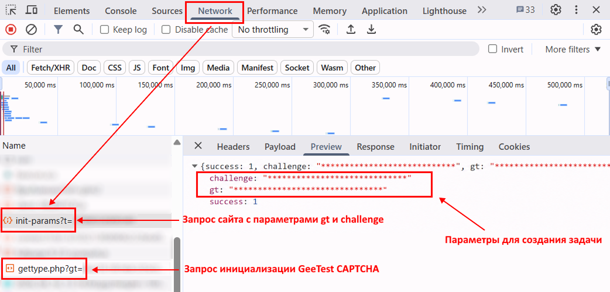

import Tabs from '@theme/Tabs';
import TabItem from '@theme/TabItem';
import ParamItem from '@theme/ParamItem';
import MethodItem from '@theme/MethodItem';
import ImageWrap from '@theme/ImageWrap';
import ImagesLayout from '@theme/ImagesLayout';
import MethodDescription from '@theme/MethodDescription'
import PriceBlock from '../../src/theme/PriceBlock';
import PriceBlockWrap from '@theme/PriceBlockWrap';
import { ArticleHead } from '../../src/theme/ArticleHead';

<ArticleHead slug="captchas/geetest-task" />

# GeeTest

<PriceBlockWrap>
  <PriceBlock title="GeeTestTask" captchaId="geetest"/>
</PriceBlockWrap>

 

:::warning **Внимание!**
CapMonster Cloud по умолчанию работает через встроенные прокси — они уже включены в стоимость. Указывать собственные прокси требуется только в тех случаях, когда сайт не принимает токен или доступ к встроенным сервисам ограничен.

Прокси с авторизацией по IP пока не поддерживаются.
:::

Ваше приложение должно прислать адрес сайта, публичный ключ домена (`gt`) и ключ (`challenge`).

Результатом решения задачи является три или пять токенов для сабмита формы.

:::info

Для **GeeTest V3**: 
- Параметры `gt`, `challenge` и `geetestApiServerSubdomain` могут передаваться в JavaScript-коде инициализации GeeTest, например в функции `initGeetest`.

- Некоторые параметры также могут присутствовать в HTML-коде страницы или сетевых запросах. Для GeeTest V3 значение `challenge` необходимо получать до инициализации CAPTCHA.


Для **GeeTest V4** в параметре `gt` передаётся значение `captcha_id`.


:::

<br />

## <span style={{fontSize: '2.25rem'}}>GeeTest V3</span>

### <span style={{fontSize: '1.5rem'}}>Примеры заданий</span>

Ниже представлены примеры типов заданий GeeTest V3, которые на данный момент поддерживаются сервисом CapMonster Cloud:

<ImagesLayout gap="16px" columns={4}>
  <ImageWrap title="Intelligent mode"></ImageWrap>
  <ImageWrap title="Slide CAPTCHA"></ImageWrap>
  <ImageWrap title="Icon CAPTCHA"></ImageWrap>
  <ImageWrap title="Space CAPTCHA"></ImageWrap>
</ImagesLayout>

### <span style={{fontSize: '1.5rem'}}>Параметры запроса</span>

<br />
<span style={{ fontSize: "15px", fontWeight: 700 }}>
> ВАЖНО: параметр `challenge` в GeeTest V3 является динамическим.  
> Получайте новое значение непосредственно перед созданием каждой задачи и до инициализации CAPTCHA на странице. После загрузки CAPTCHA ранее полученный `challenge` становится недействительным.
</span>
<br />

  <div className="bordered-panel">
    <ParamItem title="type" required type="string" />
    **GeeTestTask**

    ---

    <ParamItem title="websiteURL" required type="string" />
    Адрес страницы, на которой инициализируется капча. Корректный URL обычно передается в заголовке `Referer` при запросе к `https://api-na.geetest.com/gettype.php`. Например, вы можете находиться на странице `https://example.com#login`, однако фактическая инициализация капчи выполняется на странице `https://example.com`.

    ---

    <ParamItem title="gt" required type="string" />
    Ключ-идентификатор GeeTest `gt` для домена. Статическое значение, редко обновляется.

    ---

    <ParamItem title="challenge" required="required only for V3" type="string" />
    Динамический ключ. Перед созданием каждой задачи на решение необходимо получать новое значение `challenge`.<br />

    **Важно:** получайте `challenge` до инициализации CAPTCHA на странице.<br />

Если CAPTCHA уже была загружена, полученное значение становится недействительным. При отправке такого значения в CapMonster Cloud API будет возвращена [ошибка](../api/api-errors.mdx) `ERROR_INVALID_TASK` с сообщением о невалидности параметра.<br />
    
    ---

    <ParamItem title="version" required type="integer"/>
    3

    ---

    <ParamItem title="geetestApiServerSubdomain" type="string" />
    Поддомен сервера Geetest API (должен отличаться от `api.geetest.com`). 
	<br />Необязательный параметр. Может потребоваться для некоторых сайтов.

    ---

    <ParamItem title="geetestGetLib" type="string" />
    Путь к скрипту капчи для ее отображения на странице. 
	<br />Необязательный параметр. Может потребоваться для некоторых сайтов. 
	<br />Отправляйте JSON в виде строки.

    ---

    <ParamItem title="userAgent" type="string" />
    User-Agent браузера. Используйте текущее значение, поддерживаемое CapMonster Cloud: `userAgentPlaceholder`<br />

Получить актуальное значение можно по адресу: [https://capmonster.cloud/api/useragent/actual](https://capmonster.cloud/api/useragent/actual).

    ---

    <ParamItem title="proxyType" type="string" />
    **http** - обычный http/https прокси;<br />
	**https** - попробуйте эту опцию только если "http" не работает (требуется для некоторых кастомных прокси);<br />
	**socks4** - socks4 прокси;<br />
	**socks5** - socks5 прокси.

    ---

    <ParamItem title="proxyAddress" type="string" />
    <p>
      IP адрес прокси IPv4/IPv6. Не допускается:
		- использование прозрачных прокси (там где можно видеть IP клиента);
		- использование прокси на локальных машинах.
    </p>

    ---

    <ParamItem title="proxyPort" type="integer" />
    Порт прокси.

    ---

    <ParamItem title="proxyLogin" type="string" />
    Логин прокси-сервера.

    ---

    <ParamItem title="proxyPassword" type="string" />
    Пароль прокси-сервера.
  </div>
  


### <span style={{fontSize: '1.5rem'}}>Метод создания задачи</span>

<MethodItem>

```http
https://api.capmonster.cloud/createTask
```

</MethodItem>
<br />

:::info Альтернативный адрес метода

Для пользователей из России также доступен:

```text
https://ru.api.capmonster.cloud/createTask
```

Подробнее в разделе [createTask](/docs/api/methods/create-task/).

:::

<Tabs className="full-width-tabs filled-tabs request-tabs" groupId="captcha-type">
	<TabItem value="proxyless" label="GeeTestTask (без прокси)" default className="method-panel">
		<MethodDescription>
			**Пример запроса**
```json
{
  "clientKey": "API_KEY",
  "task": {
    "type": "GeeTestTask",
    "websiteURL": "https://yourwebsite.com/page-with-geetest",
    "gt": "gt-value",
    "challenge": "challenge-value",
    "version": 3,
    "geetestApiServerSubdomain": "example.api.geetest.com"

  }
}
```
			**Пример ответа**
			```json
			{
			  "errorId":0,
			  "taskId":407533072
			}
			```
		</MethodDescription>
	</TabItem>
	
	<TabItem value="proxy" label="GeeTestTask (при использовании прокси)" className="method-panel">
		<MethodDescription>
			**Пример запроса**
```json 
{
  "clientKey": "API_KEY",
  "task": {
    "type": "GeeTestTask",
    "websiteURL": "https://yourwebsite.com/page-with-geetest",
    "gt": "gt-value",
    "challenge": "challenge-value",
    "version": 3,
    "geetestApiServerSubdomain": "example.api.geetest.com",
    "userAgent": "userAgentPlaceholder",
    "proxyType": "your-proxy-type",
    "proxyAddress": "your-proxy-address",
    "proxyPort": 1234,
    "proxyLogin": "your-proxy-login",
    "proxyPassword": "your-proxy-password"
  }
}
```
			**Пример ответа**
			```json
			{
			  "errorId":0,
			  "taskId":407533072
			}
			```
		</MethodDescription>
	</TabItem>  
</Tabs>

Используйте метод [getTaskResult](../api/methods/get-task-result.mdx), чтобы получить решение GeeTest. В зависимости от загрузки системы вы получите ответ через время в диапазоне от 10 с до 30 с.

### <span style={{fontSize: '1.5rem'}}>Метод получения результата задачи</span>

<MethodItem>

```http
https://api.capmonster.cloud/getTaskResult
```

</MethodItem>
<br />

:::info Альтернативный адрес метода

Для пользователей из России также доступен:

```text
https://ru.api.capmonster.cloud/getTaskResult
```

Подробнее в разделе [getTaskResult](/docs/api/methods/get-task-result/).

:::

<div className="method-panel-full">
	<MethodDescription>
		**Пример запроса**
		```json
		{
		  "clientKey":"API_KEY",
		  "taskId": 407533072
		}
		```
		**Пример ответа**
```json
{
  "errorId": 0,
  "status": "ready",
  "solution": {
    "challenge": "0f759dd1ea6c4wc76cedc2991039ca4f23",
    "validate": "6275e26419211d1f526e674d97110e15",
    "seccode": "510cd9735583edcb158601067195a5eb|jordan"
  }
}
```
	</MethodDescription>
</div>

<br />

<table><tr>
<th><b>Свойство</b></th><th><b>Тип</b></th><th><b>Описание</b></th>
</tr>
<tr><td>challenge</td><td>String</td><td rowspan="3">Все три параметра необходимы при отправке формы на целевом сайте.</td></tr>
<tr><td>validate</td><td>String</td></tr>
<tr><td>seccode</td><td>String</td></tr>
</table>
<br />

### <span style={{fontSize: '1.5rem'}}>Как найти все нужные параметры для создания задачи</span>

#### <span style={{fontSize: '1.2rem'}}>Вручную</span>

1. Откройте сайт, на котором отображается GeeTest V3, в браузере.
2. Откройте инструменты разработчика (**DevTools**) и перейдите во вкладку **Network**.
3. Обновите страницу, чтобы записать сетевые запросы с момента загрузки.
4. Найдите запрос к серверу целевого сайта, в ответе которого возвращаются параметры GeeTest, в том числе `gt` и `challenge`.

Значение `challenge` необходимо получить **до инициализации CAPTCHA**, то есть до выполнения запроса GeeTest вида:

```text
https://api.geetest.com/gettype.php?gt=...
```

Перед инициализацией CAPTCHA сайт может получать параметры GeeTest со своего сервера. Чтобы найти актуальное значение `challenge`, проверьте запросы к домену целевого сайта и их ответы.



В некоторых случаях сайт шифрует данные, получаемые от своего сервера, поэтому значение `challenge` может быть недоступно в явном виде в ответе такого запроса. В этом случае значение можно получить из параметров запросов GeeTest, например:

```text
https://api.geetest.com/get.php?gt=...
```

и/или:

```text
https://api.geevisit.com/ajax.php?gt=...
```


:::warning Важно:
При таком способе необходимо получить параметры из запроса и **заблокировать запросы к GeeTest API до их отправки**. Если запрос будет выполнен и CAPTCHA загрузится, использованное значение `challenge` станет недействительным.
:::

После получения актуальных значений `gt` и `challenge` используйте их для создания задачи GeeTest V3 в CapMonster Cloud.
<br />

#### <span style={{fontSize: '1.2rem'}}>Автоматически</span>

Получение параметров GeeTest V3 можно автоматизировать двумя способами. Выберите подходящий вариант в зависимости от реализации целевого сайта.

**Получение параметров из ответа сервера сайта**

Если сервер сайта возвращает `gt` и `challenge` в открытом виде, повторите соответствующий запрос перед созданием задачи.

Например:

```text
https://example.com/api/v1/captcha/gee-test/init-params
```

<Tabs className="full-width-tabs filled-tabs request-tabs">
  <TabItem value="js" label="JavaScript" default className="method-panel">
    <details>
      <summary>Показать код (в браузере)</summary>

```js
async function getGeeTestV3Params() {
  // Замените URL на запрос вашего сайта,
  // в ответе которого возвращаются gt и challenge
  const response = await fetch(
    "https://example.com/api/v1/captcha/gee-test/init-params"
  );

  if (!response.ok) {
    throw new Error(`Request failed: ${response.status}`);
  }

  const data = await response.json();

  const gt = data.gt;
  const challenge = data.challenge;

  if (!gt || !challenge) {
    throw new Error("Не удалось получить gt или challenge");
  }

  console.log({ gt, challenge });

  return { gt, challenge };
}

getGeeTestV3Params().catch(console.error);
```

    </details>

    <details>
      <summary>Показать код (Node.js)</summary>

```js
async function getGeeTestV3Params() {
  // Замените URL на запрос вашего сайта,
  // в ответе которого возвращаются gt и challenge
  const response = await fetch(
    "https://example.com/api/v1/captcha/gee-test/init-params"
  );

  if (!response.ok) {
    throw new Error(`Request failed: ${response.status}`);
  }

  const data = await response.json();

  const gt = data.gt;
  const challenge = data.challenge;

  if (!gt || !challenge) {
    throw new Error("Missing gt or challenge");
  }

  console.log({ gt, challenge });

  return { gt, challenge };
}

getGeeTestV3Params().catch(console.error);
```

    </details>
  </TabItem>

  <TabItem value="python" label="Python" className="method-panel">
    <details>
      <summary>Показать код</summary>

```python
import requests


def get_geetest_v3_params():
    # Замените URL на запрос вашего сайта,
    # в ответе которого возвращаются gt и challenge
    response = requests.get(
        "https://example.com/api/v1/captcha/gee-test/init-params"
    )
    response.raise_for_status()

    data = response.json()

    gt = data.get("gt")
    challenge = data.get("challenge")

    if not gt or not challenge:
        raise ValueError("Не удалось получить gt или challenge")

    print({
        "gt": gt,
        "challenge": challenge,
    })

    return gt, challenge


get_geetest_v3_params()
```

    </details>
  </TabItem>

  <TabItem value="csharp" label="C#" className="method-panel">
    <details>
      <summary>Показать код</summary>

```csharp
using System;
using System.Net.Http;
using System.Threading.Tasks;
using Newtonsoft.Json.Linq;

class Program
{
    static async Task GetGeeTestV3Params()
    {
        using var client = new HttpClient();

        // Замените URL на запрос вашего сайта,
        // в ответе которого возвращаются gt и challenge
        var response = await client.GetAsync(
            "https://example.com/api/v1/captcha/gee-test/init-params"
        );

        response.EnsureSuccessStatusCode();

        var content = await response.Content.ReadAsStringAsync();
        var data = JObject.Parse(content);

        var gt = data["gt"]?.ToString();
        var challenge = data["challenge"]?.ToString();

        if (string.IsNullOrEmpty(gt) || string.IsNullOrEmpty(challenge))
        {
            throw new Exception("Не удалось получить gt или challenge");
        }

        Console.WriteLine($"GT: {gt}");
        Console.WriteLine($"Challenge: {challenge}");
    }

    static async Task Main()
    {
        await GetGeeTestV3Params();
    }
}
```

    </details>
  </TabItem>
</Tabs>
<br />


**Получение параметров из запроса GeeTest**

Если значение `challenge` не удаётся получить из ответа сервера сайта, перехватите запрос:

```text
https://api.geetest.com/get.php?gt=...&challenge=...
```

или:

```text
https://api.geevisit.com/ajax.php?gt=...&challenge=...
```

Извлеките `gt` и `challenge` из query-параметров и заблокируйте запрос до его отправки.

<Tabs className="full-width-tabs filled-tabs request-tabs">
  <TabItem value="js" label="JavaScript / TypeScript" default className="method-panel">
    <details>
      <summary>Показать код (Playwright)</summary>

```js
import { chromium } from "playwright";

async function getGeeTestV3Params(pageUrl) {
  const browser = await chromium.launch({ headless: false });
  const context = await browser.newContext();

  let params = null;

  await context.route("**/*", async (route) => {
    const requestUrl = route.request().url();

    if (
      requestUrl.includes("api.geetest.com/get.php") ||
      requestUrl.includes("api.geevisit.com/ajax.php")
    ) {
      const url = new URL(requestUrl);

      const gt = url.searchParams.get("gt");
      const challenge = url.searchParams.get("challenge");

      if (gt && challenge && !params) {
        params = { gt, challenge };
        console.log(params);
      }

      await route.abort();
      return;
    }

    await route.continue();
  });

  const page = await context.newPage();
  await page.goto(pageUrl);

  await page.waitForTimeout(5000);
  await browser.close();

  if (!params) {
    throw new Error("Не удалось получить gt и challenge");
  }

  return params;
}

getGeeTestV3Params(
  "https://example.com/page-with-geetest"
).catch(console.error);
```

    </details>
  </TabItem>

  <TabItem value="python" label="Python" className="method-panel">
    <details>
      <summary>Показать код (Playwright)</summary>

```python
import asyncio
from urllib.parse import urlparse, parse_qs

from playwright.async_api import async_playwright


async def get_geetest_v3_params(page_url):
    params = {}

    async with async_playwright() as p:
        browser = await p.chromium.launch(headless=False)
        context = await browser.new_context()

        async def handle_route(route):
            request_url = route.request.url

            if (
                "api.geetest.com/get.php" in request_url
                or "api.geevisit.com/ajax.php" in request_url
            ):
                query = parse_qs(urlparse(request_url).query)

                gt = query.get("gt", [None])[0]
                challenge = query.get("challenge", [None])[0]

                if gt and challenge and not params:
                    params["gt"] = gt
                    params["challenge"] = challenge
                    print(params)

                await route.abort()
                return

            await route.continue_()

        await context.route("**/*", handle_route)

        page = await context.new_page()
        await page.goto(page_url)

        await asyncio.sleep(5)
        await browser.close()

    if not params:
        raise RuntimeError("Не удалось получить gt и challenge")

    return params


asyncio.run(
    get_geetest_v3_params(
        "https://example.com/page-with-geetest"
    )
)
```

    </details>
  </TabItem>
</Tabs>

<br />

### <span style={{fontSize: '1.5rem'}}>Используйте библиотеку SDK</span>

<Tabs className="full-width-tabs filled-tabs request-tabs" groupId="captcha-type">
  <TabItem value="js" label="JavaScript / TypeScript" default className="method-panel">
  <details>
      <summary>Показать код (для браузера)</summary>
```js
// https://github.com/CapMonsterCloud/capmonster-nodejs-captcha-solver

import {
  CapMonsterCloudClientFactory,
  ClientOptions,
  GeeTestRequest
} from "@zennolab_com/capmonstercloud-client";

document.addEventListener("DOMContentLoaded", async () => {

  const API_KEY = "YOUR_API_KEY"; // Укажите ваш API-ключ CapMonster Cloud

  const client = CapMonsterCloudClientFactory.Create(
    new ClientOptions({ clientKey: API_KEY })
  );

  // Базовый пример без прокси
  // CapMonster Cloud автоматически использует собственные прокси
  let geetestRequest = new GeeTestRequest({
    websiteURL: "https://yourwebsite.com/page-with-geetest",
    gt: "your-gt-value",
    challenge: "your-challenge-value",
    version: 3,
  });

  // Пример с использованием вашего прокси
  // Раскомментируйте этот блок, если хотите использовать свой прокси
  /*
  const proxy = {
    proxyType: "https",
    proxyAddress: "123.45.67.89",
    proxyPort: 8080,
    proxyLogin: "username",
    proxyPassword: "password",
  };

  geetestRequest = new GeeTestRequest({
    websiteURL: "https://yourwebsite.com/page-with-geetest",
    gt: "your-gt-value",
    challenge: "your-challenge-value",
    version: 3,
    proxy,
    userAgent: "userAgentPlaceholder",
  });
  */

  // При необходимости можно проверить баланс
  const balance = await client.getBalance();
  console.log("Balance:", balance);

  const result = await client.Solve(geetestRequest);
  console.log("Solution:", result.solution);
});
```
</details>

<details>
      <summary>Показать код (Node.js)</summary>
```javascript
// https://github.com/CapMonsterCloud/capmonster-nodejs-captcha-solver

const {
  CapMonsterCloudClientFactory,
  ClientOptions,
  GeeTestRequest,
} = require("@zennolab_com/capmonstercloud-client");

const API_KEY = "YOUR_API_KEY"; // Укажите ваш API-ключ CapMonster Cloud

async function solveGeeTest() {
  const client = CapMonsterCloudClientFactory.Create(
    new ClientOptions({ clientKey: API_KEY }),
  );

  // Базовый пример без прокси
  // CapMonster Cloud автоматически использует собственные прокси
  let geetestRequest = new GeeTestRequest({
    websiteURL: "https://yourwebsite.com/page-with-geetest",
    gt: "your-gt-value",
    challenge: "your-challenge-value",
    version: 3,
  });

  // Пример с использованием вашего прокси
  // Раскомментируйте этот блок, если хотите использовать свой прокси
  /*
  const proxy = {
    proxyType: "https",
    proxyAddress: "123.45.67.89",
    proxyPort: 8080,
    proxyLogin: "username",
    proxyPassword: "password",
  };

  geetestRequest = new GeeTestRequest({
    websiteURL: "https://yourwebsite.com/page-with-geetest",
    gt: "your-gt-value",
    challenge: "your-challenge-value",
    version: 3,
    proxy,
    userAgent: "userAgentPlaceholder",
  });
  */

  // При необходимости можно проверить баланс
  const balance = await client.getBalance();
  console.log("Balance:", balance);

  const result = await client.Solve(geetestRequest);
  console.log("Solution:", result.solution);
}

solveGeeTest().catch(console.error);
```
</details>
  </TabItem>

  <TabItem value="python" label="Python" className="method-panel">
  <details>
      <summary>Показать код</summary>
```python
# https://github.com/CapMonsterCloud/capmonster-python-captcha-solver

import asyncio

from capmonstercloudclient import CapMonsterClient, ClientOptions
from capmonstercloudclient.requests import GeetestRequest
# Импортируйте ProxyInfo, если планируете использовать собственный прокси
from capmonstercloudclient.requests.proxy_info import ProxyInfo

API_KEY = "YOUR_API_KEY"  # Укажите ваш API-ключ CapMonster Cloud


async def solve_geetest():
    client = CapMonsterClient(
        options=ClientOptions(api_key=API_KEY)
    )

    # Базовый пример без прокси
    # CapMonster Cloud автоматически использует собственные прокси
    geetest_request = GeetestRequest(
        websiteUrl="https://yourwebsite.com/page-with-geetest",
        gt="your-gt-value",
        challenge="your-challenge-value",
        version=3,
    )

    # Пример с использованием вашего прокси
    # Раскомментируйте этот блок, если хотите использовать свой прокси
    """
    proxy = ProxyInfo(
        proxyType="https",
        proxyAddress="123.45.67.89",
        proxyPort=8080,
        proxyLogin="username",
        proxyPassword="password",
    )

    geetest_request = GeetestRequest(
        websiteUrl="https://yourwebsite.com/page-with-geetest",
        gt="your-gt-value",
        challenge="your-challenge-value",
        version=3,
        userAgent="userAgentPlaceholder",
        proxy=proxy,
    )
    """

    # При необходимости можно проверить баланс
    balance = await client.get_balance()
    print("Balance:", balance)

    result = await client.solve_captcha(geetest_request)
    print("Solution:", result)


asyncio.run(solve_geetest())
```
    </details>
  </TabItem>

  <TabItem value="csharp" label="C#" className="method-panel">
  <details>
      <summary>Показать код</summary>
```csharp
// https://github.com/CapMonsterCloud/capmonster-dotnet-captcha-solver

using System;
using System.Threading.Tasks;
using Zennolab.CapMonsterCloud;
using Zennolab.CapMonsterCloud.Requests;

class Program
{
    static async Task Main(string[] args)
    {
        // Укажите ваш API-ключ CapMonster Cloud
        var clientOptions = new ClientOptions
        {
            ClientKey = "YOUR_API_KEY"
        };

        var cmCloudClient = CapMonsterCloudClientFactory.Create(clientOptions);

        // Базовый пример без прокси
        // CapMonster Cloud автоматически использует собственные прокси
        var geetestRequest = new GeeTestRequest
        {
            WebsiteUrl = "https://yourwebsite.com/page-with-geetest",
            Gt = "your-gt-value",
            Challenge = "your-challenge-value",
            Version = 3
        };

        // Пример с использованием вашего прокси
        // Раскомментируйте этот блок, если хотите использовать свой прокси
        /*
        geetestRequest = new GeeTestRequest
        {
            WebsiteUrl = "https://yourwebsite.com/page-with-geetest",
            Gt = "your-gt-value",
            Challenge = "your-challenge-value",
            Version = 3,
            UserAgent = "userAgentPlaceholder",

            Proxy = new ProxyContainer(
                "123.45.67.89",
                8080,
                ProxyType.Http,
                "username",
                "password"
            )
        };
        */

        // При необходимости можно проверить баланс
        var balance = await cmCloudClient.GetBalanceAsync();
        Console.WriteLine("Balance: " + balance);

        var geetestResult = await cmCloudClient.SolveAsync(geetestRequest);

        Console.WriteLine($"""
Solution:
  Challenge: {geetestResult.Solution.Challenge}
  Validate:  {geetestResult.Solution.Validate}
  SecCode:   {geetestResult.Solution.SecCode}
""");
    }
}
```
    </details>
  </TabItem>  
</Tabs>

<br />

## <span style={{fontSize: '2.25rem'}}>GeeTest V4</span>

### <span style={{fontSize: '1.5rem'}}>Пример задания</span>


### <span style={{fontSize: '1.5rem'}}>Параметры запроса</span>

  <div className="bordered-panel">
    <ParamItem title="type" required type="string" />
    **GeeTestTask**

    ---

    <ParamItem title="websiteURL" required type="string" />
    Адрес страницы, на которой решается капча.

    ---

    <ParamItem title="gt" required type="string" />
    Ключ-идентификатор GeeTest для домена - параметр `captcha_id`.

    ---

    <ParamItem title="version" required type="integer"/>
    4

    ---

    <ParamItem title="geetestApiServerSubdomain" type="string" />
    Поддомен сервера Geetest API (должен отличаться от `api.geetest.com`). <br />
	Необязательный параметр. Может потребоваться для некоторых сайтов.

    ---

    <ParamItem title="geetestGetLib" type="string" />
    Путь к скрипту капчи для ее отображения на странице. <br /> 
	Необязательный параметр. Может потребоваться для некоторых сайтов.	<br />
	Отправляйте JSON в виде строки.
	
    ---

    <ParamItem title="initParameters" type="object" />
    Дополнительные параметры для 4 версии, используются вместе с "riskType" (например, `slide`).

    ---

    <ParamItem title="userAgent" type="string" />
    User-Agent браузера. Используйте текущее значение, поддерживаемое CapMonster Cloud: `userAgentPlaceholder`<br />

Получить актуальное значение можно по адресу: [https://capmonster.cloud/api/useragent/actual](https://capmonster.cloud/api/useragent/actual).

    ---

    <ParamItem title="proxyType" type="string" />
    **http** - обычный http/https прокси; <br />
	**https** - попробуйте эту опцию только если "http" не работает (требуется для некоторых кастомных прокси); <br />
	**socks4** - socks4 прокси; <br />
	**socks5** - socks5 прокси.

    ---

    <ParamItem title="proxyAddress" type="string" />
    <p>
      IP адрес прокси IPv4/IPv6. Не допускается:
		- использование прозрачных прокси (там, где можно видеть IP клиента);
		- использование прокси на локальных машинах.
    </p>

    ---

    <ParamItem title="proxyPort" type="integer" />
    Порт прокси.

    ---

    <ParamItem title="proxyLogin" type="string" />
    Логин прокси-сервера.

    ---

    <ParamItem title="proxyPassword" type="string" />
    Пароль прокси-сервера.

  </div>


### <span style={{fontSize: '1.5rem'}}>Метод создания задачи</span>

<MethodItem>

```http
https://api.capmonster.cloud/createTask
```

</MethodItem>
<br />

:::info Альтернативный адрес метода

Для пользователей из России также доступен:

```text
https://ru.api.capmonster.cloud/createTask
```

Подробнее в разделе [createTask](/docs/api/methods/create-task/).

:::


<Tabs className="full-width-tabs filled-tabs request-tabs" groupId="captcha-type">
	<TabItem value="proxyless" label="GeeTestTask (без прокси)" default className="method-panel">
		<MethodDescription>
			**Пример запроса**
```json
{
  "clientKey": "API_KEY",
  "task": {
    "type": "GeeTestTask",
    "websiteURL": "https://yourwebsite.com/page-with-geetest",
    "gt": "captcha-id-value",
    "version": 4,
    "initParameters": {
      "riskType": "risk-type-value"
    }
  }
}
```
			**Пример ответа**
			```json
			{
			  "errorId":0,
			  "taskId":407533072
			}
			```
		</MethodDescription>
	</TabItem>
  
	<TabItem value="proxy" label="GeeTestTask (при использовании прокси)" className="method-panel">
		<MethodDescription>
			**Пример запроса**
  ```json
  {
    "clientKey": "API_KEY",
    "task": {
      "type": "GeeTestTask",
      "websiteURL": "https://yourwebsite.com/page-with-geetest",
      "gt": "captcha-id-value",
      "version": 4,
      "initParameters": {
        "riskType": "risk-type-value"
      },
      "proxyType": "your-proxy-type",
      "proxyAddress": "your-proxy-address",
      "proxyPort": 1234,
      "proxyLogin": "your-proxy-login",
      "proxyPassword": "your-proxy-password",
      "userAgent": "userAgentPlaceholder"
    }
  }
  ```
			**Пример ответа**
			```json
			{
			  "errorId":0,
			  "taskId":407533072
			}
			```
		</MethodDescription>
	</TabItem>  
</Tabs>

Используйте метод [getTaskResult](../api/methods/get-task-result.mdx), чтобы получить решение GeeTest. В зависимости от загрузки системы вы получите ответ через время в диапазоне от 10 с до 30 с.

### <span style={{fontSize: '1.5rem'}}>Метод получения результата задачи</span>

<MethodItem>

```http
https://api.capmonster.cloud/getTaskResult
```

</MethodItem>
<br />

:::info Альтернативный адрес метода

Для пользователей из России также доступен:

```text
https://ru.api.capmonster.cloud/getTaskResult
```

Подробнее в разделе [getTaskResult](/docs/api/methods/get-task-result/).

:::

<div className="method-panel-full">
	<MethodDescription>
		**Пример запроса**
		```json
		{
		  "clientKey":"API_KEY",
		  "taskId": 407533072
		}
		```
		**Пример ответа**
```json
{
  "errorId": 0,
  "status": "ready",
  "solution": {
    "captcha_id": "f5c2ad5a8a3cf37192d8b9c039950f79",
    "lot_number": "bcb2c6ce2f8e4e9da74f2c1fa63bd713",
    "pass_token": "edc7a17716535a5ae624ef4707cb6e7e478dc557608b068d202682c8297695cf",
    "gen_time": "1683794919",
    "captcha_output": "XwmTZEJCJEnRIJBlvtEAZ662T...[cut]...SQ3fX-MyoYOVDMDXWSRQig56"
  }
}
```
	</MethodDescription>
</div>

<br />

<table>
<tr>
<th><b>Свойство</b></th><th><b>Тип</b></th><th><b>Описание</b></th>
</tr>
<tr>
<td>captcha_id</td><td>String</td><td rowspan="5">Все пять параметров необходимы при отправке формы на целевом сайте.<br />
input[name=captcha_id]<br />
input[name=lot_number]<br />
input[name=pass_token]<br />
input[name=gen_time]<br />
input[name=captcha_output]</td>
</tr>
<tr><td>lot_number</td><td>String</td></tr>
<tr><td>pass_token</td><td>String</td></tr>
<tr><td>gen_time</td><td>String</td></tr>
<tr><td>captcha_output</td><td>String</td></tr>
</table>

### Как найти все нужные параметры для создания задачи

#### Вручную


1. Откройте сайт, на котором отображается капча, в браузере.
2. Откройте инструменты разработчика (DevTools) и перейдите во вкладку **Network**.
3. Обновите страницу (F5), чтобы зафиксировать все сетевые запросы.
4. В поле поиска (Filter) введите `load` или `captcha`, чтобы быстрее найти нужный запрос.
5. Найдите запрос вида `load?callback=...` — в нём обычно передаются параметры капчи.
6. Кликните по этому запросу и откройте вкладку **Payload**, чтобы просмотреть необходимые данные.


#### Автоматически

Удобный способ автоматизировать поиск всех необходимых параметров.
Некоторые параметры генерируются заново при каждой загрузке страницы, поэтому для их извлечения потребуется работать через браузер – обычный или в режиме headless (например, с помощью **Playwright**).
Так как значения динамических параметров хранятся недолго, капчу нужно решать сразу после их получения.

:::warning **Важно!**
Приведённые фрагменты кода являются базовыми примерами для ознакомления в извлечении необходимых параметров. Точная реализация будет зависеть от вашего сайта с капчей, его структуры и используемых HTML-элементов и селекторов.
:::

<Tabs className="full-width-tabs filled-tabs request-tabs">
  <TabItem value="js" label="JavaScript" default className="method-panel">
    <details>
      <summary>Показать код (в браузере)</summary>

```js
(function() {
  function getQueryParams(url) {
    const params = new URLSearchParams(new URL(url).search);
    const captchaId = params.get('captcha_id');
    const riskType = params.get('risk_type');
    return { captchaId, riskType };
  }

  const observer = new PerformanceObserver((list) => {
    const entries = list.getEntriesByType('resource');
    entries.forEach((entry) => {
      if (entry.name.includes('https://gcaptcha4.geetest.com/load?')) {
        const { captchaId, riskType } = getQueryParams(entry.name);
        if (captchaId) {
          console.log('GeeTest v4 detected (via PerformanceObserver):');
          console.log({ captchaId, riskType });
        }
      }
    });
  });

  observer.observe({ type: 'resource', buffered: true });
})();
```
    </details>

    <details>
      <summary>Показать код (Node.js)</summary>

```js
import { chromium } from "playwright";

async function detectGeeTestV4(pageUrl) {
  const result = { version: null, data: {} };

  const browser = await chromium.launch({ headless: false });
  const context = await browser.newContext();
  const page = await context.newPage();

  page.on("response", async (response) => {
    const url = response.url();

    if (url.includes("https://gcaptcha4.geetest.com/load?")) {
      const urlParams = new URLSearchParams(url.split("?")[1]);
      const captchaId = urlParams.get("captcha_id");
      const riskType = urlParams.get("risk_type");

      if (captchaId && !result.version) {
        result.version = "v4";
        result.data = {
          captchaId: captchaId,
          riskType: riskType,
        };

        console.log("GeeTest v4 detected:");
        console.log(result.data);
      }
    }
  });

  await page.goto(pageUrl, { waitUntil: "networkidle" });
  await page.waitForTimeout(20000);

  if (!result.version) {
    console.log("error");
  }

  await browser.close();
  return result;
}

detectGeeTestV4("https://example.com").then((result) => {
  console.log(result);
});
```
    </details>
  </TabItem>

  <TabItem value="python" label="Python" className="method-panel">
    <details>
      <summary>Показать код</summary>

```python
import asyncio
from playwright.async_api import async_playwright
from urllib.parse import urlparse, parse_qs

async def detect_geetest_v4(page_url):
    result = {"version": None, "data": {}}

    async with async_playwright() as p:
        browser = await p.chromium.launch(headless=False)
        context = await browser.new_context()
        page = await context.new_page()

        async def on_request(request):
            url = request.url
            if "https://gcaptcha4.geetest.com/load?" in url:
                query = parse_qs(urlparse(url).query)
                captcha_id = query.get("captcha_id", [None])[0]
                risk_type = query.get("risk_type", [None])[0]

                if captcha_id and not result["version"]:
                    result["version"] = "v4"
                    result["data"] = {
                        "captchaId": captcha_id,
                        "riskType": risk_type
                    }

                    print("GeeTest v4 detected:")
                    print(result["data"])

        context.on("request", on_request)

        await page.goto(page_url, wait_until="networkidle")
        await asyncio.sleep(10)

        if not result["version"]:
            print("error")

        await browser.close()
        return result

asyncio.run(detect_geetest_v4("https://www.example.com"))
```
    </details>
  </TabItem>

  <TabItem value="csharp" label="C#" className="method-panel">
    <details>
      <summary>Показать код</summary>

```csharp
using System;
using System.Threading.Tasks;
using Microsoft.Playwright;
using System.Web;

class Program
{
    public static async Task Main(string[] args)
    {
        using var playwright = await Playwright.CreateAsync();
        var browser = await playwright.Chromium.LaunchAsync(new BrowserTypeLaunchOptions
        {
            Headless = false
        });

        var context = await browser.NewContextAsync();
        var page = await context.NewPageAsync();

        bool detected = false;

        page.Request += (_, request) =>
        {
            var url = request.Url;

            if (url.Contains("https://gcaptcha4.geetest.com/load?"))
            {
                var uri = new Uri(url);
                var queryParams = HttpUtility.ParseQueryString(uri.Query);
                var captchaId = queryParams.Get("captcha_id");
                var riskType = queryParams.Get("risk_type");

                if (!string.IsNullOrEmpty(captchaId) && !detected)
                {
                    detected = true;

                    Console.WriteLine("GeeTest v4 detected:");
                    Console.WriteLine($"CaptchaId: {captchaId}");
                    Console.WriteLine($"RiskType: {riskType}");
                }
            }
        };

        await page.GotoAsync("https://www.example.com/", new PageGotoOptions
        {
            WaitUntil = WaitUntilState.NetworkIdle
        });

        await Task.Delay(10000);

        await browser.CloseAsync();
    }
}
```
    </details>
  </TabItem>
</Tabs>

### <span style={{fontSize: '1.5rem'}}>Используйте библиотеку SDK</span>

<Tabs className="full-width-tabs filled-tabs request-tabs" groupId="captcha-type">
  <TabItem value="js" label="JavaScript / TypeScript" default className="method-panel">
  <details>
      <summary>Показать код (для браузера)</summary>
```js
// https://github.com/CapMonsterCloud/capmonster-nodejs-captcha-solver

import {
  CapMonsterCloudClientFactory,
  ClientOptions,
  GeeTestRequest
} from "@zennolab_com/capmonstercloud-client";

document.addEventListener("DOMContentLoaded", async () => {

  const API_KEY = "YOUR_API_KEY"; // Укажите ваш API-ключ CapMonster Cloud

  const client = CapMonsterCloudClientFactory.Create(
    new ClientOptions({ clientKey: API_KEY })
  );

  // Базовый пример без прокси
  // CapMonster Cloud автоматически использует собственные прокси
  let geetestRequest = new GeeTestRequest({
    websiteURL: "https://yourwebsite.com/page-with-geetest",
    gt: "your-gt-value",
    version: "4",
    initParameters: {
      riskType: "your-risk-type",
    },
  });

  // Пример с использованием вашего прокси
  // Раскомментируйте этот блок, если хотите использовать свой прокси
  /*
  const proxy = {
    proxyType: "https",
    proxyAddress: "123.45.67.89",
    proxyPort: 8080,
    proxyLogin: "username",
    proxyPassword: "password",
  };

  geetestRequest = new GeeTestRequest({
    websiteURL: "https://yourwebsite.com/page-with-geetest",
    gt: "your-gt-value",
    version: "4",
    initParameters: {
      riskType: "your-risk-type",
    },
    proxy,
  });
  */

  // При необходимости можно проверить баланс
  const balance = await client.getBalance();
  console.log("Balance:", balance);

  const result = await client.Solve(geetestRequest);
  console.log("Solution:", result.solution);
});
```
    </details>

    <details>
      <summary>Показать код (Node.js)</summary>
```javascript
// https://github.com/CapMonsterCloud/capmonster-nodejs-captcha-solver

const {
  CapMonsterCloudClientFactory,
  ClientOptions,
  GeeTestRequest,
} = require("@zennolab_com/capmonstercloud-client");

const API_KEY = "YOUR_API_KEY"; // Укажите ваш API-ключ CapMonster Cloud

async function solveGeeTest() {
  const client = CapMonsterCloudClientFactory.Create(
    new ClientOptions({ clientKey: API_KEY }),
  );

  // Базовый пример без прокси
  // CapMonster Cloud автоматически использует собственные прокси
  let geetestRequest = new GeeTestRequest({
    websiteURL: "https://yourwebsite.com/page-with-geetest",
    gt: "your-gt-value",
    version: "4",
    initParameters: {
      riskType: "your-risk-type",
    },
  });

  // Пример с использованием вашего прокси
  // Раскомментируйте этот блок, если хотите использовать свой прокси
  /*
  const proxy = {
    proxyType: "https",
    proxyAddress: "123.45.67.89",
    proxyPort: 8080,
    proxyLogin: "username",
    proxyPassword: "password",
  };

  geetestRequest = new GeeTestRequest({
    websiteURL: "https://yourwebsite.com/page-with-geetest",
    gt: "your-gt-value",
    version: "4",
    initParameters: {
      riskType: "your-risk-type",
    },
    proxy,
  });
  */

  // При необходимости можно проверить баланс
  const balance = await client.getBalance();
  console.log("Balance:", balance);

  const result = await client.Solve(geetestRequest);
  console.log("Solution:", result.solution);
}

solveGeeTest().catch(console.error);
```
</details>

  </TabItem>
  
  <TabItem value="python" label="Python" className="method-panel">
  <details>
      <summary>Показать код</summary>

```python
# https://github.com/CapMonsterCloud/capmonster-python-captcha-solver

import asyncio

from capmonstercloudclient import CapMonsterClient, ClientOptions
from capmonstercloudclient.requests import GeetestRequest
# Импортируйте ProxyInfo, если планируете использовать собственный прокси
from capmonstercloudclient.requests.proxy_info import ProxyInfo

API_KEY = "YOUR_API_KEY"  # Укажите ваш API-ключ CapMonster Cloud


async def solve_geetest():
    client = CapMonsterClient(
        options=ClientOptions(api_key=API_KEY)
    )

    # Базовый пример без прокси
    # CapMonster Cloud автоматически использует собственные прокси
    geetest_request = GeetestRequest(
        websiteUrl="https://yourwebsite.com/page-with-geetest",
        gt="your-gt-value",
        version="4",
        initParameters={
            "riskType": "your-risk-type",
        },
    )

    # Пример с использованием вашего прокси
    # Раскомментируйте этот блок, если хотите использовать свой прокси
    """
    proxy = ProxyInfo(
        proxyType="https",
        proxyAddress="123.45.67.89",
        proxyPort=8080,
        proxyLogin="username",
        proxyPassword="password",
    )

    geetest_request = GeetestRequest(
        websiteUrl="https://yourwebsite.com/page-with-geetest",
        gt="your-gt-value",
        version="4",
        initParameters={
            "riskType": "your-risk-type",
        },
        proxy=proxy,
        userAgent="userAgentPlaceholder",
    )
    """

    # При необходимости можно проверить баланс
    balance = await client.get_balance()
    print("Balance:", balance)

    result = await client.solve_captcha(geetest_request)
    print("Solution:", result)


asyncio.run(solve_geetest())
```
    </details>
  </TabItem>
  
  <TabItem value="csharp" label="C#" className="method-panel">
  <details>
      <summary>Показать код</summary>
```csharp
// https://github.com/CapMonsterCloud/capmonster-dotnet-captcha-solver

using System;
using System.Collections.Generic;
using System.Threading.Tasks;
using Zennolab.CapMonsterCloud;
using Zennolab.CapMonsterCloud.Requests;

class Program
{
    static async Task Main(string[] args)
    {
        // Укажите ваш API-ключ CapMonster Cloud
        var clientOptions = new ClientOptions
        {
            ClientKey = "YOUR_API_KEY"
        };

        var cmCloudClient = CapMonsterCloudClientFactory.Create(clientOptions);

        // Базовый пример без прокси
        // CapMonster Cloud автоматически использует собственные прокси
        var geetestRequest = new GeeTestRequest
        {
            WebsiteUrl = "https://yourwebsite.com/page-with-geetest",
            Gt = "your-gt-value",
            Version = 4,
            InitParameters = new Dictionary<string, string>
            {
                { "riskType", "your-risk-type" }
            }
        };

        // Пример с использованием вашего прокси
        // Раскомментируйте этот блок, если хотите использовать свой прокси
        /*
        geetestRequest = new GeeTestRequest
        {
            WebsiteUrl = "https://yourwebsite.com/page-with-geetest",
            Gt = "your-gt-value",
            Version = 4,
            InitParameters = new Dictionary<string, string>
            {
                { "riskType", "your-risk-type" }
            },

            Proxy = new ProxyContainer(
                "123.45.67.89",
                8080,
                ProxyType.Http,
                "username",
                "password"
            )
        };
        */

        // При необходимости можно проверить баланс
        var balance = await cmCloudClient.GetBalanceAsync();
        Console.WriteLine("Balance: " + balance);

        var geetestResult = await cmCloudClient.SolveAsync(geetestRequest);

        Console.WriteLine($"""
Solution:
  CaptchaId:     {geetestResult.Solution.CaptchaId}
  LotNumber:     {geetestResult.Solution.LotNumber}
  PassToken:     {geetestResult.Solution.PassToken}
  GenTime:       {geetestResult.Solution.GenTime}
  CaptchaOutput: {geetestResult.Solution.CaptchaOutput}
""");
    }
}
```
    </details>
  </TabItem>
</Tabs>

## Особенности решения GeeTest на app.gal**.com

:::warning **Внимание!**
 Данный раздел актуален **только для капчи GeeTest на сайте `app.gal**.com`**. Для других сайтов использовать эти значения не требуется.
:::

<details>
  <summary>Когда использовать поле <code>challenge</code>?</summary>

Для сайта **`app.gal**.com`** необходимо указывать значение поля `challenge` в зависимости от выполняемого действия.
Если это поле не указано, по умолчанию используется значение **`AddTypedCredentialItems`**, но это подходит не для всех сценариев.

Список возможных значений `challenge`:
| Действие на сайте `app.gal**.com`         | Значение challenge          |
| ----------------------------------------- | --------------------------- |
| Отправка email-кода                       | `SendEmailCode`             |
| Подтверждение действия (например, логина) | `SendVerifyCode`            |
| Получение награды                         | `ClaimUserTask`             |
| Открытие коробки-сюрприза                 | `OpenMysteryBox`            |
| Покупка в GGShop                          | `BuyGGShop`                 |
| Подготовка к покупке билетов              | `PrepareBuyGGRaffleTickets` |
| Добавление учётных данных                 | `AddTypedCredentialItems`   |
| Создание тикета                           | `CreateReportTicket`        |
| Участие в активности                      | `PrepareParticipate`        |
| Обновление данных учётных данных          | `RefreshCredentialValue`    |
| Синхронизация данных                      | `SyncCredentialValue`       |
| Вход через соцсеть                        | `GetSocialAuthUrl`          |


> Значение `challenge` должно совпадать с `operationName`, который можно увидеть в сетевых запросах (`Network`) через DevTools.


</details>

<details>
  <summary>Пример отправки задачи</summary>

```json
{
  "type": "GeeTestTask",
  "websiteURL": "https://app.gal**.com/accountSetting/social",
  "gt": "244bcb8b9846215df5af4c624a750db4",
  "challenge": "SendVerifyCode",
  "version": 3
}
```

>Примечание: GT-ключ для gal**.com всегда равен 244bcb8b9846215df5af4c624a750db4. Это значение можно оставить по умолчанию.

</details>

<details>
  <summary>Пример ответа</summary>

```json
{
  "errorId": 0,
  "errorCode": null,
  "errorDescription": null,
  "solution": {
    "lot_number": "e0c84aab60867ad1316f8606d31ab58d2a54d8a4ca8e78b9339abd8ea62967cb",
    "captcha_output": "7DlZW2dul...cbEA5uIbwg==",
    "pass_token": "ce024389a0926e0d1081792c83e0c46f882084e45e95afa0e148fd03aed3ae10",
    "gen_time": "1753158042",
    "encryptedData": ""
  },
  "status": "ready"
}
```

Поле `encryptedData` на стороне сайта обычно пустое, так как логика клиента игнорирует его. Хотя значение возвращается через WebAssembly, на практике оно не используется.

</details>