# YandexSmartCaptchaTask

:::info
Обратите внимание, что данная капча подразделяется на два вида: 

1. Сервисы Яндекса

2. Сторонние сайты

Методы решения этих видов **различаются**.
:::

## SmartCaptcha на сервисах Яндекса

Данный вид капчи открывается на отдельной странице (например, https://ya.ru/showcaptcha?…).

<details>
    <summary>Внешний вид</summary>


</details>

Для создания запроса на решение данного вида капчи потребуются следующие данные:

|**Параметр**|**Тип**|**Обязательный**|**Значение**|
| :- | :- | :- | :- | 
|type|String|да|**YandexSmartCaptchaTaskProxyless**|
|websiteURL|String|да|Адрес страницы, на которой решается капча. Например https://ya.ru/showcaptcha?…|
|websiteKey|String|да|**yandex**|
|htmlPageBase64|String|да|Закодированная в base64 html страница с капчей.|
|userAgent|String|да|UA от Chromium браузера.|

В ответ вы получите следующий объект:

|**Параметр**|**Тип**|**Описание**|
| :- | :- | :- | 
|cookies|Object|Данное свойство содержит объект с куками, которые нужно установить в свой браузер либо в заголовки запросов. На данный момент это только куки “spravka”.|
|redirectedUrl|String|URL адрес, на который вам нужно будет перейти с установленными куками. Используйте именно его. Обычно он содержит изначально запрашиваемую вами страницу.|
|referrer|String|Referrer, который нужно **ОБЯЗАТЕЛЬНО** использовать при переходе на redirectedUrl.|

## SmartCaptcha на сторонних сайтах

Выглядит подобно многим другим видам капч. Обычный виджет с чекбоксом:

<details>
    <summary>Внешний вид</summary>

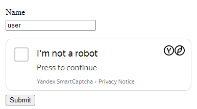
</details>

Данный вид капчи отлично решается с помощью токена. Запрос на решение такой капчи выглядит совершенно обыденно:

|**Параметр**|**Тип**|**Обязательный**|**Значение**|
| :- | :- | :- | :- |
|type|String|да|YandexSmartCaptchaTaskProxyless|
|websiteURL|String|да|Адрес страницы, на которой решается капча.|
|websiteKey|String|да|Sitekey, с которым рендерится капча. В большинстве случаев вытаскивается из кода страницы.|

Ответ:

|**Свойство**|**Тип**|**Описание**|
| :- | :- | :- |
|token|String|Вставьте значение токена в поле smart-token на странице с капчей.|

## Примеры запросов

### Сервисы Яндекса

**Создание запроса:**

:::info Метод
```http
https://api.capmonster.cloud/createTask
```
:::

```json
{
   "clientKey":"dce6bcbb1a728ea8d871de6d169a2057",
   "task":{
      "type":"YandexSmartCaptchaTaskProxyless",
      "websiteURL":"https://ya.ru/showcaptcha?cc=1&mt=C934C537A3644...",
      "websiteKey":"yandex",
      "userAgent":"Mozilla/5.0 (Windows NT 10.0; Win64; x64) AppleWebKit/537.36 (KHTML, like Gecko) Chrome/115.0.0.0 Safari/537.36",
      "htmlPageBase64":"PGhlYWQ+PG1ldGEgaHR0cC1lcXVpdj0iWC1VQS1Db...0L2phdmFzY3JpcHQiPjwvc2NyaXB0PjwvYm9keT4="
   }
}
```

Ответ:

```json
{
    "errorId":0,
    "taskId":407533072
}
```

**Получение результата:**

Используйте метод [getTaskResult](../api/methods/get-task-result.md), чтобы получить решение. 

```json
{
	"clientKey": "dce6bcbb1a728ea8d871de6d169a2057",
	"taskId": 407533072
}
```

Ответ:

```json
{
	"errorId": 0,
	"errorCode": null,
	"errorDescription": null,
	"solution": {
		"cookies": {
			"spravka": "dD0xNjkzMjI1MTE0OTZF...0ZDJlNDhiYjcxNTBjZWYzYzg2ODdhOQ=="
		},
		"redirectedUrl": "https://ya.ru/?nr=1&redirect_ts=169...87.00000",
		"referrer": "https://ya.ru/checkcaptcha?key=c57865...",
	},
	"status": "ready",
}
```

### Сторонние сайты

**Создание запроса:**

:::info Метод
```http
https://api.capmonster.cloud/createTask
```
:::

```json
{
   "clientKey":"dce6bcbb1a728ea8d871de6d169a2057",
   "task":{
      "type":"YandexSmartCaptchaTaskProxyless",
      "websiteURL":"https://example.com/captcha",
      "websitekey":"FEXfAbHQsToo9...1DgdxjtNB9"
   }
}
```

Ответ:

```json
{
    "errorId":0,
    "taskId":407533072
}
```

**Получение результата:**

Используйте метод [getTaskResult](../api/methods/get-task-result.md), чтобы получить решение.

```json
{
	"clientKey": "dce6bcbb1a728ea8d871de6d169a2057",
	"taskId": 407533072
}
```

Ответ:

```json
{
	"errorId": 0,
	"errorCode": null,
	"errorDescription": null,
	"solution": {
		"token": "dD0xNjkzMjI1OT...mNjMTExMTM5ZmVkMDRlMg=="
	},
	"status": "ready"
}
```

## Пример работы с ZennoPoster

**Шаг 1. Сбор данных**

Переходим на https://ya.ru в Zennoposter и встречаем страницу с капчей:

<details>
    <summary>Страница с капчей</summary>

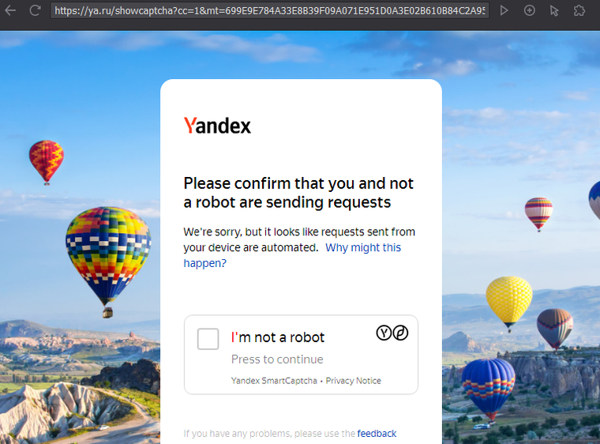
</details>

Для создания запроса на решение капчи нам нужно получить с этой страницы 2 параметра: *websiteURL* и *htmlPageBase64*. 

Займёмся получением исходного кода страницы и кодировкой его в base64. 

Для этого выбираем 

<details>
    <summary>Добавить действие → Табы → Данные</summary>


</details>

Затем настраиваем кубик следующим образом:

<details>
    <summary>Настройка кубика "Данные"</summary>

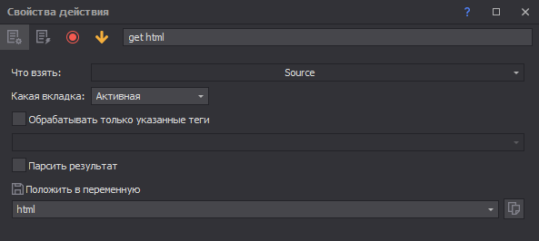
</details>

После выполения кубика в переменной проекта “html“ будет находиться содержимое страницы. Нам нужно закодировать его в base64. Сделать это можно с помощью короткого C# сниппета:

```csharp
var plainTextBytes = System.Text.Encoding.UTF8.GetBytes(project.Variables["html"].Value);
return System.Convert.ToBase64String(plainTextBytes);
```
<details>
    <summary>Настройка C# сниппета</summary>

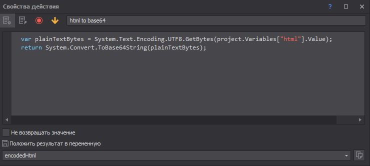
</details>

Теперь закодированная страница находится в переменной “encodedHtml“. 

Текущий websiteUrl можно взять с помощью встроенного макроса `{-Page.Url-}`.

**Шаг 2. Создание запроса на решение капчи**

Для отправки запроса на сервис CapmonsterCloud воспользуемся кубиком “Post запрос“

<details>
    <summary>Добавить действие → HTTP → POST-запрос</summary>

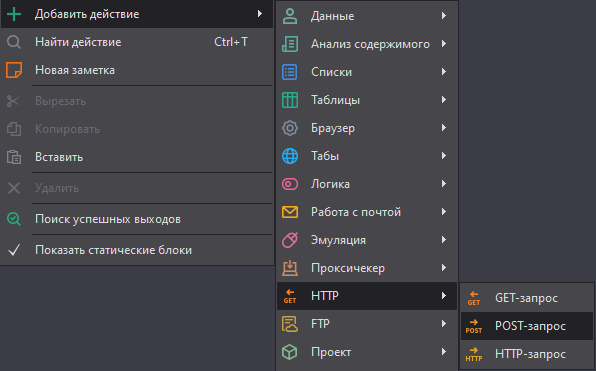
</details>

Настроим кубик следующим образом:

<details>
    <summary>Настройка кубика POST-запрос</summary>

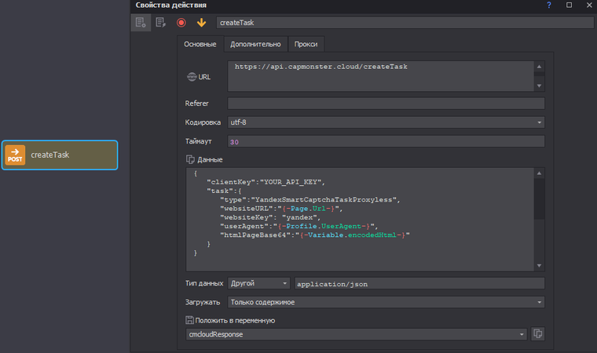

Данные(не забудьте вставить свой ключ от сервиса):

```JSON
{
   "clientKey":"YOUR_API_KEY",
   "task":{
      "type":"YandexSmartCaptchaTaskProxyless",
      "websiteURL":"{-Page.Url-}",
	  "websiteKey": "yandex",
      "userAgent":"{-Profile.UserAgent-}",
      "htmlPageBase64":"{-Variable.encodedHtml-}"
   }
}
```

Тип данных - *application/json*
</details>

После выполнения кубика в переменной *cmcloudResponse* будет примерно следующее содержимое:

```
{"taskId":989589591,"errorId":0,"errorCode":null,"errorDescription":null}
```

Чтобы забрать ответ от сервиса нам нужно вытащить значение поля *taskId*. Сделать это можно разными способами, но быстрее всего воспользоваться регулярным выражением:

```
(?<=\{"taskId":).*?(?=,)
```

<details>
    <summary>Добавить действие → Данные → Обработка текста</summary>

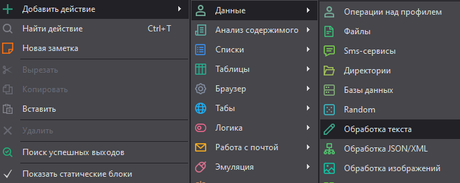
</details>

<details>
    <summary>Настройка кубика обработки текста</summary>

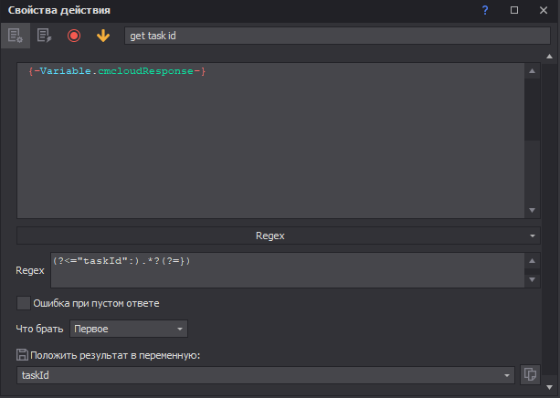
</details>

Похожим образом создаём ещё один кубик POST-запроса, но уже для получения решения от сервиса:

<details>
    <summary>Настройка кубика "POST-запрос" для /getTaskResult</summary>

!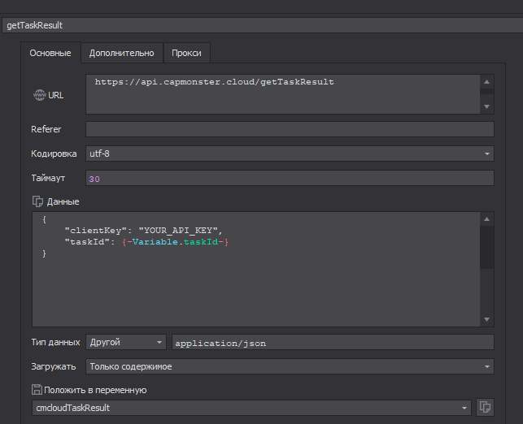
</details>

Если сервис решил капчу, то после выполнения кубика мы получим следующий ответ:

```
{
	"solution": {
		"cookies": {
			"spravka": "dD0xNjk1NzI5..zlmMg=="
		},
		"redirectedUrl": "https://ya.ru/?nr=1&redirect_ts=16957...00",
		"referrer": "https://ya.ru/showcaptcha?cc=1&mt=591BE798EABB444CC0B912483...f295d818d2"
	},
	"cost": 0.001,
	"status": "ready",
	"errorId": 0,
	"errorCode": null,
	"errorDescription": null
}
```

Спарсим нужные данные из ответа с помощью обработки JSON. Для этого выполним следующие шаги:

<details>
<summary>Развернуть</summary>

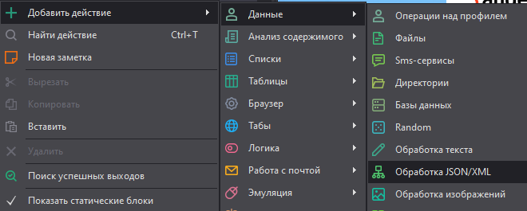
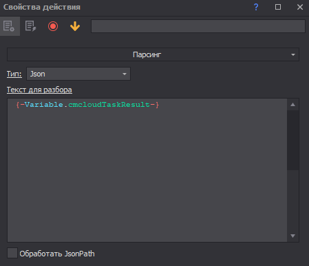

Следом тремя кубиками для обработки переменных заполним переменные проекта значениями из полученного JSON:

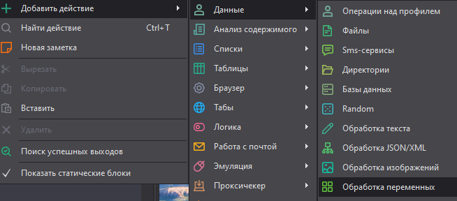
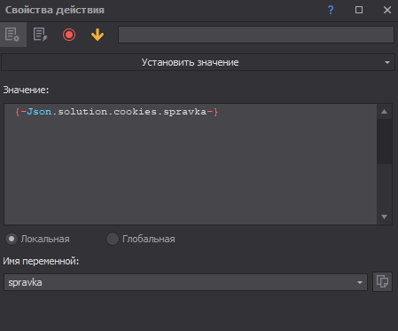

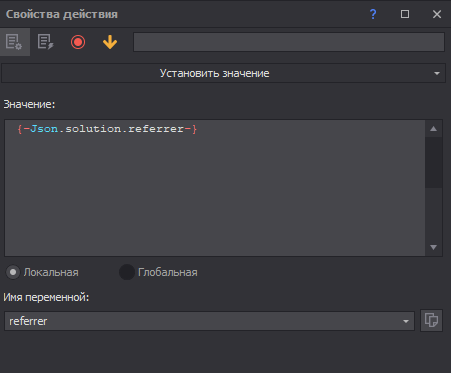
</details>

**Шаг 3. Применение данных**

Первым делом следует разобраться с куками. Чтобы всё стало понятнее, давайте проведём небольшой ресёрч, дабы понять как именно яндексу нужно скормить полученные от сервиса куки. Для этого просто руками пройдём капчу, а затем экспортируем куки в какую-нибудь переменную и изучим как они выглядят:

<details>
    <summary>Экспорт кук из браузера</summary>


</details>

В переменной *browserCookies* увидим примерно такой текст:

```
// ... тут много разных кук
.ya.ru	TRUE	/	FALSE	10/26/2023 14:09:45	spravka	dD0xNjk1NzMwMTg1O2k9MmEwZjozMTAxOmJkZjM6ZDM4MTo2NjY2OmY0OTE6M2M1MjpkYjEyO0Q9OUQyMjcwQURFNkU0MTU0QzA0NkUyNEUwMjU3OEQ3N0NGRDFCOEE5ODE0ODhDMzkzQjJGNTkzRURDQTcwNzdBQUNGNjA1MEMwMzQxNzFENzA5Qzg3RkEwM0JBOTVFNjcxMkNFNzk1QjYyQzFFMjI0QUY4RjFGMTFGOUYxNTdGOUM2NUU3RTI5RjUzMzg5QkNDQjA3Qjk4ODZBNjt1PTE2OTU3MzAxODUzNzQxNzE5ODU7aD03MjU2Y2ZiMGEzYjViY2I0Nzk3NGIxNmEwZWZiMDFjNA==	FALSE	FALSE	Unspecified	Medium
// ... тут тоже много разных кук
```

Теперь мы можем просто вытащить эту строчку, но подставить в неё значение кук от сервиса. Для этого воспользуемся кубиком “Обработка текста” и регулярным выражением:

<details>
    <summary>Формирование строки с куками</summary>

Составим regex:
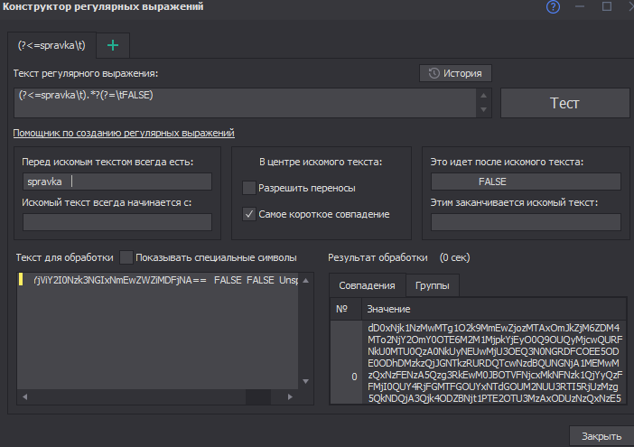

Обработаем текст:
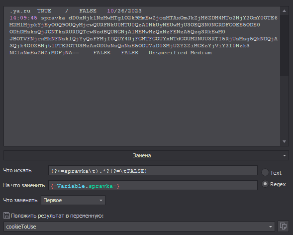

На дату и время в куках можете не обращать внимание. 
</details>

Далее импортируем куки в браузер с помощью того же кубика “Работа с Cookies“:

<details>
    <summary>Импорт кук</summary>

 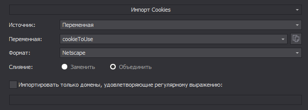
</details>

Осталось только перейти на страницу c полученными ранее данными redirectedUrl и referrer:

<details>
    <summary>Настройка кубика перехода на страницу</summary>

 
 
</details>