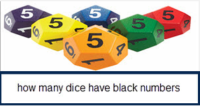

import Tabs from '@theme/Tabs';
import TabItem from '@theme/TabItem';
import ParamItem from '@theme/ParamItem';
import MethodItem from '@theme/MethodItem';
import MethodDescription from '@theme/MethodDescription'
import PriceBlock from '@theme/PriceBlock';
import PriceBlockWrap from '@theme/PriceBlockWrap';
import { ArticleHead } from '@site/src/theme/ArticleHead';

<ArticleHead slug="captchas/compleximage/dli_ensemble" />

# dli_ensemble


<PriceBlockWrap>
  <PriceBlock title="dli_ensemble" captchaId="complex-rec_oocl_rotate_new" />
</PriceBlockWrap>

:::warning **Attention!**
Using proxy servers is not required for this task.
:::
<br />

The request must contain a single image (together with text) in base64 format.

## Request parameters

<br />
<span style={{ fontSize: "15px", fontWeight: 700 }}>
> IMPORTANT: obtain the base64 image directly before creating the task to avoid errors during solving (see section [How to get base64](#how-to-get-base64)).
</span>
<br />

<TabItem value="proxyless" label="ComplexImageTask (without proxy)" default className="bordered-panel">
    <ParamItem title="type" required type="string" />
    **ComplexImageTask**

    ---

    <ParamItem title="class" required type="string" />
    **recognition**

    ---

    <ParamItem title="imagesBase64" required type="array" />
    Image encoded in base64 format.

    ---

    <ParamItem title="Task (inside metadata)" required type="string" />
    Task name: `"dli_ensemble"`

</TabItem>

## Create task method

<TabItem value="proxyless" label="ComplexImageTask (without proxy)" default className="method-panel">
	<MethodItem>
		```http
		https://api.capmonster.cloud/createTask
		```
    </MethodItem>
    <MethodDescription>
      **Request**
      ```json
      {
        "clientKey": "API_KEY",
        "task": {
          "type": "ComplexImageTask",
          "class": "recognition",
          "imagesBase64": [
            "base64"
          ],
          "metadata": {
            "Task": "dli_ensemble"
          }
        }
      }
      ```

    	**Task examples:**

    	
    	

    	**Response**
    	```json
    	{
    	  "errorId":0,
    	  "taskId":143998457
    	}
    	```
    </MethodDescription>

</TabItem>

## Get task result method

<TabItem value="proxyless" label="ComplexImageTask (without proxy)" default className="method-panel-full">
	<MethodItem>
		```http
		https://api.capmonster.cloud/getTaskResult
		```
	</MethodItem>
	<MethodDescription>
		**Request**
		```json
		{
		  "clientKey":"API_KEY",
		  "taskId": 143998457
		}
		```

		**Response:**
		computed result (numeric value) returned as a string:
      ```json
      {
          "solution":
        {
          "answer": "1",
          "metadata": {
              "AnswerType": "Text"
          }
        },
          "cost": 0.0003,
          "status": "ready",
          "errorId": 0,
          "errorCode": null,
          "errorDescription": null
      }
      ```
	</MethodDescription>
</TabItem>

## How to get Base64

Images on pages can be represented either as a URL or already encoded in Base64 format. To find the required value, right-click the captcha image, select **Inspect**, and carefully examine the **Elements** section or network requests — there you can find either the image URL or the encoded content.

1. Open your website where the captcha is displayed in the browser.  
2. Right-click the captcha element and select **Inspect**.

