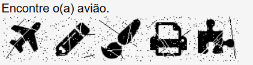

import Tabs from '@theme/Tabs';
import TabItem from '@theme/TabItem';
import ParamItem from '@theme/ParamItem';
import MethodItem from '@theme/MethodItem';
import MethodDescription from '@theme/MethodDescription'
import PriceBlock from '@theme/PriceBlock';
import PriceBlockWrap from '@theme/PriceBlockWrap';
import { ArticleHead } from '@site/src/theme/ArticleHead';

<ArticleHead slug="captchas/compleximage/portugal_text_find_icon" />

# portugal_text_find_icon


<PriceBlockWrap>
  <PriceBlock title="portugal_text_find_icon" captchaId="complex-rec_oocl_rotate_new" />
</PriceBlockWrap>

:::warning **Attention!**
Using proxy servers is not required for this task.
:::
<br />

The request must contain a single image in base64 format, consisting of 5 horizontally merged images (without text) arranged in the order of their display. A detailed example of the stitching process is shown below. Additionally, the `TaskArgument` parameter specifies the task text — the target icon to find.

## Request parameters

<br />
<span style={{ fontSize: "15px", fontWeight: 700 }}>
> IMPORTANT: obtain the base64 image directly before creating the task to avoid errors during solving (see section [Automated recognition and solving examples](#automated-recognition-and-solving-examples)).
</span>
<br />

<TabItem value="proxyless" label="ComplexImageTask (without proxy)" default className="bordered-panel">
    <ParamItem title="type" required type="string" />
    **ComplexImageTask**

    ---

    <ParamItem title="class" required type="string" />
    **recognition**

    ---

    <ParamItem title="imagesBase64" required type="array" />
    Image encoded in base64 format.

    ---

    <ParamItem title="Task (inside metadata)" required type="string" />
    Task name: `"portugal_text_find_icon"`

     ---

    <ParamItem title="TaskArgument (inside metadata)" required type="string" />
    Task text that defines which icon must be found. Example: `"Clique no(a) quadrado."`<br />

    **Important**: some characters in the task text must be properly escaped to avoid processing or solving errors.
    For example, for the text `"Por favor, clique no(a) avião."` you must pass `"Por favor, clique no(a) avi\\u00E3o."`
    (*see example in section [Automated recognition and solving examples](#automated-recognition-and-solving-examples)*).

</TabItem>

## Create task method

<TabItem value="proxyless" label="ComplexImageTask (without proxy)" default className="method-panel">
	<MethodItem>
		```http
		https://api.capmonster.cloud/createTask
		```
    </MethodItem>
    <MethodDescription>
      **Request**
      ```json
      {
        "clientKey": "API_KEY",
        "task": {
          "type": "ComplexImageTask",
          "class": "recognition",
          "imagesBase64": [
            "iVBORw0KGgoAAAA...SuQmCC"
          ],
          "metadata": {
            "Task": "portugal_text_find_icon",
            "TaskArgument": "Encontre o(a) avi\\u00E3o."
          }
        }
      }
      ```

    	**Response**
    	```json
    	{
    	  "errorId":0,
    	  "taskId":143998457
    	}
    	```
    </MethodDescription>

</TabItem>

Example task:

The example shows 5 icons and the task text: "Encontre o(a) avião." (Find the airplane).



You must send an image in base64 format that represents 5 horizontally merged icon images:


## Get task result method

<TabItem value="proxyless" label="ComplexImageTask (without proxy)" default className="method-panel-full">
	<MethodItem>
		```http
		https://api.capmonster.cloud/getTaskResult
		```
	</MethodItem>
	<MethodDescription>
		**Request**
		```json
		{
		  "clientKey":"API_KEY",
		  "taskId": 143998457
		}
		```

		**Response:**
		the returned index is the number of the icon that must be clicked. Icon indexing starts from 1 and ends at 5:
```json
{
  "solution": {
    "answer": [4],
    "metadata": {
      "AnswerType": "NumericArray"
    }
  },
  "status": "ready",
  "errorId": 0,
  "errorCode": null,
  "errorDescription": null
}     
```

</MethodDescription>

</TabItem>

## Automated recognition and solving examples

Examples in Python using `requests` and `Playwright`, demonstrating the full captcha workflow: from retrieving the task and extracting images to processing, preparing, and sending them to CapMonster Cloud for recognition, as well as obtaining the final result.

:::warning Important
These examples are for demonstration purposes and illustrate the general logic of working with your website. In real projects, the code may require adaptation to a specific site, its requests, and headers.

Sensitive data (API keys, proxy settings, etc.) should be stored in `.env` files or environment variables.
:::

<Tabs className="full-width-tabs filled-tabs request-tabs" groupId="captcha-type">

  <TabItem value="python" label="Using requests" default className="method-panel">
<details>
      <summary>Show code</summary>
```python
import os
import io
import time
import base64
import csv
import json
import re
import requests
from PIL import Image

# ===================== CONFIGURATION =====================
# It is recommended to store sensitive data in .env

# Base URL of internal captcha API
BASE = "https://www.example.com"

# CapMonster Cloud API
API_KEY = "YOUR_API_KEY"
CREATE_TASK_URL = "https://api.capmonster.cloud/createTask"
GET_RESULT_URL = "https://api.capmonster.cloud/getTaskResult"

# Headers to simulate a real browser request
HEADERS = {
    "User-Agent": "userAgentPlaceholder",
    "Referer": BASE + "/",
    "Accept": "image/avif,image/webp,image/apng,image/*,*/*;q=0.8",
    "Connection": "keep-alive"
}

# Directory for saving data (images, logs, CSV)
SAVE_DIR = "captcha_results"
os.makedirs(SAVE_DIR, exist_ok=True)

session = requests.Session()
session.headers.update(HEADERS)

# ===================== UTILITIES =====================

def serialize_json(text):
    """
    Converts a string into a JSON-safe format.
    """
    json_str = json.dumps(text, ensure_ascii=True)[1:-1]
    return re.sub(r'\\u([0-9a-f]{4})', lambda m: '\\u' + m.group(1).upper(), json_str)


def post_json(url, payload):
    """
    Sends a POST request with a JSON body and returns the server response.
    """
    return requests.post(url, json=payload).json()

# ===================== CAPTCHA FETCHING =====================

def get_captcha():
    """
    Requests a new captcha from the site internal API.
    """
    url = f"{BASE}/api.php?action=new"
    res = session.get(url)
    data = res.json()
    print("[CAPTCHA]:", data)
    return data


def build_image_urls(data):
    """
    Builds a list of captcha image URLs based on session and answers.
    """
    return [
        f"{BASE}/api.php?action=img&s={data['session']}&c={ans}"
        for ans in data["answers"]
    ]

# ===================== IMAGE PROCESSING =====================

def download_images(urls):
    """
    Downloads captcha images from a list of URLs.
    """
    images = []
    for url in urls:
        r = session.get(url)

        if "image" not in r.headers.get("Content-Type", ""):
            continue

        if len(r.content) < 100:
            continue

        try:
            img = Image.open(io.BytesIO(r.content)).convert("RGBA")
            images.append(img)
        except:
            pass

    return images


def merge_images(pil_images):
    """
    Merges multiple images into one (horizontal concatenation).
    """
    widths, heights = zip(*(img.size for img in pil_images))

    result = Image.new("RGBA", (sum(widths), max(heights)))

    x = 0
    for img in pil_images:
        result.paste(img, (x, 0))
        x += img.size[0]

    return result


def to_base64(img):
    """
    Converts an image to a base64 string.
    """
    buf = io.BytesIO()
    img.save(buf, format="PNG")
    return base64.b64encode(buf.getvalue()).decode()


def save_csv(prompt, urls):
    """
    Saves captcha log (prompt + image URLs) into a CSV file.
    """
    with open(os.path.join(SAVE_DIR, "captcha.csv"), "w", newline="", encoding="utf-8") as f:
        writer = csv.writer(f)
        writer.writerow(["prompt", "image_url"])
        for url in urls:
            writer.writerow([prompt, url])

# ===================== CAPMONSTER CLOUD API =====================

def create_task(base64_image, prompt):
    """
    Creates a CapMonster Cloud task for image recognition.
    """
    payload = {
        "clientKey": API_KEY,
        "task": {
            "type": "ComplexImageTask",
            "class": "recognition",
            "imagesBase64": [base64_image],
            "metadata": {
                "Task": "portugal_text_find_icon",
                "TaskArgument": serialize_json(prompt)
            }
        }
    }

    res = post_json(CREATE_TASK_URL, payload)
    print("[createTask]:", res)
    return res.get("taskId")


def get_result(task_id):
    """
    Waits for task completion and returns the result.
    """
    while True:
        time.sleep(2)

        res = post_json(GET_RESULT_URL, {
            "clientKey": API_KEY,
            "taskId": task_id
        })

        if res.get("status") == "ready":
            return res

        print("[...] waiting for result...")

# ===================== MAIN PROCESS =====================

def main():

    # fetch captcha
    data = get_captcha()
    prompt = data["question_i"]
    print("[PROMPT]:", prompt)

    # build image URLs
    urls = build_image_urls(data)
    save_csv(prompt, urls)

    # download images
    images = download_images(urls)
    if not images:
        print("No images found")
        return

    # merge images into one
    merged = merge_images(images)

    filepath = os.path.join(SAVE_DIR, f"captcha_{int(time.time())}.png")
    merged.save(filepath)
    print("[+] Saved image:", filepath)

    # convert image to base64
    base64_img = to_base64(merged)

    # create task in CapMonster Cloud
    task_id = create_task(base64_img, prompt)
    if not task_id:
        print("createTask error")
        return

    print("[+] taskId:", task_id)

    # get result
    result = get_result(task_id)

    print("\n=== FULL RESULT ===")
    print(json.dumps(result, indent=2, ensure_ascii=False))


if __name__ == "__main__":
    main()
```
</details>
  </TabItem>

  <TabItem value="python1" label="Using Playwright" className="method-panel">
  <details>
    <summary>Show code</summary>
```python
import os
import io
import time
import base64
import json
import requests
import re
from playwright.sync_api import sync_playwright
from PIL import Image

# API key for CapMonster Cloud
API_KEY = "YOUR_API_KEY"

# CapMonster Cloud endpoints
CREATE_TASK_URL = "https://api.capmonster.cloud/createTask"
GET_RESULT_URL = "https://api.capmonster.cloud/getTaskResult"

# Target site with captcha
TARGET_URL = "https://www.example.com"

# Directory for saving final captcha image
SAVE_DIR = "captcha_imgs"
os.makedirs(SAVE_DIR, exist_ok=True)

# Browser User-Agent to simulate a real user
USER_AGENT = "userAgentPlaceholder"


def serialize_json(text):
    # Converts text into a JSON-safe string with Unicode escaping
    json_str = json.dumps(text, ensure_ascii=True)[1:-1]

    # Convert Unicode symbols to uppercase (required by some captcha tasks)
    return re.sub(r'\\u([0-9a-f]{4})',
                  lambda m: '\\u' + m.group(1).upper(),
                  json_str)


# Merges multiple images into one horizontal image
def merge_images(images):

    widths, heights = zip(*(img.size for img in images))

    result = Image.new("RGBA", (sum(widths), max(heights)), (0, 0, 0, 0))

    x_offset = 0
    for img in images:
        if img.mode != "RGBA":
            img = img.convert("RGBA")

        # Place images side by side (in a row)
        result.paste(img, (x_offset, 0), img)
        x_offset += img.size[0]

    return result


# Converts PIL image to base64 string
def image_to_base64(img):
    buffer = io.BytesIO()
    img.save(buffer, format="PNG")
    return base64.b64encode(buffer.getvalue()).decode()


def post_json(url, payload):
    return requests.post(url, json=payload).json()


# Loads image from URL or decodes base64
def fetch_image(session, src):
    # If image is provided as base64 (data URI)
    if src.startswith("data:"):
        return base64.b64decode(src.split(",", 1)[1])

    # Otherwise download from URL
    res = session.get(src, headers={
        "User-Agent": USER_AGENT,
        "Referer": TARGET_URL
    })

    # Check successful response
    if res.status_code != 200:
        raise Exception(f"Error loading image: {src}")

    return res.content


# Creates captcha solving task
def create_task(base64_image, prompt):
    payload = {
        "clientKey": API_KEY,
        "task": {
            "type": "ComplexImageTask",
            "class": "recognition",
            "imagesBase64": [base64_image],
            "metadata": {
                "Task": "portugal_text_find_icon",
                "TaskArgument": serialize_json(prompt)  # captcha instruction
            }
        }
    }

    print("\n[=== createTask ===]")
    print(json.dumps(payload, indent=2))

    res = post_json(CREATE_TASK_URL, payload)
    print("[createTask]:", res)

    return res.get("taskId")


# Waits for captcha solution result
def get_result(task_id):
    while True:
        time.sleep(2)  # request delay

        res = post_json(GET_RESULT_URL, {
            "clientKey": API_KEY,
            "taskId": task_id
        })

        # If solution is ready
        if res.get("status") == "ready":
            return res.get("solution")

        print("[...] waiting for result...")


def main():
    session = requests.Session() 

    images_data = []

    with sync_playwright() as p:
        # Launch browser (non-headless for debugging)
        browser = p.chromium.launch(headless=False)
        page = browser.new_page()

        # Open target page
        page.goto(TARGET_URL)

        # Wait for captcha instruction text
        page.wait_for_selector(".captcheck_question_image", timeout=15000)
        prompt = page.locator(".captcheck_question_image").first.inner_text()
        print("[PROMPT]:", prompt)

        # Find all captcha answer images
        answer_links = page.locator(".captcheck_answer_images a")
        count = answer_links.count()

        print(f"[+] Found images: {count}")

        # Extract image sources
        for i in range(count):
            img = answer_links.nth(i).locator("img")
            src = img.get_attribute("src")

            # Download image
            images_data.append(fetch_image(session, src))

        browser.close()

    print(f"[+] Received images: {len(images_data)}")

    # If no images found, exit
    if not images_data:
        print("No images found")
        return

    # Convert bytes to PIL images
    images = [Image.open(io.BytesIO(x)) for x in images_data]

    # Merge images
    merged = merge_images(images)

    # Save final image
    path = f"{SAVE_DIR}/result.png"
    merged.save(path)
    print("[+] Saved:", path)

    # Convert image to base64
    base64_image = image_to_base64(merged)

    print("[+] Sending to CapMonster Cloud...")
    task_id = create_task(base64_image, prompt)

    # Check task creation
    if not task_id:
        print("createTask error")
        return

    print("[+] taskId:", task_id)

    # Wait for result
    solution = get_result(task_id)

    print("\nRESULT:")
    print(solution)


if __name__ == "__main__":
    main()
```
</details>
  </TabItem>
    </Tabs>
