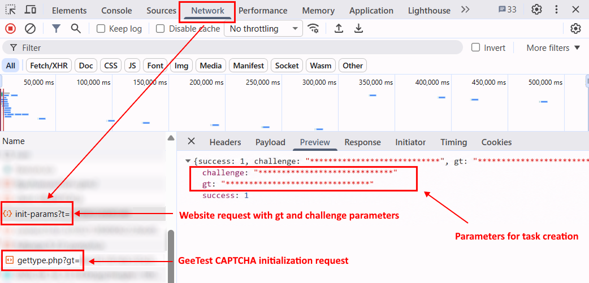

import Tabs from '@theme/Tabs';
import TabItem from '@theme/TabItem';
import ParamItem from '@theme/ParamItem';
import MethodItem from '@theme/MethodItem';
import MethodDescription from '@theme/MethodDescription';
import PriceBlock from '../../../../../src/theme/PriceBlock';
import PriceBlockWrap from '@theme/PriceBlockWrap';
import ImagesLayout from '@theme/ImagesLayout';
import ImageWrap from '@theme/ImageWrap';
import { ArticleHead } from '../../../../../src/theme/ArticleHead';

<ArticleHead slug="captchas/geetest-task" />

# GeeTest

<PriceBlockWrap>
  <PriceBlock title="GeeTestTask" captchaId="geetest" />
</PriceBlockWrap>

<ImagesLayout gap="16px" columns={3}>
  <ImageWrap title="GeeTestCaptcha Example"></ImageWrap>
  <ImageWrap title="GeeTestCaptcha Example"></ImageWrap>
</ImagesLayout>

Your application should send the site address, public domain key (`gt`) and key (`challenge`).

The result of solving the task is three or five tokens for form submission.

:::warning **Attention!**
CapMonster Cloud uses built-in proxies by default — their cost is already included in the service. You only need to specify your own proxies in cases where the website does not accept the token or access to the built-in services is restricted.

Proxies with IP authorization are not yet supported.
:::

:::info

For **GeeTest V3**: 
- The `gt`, `challenge`, and `geetestApiServerSubdomain` parameters can be passed in the JavaScript code used to initialize GeeTest, for example in the `initGeetest` function.

- Some parameters may also be present in the page HTML or network requests. For GeeTest V3, the `challenge` value must be obtained before the CAPTCHA is initialized.


For **GeeTest V4**, the `gt` parameter contains the `captcha_id` value.


:::

<br />

## <span style={{fontSize: '2.25rem'}}>GeeTest V3</span>

### <span style={{fontSize: '1.5rem'}}>Task examples</span>

Below are examples of GeeTest V3 task types currently supported by CapMonster Cloud:

<ImagesLayout gap="16px" columns={4}>
  <ImageWrap title="Intelligent mode"></ImageWrap>
  <ImageWrap title="Slide CAPTCHA"></ImageWrap>
  <ImageWrap title="Icon CAPTCHA"></ImageWrap>
  <ImageWrap title="Space CAPTCHA"></ImageWrap>
</ImagesLayout>

### <span style={{fontSize: '1.5rem'}}>Request parameters</span>

<br />
<span style={{ fontSize: "15px", fontWeight: 700 }}>
> IMPORTANT: the `challenge` parameter in GeeTest V3 is dynamic.  
> Obtain a new value immediately before creating each task and before the CAPTCHA is initialized on the page. Once the CAPTCHA is loaded, the previously obtained `challenge` becomes invalid.
</span>
<br />

  <div className="bordered-panel">
    <ParamItem title="type" required type="string" />
    **GeeTestTask**

    ---

    <ParamItem title="websiteURL" required type="string" />
    The URL of the page where the CAPTCHA is initialized. The correct URL is usually passed in the `Referer` header when requesting `https://api-na.geetest.com/gettype.php`. For example, you may be on `https://example.com#login`, while the CAPTCHA is actually initialized on `https://example.com`.

    ---

    <ParamItem title="gt" required type="string" />
    The GeeTest `gt` identifier key for the domain. This is a static value and is rarely changed.

    ---

    <ParamItem title="challenge" required="required only for V3" type="string" />
    Dynamic key. A new `challenge` value must be obtained before creating each task.<br />

    **Important:** obtain `challenge` before the CAPTCHA is initialized on the page.<br />

If the CAPTCHA has already been loaded, the obtained value becomes invalid. Sending such a value to the CapMonster Cloud API will return the [error](../api/api-errors.mdx) `ERROR_INVALID_TASK` with a message indicating that the parameter is invalid.<br />
    
    ---

    <ParamItem title="version" required type="integer"/>
    3

    ---

    <ParamItem title="geetestApiServerSubdomain" type="string" />
    GeeTest API server subdomain (must be different from `api.geetest.com`). 
	<br />Optional parameter. May be required for some websites.

    ---

    <ParamItem title="geetestGetLib" type="string" />
    Path to the CAPTCHA script used to display it on the page. 
	<br />Optional parameter. May be required for some websites. 
	<br />Send JSON as a string.

    ---

    <ParamItem title="userAgent" type="string" />
    Browser User-Agent. Use the current value supported by CapMonster Cloud: `userAgentPlaceholder`<br />

You can get the latest value at: [https://capmonster.cloud/api/useragent/actual](https://capmonster.cloud/api/useragent/actual).
    
    ---

    <ParamItem title="proxyType" type="string" />
    **http** - regular http/https proxy;<br />**https** - try this option only if "http" doesn't work (required for some custom proxies);<br />**socks4** - socks4 proxy;<br />**socks5** - socks5 proxy.

    ---

    <ParamItem title="proxyAddress" type="string" />
    <p>
      IPv4/IPv6 proxy IP address. Not allowed:
      - using transparent proxies (where you can see the client's IP);
      - using proxies on local machines.
    </p>

    ---

    <ParamItem title="proxyPort" type="integer" />
    Proxy port.

    ---

    <ParamItem title="proxyLogin" type="string" />
    Proxy-server login.

    ---

    <ParamItem title="proxyPassword" type="string" />
    Proxy-server password.

  </div>

### <span style={{fontSize: '1.5rem'}}>Create task method</span>

<Tabs className="full-width-tabs filled-tabs request-tabs" groupId="captcha-type">
	<TabItem value="proxyless" label="GeeTestTask (without proxy)" default className="method-panel">
		<MethodItem>
			```http
			https://api.capmonster.cloud/createTask
			```
		</MethodItem>
		<MethodDescription>
			**Request example**
```json
{
  "clientKey": "API_KEY",
  "task": {
    "type": "GeeTestTask",
    "websiteURL": "https://yourwebsite.com/page-with-geetest",
    "gt": "gt-value",
    "challenge": "challenge-value",
    "version": 3,
    "geetestApiServerSubdomain": "example.api.geetest.com"

  }
}
```
    		**Response example**
    		```json
    		{
    		  "errorId":0,
    		  "taskId":407533072
    		}
    		```
    	</MethodDescription>
    </TabItem>

    <TabItem value="proxy" label="GeeTestTask (with proxy)" className="method-panel">
    	<MethodItem>
    		```http
    		https://api.capmonster.cloud/createTask
    		```
    	</MethodItem>
    	<MethodDescription>
    		**Request example**
```json 
{
  "clientKey": "API_KEY",
  "task": {
    "type": "GeeTestTask",
    "websiteURL": "https://yourwebsite.com/page-with-geetest",
    "gt": "gt-value",
    "challenge": "challenge-value",
    "version": 3,
    "geetestApiServerSubdomain": "example.api.geetest.com",
    "userAgent": "userAgentPlaceholder",
    "proxyType": "your-proxy-type",
    "proxyAddress": "your-proxy-address",
    "proxyPort": 1234,
    "proxyLogin": "your-proxy-login",
    "proxyPassword": "your-proxy-password"
  }
}
```
    		**Response example**
    		```json
    		{
    		  "errorId":0,
    		  "taskId":407533072
    		}
    		```
    	</MethodDescription>
    </TabItem>

</Tabs>

Use the [getTaskResult](../api/methods/get-task-result.mdx) method to get the result of GeeTest recognition. Depending on the system load, you will receive a response after a time in the range from 10 s to 30 s.

### <span style={{fontSize: '1.5rem'}}>Get task result method</span>

    <div className="method-panel-full">
    	<MethodItem>
    		```http
    		https://api.capmonster.cloud/getTaskResult
    		```
    	</MethodItem>
    	<MethodDescription>
    		**Request example**
    		```json
    		{
    		  "clientKey":"API_KEY",
    		  "taskId": 407533072
    		}
    		```
    		**Response example**
```json
{
  "errorId": 0,
  "status": "ready",
  "solution": {
    "challenge": "0f759dd1ea6c4wc76cedc2991039ca4f23",
    "validate": "6275e26419211d1f526e674d97110e15",
    "seccode": "510cd9735583edcb158601067195a5eb|jordan"
  }
}
```
    	</MethodDescription>
    </div>

<br />

<table>
  <tr>
    <th>
      <b>Property</b>
    </th>
    <th>
      <b>Type</b>
    </th>
    <th>
      <b>Description</b>
    </th>
  </tr>
  <tr>
    <td>challenge</td>
    <td>String</td>
    <td rowspan="3">All three parameters are required when submitting the form on the target site.</td>
  </tr>
  <tr>
    <td>validate</td>
    <td>String</td>
  </tr>
  <tr>
    <td>seccode</td>
    <td>String</td>
  </tr>
</table>
<br />

### <span style={{fontSize: '1.5rem'}}>How to find all parameters required to create a task</span>

#### <span style={{fontSize: '1.2rem'}}>Manually</span>

1. Open the website where GeeTest V3 is displayed in a browser.
2. Open Developer Tools (**DevTools**) and go to the **Network** tab.
3. Reload the page to capture network requests from the moment it starts loading.
4. Find a request to the target website server whose response contains GeeTest parameters, including `gt` and `challenge`.

The `challenge` value must be obtained **before the CAPTCHA is initialized**, that is, before a GeeTest request such as the following is sent:

```text
https://api.geetest.com/gettype.php?gt=...
```

Before initializing the CAPTCHA, the website may obtain GeeTest parameters from its own server. To find the current `challenge` value, check requests to the target website domain and their responses.



In some cases, the website encrypts data received from its server, so the `challenge` value may not be available in plain form in the response. In this case, you can obtain it from GeeTest request parameters, for example:

```text
https://api.geetest.com/get.php?gt=...
```

and/or:

```text
https://api.geevisit.com/ajax.php?gt=...
```


:::warning Important:
With this method, obtain the parameters from the request and **block requests to the GeeTest API before they are sent**. If the request is sent and the CAPTCHA loads, the `challenge` value used in that request becomes invalid.
:::

After obtaining the current `gt` and `challenge` values, use them to create a GeeTest V3 task in CapMonster Cloud.
<br />

#### <span style={{fontSize: '1.2rem'}}>Automatically</span>

GeeTest V3 parameter retrieval can be automated in two ways. Choose the appropriate option depending on how the target website is implemented.

**Getting parameters from the website server response**

If the website server returns `gt` and `challenge` in plain form, repeat the corresponding request before creating a task.

For example:

```text
https://example.com/api/v1/captcha/gee-test/init-params
```

<Tabs className="full-width-tabs filled-tabs request-tabs">
  <TabItem value="js" label="JavaScript" default className="method-panel">
    <details>
      <summary>Show code (in browser)</summary>

```js
async function getGeeTestV3Params() {
  // Replace the URL with the request used by your website,
  // whose response returns gt and challenge.
  // If the request contains dynamic parameters,
  // generate them before sending the request.
  const timestamp = Date.now();

  const response = await fetch(
    `https://example.com/api/v1/captcha/gee-test/init-params?t=${timestamp}`
  );

  if (!response.ok) {
    throw new Error(`Request failed: ${response.status}`);
  }

  const data = await response.json();

  const gt = data.gt;
  const challenge = data.challenge;

  if (!gt || !challenge) {
    throw new Error("Failed to get gt or challenge");
  }

  console.log({ gt, challenge });

  return { gt, challenge };
}

getGeeTestV3Params().catch(console.error);
```

    </details>

    <details>
      <summary>Show code (Node.js)</summary>

```js
async function getGeeTestV3Params() {
  // Replace the URL with the request used by your website,
  // whose response returns gt and challenge.
  // If the request contains dynamic parameters,
  // generate them before sending the request.
  const timestamp = Date.now();

  const response = await fetch(
    `https://example.com/api/v1/captcha/gee-test/init-params?t=${timestamp}`
  );

  if (!response.ok) {
    throw new Error(`Request failed: ${response.status}`);
  }

  const data = await response.json();

  const gt = data.gt;
  const challenge = data.challenge;

  if (!gt || !challenge) {
    throw new Error("Missing gt or challenge");
  }

  console.log({ gt, challenge });

  return { gt, challenge };
}

getGeeTestV3Params().catch(console.error);
```

    </details>
  </TabItem>

  <TabItem value="python" label="Python" className="method-panel">
    <details>
      <summary>Show code</summary>

```python
import time

import requests


def get_geetest_v3_params():
    # Replace the URL with the request used by your website,
    # whose response returns gt and challenge.
    # If the request contains dynamic parameters,
    # generate them before sending the request.
    timestamp = int(time.time() * 1000)

    response = requests.get(
        "https://example.com/api/v1/captcha/gee-test/init-params",
        params={
            "t": timestamp,
        },
    )
    response.raise_for_status()

    data = response.json()

    gt = data.get("gt")
    challenge = data.get("challenge")

    if not gt or not challenge:
        raise ValueError("Failed to get gt or challenge")

    print({
        "gt": gt,
        "challenge": challenge,
    })

    return gt, challenge


get_geetest_v3_params()
```

    </details>
  </TabItem>

  <TabItem value="csharp" label="C#" className="method-panel">
    <details>
      <summary>Show code</summary>

```csharp
using System;
using System.Net.Http;
using System.Threading.Tasks;
using Newtonsoft.Json.Linq;

class Program
{
    static async Task GetGeeTestV3Params()
    {
        using var client = new HttpClient();

        // Replace the URL with the request used by your website,
        // whose response returns gt and challenge.
        // If the request contains dynamic parameters,
        // generate them before sending the request.
        var timestamp = DateTimeOffset.UtcNow.ToUnixTimeMilliseconds();

        var url =
            $"https://example.com/api/v1/captcha/gee-test/init-params?t={timestamp}";

        var response = await client.GetAsync(url);

        response.EnsureSuccessStatusCode();

        var content = await response.Content.ReadAsStringAsync();
        var data = JObject.Parse(content);

        var gt = data["gt"]?.ToString();
        var challenge = data["challenge"]?.ToString();

        if (string.IsNullOrEmpty(gt) || string.IsNullOrEmpty(challenge))
        {
            throw new Exception("Failed to get gt or challenge");
        }

        Console.WriteLine($"GT: {gt}");
        Console.WriteLine($"Challenge: {challenge}");
    }

    static async Task Main()
    {
        await GetGeeTestV3Params();
    }
}
```

    </details>
  </TabItem>
</Tabs>
<br />

**Getting parameters from a GeeTest request**

If the `challenge` value cannot be obtained from the website server response, use the corresponding GeeTest request:

```text
https://api.geetest.com/get.php?gt=...&challenge=...
```

or:

```text
https://api.geevisit.com/ajax.php?gt=...&challenge=...
```

Extract `gt` and `challenge` from the query parameters and block the request before it is sent.

<Tabs className="full-width-tabs filled-tabs request-tabs">
  <TabItem value="js" label="JavaScript / TypeScript" default className="method-panel">
    <details>
      <summary>Show code (Playwright)</summary>

```js
import { chromium } from "playwright";

async function getGeeTestV3Params(pageUrl) {
  const browser = await chromium.launch({ headless: false });
  const context = await browser.newContext();

  let params = null;

  await context.route("**/*", async (route) => {
    const requestUrl = route.request().url();

    if (
      requestUrl.includes("api.geetest.com/get.php") ||
      requestUrl.includes("api.geevisit.com/ajax.php")
    ) {
      const url = new URL(requestUrl);

      const gt = url.searchParams.get("gt");
      const challenge = url.searchParams.get("challenge");

      if (gt && challenge && !params) {
        params = { gt, challenge };
        console.log(params);
      }

      await route.abort();
      return;
    }

    await route.continue();
  });

  const page = await context.newPage();
  await page.goto(pageUrl);

  await page.waitForTimeout(5000);
  await browser.close();

  if (!params) {
    throw new Error("Failed to get gt and challenge");
  }

  return params;
}

getGeeTestV3Params(
  "https://example.com/page-with-geetest"
).catch(console.error);
```

    </details>
  </TabItem>

  <TabItem value="python" label="Python" className="method-panel">
    <details>
      <summary>Show code (Playwright)</summary>

```python
import asyncio
from urllib.parse import urlparse, parse_qs

from playwright.async_api import async_playwright


async def get_geetest_v3_params(page_url):
    params = {}

    async with async_playwright() as p:
        browser = await p.chromium.launch(headless=False)
        context = await browser.new_context()

        async def handle_route(route):
            request_url = route.request.url

            if (
                "api.geetest.com/get.php" in request_url
                or "api.geevisit.com/ajax.php" in request_url
            ):
                query = parse_qs(urlparse(request_url).query)

                gt = query.get("gt", [None])[0]
                challenge = query.get("challenge", [None])[0]

                if gt and challenge and not params:
                    params["gt"] = gt
                    params["challenge"] = challenge
                    print(params)

                await route.abort()
                return

            await route.continue_()

        await context.route("**/*", handle_route)

        page = await context.new_page()
        await page.goto(page_url)

        await asyncio.sleep(5)
        await browser.close()

    if not params:
        raise RuntimeError("Failed to get gt and challenge")

    return params


asyncio.run(
    get_geetest_v3_params(
        "https://example.com/page-with-geetest"
    )
)
```

    </details>
  </TabItem>
</Tabs>

<br />


### <span style={{fontSize: '1.5rem'}}>Use the SDK library</span>

<Tabs className="full-width-tabs filled-tabs request-tabs" groupId="captcha-type">
  <TabItem value="js" label="JavaScript / TypeScript" default className="method-panel">
  <details>
      <summary>Show code (for browser)</summary>
```js
// https://github.com/CapMonsterCloud/capmonster-nodejs-captcha-solver

import {
  CapMonsterCloudClientFactory,
  ClientOptions,
  GeeTestRequest
} from "@zennolab_com/capmonstercloud-client";

document.addEventListener("DOMContentLoaded", async () => {

  const API_KEY = "YOUR_API_KEY"; // Specify your CapMonster Cloud API key

  const client = CapMonsterCloudClientFactory.Create(
    new ClientOptions({ clientKey: API_KEY })
  );

  // Basic example without proxy
  // CapMonster Cloud automatically uses its own proxies
  let geetestRequest = new GeeTestRequest({
    websiteURL: "https://yourwebsite.com/page-with-geetest",
    gt: "your-gt-value",
    challenge: "your-challenge-value",
    version: 3,
  });

  // Example using your proxy
  // Uncomment this block if you want to use your own proxy
  /*
  const proxy = {
    proxyType: "https",
    proxyAddress: "123.45.67.89",
    proxyPort: 8080,
    proxyLogin: "username",
    proxyPassword: "password",
  };

  geetestRequest = new GeeTestRequest({
    websiteURL: "https://yourwebsite.com/page-with-geetest",
    gt: "your-gt-value",
    challenge: "your-challenge-value",
    version: 3,
    proxy,
    userAgent: "userAgentPlaceholder",
  });
  */

  // You can check your balance if necessary
  const balance = await client.getBalance();
  console.log("Balance:", balance);

  const result = await client.Solve(geetestRequest);
  console.log("Solution:", result.solution);
});
```
</details>

<details>
      <summary>Show code (Node.js)</summary>
```javascript
// https://github.com/CapMonsterCloud/capmonster-nodejs-captcha-solver

const {
  CapMonsterCloudClientFactory,
  ClientOptions,
  GeeTestRequest,
} = require("@zennolab_com/capmonstercloud-client");

const API_KEY = "YOUR_API_KEY"; // Specify your CapMonster Cloud API key

async function solveGeeTest() {
  const client = CapMonsterCloudClientFactory.Create(
    new ClientOptions({ clientKey: API_KEY }),
  );

  // Basic example without proxy
  // CapMonster Cloud automatically uses its own proxies
  let geetestRequest = new GeeTestRequest({
    websiteURL: "https://yourwebsite.com/page-with-geetest",
    gt: "your-gt-value",
    challenge: "your-challenge-value",
    version: 3,
  });

  // Example using your proxy
  // Uncomment this block if you want to use your own proxy
  /*
  const proxy = {
    proxyType: "https",
    proxyAddress: "123.45.67.89",
    proxyPort: 8080,
    proxyLogin: "username",
    proxyPassword: "password",
  };

  geetestRequest = new GeeTestRequest({
    websiteURL: "https://yourwebsite.com/page-with-geetest",
    gt: "your-gt-value",
    challenge: "your-challenge-value",
    version: 3,
    proxy,
    userAgent: "userAgentPlaceholder",
  });
  */

  // You can check your balance if necessary
  const balance = await client.getBalance();
  console.log("Balance:", balance);

  const result = await client.Solve(geetestRequest);
  console.log("Solution:", result.solution);
}

solveGeeTest().catch(console.error);
```
</details>
  </TabItem>

  <TabItem value="python" label="Python" className="method-panel">
  <details>
      <summary>Show code</summary>
```python
# https://github.com/CapMonsterCloud/capmonster-python-captcha-solver

import asyncio

from capmonstercloudclient import CapMonsterClient, ClientOptions
from capmonstercloudclient.requests import GeetestRequest
# Import ProxyInfo if you plan to use your own proxy
from capmonstercloudclient.requests.proxy_info import ProxyInfo

API_KEY = "YOUR_API_KEY"  # Specify your CapMonster Cloud API key


async def solve_geetest():
    client = CapMonsterClient(
        options=ClientOptions(api_key=API_KEY)
    )

    # Basic example without proxy
    # CapMonster Cloud automatically uses its own proxies
    geetest_request = GeetestRequest(
        websiteUrl="https://yourwebsite.com/page-with-geetest",
        gt="your-gt-value",
        challenge="your-challenge-value",
        version=3,
    )

    # Example using your proxy
    # Uncomment this block if you want to use your own proxy
    """
    proxy = ProxyInfo(
        proxyType="https",
        proxyAddress="123.45.67.89",
        proxyPort=8080,
        proxyLogin="username",
        proxyPassword="password",
    )

    geetest_request = GeetestRequest(
        websiteUrl="https://yourwebsite.com/page-with-geetest",
        gt="your-gt-value",
        challenge="your-challenge-value",
        version=3,
        userAgent="userAgentPlaceholder",
        proxy=proxy,
    )
    """

    # You can check your balance if necessary
    balance = await client.get_balance()
    print("Balance:", balance)

    result = await client.solve_captcha(geetest_request)
    print("Solution:", result)


asyncio.run(solve_geetest())
```
    </details>
  </TabItem>

  <TabItem value="csharp" label="C#" className="method-panel">
  <details>
      <summary>Show code</summary>
```csharp
// https://github.com/CapMonsterCloud/capmonster-dotnet-captcha-solver

using System;
using System.Threading.Tasks;
using Zennolab.CapMonsterCloud;
using Zennolab.CapMonsterCloud.Requests;

class Program
{
    static async Task Main(string[] args)
    {
        // Specify your CapMonster Cloud API key
        var clientOptions = new ClientOptions
        {
            ClientKey = "YOUR_API_KEY"
        };

        var cmCloudClient = CapMonsterCloudClientFactory.Create(clientOptions);

        // Basic example without proxy
        // CapMonster Cloud automatically uses its own proxies
        var geetestRequest = new GeeTestRequest
        {
            WebsiteUrl = "https://yourwebsite.com/page-with-geetest",
            Gt = "your-gt-value",
            Challenge = "your-challenge-value",
            Version = 3
        };

        // Example using your proxy
        // Uncomment this block if you want to use your own proxy
        /*
        geetestRequest = new GeeTestRequest
        {
            WebsiteUrl = "https://yourwebsite.com/page-with-geetest",
            Gt = "your-gt-value",
            Challenge = "your-challenge-value",
            Version = 3,
            UserAgent = "userAgentPlaceholder",

            Proxy = new ProxyContainer(
                "123.45.67.89",
                8080,
                ProxyType.Http,
                "username",
                "password"
            )
        };
        */

        // You can check your balance if necessary
        var balance = await cmCloudClient.GetBalanceAsync();
        Console.WriteLine("Balance: " + balance);

        var geetestResult = await cmCloudClient.SolveAsync(geetestRequest);

        Console.WriteLine($"""
Solution:
  Challenge: {geetestResult.Solution.Challenge}
  Validate:  {geetestResult.Solution.Validate}
  SecCode:   {geetestResult.Solution.SecCode}
""");
    }
}
```
    </details>
  </TabItem>  
</Tabs>

<br />

## <span style={{fontSize: '2.25rem'}}>GeeTest V4</span>

### <span style={{fontSize: '1.5rem'}}>Possible captcha variant</span>


### <span style={{fontSize: '1.5rem'}}>Request parameters</span>

  <div className="bordered-panel">
    <ParamItem title="type" required type="string" />
    **GeeTestTask**

    ---

    <ParamItem title="websiteURL" required type="string" />
    Address of the page on which the captcha is solved.

    ---

    <ParamItem title="gt" required type="string" />
    The GeeTest identifier key for the domain - the `captcha_id` parameter.

    ---

    <ParamItem title="version" required type="integer"/>
    4

    ---

    <ParamItem title="geetestApiServerSubdomain" type="string" />
    Geetest API subdomain server (must be different from api.geetest.com). <br />Optional parameter. May be required for some sites.

    ---

    <ParamItem title="geetestGetLib" type="string" />
    Path to the captcha script to display it on the page. <br /> Optional parameter. May be required for some sites. <br />Send JSON as a string.

    ---

    <ParamItem title="initParameters" type="object" />
    Additional parameters for version 4, used together with “riskType” (captcha type/characteristics of its verification).
    
    ---

    <ParamItem title="userAgent" type="string" />
    Browser User-Agent. **Pass only a valid UA from Windows OS. Currently it is**: `userAgentPlaceholder`

    ---

    <ParamItem title="proxyType" type="string" />
    **http** - regular http/https proxy;<br />**https** - try this option only if "http" doesn't work (required for some custom proxies);<br />**socks4** - socks4 proxy;<br />**socks5** - socks5 proxy.

    ---

    <ParamItem title="proxyAddress" type="string" />
    <p>
      IPv4/IPv6 proxy IP address. Not allowed:
      - using transparent proxies (where you can see the client's IP);
      - using proxies on local machines.
    </p>

    ---

    <ParamItem title="proxyPort" type="integer" />
    Proxy port.

    ---

    <ParamItem title="proxyLogin" type="string" />
    Proxy-server login.

    ---

    <ParamItem title="proxyPassword" type="string" />
    Proxy-server password.

  </div>

### <span style={{fontSize: '1.5rem'}}>Create task method</span>

<Tabs className="full-width-tabs filled-tabs request-tabs" groupId="captcha-type">
	<TabItem value="proxyless" label="GeeTestTask (without proxy)" default className="method-panel">
		<MethodItem>
			```http
			https://api.capmonster.cloud/createTask
			```
		</MethodItem>
		<MethodDescription>
			**Request**
```json
{
  "clientKey": "API_KEY",
  "task": {
    "type": "GeeTestTask",
    "websiteURL": "https://yourwebsite.com/page-with-geetest",
    "gt": "captcha-id-value",
    "version": 4,
    "initParameters": {
      "riskType": "risk-type-value"
    }
  }
}
```
    		**Response example**
    		```json
    		{
    		  "errorId":0,
    		  "taskId":407533072
    		}
    		```
    	</MethodDescription>
    </TabItem>

    <TabItem value="proxy" label="GeeTestTask (with proxy)" className="method-panel">
    	<MethodItem>
    		```http
    		https://api.capmonster.cloud/createTask
    		```
    	</MethodItem>
    	<MethodDescription>
    		**Request example**
  ```json
  {
    "clientKey": "API_KEY",
    "task": {
      "type": "GeeTestTask",
      "websiteURL": "https://yourwebsite.com/page-with-geetest",
      "gt": "captcha-id-value",
      "version": 4,
      "initParameters": {
        "riskType": "risk-type-value"
      },
      "proxyType": "your-proxy-type",
      "proxyAddress": "your-proxy-address",
      "proxyPort": 1234,
      "proxyLogin": "your-proxy-login",
      "proxyPassword": "your-proxy-password",
      "userAgent": "userAgentPlaceholder"
    }
  }
  ```

    		**Response example**
    		```json
    		{
    		  "errorId":0,
    		  "taskId":407533072
    		}
    		```
    	</MethodDescription>
    </TabItem>

</Tabs>

Use the [getTaskResult](../api/methods/get-task-result.mdx) to get the result of GeeTest recognition. Depending on the system load, you will receive a response after a time in the range from 10 s to 30 s.

### <span style={{fontSize: '1.5rem'}}>Get task result method</span>

<div className="method-panel-full">
	<MethodItem>
		```http
		https://api.capmonster.cloud/getTaskResult
		```
	</MethodItem>
	<MethodDescription>
		**Request example**
		```json
		{
		  "clientKey":"API_KEY",
		  "taskId": 407533072
		}
		```
		**Response example**
```json
{
  "errorId": 0,
  "status": "ready",
  "solution": {
    "captcha_id": "f5c2ad5a8a3cf37192d8b9c039950f79",
    "lot_number": "bcb2c6ce2f8e4e9da74f2c1fa63bd713",
    "pass_token": "edc7a17716535a5ae624ef4707cb6e7e478dc557608b068d202682c8297695cf",
    "gen_time": "1683794919",
    "captcha_output": "XwmTZEJCJEnRIJBlvtEAZ662T...[cut]...SQ3fX-MyoYOVDMDXWSRQig56"
  }
}
```
	</MethodDescription>
</div>

<br />

<table>
  <tr>
    <th>
      <b>Property</b>
    </th>
    <th>
      <b>Type</b>
    </th>
    <th>
      <b>Description</b>
    </th>
  </tr>
  <tr>
    <td>captcha_id</td>
    <td>String</td>
    <td rowspan="5">
      All five parameters are required when submitting the form on the target site.
      <br />
      input[name=captcha_id]
      <br />
      input[name=lot_number]
      <br />
      input[name=pass_token]
      <br />
      input[name=gen_time]
      <br />
      input[name=captcha_output]
    </td>
  </tr>
  <tr>
    <td>lot_number</td>
    <td>String</td>
  </tr>
  <tr>
    <td>pass_token</td>
    <td>String</td>
  </tr>
  <tr>
    <td>gen_time</td>
    <td>String</td>
  </tr>
  <tr>
    <td>captcha_output</td>
    <td>String</td>
  </tr>
</table>

### How to find all required parameters for task creation

### Manually

1. Open the website where the CAPTCHA is displayed in your browser.
2. Open Developer Tools (DevTools) and go to the **Network** tab.
3. Refresh the page (F5) to capture all network requests.
4. In the search field (Filter), type `load` or `captcha` to quickly find the required request.
5. Find a request like `load?callback=...` — it usually contains CAPTCHA parameters.
6. Click on this request and open the **Payload** tab to view the required data.


### Automatically

A convenient way to automate the search for all necessary parameters.
Some parameters are regenerated every time the page loads, so you'll need to extract them through a browser — either regular or headless (e.g., using **Playwright**).
Since the values of dynamic parameters are short-lived, the captcha must be solved immediately after retrieving them.

:::warning **Important!**
The code snippets provided are basic examples for familiarization with extracting the required parameters. The exact implementation will depend on your captcha page, its structure, and the HTML elements/selectors it uses.
:::

<Tabs className="full-width-tabs filled-tabs request-tabs">
  <TabItem value="js" label="JavaScript" default className="method-panel">
    <details>
      <summary>Show code (in browser)</summary>

```js
(function() {
  function getQueryParams(url) {
    const params = new URLSearchParams(new URL(url).search);
    const captchaId = params.get('captcha_id');
    const riskType = params.get('risk_type');
    return { captchaId, riskType };
  }

  const observer = new PerformanceObserver((list) => {
    const entries = list.getEntriesByType('resource');
    entries.forEach((entry) => {
      if (entry.name.includes('https://gcaptcha4.geetest.com/load?')) {
        const { captchaId, riskType } = getQueryParams(entry.name);
        if (captchaId) {
          console.log('GeeTest v4 detected (via PerformanceObserver):');
          console.log({ captchaId, riskType });
        }
      }
    });
  });

  observer.observe({ type: 'resource', buffered: true });
})();
  ```
    </details>

    <details>
      <summary>Show code (Node.js)</summary>

```js
import { chromium } from "playwright";

async function detectGeeTestV4(pageUrl) {
  const result = { version: null, data: {} };

  const browser = await chromium.launch({ headless: false });
  const context = await browser.newContext();
  const page = await context.newPage();

  page.on("response", async (response) => {
    const url = response.url();

    if (url.includes("https://gcaptcha4.geetest.com/load?")) {
      const urlParams = new URLSearchParams(url.split("?")[1]);
      const captchaId = urlParams.get("captcha_id");
      const riskType = urlParams.get("risk_type");

      if (captchaId && !result.version) {
        result.version = "v4";
        result.data = {
          captchaId: captchaId,
          riskType: riskType,
        };

        console.log("GeeTest v4 detected:");
        console.log(result.data);
      }
    }
  });

  await page.goto(pageUrl, { waitUntil: "networkidle" });
  await page.waitForTimeout(20000);

  if (!result.version) {
    console.log("error");
  }

  await browser.close();
  return result;
}

detectGeeTestV4("https://example.com").then((result) => {
  console.log(result);
});
```
    </details>

  </TabItem>

  <TabItem value="python" label="Python" className="method-panel">
    <details>
      <summary>Show code</summary>

```python
import asyncio
from playwright.async_api import async_playwright
from urllib.parse import urlparse, parse_qs

async def detect_geetest_v4(page_url):
    result = {"version": None, "data": {}}

    async with async_playwright() as p:
        browser = await p.chromium.launch(headless=False)
        context = await browser.new_context()
        page = await context.new_page()

        async def on_request(request):
            url = request.url
            if "https://gcaptcha4.geetest.com/load?" in url:
                query = parse_qs(urlparse(url).query)
                captcha_id = query.get("captcha_id", [None])[0]
                risk_type = query.get("risk_type", [None])[0]

                if captcha_id and not result["version"]:
                    result["version"] = "v4"
                    result["data"] = {
                        "captchaId": captcha_id,
                        "riskType": risk_type
                    }

                    print("GeeTest v4 detected:")
                    print(result["data"])

        context.on("request", on_request)

        await page.goto(page_url, wait_until="networkidle")
        await asyncio.sleep(10)

        if not result["version"]:
            print("error")

        await browser.close()
        return result

asyncio.run(detect_geetest_v4("https://www.example.com"))
```
    </details>

  </TabItem>

  <TabItem value="csharp" label="C#" className="method-panel">
    <details>
      <summary>Show code</summary>

```csharp
using System;
using System.Threading.Tasks;
using Microsoft.Playwright;
using System.Web;

class Program
{
    public static async Task Main(string[] args)
    {
        using var playwright = await Playwright.CreateAsync();
        var browser = await playwright.Chromium.LaunchAsync(new BrowserTypeLaunchOptions
        {
            Headless = false
        });

        var context = await browser.NewContextAsync();
        var page = await context.NewPageAsync();

        bool detected = false;

        page.Request += (_, request) =>
        {
            var url = request.Url;

            if (url.Contains("https://gcaptcha4.geetest.com/load?"))
            {
                var uri = new Uri(url);
                var queryParams = HttpUtility.ParseQueryString(uri.Query);
                var captchaId = queryParams.Get("captcha_id");
                var riskType = queryParams.Get("risk_type");

                if (!string.IsNullOrEmpty(captchaId) && !detected)
                {
                    detected = true;

                    Console.WriteLine("GeeTest v4 detected:");
                    Console.WriteLine($"CaptchaId: {captchaId}");
                    Console.WriteLine($"RiskType: {riskType}");
                }
            }
        };

        await page.GotoAsync("https://www.example.com/", new PageGotoOptions
        {
            WaitUntil = WaitUntilState.NetworkIdle
        });

        await Task.Delay(10000);

        await browser.CloseAsync();
    }
}
```
    </details>

  </TabItem>
</Tabs>

### <span style={{fontSize: '1.5rem'}}>Use the SDK library</span>

<Tabs className="full-width-tabs filled-tabs request-tabs" groupId="captcha-type">
  <TabItem value="js" label="JavaScript / TypeScript" default className="method-panel">
  <details>
      <summary>Show code (for browser)</summary>
```js
// https://github.com/CapMonsterCloud/capmonster-nodejs-captcha-solver

import {
  CapMonsterCloudClientFactory,
  ClientOptions,
  GeeTestRequest
} from "@zennolab_com/capmonstercloud-client";

document.addEventListener("DOMContentLoaded", async () => {

  const API_KEY = "YOUR_API_KEY"; // Specify your CapMonster Cloud API key

  const client = CapMonsterCloudClientFactory.Create(
    new ClientOptions({ clientKey: API_KEY })
  );

  // Basic example without proxy
  // CapMonster Cloud automatically uses its own proxies
  let geetestRequest = new GeeTestRequest({
    websiteURL: "https://yourwebsite.com/page-with-geetest",
    gt: "your-gt-value",
    version: "4",
    initParameters: {
      riskType: "your-risk-type",
    },
  });

  // Example using your proxy
  // Uncomment this block if you want to use your own proxy
  /*
  const proxy = {
    proxyType: "https",
    proxyAddress: "123.45.67.89",
    proxyPort: 8080,
    proxyLogin: "username",
    proxyPassword: "password",
  };

  geetestRequest = new GeeTestRequest({
    websiteURL: "https://yourwebsite.com/page-with-geetest",
    gt: "your-gt-value",
    version: "4",
    initParameters: {
      riskType: "your-risk-type",
    },
    proxy,
  });
  */

  // You can check your balance if necessary
  const balance = await client.getBalance();
  console.log("Balance:", balance);

  const result = await client.Solve(geetestRequest);
  console.log("Solution:", result.solution);
});
```
    </details>

    <details>
      <summary>Show code (Node.js)</summary>
```javascript
// https://github.com/CapMonsterCloud/capmonster-nodejs-captcha-solver

const {
  CapMonsterCloudClientFactory,
  ClientOptions,
  GeeTestRequest,
} = require("@zennolab_com/capmonstercloud-client");

const API_KEY = "YOUR_API_KEY"; // Specify your CapMonster Cloud API key

async function solveGeeTest() {
  const client = CapMonsterCloudClientFactory.Create(
    new ClientOptions({ clientKey: API_KEY }),
  );

  // Basic example without proxy
  // CapMonster Cloud automatically uses its own proxies
  let geetestRequest = new GeeTestRequest({
    websiteURL: "https://yourwebsite.com/page-with-geetest",
    gt: "your-gt-value",
    version: "4",
    initParameters: {
      riskType: "your-risk-type",
    },
  });

  // Example using your proxy
  // Uncomment this block if you want to use your own proxy
  /*
  const proxy = {
    proxyType: "https",
    proxyAddress: "123.45.67.89",
    proxyPort: 8080,
    proxyLogin: "username",
    proxyPassword: "password",
  };

  geetestRequest = new GeeTestRequest({
    websiteURL: "https://yourwebsite.com/page-with-geetest",
    gt: "your-gt-value",
    version: "4",
    initParameters: {
      riskType: "your-risk-type",
    },
    proxy,
  });
  */

  // You can check your balance if necessary
  const balance = await client.getBalance();
  console.log("Balance:", balance);

  const result = await client.Solve(geetestRequest);
  console.log("Solution:", result.solution);
}

solveGeeTest().catch(console.error);
```
</details>

  </TabItem>

  <TabItem value="python" label="Python" className="method-panel">
  <details>
      <summary>Show code</summary>

```python
# https://github.com/CapMonsterCloud/capmonster-python-captcha-solver

import asyncio

from capmonstercloudclient import CapMonsterClient, ClientOptions
from capmonstercloudclient.requests import GeetestRequest
# Import ProxyInfo if you plan to use your own proxy
from capmonstercloudclient.requests.proxy_info import ProxyInfo

API_KEY = "YOUR_API_KEY"  # Specify your CapMonster Cloud API key


async def solve_geetest():
    client = CapMonsterClient(
        options=ClientOptions(api_key=API_KEY)
    )

    # Basic example without proxy
    # CapMonster Cloud automatically uses its own proxies
    geetest_request = GeetestRequest(
        websiteUrl="https://yourwebsite.com/page-with-geetest",
        gt="your-gt-value",
        version="4",
        initParameters={
            "riskType": "your-risk-type",
        },
    )

    # Example using your proxy
    # Uncomment this block if you want to use your own proxy
    """
    proxy = ProxyInfo(
        proxyType="https",
        proxyAddress="123.45.67.89",
        proxyPort=8080,
        proxyLogin="username",
        proxyPassword="password",
    )

    geetest_request = GeetestRequest(
        websiteUrl="https://yourwebsite.com/page-with-geetest",
        gt="your-gt-value",
        version="4",
        initParameters={
            "riskType": "your-risk-type",
        },
        proxy=proxy,
        userAgent="userAgentPlaceholder",
    )
    """

    # You can check your balance if necessary
    balance = await client.get_balance()
    print("Balance:", balance)

    result = await client.solve_captcha(geetest_request)
    print("Solution:", result)


asyncio.run(solve_geetest())
```
    </details>
  </TabItem>

  <TabItem value="csharp" label="C#" className="method-panel">
  <details>
      <summary>Show code</summary>
```csharp
// https://github.com/CapMonsterCloud/capmonster-dotnet-captcha-solver

using System;
using System.Collections.Generic;
using System.Threading.Tasks;
using Zennolab.CapMonsterCloud;
using Zennolab.CapMonsterCloud.Requests;

class Program
{
    static async Task Main(string[] args)
    {
        // Specify your CapMonster Cloud API key
        var clientOptions = new ClientOptions
        {
            ClientKey = "YOUR_API_KEY"
        };

        var cmCloudClient = CapMonsterCloudClientFactory.Create(clientOptions);

        // Basic example without proxy
        // CapMonster Cloud automatically uses its own proxies
        var geetestRequest = new GeeTestRequest
        {
            WebsiteUrl = "https://yourwebsite.com/page-with-geetest",
            Gt = "your-gt-value",
            Version = 4,
            InitParameters = new Dictionary<string, string>
            {
                { "riskType", "your-risk-type" }
            }
        };

        // Example using your proxy
        // Uncomment this block if you want to use your own proxy
        /*
        geetestRequest = new GeeTestRequest
        {
            WebsiteUrl = "https://yourwebsite.com/page-with-geetest",
            Gt = "your-gt-value",
            Version = 4,
            InitParameters = new Dictionary<string, string>
            {
                { "riskType", "your-risk-type" }
            },

            Proxy = new ProxyContainer(
                "123.45.67.89",
                8080,
                ProxyType.Http,
                "username",
                "password"
            )
        };
        */

        // You can check your balance if necessary
        var balance = await cmCloudClient.GetBalanceAsync();
        Console.WriteLine("Balance: " + balance);

        var geetestResult = await cmCloudClient.SolveAsync(geetestRequest);

        Console.WriteLine($"""
Solution:
  CaptchaId:     {geetestResult.Solution.CaptchaId}
  LotNumber:     {geetestResult.Solution.LotNumber}
  PassToken:     {geetestResult.Solution.PassToken}
  GenTime:       {geetestResult.Solution.GenTime}
  CaptchaOutput: {geetestResult.Solution.CaptchaOutput}
""");
    }
}
```
    </details>
  </TabItem>
</Tabs>

## Features of the GeeTest solution on app.gal\*\*.com

:::warning **Attention!**
This section is relevant **only for the GeeTest captcha on the `app.gal**.com` site\*\*. These values should not be used for other sites.
:::

<details>
  <summary>When to use the <code>challenge</code> field?</summary>

For the **`app.gal**.com`** site, you need to specify the value of the `challenge` field depending on the action being performed. If this field is not specified, the default value **`AddTypedCredentialItems`\*\* is used, but this does not suit all scenarios.

List of possible `challenge` values:

| Action on `app.gal**.com` site     | challenge Value             |
| ---------------------------------- | --------------------------- |
| Sending an email code              | `SendEmailCode`             |
| Confirming an action (e.g., login) | `SendVerifyCode`            |
| Claiming a reward                  | `ClaimUserTask`             |
| Opening a mystery box              | `OpenMysteryBox`            |
| Purchasing in GGShop               | `BuyGGShop`                 |
| Preparing to buy raffle tickets    | `PrepareBuyGGRaffleTickets` |
| Adding credentials                 | `AddTypedCredentialItems`   |
| Creating a report ticket           | `CreateReportTicket`        |
| Participating in an activity       | `PrepareParticipate`        |
| Updating credential data           | `RefreshCredentialValue`    |
| Synchronizing data                 | `SyncCredentialValue`       |
| Social login                       | `GetSocialAuthUrl`          |

> The `challenge` value must match the `operationName` visible in the network requests (`Network` tab) via DevTools.


</details>

<details>
  <summary>Task submission example</summary>

```json
{
  "type": "GeeTestTask",
  "websiteURL": "https://app.gal**.com/accountSetting/social",
  "gt": "244bcb8b9846215df5af4c624a750db4",
  "challenge": "SendVerifyCode",
  "version": 3
}
```

> Note: The GT key for gal\*\*.com is always `244bcb8b9846215df5af4c624a750db4`. You can leave this value as the default.

</details>

<details>
  <summary>Example response</summary>

```json
{
  "errorId": 0,
  "errorCode": null,
  "errorDescription": null,
  "solution": {
    "lot_number": "e0c84aab60867ad1316f8606d31ab58d2a54d8a4ca8e78b9339abd8ea62967cb",
    "captcha_output": "7DlZW2dul...cbEA5uIbwg==",
    "pass_token": "ce024389a0926e0d1081792c83e0c46f882084e45e95afa0e148fd03aed3ae10",
    "gen_time": "1753158042",
    "encryptedData": ""
  },
  "status": "ready"
}
```

The `encryptedData` field on the site side is usually empty, as the client logic ignores it. Although the value is returned via WebAssembly, in practice it is not used.

</details>
