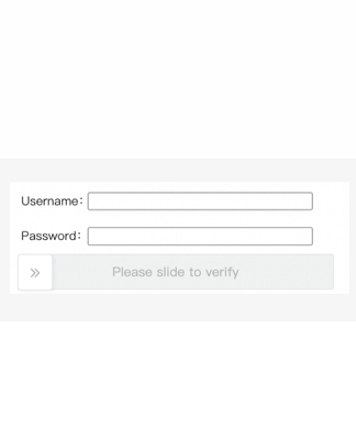

import Tabs from '@theme/Tabs';
import TabItem from '@theme/TabItem';
import ParamItem from '@theme/ParamItem';
import MethodItem from '@theme/MethodItem';
import ImageWrap from '@theme/ImageWrap';
import ImagesLayout from '@theme/ImagesLayout';
import MethodDescription from '@theme/MethodDescription'
import PriceBlock from '@theme/PriceBlock';
import PriceBlockWrap from '@theme/PriceBlockWrap';
import { ArticleHead } from '../../../../../src/theme/ArticleHead';

<ArticleHead slug="captchas/alibaba-task" />

# Alibaba Cloud Captcha

<PriceBlockWrap>
  <PriceBlock title="Alibaba Captcha" captchaId="alibabacaptcha"/>
</PriceBlockWrap>

## Exemplos de tarefas

A seguir estão exemplos de tipos de tarefas do Alibaba CAPTCHA que atualmente são suportados pelo serviço CapMonster Cloud:

<ImagesLayout gap="16px" columns={3}>
  <ImageWrap title="Slider CAPTCHA"></ImageWrap>
  <ImageWrap title="Puzzle CAPTCHA"></ImageWrap>
  <ImageWrap title="Image restoration CAPTCHA"></ImageWrap>
</ImagesLayout>

:::warning **Atenção!**
O CapMonster Cloud, por padrão, funciona com proxies integrados — já incluídos no custo do serviço. É necessário especificar seus próprios proxies apenas nos casos em que o site não aceita o token ou quando o acesso aos serviços integrados está restrito.

Se o proxy utiliza autenticação por IP, é necessário adicionar o endereço **65.21.190.34** à lista de permissões (whitelist).
:::

## Parâmetros da requisição

<TabItem value="proxy" label="CustomTask (ao usar proxy)" className="bordered-panel">

  <ParamItem title="type" required type="string" />
  **CustomTask**

  ---

  <ParamItem title="class" required type="string" />
  **alibaba**

   --- 

  <ParamItem title="websiteURL" required type="string" />
  URL completo da página com o CAPTCHA.

  ---

  <ParamItem title="sceneId (dentro de metadata)" required type="string" />

  Identificador do cenário do CAPTCHA, enviado no seguinte formato: `"sceneId":"1ww7426c4"` (veja [a seção correspondente](#sceneid) para saber como encontrar este valor)

  ---
  <ParamItem title="prefix (dentro de metadata)" required type="string" />

  Parâmetro de inicialização do CAPTCHA, enviado na URL da requisição usada para carregar o texto da tarefa na página.<br />
  Por exemplo, se a URL for: `https://dlw3kug.captcha-open.example.aliyuncs.com/`, então o valor do parâmetro `prefix` corresponde ao subdomínio — `dlw3kug`.

  ---

<div style={{
  border: "1px solid #b1b1b1ff",
  borderRadius: "8px",
  padding: "12px",
  margin: "12px 0"
}}>

**Para alguns sites é necessário enviar parâmetros adicionais:**

Utilize esses parâmetros apenas quando eles estiverem presentes no site (*veja mais detalhes na seção [Trabalhando com sites que contêm parâmetros estendidos](#trabalhando-com-sites-que-contêm-parâmetros-estendidos)*).

<ParamItem title="userId (dentro de metadata)" type="string" />
Identificador único do usuário ou da sessão no lado do site. <br />

---

<ParamItem title="userUserId (dentro de metadata)" type="string" />
Identificador adicional (secundário) do usuário. <br />

---

<ParamItem title="verifyType (dentro de metadata)" type="string" />
Versão ou tipo do mecanismo de verificação do captcha. <br />

---

<ParamItem title="region (dentro de metadata)" type="string" />
Região do servidor ou data center onde o captcha é processado. <br />

---

<ParamItem title="UserCertifyId (dentro de metadata)" type="string" />
ID único de verificação associado à sessão atual do captcha. <br />

---

<ParamItem title="apiGetLib (dentro de metadata)" type="string" />
Link para a biblioteca JS do captcha utilizada pelo site. O valor é gerado no lado do cliente e pode mudar dinamicamente a cada renderização da página. <br />

</div>

  <ParamItem title="userAgent" type="string" />
  
  User-Agent do navegador. <br />
  **Utilize apenas um User-Agent atual do Windows. O recomendado é:** `userAgentPlaceholder`

  ---

  <ParamItem title="proxyType" type="string" />
  **http** - proxy padrão http/https;<br />
  **https** - tente essa opção se "http" não funcionar (necessário para alguns proxies personalizados);<br />
  **socks4** - proxy socks4;<br />
  **socks5** - proxy socks5.

  ---

  <ParamItem title="proxyAddress" type="string" />
  <p>
    Endereço IP do proxy IPv4/IPv6. Não é permitido:
    - uso de proxies transparentes (aqueles que revelam o IP do cliente);
    - uso de proxies locais.
  </p>

  ---

  <ParamItem title="proxyPort" type="integer" />
  Porta do proxy.

  ---

  <ParamItem title="proxyLogin" type="string" />
  Login do proxy.

  ---

  <ParamItem title="proxyPassword" type="string" />
  Senha do proxy.

  ---

</TabItem>

## Método de criação da tarefa

### Variante padrão (sem parâmetros adicionais)

<Tabs className="full-width-tabs filled-tabs request-tabs" groupId="captcha-type">
  <TabItem value="proxyless" label="CustomTask (sem proxy)" default className="method-panel">
    <MethodItem>
    ```http
    https://api.capmonster.cloud/createTask
    ```
    </MethodItem>
    <MethodDescription>
      
      **Requisição**
```json
{
  "clientKey": "API_KEY",
  "task": {
    "type": "CustomTask",
    "class": "alibaba",
    "websiteURL": "https://www.example.com",
    "userAgent": "userAgentPlaceholder",
    "metadata": {
      "sceneId": "1ww7426c4",
      "prefix": "dlw3kug"
    }
  }
}     
```

      **Resposta**
      ```json
      {
        "errorId": 0,
        "taskId": 407533077
      }
      ```
    </MethodDescription>
  </TabItem>

    <TabItem value="proxy" label="CustomTask (com proxy)" className="method-panel">
    <MethodItem>
      ```http
      https://api.capmonster.cloud/createTask
      ```
    </MethodItem>
    <MethodDescription>
      
      **Requisição**
```json
{
  "clientKey": "API_KEY",
  "task": {
    "type": "CustomTask",
    "class": "alibaba",
    "websiteURL": "https://www.example.com",
    "userAgent": "userAgentPlaceholder",
    "metadata": {
      "sceneId": "1ww7426c4",
      "prefix": "dlw3kug",
      "proxyType": "http",
      "proxyAddress": "8.8.8.8",
      "proxyPort": 8080,
      "proxyLogin": "proxyLoginHere",
      "proxyPassword": "proxyPasswordHere"
    }
  }
}
```

      **Resposta**
      ```json
      {
        "errorId": 0,
        "taskId": 407533077
      }
      ```
    </MethodDescription>
  </TabItem>
</Tabs>

### Variante com parâmetros estendidos (`userId`, `userUserId`, `verifyType`, etc.):

<Tabs className="full-width-tabs filled-tabs request-tabs" groupId="captcha-type">
  <TabItem value="proxyless" label="CustomTask (sem proxy)" default className="method-panel">
    <MethodItem>
    ```http
    https://api.capmonster.cloud/createTask
    ```
    </MethodItem>
    <MethodDescription>
      
      **Requisição**
```json
{
  "clientKey": "API_KEY",
  "task": {
    "type": "CustomTask",
    "class": "alibaba",
    "websiteURL": "https://www.example.com",
    "userAgent": "userAgentPlaceholder",
    "metadata": {
      "sceneId": "1ww7426c4",
      "prefix": "dlw3kug",
      "userId": "HpadJlQnz2zSKcSmjXBaqQvjYUvP4jMJIk/ZwGNDNiM=",
      "userUserId": "/uSXKkVFuuwxXA21/MpXGxpLStWBEup1B3jjlMUWwNE=",
      "verifyType": "1.0",
      "region": "sgp",
      "UserCertifyId": "0a03e59417757735511105780e2a5e",
      "apiGetLib": "https://o.example.com/captcha-frontend/aliyunCaptcha/AliyunCaptcha.js?t=2041"
    }
  }
}     
```
  **Resposta**
  ```json
  {
    "errorId": 0,
    "taskId": 407533077
  }
  ```
</MethodDescription>

  </TabItem>

  <TabItem value="proxy" label="CustomTask (com proxy)" className="method-panel">
    <MethodItem>
      ```http
      https://api.capmonster.cloud/createTask
      ```
    </MethodItem>
    <MethodDescription>

  **Requisição**

```json
{
  "clientKey": "API_KEY",
  "task": {
    "type": "CustomTask",
    "class": "alibaba",
    "websiteURL": "https://www.example.com",
    "userAgent": "userAgentPlaceholder",
    "metadata": {
      "sceneId": "1ww7426c4",
      "prefix": "dlw3kug",
      "userId": "HpadJlQnz2zSKcSmjXBaqQvjYUvP4jMJIk/ZwGNDNiM=",
      "userUserId": "/uSXKkVFuuwxXA21/MpXGxpLStWBEup1B3jjlMUWwNE=",
      "verifyType": "1.0",
      "region": "sgp",
      "UserCertifyId": "0a03e59417757735511105780e2a5e",
      "apiGetLib": "https://o.example.com/captcha-frontend/aliyunCaptcha/AliyunCaptcha.js?t=2041"
    },
    "proxyType": "http",
    "proxyAddress": "8.8.8.8",
    "proxyPort": 8080,
    "proxyLogin": "proxyLoginHere",
    "proxyPassword": "proxyPasswordHere"
  }
}
```
  **Resposta**
  ```json
  {
    "errorId": 0,
    "taskId": 407533077
  }
  ```
</MethodDescription>

  </TabItem>
</Tabs>

## Método de obter resultado da tarefa

Use o método [getTaskResult](../api/methods/get-task-result.mdx) para obter a solução do CAPTCHA Alibaba.

<TabItem value="proxyless" label="CustomTask (sem proxy)" default className="method-panel-full">
  <MethodItem>
    ```http
    https://api.capmonster.cloud/getTaskResult
    ```
  </MethodItem>
  <MethodDescription>

  **Requisição**
  ```json
  {
    "clientKey": "API_KEY",
    "taskId": 407533077
  }
```

**Resposta**

```json
{
  "errorId": 0,
  "errorCode": null,
  "errorDescription": null,
  "status": "ready",
  "solution": {
    "data": {
      "tokens": "{\"sceneId\":\"1ww7426c4\",\"certifyId\":\"kBjCxX2W2c\",\"deviceToken\":\"U0dfV0VCIzM3...wOGJkMjY=\",\"data\":\"JRMnX3B...EUQdCpLkqSj7THYNf3dn\"}"
    }
  }
}
```

  </MethodDescription>
</TabItem>

## Como encontrar todos os parâmetros necessários para criar uma tarefa

### `sceneId`

O `sceneId` pode ser obtido após resolver o CAPTCHA com sucesso uma vez:

1. Resolva o CAPTCHA manualmente no site.
2. Abra o **DevTools** → aba **Network**.
3. Encontre a requisição enviada após a verificação bem-sucedida (por exemplo: verify, check, validate).
4. No **Payload** ou na **Response**, localize o parâmetro `sceneId` (`CaptchaSceneId` ou `sId`).


Este parâmetro também pode ser encontrado usando a busca nas requisições de rede:

1. Abra a página com o CAPTCHA e vá para **DevTools** → aba **Network**.
3. Use a busca (Ctrl + F) com a palavra-chave `sceneId` ou `CaptchaSceneId`.


### `prefix`

O `prefix` pode ser obtido a partir da URL da requisição usada no site para carregar o texto da tarefa do CAPTCHA:

1. Abra a página com o CAPTCHA.
2. Encontre a requisição relacionada ao carregamento da tarefa (geralmente via **DevTools** → **Network**).

<br /> 

## Trabalhando com sites que contêm parâmetros estendidos

### Extração e preparação dos parâmetros de captcha

Esta seção descreve o processo geral de extração dos parâmetros necessários, resolução do captcha e reenvio da requisição de autenticação no site alvo.

1. Requisição inicial de autenticação:

```http
POST https://example.com/api/v2/auths/signin
````

Os dados do usuário são enviados:

```json
{
  "email": "example@gmail.com",
  "password": "hashed_password"
}
```

*Exemplos de headers estão disponíveis na seção [Exemplos de resolução automática de captcha](#exemplos-de-resolução-automática-de-captcha).*

2. Detecção da resposta do servidor. O servidor pode retornar dois tipos de resposta:

* 2.1 JSON padrão (sem captcha):

```json
{
  "success": false,
  "data": {
    "code": "Bad_Request",
    "details": "The email or password provided is incorrect..."
  }
}
```

Isso significa que o captcha não é necessário e a requisição foi processada normalmente.

* 2.2 Resposta com captcha (o servidor retorna uma página HTML em vez de JSON):

```html
<!doctype html>
<meta charset="UTF-8">
<meta name="aliyun_waf_aa" content="...">
<meta name="aliyun_waf_bb" content="...">
...
```

3. Dentro da página existe um objeto com os seguintes dados:

```javascript
var requestInfo = {
  data,
  region,
  sceneId,
  token,
  traceid,
  type,
  userId,
  userUserId
}
```

Do objeto, devem ser extraídos os seguintes parâmetros usados para a resolução do captcha:

* `userId`
* `userUserId`
* `verifyType` (corresponde a `type`)
* `region`
* `UserCertifyId` (corresponde a `traceid`)

<br /> 
>**Importante:** além disso, é necessário armazenar os valores de autenticação `token` e `traceid`. Eles são usados nas requisições subsequentes de autenticação como `u_atoken` e `u_asig`, respectivamente.
<br /> 

4. Exemplo de geração do link da biblioteca JS do captcha:

```javascript
this.currentDate = new Date()

this.AliyunGeneratedDynamicJS =
  `https://o.example.com/captcha-frontend/aliyunCaptcha/AliyunCaptcha.js?t=${
    this.currentDate.getFullYear() +
    (this.currentDate.getMonth() + 1) +
    this.currentDate.getDate() +
    this.currentDate.getHours()
  }`
```

5. Construção de `metadata` e da requisição de resolução do captcha.

Esses dados são enviados ao nosso serviço de resolução de captcha:

```json
{
  "metadata": {
    "sceneId": "1ww7426c4",
    "prefix": "dlw3kug",
    "userId": "HpadJlQnz2zSKcSmjXBaqQvjYUvP4jMJIk/ZwGNDNiM=",
    "userUserId": "/uSXKkVFuuwxXA21/MpXGxpLStWBEup1B3jjlMUWwNE=",
    "verifyType": "1.0",
    "region": "sgp",
    "UserCertifyId": "0a03e59417757735511105780e2a5e",
    "apiGetLib": "https://o.example.com/captcha-frontend/aliyunCaptcha/AliyunCaptcha.js?t=2041"
  }
}
```

6. Obtenção da solução do captcha e reenvio da requisição de autenticação com os parâmetros `u_atoken` e `u_asig` previamente salvos:

```http
POST https://example.com/api/v2/auths/signin?u_atoken=...&u_asig=...&u_aref=undefined
```

Em caso de sucesso na resolução do captcha, o servidor retorna o resultado da autenticação (*ver ponto 2.1*).

### Exemplos de resolução automática de captcha

:::warning Importante
Os exemplos são apenas demonstrativos e mostram a lógica geral de funcionamento do seu site que utiliza proteção Alibaba Cloud Captcha. Em projetos reais, o código pode precisar de adaptação para um site específico, seus endpoints e headers.

Dados sensíveis (API keys, configurações de proxy, etc.) devem ser armazenados em `.env` ou em variáveis de ambiente.
:::

<Tabs className="full-width-tabs filled-tabs request-tabs" groupId="captcha-type">

  <TabItem value="js" label="JavaScript" default className="method-panel">
<details>
      <summary>Mostrar código (Node.js)</summary>
```js
import "dotenv/config";
import fs from "fs";

import { gotScraping } from "got-scraping";

function parse(text, start, end, isJson = true) {
  const startIndex = text.indexOf(start);
  if (startIndex === -1) return null;

  const contentStart = startIndex + start.length;
  const endIndex = text.indexOf(end, contentStart);
  if (endIndex === -1) return null;

  let extracted = text.substring(contentStart, endIndex).trim();

  extracted = extracted.replace(/\n/g, "").trim();

  let jsonStr = extracted
    .replace(/(['"])?([a-zA-Z0-9_]+)(['"])?:/g, '"$2":')
    .replace(/'/g, '"');

  try {
    return isJson ? JSON.parse(jsonStr) : jsonStr;
  } catch (err) {
    console.error("Não foi possível fazer o parse do JSON:", err.message);
    console.error("Tentativa de parse:", jsonStr);
    return null;
  }
}

function buildProxyLine(proxyUrl) {
  if (!proxyUrl) return undefined;

  const parts = proxyUrl.split(":");

  // Tratamento do formato protocol:ip:port (3 partes)
  if (parts.length === 3) {
    const [protocol, ip, port] = parts;
    return { proxyLine: `${protocol}://${ip}:${port}`, protocol, ip, port };
  }

  // Tratamento do formato protocol:username:password:ip:port (5 partes)
  if (parts.length === 5) {
    const [protocol, username, password, ip, port] = parts;
    return {
      proxyLine: `${protocol}://${username}:${password}@${ip}:${port}`,
      protocol,
      ip,
      port,
      username,
      password,
    };
  }

  // Formato inválido
  return undefined;
}

const proxyUrl =
  process.env.proxyUrl || "http:username:password:127.0.0.1:9029"; // Substitua pelos dados do seu proxy ou defina no arquivo .env
const proxyLine = buildProxyLine(proxyUrl);
const delay = (ms) => new Promise((res) => setTimeout(res, ms));

class Worker {
  constructor() {
    this.providerVendorSolverUrl = "https://api.capmonster.cloud";
    this.API_KEY = process.env.apiKey || "YOUR_API_KEY"; // Substitua pela sua API key do CapMonster Cloud

    this.currentDate = new Date();
    // Aqui é gerado o link dinâmico da biblioteca JS do captcha
    this.AliyunGeneratedDynamicJS = `https://o.example.com/captcha-frontend/aliyunCaptcha/AliyunCaptcha.js?t=${this.currentDate.getFullYear() + (this.currentDate.getMonth() + 1) + this.currentDate.getDate() + this.currentDate.getHours()}`;

    this.websiteUrl = "https://example.com/auth"; // Substitua pela URL da página com captcha
    this.userAgent =
      "Mozilla/5.0 (Windows NT 10.0; Win64; x64) AppleWebKit/537.36 (KHTML, like Gecko) Chrome/146.0.0.0 Safari/537.36";
  }

  async executor() {
    console.log(`Obtendo parâmetros do captcha....`);

    const RequireAuthorizationResponses =
      await this.getAuthorizationResponses();

    console.log("Páginas com captcha recebidas com sucesso");

    const requireParamsCaptchas = await this.requireParamsCaptchasData(
      RequireAuthorizationResponses,
    );

    console.log(`Parâmetros do captcha: `, requireParamsCaptchas);

    const AlibabaSolvedResult = await this.requireAlibabaSolverResponse(
      requireParamsCaptchas,
    );

    console.log(
      `Resultado da resolução do captcha: `,
      AlibabaSolvedResult?.solution?.data?.tokens,
    );

    const RequireAuthorizationResponsesAfterCaptchaBypass =
      await this.sendAuthrozationsRequest();

    console.log(RequireAuthorizationResponsesAfterCaptchaBypass);
  }

  async sendAuthrozationsRequest() {
    const response = await gotScraping.post(
      `https://example.com/api/v2/auths/signin?u_atoken=${this.AuthorizationParams.u_atoken}&u_asig=${this.AuthorizationParams.u_asig}&u_aref=undefined`,
      {
        body: JSON.stringify({
          email: "example@gmail.com",
          password:
            "e2577eeb61dc2197dfe94816d731f2941ccd0b66de8dc97aacb377bfe8476970",
        }),
        headers: {
          Accept: "application/json, text/plain, */*",
          "Accept-Encoding": "gzip, deflate, br, zstd",
          "Accept-Language": "en-US,en;q=0.9",
          "Content-Type": "application/json",
          Origin: "https://example.com",
          Pragma: "no-cache",
          Referer: "https://example.com/auth",
          Timezone: "Thu Apr 09 2026 23:29:23 GMT+0300",
          "User-Agent":
            "Mozilla/5.0 (Windows NT 10.0; Win64; x64) AppleWebKit/537.36 (KHTML, like Gecko) Chrome/146.0.0.0 Safari/537.36",
          Version: "0.2.36",
          "X-Request-Id": "2b4a7a52-d273-4049-a826-156aae856fe5",
          "bx-v": "2.5.36",
          "sec-ch-ua":
            '"Chromium";v="146", "Not-A.Brand";v="24", "Google Chrome";v="146"',
          "sec-ch-ua-mobile": "?0",
          "sec-ch-ua-platform": '"Windows"',
          source: "web",
        },
      },
    );

    return response.body;
  }

  async getAuthorizationResponses() {
    const response = await gotScraping.post(
      `https://example.com/api/v2/auths/signin`, // Substitua pela URL correta de autenticação que aciona o captcha
      {
        body: JSON.stringify({
          email: "example@gmail.com",
          password:
            "e2577eeb61dc2197dfe94816d731f2941ccd0b66de8dc97aacb377bfe8476970",
        }),
        headers: {
          Accept: "application/json, text/plain, */*",
          "Accept-Encoding": "gzip, deflate, br, zstd",
          "Accept-Language": "en-US,en;q=0.9",
          "Content-Type": "application/json",
          Origin: "https://example.com", // Substitua pelo Origin correto do site
          Pragma: "no-cache",
          Referer: "https://example.com/auth", // Substitua pelo Referer correto do site
          Timezone: "Thu Apr 09 2026 23:29:23 GMT+0300",
          "User-Agent":
            "Mozilla/5.0 (Windows NT 10.0; Win64; x64) AppleWebKit/537.36 (KHTML, like Gecko) Chrome/146.0.0.0 Safari/537.36",
          Version: "0.2.36",
          "X-Request-Id": "2b4a7a52-d273-4049-a826-156aae856fe5",
          "bx-v": "2.5.36",
          "sec-ch-ua":
            '"Chromium";v="146", "Not-A.Brand";v="24", "Google Chrome";v="146"',
          "sec-ch-ua-mobile": "?0",
          "sec-ch-ua-platform": '"Windows"',
          source: "web",
        },
      },
    );

    if (response.body.includes("requestInfo")) {
      console.log("Resposta com captcha recebida com sucesso:");
      fs.writeFileSync("./baseResponse.txt", response.body);
      console.log(response.body.substring(0, 150));
      return response.body;
    }

    console.log(response.body);
    return await this.getAuthorizationResponses();
  }

  async requireAlibabaSolverResponse(captchaMetadataParams) {
    let cmReqData = {
      type: "CustomTask",
      class: "alibaba",
      websiteURL: this.websiteUrl,
      websiteKey: "customTask",
      userAgent: this.userAgent,
    };

    if (captchaMetadataParams) {
      cmReqData.metadata = captchaMetadataParams;
    }

    const response = await gotScraping.post(
      `${this.providerVendorSolverUrl}/createTask`,
      {
        body: JSON.stringify({ clientKey: this.API_KEY, task: cmReqData }),
        headers: {
          "Content-Type": "application/json",
        },
      },
    );

    let JSON_responseData = JSON.parse(response.body);

    if (JSON_responseData.errorId) throw new Error("JSON.TaskId.error");

    let taskId = JSON_responseData.taskId;
    let responseData;

    while (true) {
      let cmTaskRes = { clientKey: this.API_KEY, taskId: taskId };

      let task_response = await gotScraping.post(
        `${this.providerVendorSolverUrl}/getTaskResult`,
        {
          body: JSON.stringify(cmTaskRes),
          headers: {
            "Content-Type": "application/json",
          },
        },
      );

      let JSON_responseDataTaskResponse = JSON.parse(task_response.body);

      if (JSON_responseDataTaskResponse.status !== "processing") {
        responseData = JSON_responseDataTaskResponse;
        break;
      }

      await delay(5000);
    }

    return responseData;
  }

  async requireParamsCaptchasData(responsesCaptchaPage) {
    const JsonData = parse(
      responsesCaptchaPage,
      ':none">var requestInfo = ',
      ";",
      true,
    );

    // Salve os parâmetros de autorização para uso posterior na nova requisição de login
    this.AuthorizationParams = {
      u_atoken: JsonData.token,
      u_asig: JsonData.traceid,
    };

    return {
      prefix: "57d98d02303c01e7d2f7814c75224396",
      sceneId: JsonData.sceneId,
      userId: JsonData.userId,
      userUserId: JsonData.userUserId,
      verifyType: "1.0",
      region: JsonData.region,
      UserCertifyId: JsonData.traceid,
      apiGetLib: this.AliyunGeneratedDynamicJS,
    };
  }
}

new Worker().executor();
```
</details>
  </TabItem>

<TabItem value="python" label="Python" default className="method-panel">
<details>
      <summary>Mostrar código</summary>
```python
import os
import json
import time
import re
import requests
from datetime import datetime


def parse(text, start, end, is_json=True):
    start_index = text.find(start)
    if start_index == -1:
        return None

    content_start = start_index + len(start)
    end_index = text.find(end, content_start)
    if end_index == -1:
        return None

    extracted = text[content_start:end_index].strip()
    extracted = extracted.replace("\n", "").strip()

    json_str = re.sub(r"(['\"])?([a-zA-Z0-9_]+)(['\"])?:", r'"\2":', extracted)
    json_str = json_str.replace("'", '"')

    try:
        return json.loads(json_str) if is_json else json_str
    except Exception as e:
        print("Não foi possível fazer o parse do JSON:", str(e))
        print("Tentativa de parse:", json_str)
        return None


def build_proxy(proxy_url: str):
    """
    Suporte:
    protocol:ip:port
    protocol:username:password:ip:port
    """

    if not proxy_url:
        return None

    parts = proxy_url.split(":")

    if len(parts) == 3:
        protocol, ip, port = parts
        proxy_line = f"{protocol}://{ip}:{port}"
        return {
            "http": proxy_line,
            "https": proxy_line,
        }

    if len(parts) == 5:
        protocol, username, password, ip, port = parts
        proxy_line = f"{protocol}://{username}:{password}@{ip}:{port}"
        return {
            "http": proxy_line,
            "https": proxy_line,
        }

    return None


class Worker:
    def __init__(self):
        self.provider_vendor_solver_url = "https://api.capmonster.cloud"
        self.api_key = os.getenv("API_KEY", "YOUR_API_KEY")  # Substitua pela sua API key do CapMonster Cloud

        now = datetime.now()
        self.aliyun_generated_dynamic_js = (
            # Aqui é gerado o link dinâmico da biblioteca JS do captcha
            "https://o.example.com/captcha-frontend/aliyunCaptcha/AliyunCaptcha.js?"
            f"t={now.year}{now.month}{now.day}{now.hour}"
        )

        self.website_url = "https://example.com/auth"  # Substitua pela URL da página com captcha
        self.user_agent = (
            "Mozilla/5.0 (Windows NT 10.0; Win64; x64) "
            "AppleWebKit/537.36 (KHTML, like Gecko) "
            "Chrome/146.0.0.0 Safari/537.36"
        )

        self.authorization_params = {}

        # ===================== PROXY =====================
        proxy_url = os.getenv(
            "proxyUrl",
            "http:username:password:127.0.0.1:9029"  # Substitua pelos dados do seu proxy ou defina no arquivo .env
        )

        self.proxies = build_proxy(proxy_url)

        self.session = requests.Session()

        # conecta o proxy à session (IMPORTANTE)
        if self.proxies:
            self.session.proxies.update(self.proxies)

        self.headers = {
            "Accept": "application/json, text/plain, */*",
            "Accept-Encoding": "gzip, deflate, br, zstd",
            "Accept-Language": "en-US,en;q=0.9",
            "Content-Type": "application/json",
            "Origin": "https://example.com",  # Substitua pelo Origin real do site
            "Pragma": "no-cache",
            "Referer": "https://example.com/auth",  # Substitua pelo Referer real do site
            "Timezone": "Thu Apr 09 2026 23:29:23 GMT+0300",
            "User-Agent": self.user_agent,
            "Version": "0.2.36",
            "X-Request-Id": "2b4a7a52-d273-4049-a826-156aae856fe5",
            "bx-v": "2.5.36",
            "sec-ch-ua": '"Chromium";v="146", "Not-A.Brand";v="24", "Google Chrome";v="146"',
            "sec-ch-ua-mobile": "?0",
            "sec-ch-ua-platform": '"Windows"',
            "source": "web",
        }

    def executor(self):
        print("Obtendo parâmetros do captcha....")

        captcha_page = self.get_authorization_responses()

        print("Páginas com captcha obtidas com sucesso")

        captcha_params = self.require_params_captchas_data(captcha_page)

        print("Parâmetros do captcha:", captcha_params)

        solved = self.require_alibaba_solver_response(captcha_params)

        print("Resultado da resolução do captcha:", solved)

        final_response = self.send_authorization_request()

        print(final_response)

    def get_authorization_responses(self):
        url = "https://example.com/api/v2/auths/signin"  # Substitua pela URL correta de autenticação que dispara o captcha

        payload = {
            "email": "example@gmail.com",
            "password": "e2577eeb61dc2197dfe94816d731f2941ccd0b66de8dc97aacb377bfe8476970",
        }

        while True:
            response = self.session.post(
                url,
                headers=self.headers,
                data=json.dumps(payload),
            )

            text = response.text

            if "requestInfo" in text:
                print("Resposta com captcha recebida com sucesso")
                with open("baseResponse.txt", "w", encoding="utf-8") as f:
                    f.write(text)

                print(text[:150])
                return text

            print("no captcha -> retry")

    def require_params_captchas_data(self, html):
        json_data = parse(html, ':none">var requestInfo = ', ";", True)

        # Salve os parâmetros de autorização para uso posterior na requisição de login
        self.authorization_params = {
            "u_atoken": json_data["token"],
            "u_asig": json_data["traceid"],
        }

        return {
            "prefix": "57d98d02303c01e7d2f7814c75224396",
            "sceneId": json_data["sceneId"],
            "userId": json_data["userId"],
            "userUserId": json_data["userUserId"],
            "verifyType": "1.0",
            "region": json_data["region"],
            "UserCertifyId": json_data["traceid"],
            "apiGetLib": self.aliyun_generated_dynamic_js,
        }

    def require_alibaba_solver_response(self, metadata):
        task_payload = {
            "clientKey": self.api_key,
            "task": {
                "type": "CustomTask",
                "class": "alibaba",
                "websiteURL": self.website_url,
                "websiteKey": "customTask",
                "userAgent": self.user_agent,
                "metadata": metadata,
            },
        }

        response = requests.post(
            f"{self.provider_vendor_solver_url}/createTask",
            json=task_payload,
        )

        data = response.json()

        if data.get("errorId"):
            raise Exception("Erro ao criar tarefa")

        task_id = data["taskId"]

        while True:
            result = requests.post(
                f"{self.provider_vendor_solver_url}/getTaskResult",
                json={"clientKey": self.api_key, "taskId": task_id},
            ).json()

            if result["status"] != "processing":
                return result

            time.sleep(5)

    def send_authorization_request(self):
        url = (
            "https://example.com/api/v2/auths/signin"
            f"?u_atoken={self.authorization_params['u_atoken']}"
            f"?u_asig={self.authorization_params['u_asig']}"
            "&u_aref=undefined"
        )

        payload = {
            "email": "example@gmail.com",
            "password": "e2577eeb61dc2197dfe94816d731f2941ccd0b66de8dc97aacb377bfe8476970",
        }

        response = self.session.post(
            url,
            headers=self.headers,
            data=json.dumps(payload),
        )

        return response.text


if __name__ == "__main__":
    Worker().executor()
``` 
</details>
  </TabItem>
  </Tabs>