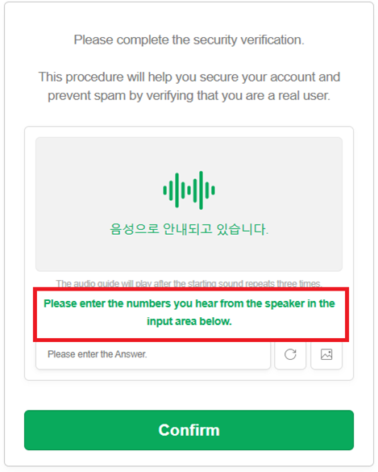

import Tabs from '@theme/Tabs';
import TabItem from '@theme/TabItem';
import ParamItem from '@theme/ParamItem';
import MethodItem from '@theme/MethodItem';
import MethodDescription from '@theme/MethodDescription'
import PriceBlock from '@theme/PriceBlock';
import PriceBlockWrap from '@theme/PriceBlockWrap';
import { ArticleHead } from '@site/src/theme/ArticleHead';

<ArticleHead slug="captchas/compleximage/bills_audio" />

# bills_audio


<PriceBlockWrap>
  <PriceBlock title="bills_audio" captchaId="complex-rec_bills_audio" />
</PriceBlockWrap>

:::warning **Atenção!**
O uso de servidores proxy não é necessário para esta tarefa.
:::
<br />
O captcha de áudio `bills_audio` é uma versão sonora do “captcha de recibos”, onde imagens ou dados gerados simulam recibos e podem conter, por exemplo, números, valores e datas. Neste tipo de tarefa, o usuário deve ouvir um arquivo de áudio e verificar a entrada correta com base nas informações ouvidas. Este formato pode se parecer com o seguinte:

 

## Parâmetros da solicitação

<br />
<span style={{ fontSize: "15px", fontWeight: 700 }}>
> IMPORTANTE: obtenha o áudio em base64 diretamente antes de criar a tarefa para evitar erros durante a resolução (veja a seção [Obtenção de áudio e conversão para Base64](#obtenção-de-áudio-e-conversão-para-base64)).
</span>
<br />

<TabItem value="proxyless" label="ComplexImageTask (sem proxy)" default className="bordered-panel">
    <ParamItem title="type" required type="string" />
    **ComplexImageTask**

    ---

    <ParamItem title="class" required type="string" />
    **recognition**

    ---

    <ParamItem title="imagesBase64" required type="array" />
    Imagem codificada em base64.
    Exemplo: `[ “UklGRnjuAwBXQVZFZm10...f/2f/9/6z/vf8MAAAA”]`

    ---

    <ParamItem title="Task (dentro de metadata)" required type="string" />
    Nome da tarefa: `"bills_audio"`<br />

    ---

    <ParamItem title="PayloadType (dentro de metadata)" required type="string" />
    Tipo de dados enviados na tarefa: `"Audio"`

</TabItem>

## Método para criar tarefa

<TabItem value="proxyless" label="ComplexImageTask (sem proxy)" default className="method-panel">
    <MethodItem>
    ```http
    https://api.capmonster.cloud/createTask
    ```
    </MethodItem>
    <MethodDescription>
      **Requisição**
```json
{
    "clientKey": "API_KEY",
    "task": {
        "type": "ComplexImageTask",
        "class": "recognition",
        "imagesBase64": [
            "UklGRnjuAwBXQVZFZm10...f/2f/9/6z/vf8MAAAA"
        ],
        "metadata": {
            "Task": "bills_audio",
            "PayloadType": "Audio"
        }
    }
}
```

**Resposta**

```json
{
    "errorId": 0,
    "taskId": 143998457
}
```

</MethodDescription>

</TabItem>

## Método para obter o resultado da tarefa

<TabItem value="proxyless" label="ComplexImageTask (sem proxy)" default className="method-panel-full">
    <MethodItem>
    ```http
    https://api.capmonster.cloud/getTaskResult
    ```
    </MethodItem>
    <MethodDescription>
    **Requisição**
    ```json
    {
        "clientKey": "API_KEY",
        "taskId": 143998457
    }
    ```
    **Resposta:** o resultado contém os dígitos do áudio.
    ```json
    {
      "solution": {
          "answer": [6, 8, 4, 1, 2, 3],
          "metadata": {"AnswerType": "Text"}
      },
      "cost": 0.0008,
      "status": "ready",
      "errorId": 0,
      "errorCode": null,
      "errorDescription": null
    }
    ```
    </MethodDescription>
</TabItem>

## Obtenção de áudio e conversão para Base64

1. Abra a página do captcha e inicie o **DevTools**, depois vá até a aba **Network**.  
2. Ative o modo de áudio do captcha clicando no botão correspondente.  
3. Na lista de requisições, encontre um endereço como:  
   `blob:https://example.com/3be79ac6-1b3d-43ef-9a8a-7ad8877b3606`  
4. Copie essa URL e abra-a na barra de endereço do navegador — o arquivo de áudio do captcha em formato **.wav** será aberto.


5. Salve o arquivo e converta o arquivo **.wav** para **Base64** usando qualquer método conveniente — por exemplo, com Node.js:

```JavaScript
const fs = require("fs");

// Caminho para o arquivo .wav de origem
const filePath = "C:\\Users\\User\\Downloads\\file-acbe-4fb3-9f8e-f989ba6c7fde.wav";

const fileBuffer = fs.readFileSync(filePath);

// Converter para Base64
const base64 = fileBuffer.toString("base64");

// Salvar a string Base64 em um arquivo de texto
fs.writeFileSync("output.txt", base64);

console.log("Arquivo convertido com sucesso para Base64 e salvo como output.txt");
```

6. Use a string Base64 resultante na requisição de tarefa do CapMonster Cloud.


