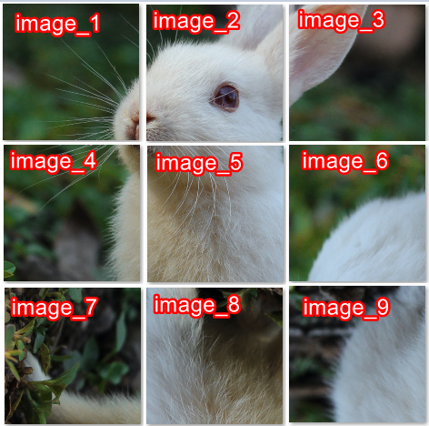

import Tabs from '@theme/Tabs';
import TabItem from '@theme/TabItem';
import ParamItem from '@theme/ParamItem';
import MethodItem from '@theme/MethodItem';
import MethodDescription from '@theme/MethodDescription'
import PriceBlock from '@theme/PriceBlock';
import PriceBlockWrap from '@theme/PriceBlockWrap';
import { ArticleHead } from '@site/src/theme/ArticleHead';

<ArticleHead slug="captchas/compleximage/betpunch_3x3_rotate" />

# betpunch_3x3_rotate


<PriceBlockWrap>
  <PriceBlock title="betpunch_3x3_rotate" captchaId="complex-rec_betpunch_3x3_rotate_request" />
</PriceBlockWrap>

:::warning **Atenção!**
O uso de servidores proxy não é necessário para esta tarefa.
:::
<br />

O pedido deve conter nove imagens. As imagens devem ser fornecidas na seguinte ordem:



## Parâmetros da solicitação

<br />
<span style={{ fontSize: "15px", fontWeight: 700 }}>
> IMPORTANTE: obtenha as imagens em base64 diretamente antes de criar a tarefa para evitar erros durante a resolução (veja a seção [Como obter base64](#como-obter-base64)).
</span>
<br />

<TabItem value="proxyless" label="ComplexImageTask (sem proxy)" default className="bordered-panel">
    <ParamItem title="type" required type="string" />
    **ComplexImageTask**

    ---

    <ParamItem title="class" required type="string" />
    **recognition**

    ---

    <ParamItem title="imagesBase64" required type="array" />
    Array de imagens codificadas em formato base64.

    ---

    <ParamItem title="Task (dentro de metadata)" required type="string" />
    Nome da tarefa: `betpunch_3x3_rotate`

</TabItem>

## Método para criar tarefa

<TabItem value="proxyless" label="ComplexImageTask (sem proxy)" default className="method-panel">
	<MethodItem>
		```http
		https://api.capmonster.cloud/createTask
		```
	</MethodItem>
	<MethodDescription>
      **Solicitação**
      ```json
      { 
        "clientKey": "API_KEY",
        "task": {
          "type": "ComplexImageTask",
          "class": "recognition",
          "imagesBase64": [
            "{image_1_Base64}",
            "{image_2_Base64}",
            "{image_3_Base64}",
            "{image_4_Base64}",
            "{image_5_Base64}",
            "{image_6_Base64}",
            "{image_7_Base64}",
            "{image_8_Base64}",
            "{image_9_Base64}"
          ],
          "metadata": {
            "Task": "betpunch_3x3_rotate"
          }
        }
      }
      ```

    	**Resposta**
    	```json
    	{
    	  "errorId":0,
    	  "taskId":407533072
    	}
    	```
    </MethodDescription>

</TabItem>

## Método para obter o resultado da tarefa

<TabItem value="proxyless" label="ComplexImageTask (sem proxy)" default className="method-panel-full">
	<MethodItem>
		```http
		https://api.capmonster.cloud/getTaskResult
		```
	</MethodItem>
	<MethodDescription>
		**Solicitação**
		```json
		{
		  "clientKey":"API_KEY",
		  "taskId": 407533072
		}
		```

      **Resposta**
      `"answer":[X,X,X,X,X,X,X,X,X]`, onde X é um valor inteiro de 1 a 4 para cada imagem.  
      4 significa que a imagem não precisa de rotação; 1–3 indicam quantas rotações no sentido anti-horário são necessárias.

      ```json
      {
        "errorId":0,
        "status":"ready",
        "errorCode":null,
        "errorDescription":null,
        "solution":
        {
          "answer":[4,4,4,4,4,3,1,2,2],
          "metadata":{"AnswerType":"NumericArray"}
        }
      }
      ```
	</MethodDescription>
</TabItem>

## Como obter Base64

As imagens nas páginas podem ser representadas tanto como uma URL quanto já codificadas em formato Base64. Para encontrar o valor necessário, clique com o botão direito na imagem da captcha, selecione **Inspect (Inspecionar)** e examine cuidadosamente a seção **Elements** ou as requisições de rede — ali você poderá encontrar a URL da imagem ou o conteúdo já codificado.

1. Abra o seu site onde a captcha é exibida no navegador.
2. Clique com o botão direito no elemento da captcha e selecione **Inspect (Inspecionar)**.

