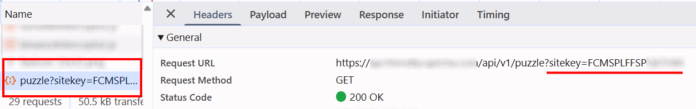
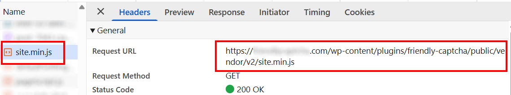

import Tabs from '@theme/Tabs';
import TabItem from '@theme/TabItem';
import ParamItem from '@theme/ParamItem';
import MethodItem from '@theme/MethodItem';
import ImageWrap from '@theme/ImageWrap';
import ImagesLayout from '@theme/ImagesLayout';
import MethodDescription from '@theme/MethodDescription'
import PriceBlock from '@theme/PriceBlock';
import PriceBlockWrap from '@theme/PriceBlockWrap';
import { ArticleHead } from '../../../../../src/theme/ArticleHead';

<ArticleHead slug="captchas/friendly-task" />

# Friendly Captcha

<PriceBlockWrap>
  <PriceBlock title="Friendly Captcha" captchaId="friendly"/>
</PriceBlockWrap>


:::warning **Atenção!**
O CapMonster Cloud, por padrão, funciona com proxies integrados — já incluídos no custo do serviço. É necessário especificar seus próprios proxies apenas nos casos em que o site não aceita o token ou quando o acesso aos serviços integrados está restrito.

Se o proxy utiliza autenticação por IP, é necessário adicionar o endereço **65.21.190.34** à lista de permissões (whitelist).
:::

## Parâmetros da solicitação

<TabItem value="proxy" label="CustomTask (ao usar proxy)" className="bordered-panel">

  <ParamItem title="type" required type="string" />
  **CustomTask**

  ---

  <ParamItem title="class" required type="string" />
  **friendly**

   --- 

  <ParamItem title="websiteURL" required type="string" />
  URL completo da página com o captcha.

  ---

  <ParamItem title="websiteKey" required type="string" />
  Chave do Friendly Captcha (*veja a seção [Como encontrar o valor do sitekey](#como-encontrar-o-valor-do-sitekey)*).
  
  ---

  <ParamItem title="apiGetLib (dentro de metadata)" required type="string" />
  URL do arquivo JS. Especifique a URL do arquivo JS de acordo com a versão do captcha:

* **V1:**
  `apiGetLib` = `https://cdn.jsdelivr.net/npm/friendly-challenge@X.Y.Z/widget.module.min.js`, onde `X.Y.Z` é a versão do cliente obtida no cabeçalho `x-frc-client`.

* **V2:**
  `apiGetLib` = URL do arquivo `site.min.js` carregado na página.

*Veja também as seções [Criar método de tarefa](#criar-método-de-tarefa) e [Como identificar a versão do Friendly Captcha](#como-identificar-a-versão-do-friendly-captcha).*

  ---

  <ParamItem title="userAgent" type="string" />
  User-Agent do navegador.<br />
  **Forneça apenas o UA do Windows atual:** userAgentPlaceholder

---

<ParamItem title="proxyType" required type="string" />
**http** - proxy HTTP/HTTPS normal;<br />
**https** - use se http não funcionar (necessário para alguns proxies personalizados);<br />
**socks4** - proxy SOCKS4;<br />
**socks5** - proxy SOCKS5.

---

<ParamItem title="proxyAddress" required type="string" />
<p>
Endereço IP do proxy (IPv4/IPv6). Não permitido:
- Proxies transparentes
- Proxies da máquina local
</p>

---

<ParamItem title="proxyPort" required type="integer" />
Porta do proxy.

---

<ParamItem title="proxyLogin" required type="string" />
Login do proxy.

---

<ParamItem title="proxyPassword" required type="string" />
Senha do proxy.

</TabItem>

## Criar método de tarefa

Use o valor do parâmetro `apiGetLib` em `metadata`, correspondente à versão do Friendly Captcha.

**Exemplo:**

Para **V1**
  ```json
  "apiGetLib": "https://cdn.jsdelivr.net/npm/friendly-challenge@0.9.19/widget.module.min.js"
```

Para **V2**

```json
"apiGetLib": "https://example.com/wp-content/plugins/friendly-captcha/public/vendor/v2/site.min.js?ver=0.1.25"
```

<br />
<Tabs className="full-width-tabs filled-tabs request-tabs" groupId="captcha-type">
  <TabItem value="proxyless" label="CustomTask (sem proxy)" default className="method-panel">
    <MethodItem>
    ```http
    https://api.capmonster.cloud/createTask
    ```
    </MethodItem>
    <MethodDescription>

  **Requisição**
  ```json
  {
    "clientKey": "API_KEY",
    "task": {
      "type": "CustomTask",
      "class": "friendly",
      "websiteKey": "FFMGEMAD2K3JJ35P",
      "websiteURL": "https://example.com",
      "userAgent": "userAgentPlaceholder",
      "metadata": {
		"apiGetLib":"https://cdn.jsdelivr.net/npm/friendly-challenge@0.9.19/widget.module.min.js"
	}
}
  ```

  **Resposta**
  ```json
  {
    "errorId": 0,
    "taskId": 407533077
  }
  ```
</MethodDescription>

  </TabItem>

<TabItem value="proxy" label="CustomTask (com proxy)" className="method-panel">
<MethodItem>
  ```http
  https://api.capmonster.cloud/createTask
  ```
</MethodItem>
<MethodDescription>
  
  **Requisição**
  ```json
  {
    "clientKey": "API_KEY",
    "task": {
      "type": "CustomTask",
      "class": "friendly",
      "websiteKey": "FFMGEMAD2K3JJ35P",
      "websiteURL": "https://example.com",
      "userAgent": "userAgentPlaceholder",
      "metadata": {
		"apiGetLib":"https://cdn.jsdelivr.net/npm/friendly-challenge@0.9.19/widget.module.min.js"
	},
      "proxyType": "http",
      "proxyAddress": "8.8.8.8",
      "proxyPort": 8080,
      "proxyLogin": "proxyLoginHere",
      "proxyPassword": "proxyPasswordHere"
    }
  }
  ```

  **Resposta**
  ```json
  {
    "errorId": 0,
    "taskId": 407533077
  }
  ```
</MethodDescription>

  </TabItem>
</Tabs>

## Obter resultado da tarefa

Use o método [getTaskResult](../api/methods/get-task-result.mdx) para obter a solução do Friendly Captcha.  
O formato do token na resposta depende da versão do captcha usada no site:

**V1**: `"56a3727f1f9ae4f339c8e512913cd6f8.ac7W...MAKgAAAN+MAQArAAAAjxMBACwAAAB5QgAA.AgAB"`<br />

**V2**: `"AQQA.8Q2TbgK_..._pknXDweJjKT2qwmroOhHcZsU4dHyu-jaGIPx9k7432p_num13buuTu6n4lVA=="`

<TabItem value="proxyless" label="CustomTask (sem proxy)" default className="method-panel-full">
  <MethodItem>
      ```http
    https://api.capmonster.cloud/getTaskResult
    ```
  </MethodItem>
  <MethodDescription>

  **Requisição**
  ```json
  {
    "clientKey": "API_KEY",
    "taskId": 407533077
  }
````

**Resposta**

```json
{
  "errorId": 0,
  "errorCode": null,
  "errorDescription": null,
  "status": "ready",
  "solution": {
    "data": {
      "token": "56a3727f1f9ae4f339c8e512913cd6f8.ac7W...MAKgAAAN+MAQArAAAAjxMBACwAAAB5QgAA.AgAB"
    }
  }
}
```

  </MethodDescription>
</TabItem>
<br />
O valor do token obtido deve ser inserido no campo correspondente:

| Versão | Campo para inserção do token |
| ------ | ---------------------------- |
| V1     | `input.frc-captcha-solution` |
| V2     | `input.frc-captcha-response` |

## Como encontrar o valor do sitekey

* Para **V1**, este parâmetro pode ser encontrado em requisições de rede filtrando pelas palavras-chave `sitekey` ou `puzzle?sitekey=`:



---

* Para **V2**, use a busca pelas palavras-chave `sitekey` ou `data-sitekey` entre as requisições ou elementos no código da página:


## Como identificar a versão do Friendly Captcha

O Friendly Captcha pode ser usado em duas versões principais: **V1** e **V2**.
A versão pode ser identificada pelos scripts carregados ou pelas requisições de rede.

### Friendly Captcha V1

Usado se os seguintes scripts estiverem presentes na página:

```javascript
widget.min.js
widget.module.min.js
```

ou se `puzzle?sitekey=` aparecer nas requisições de rede:


**Para identificar a versão do cliente, você deve:**

1. Abrir a requisição `puzzle?sitekey=...` encontrada e ir em **Headers → Request Headers**

2. Encontrar o cabeçalho `x-frc-client`:


O cabeçalho contém a versão do cliente Friendly Captcha usada no site:

```
x-frc-client: <version>
```

**Exemplos de valores**: *0.9.14, 0.9.19*, etc.

3. Após identificar a versão em `x-frc-client`, insira-a no link CDN:

```
https://cdn.jsdelivr.net/npm/friendly-challenge@<VERSION>/widget.module.min.js
```

Por exemplo, se `x-frc-client = 0.9.14`, use:

```
https://cdn.jsdelivr.net/npm/friendly-challenge@0.9.14/widget.module.min.js
```

Esse link deve ser passado no parâmetro `apiGetLib` ao criar a tarefa.

---

### Friendly Captcha V2

Se o arquivo `site.min.js` for carregado no site, isso significa que está sendo usado o **Friendly Captcha V2**.


Passe a URL do `site.min.js` no parâmetro `apiGetLib` ao criar a tarefa:



### Detecção automática da versão do Friendly Captcha

Você pode automatizar o processo de detecção da versão do Friendly Captcha no navegador usando a seguinte solução:

<details>
      <summary>Mostrar código</summary>
```javascript
(async function detectFriendlyCaptcha() {
  const result = {
    version: null,      
    clientVersion: null,
    indicators: [],
    siteMinJsLinks: []
  };

  const scripts = Array.from(document.scripts).map(s => s.src);

  for (const src of scripts) {
    if (!src) continue;

    if (src.includes("site.min.js")) {
      result.version = "V2";
      result.indicators.push("Found site.min.js");
      result.siteMinJsLinks.push(src);
    }

    if (src.includes("widget.min.js") || src.includes("widget.module.min.js")) {
      result.version = "V1";
      result.indicators.push("Found widget script");
    }

    const match = src.match(/friendly-challenge@(\d+\.\d+\.\d+)/);
    if (match) {
      result.clientVersion = match[1];
      result.version = "V1";
      result.indicators.push("Detected CDN version");
    }
  }

  const puzzleElements = document.querySelectorAll(
    '[id*="friendly"], [class*="frc"], iframe[src*="friendly"]'
  );

  if (puzzleElements.length > 0) {
    result.indicators.push("Found captcha DOM elements");
    if (!result.version) result.version = "V1";
  }

  const resources = performance.getEntriesByType("resource");

  for (const r of resources) {
    if (r.name.includes("puzzle?sitekey")) {
      result.version = "V1";
      result.indicators.push("Found puzzle?sitekey request");
    }
  }

  if (!result.version) {
    result.version = "Unknown (not detected)";
  }

  console.log("FriendlyCaptcha Detection Result:");
  console.log(result);

  return result;
})();
```
</details>