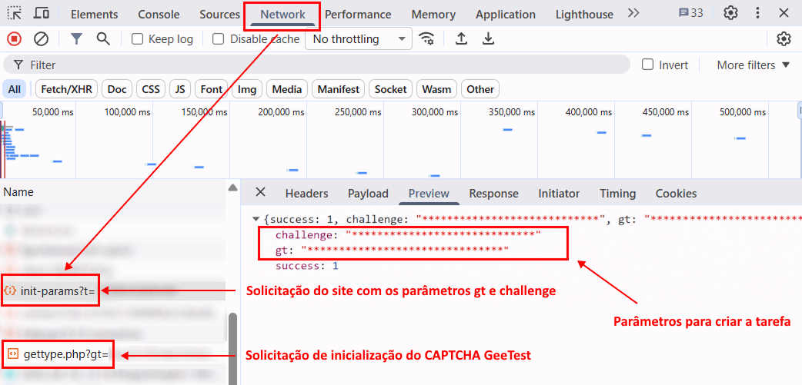
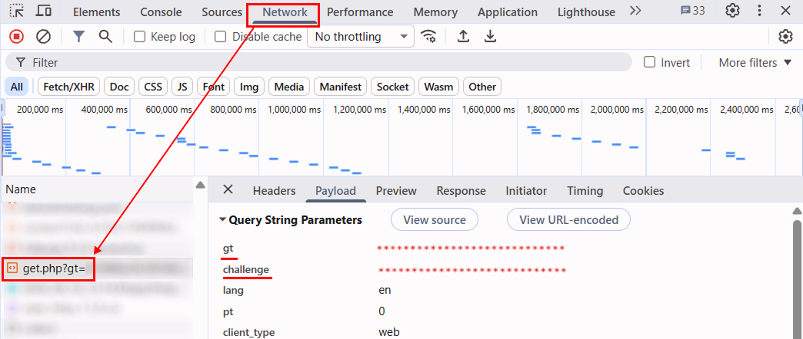

import Tabs from '@theme/Tabs';
import TabItem from '@theme/TabItem';
import ParamItem from '@theme/ParamItem';
import MethodItem from '@theme/MethodItem';
import ImageWrap from '@theme/ImageWrap';
import ImagesLayout from '@theme/ImagesLayout';
import MethodDescription from '@theme/MethodDescription'
import PriceBlock from '../../../../../src/theme/PriceBlock';
import PriceBlockWrap from '@theme/PriceBlockWrap';
import { ArticleHead } from '../../../../../src/theme/ArticleHead';

<ArticleHead slug="captchas/geetest-task" />

# GeeTest

<PriceBlockWrap>
  <PriceBlock title="GeeTestTask" captchaId="geetest"/>
</PriceBlockWrap>

 

Este tipo de tarefa é para resolver captcha GeeTest usando seus proxies.
Sua aplicação deve enviar o endereço do site, chave de domínio público (`gt`), chave (`challenge`) e proxy.

O resultado da resolução do problema são três ou cinco tokens para enviar o formulário.

:::warning **Atenção!**
O CapMonster Cloud, por padrão, funciona com proxies integrados — já incluídos no custo do serviço. É necessário especificar seus próprios proxies apenas nos casos em que o site não aceita o token ou quando o acesso aos serviços integrados está restrito.

Proxies com autorização de IP ainda não são suportados.
:::

:::info

Para **GeeTest V3**:
- Os parâmetros `gt`, `challenge` e `geetestApiServerSubdomain` podem ser passados no código JavaScript de inicialização do GeeTest, por exemplo, na função `initGeetest`.

- Alguns parâmetros também podem estar presentes no código HTML da página ou nas solicitações de rede. Para GeeTest V3, o valor de `challenge` deve ser obtido antes da inicialização do CAPTCHA.


Para **GeeTest V4**, o parâmetro `gt` contém o valor de `captcha_id`.


::: 

<br />

## <span style={{fontSize: '2.25rem'}}>GeeTest V3</span>

### <span style={{fontSize: '1.5rem'}}>Exemplos de tarefas</span>

Abaixo estão exemplos dos tipos de tarefas GeeTest V3 atualmente compatíveis com o CapMonster Cloud:

<ImagesLayout gap="16px" columns={4}>
  <ImageWrap title="Modo Inteligente"></ImageWrap>
  <ImageWrap title="CAPTCHA de Deslizamento"></ImageWrap>
  <ImageWrap title="CAPTCHA de Ícone"></ImageWrap>
  <ImageWrap title="CAPTCHA de Espaço"></ImageWrap>
</ImagesLayout>

### <span style={{fontSize: '1.5rem'}}>Parâmetros de solicitação</span>

<br />
<span style={{ fontSize: "15px", fontWeight: 700 }}>
> IMPORTANTE: o parâmetro `challenge` no GeeTest V3 é dinâmico.  
> Obtenha um novo valor imediatamente antes de criar cada tarefa e antes da inicialização do CAPTCHA na página. Depois que o CAPTCHA for carregado, o valor de `challenge` obtido anteriormente se tornará inválido.
</span>
<br />

  <div className="bordered-panel">
    <ParamItem title="type" required type="string" />
    **GeeTestTask**

    ---

    <ParamItem title="websiteURL" required type="string" />
    O endereço da página na qual o captcha é inicializado. O URL correto geralmente é enviado no cabeçalho Referer ao fazer uma solicitação para `https://api-na.geetest.com/gettype.php`. Por exemplo, você pode estar na página `https://example.com#login`, porém a inicialização real do captcha é realizada em `https://example.com`.

    ---

    <ParamItem title="gt" required type="string" />
    A chave identificadora do GeeTest `gt` para o domínio. Valor estático, raramente atualizado.

    ---

    <ParamItem title="challenge" required="required only for V3" type="string" />
    Chave dinâmica. Um novo valor de `challenge` deve ser obtido antes de criar cada tarefa.<br />

    **Importante:** obtenha `challenge` antes da inicialização do CAPTCHA na página.<br />

Se o CAPTCHA já tiver sido carregado, o valor obtido se tornará inválido. Ao enviar esse valor para a API do CapMonster Cloud, será retornado o [erro](../api/api-errors.mdx) `ERROR_INVALID_TASK` com uma mensagem indicando que o parâmetro é inválido.<br />

    ---

    <ParamItem title="version" required type="integer"/>
    3

    ---

    <ParamItem title="geetestApiServerSubdomain" type="string" />
    Servidor de subdomínio da API GeeTest (deve ser diferente de api.geetest.com). <br />Parâmetro opcional. Pode ser necessário para alguns sites.

    ---

    <ParamItem title="geetestGetLib" type="string" />
    Caminho para o script do captcha para exibi-lo na página. <br /> Parâmetro opcional. Pode ser necessário para alguns sites. <br />Enviar JSON como string.

    ---

    <ParamItem title="userAgent" type="string" />
    User-Agent do navegador. Use o valor atual compatível com o CapMonster Cloud: `userAgentPlaceholder`<br />

Você pode obter o valor mais recente em: [https://capmonster.cloud/api/useragent/actual](https://capmonster.cloud/api/useragent/actual).

    ---

    <ParamItem title="proxyType" type="string" />
    **http** - proxy http/https comum;<br />**https** - tente esta opção apenas se "http" não funcionar (necessário para alguns proxies personalizados);<br />**socks4** - proxy socks4;<br />**socks5** - proxy socks5.

    ---

    <ParamItem title="proxyAddress" type="string" />
    <p>
      Endereço IP proxy IPv4/IPv6. Não permitido:
      - uso de proxies transparentes (onde você pode ver o IP do cliente);
      - uso de proxies em máquinas locais.
    </p>

    ---

    <ParamItem title="proxyPort" type="integer" />
    Porta proxy.

    ---

    <ParamItem title="proxyLogin" type="string" />
    Login do servidor proxy.

    ---

    <ParamItem title="proxyPassword" type="string" />
    Senha do servidor proxy.


  </div>


### <span style={{fontSize: '1.5rem'}}>Criar tarefa</span>

<Tabs className="full-width-tabs filled-tabs request-tabs" groupId="captcha-type">
<TabItem value="proxyless" label="GeeTestTask (sem proxy)" default className="method-panel">
    <MethodItem>
      ```http
      https://api.capmonster.cloud/createTask
      ```
    </MethodItem>
<MethodDescription>
**Exemplo de requisição**
```json
{
  "clientKey": "API_KEY",
  "task": {
    "type": "GeeTestTask",
    "websiteURL": "https://yourwebsite.com/page-with-geetest",
    "gt": "gt-value",
    "challenge": "challenge-value",
    "version": 3,
    "geetestApiServerSubdomain": "example.api.geetest.com"

  }
}
```
**Exemplo de resposta**
```json
{
  "errorId":0,
  "taskId":407533072
}
```

</MethodDescription>
</TabItem>
<TabItem value="proxy" label="GeeTestTask (com proxy)" className="method-panel">
<MethodItem>
```http
https://api.capmonster.cloud/createTask
```
</MethodItem>
<MethodDescription>
**Exemplo de requisição**
```json 
{
  "clientKey": "API_KEY",
  "task": {
    "type": "GeeTestTask",
    "websiteURL": "https://yourwebsite.com/page-with-geetest",
    "gt": "gt-value",
    "challenge": "challenge-value",
    "version": 3,
    "geetestApiServerSubdomain": "example.api.geetest.com",
    "userAgent": "userAgentPlaceholder",
    "proxyType": "your-proxy-type",
    "proxyAddress": "your-proxy-address",
    "proxyPort": 1234,
    "proxyLogin": "your-proxy-login",
    "proxyPassword": "your-proxy-password"
  }
}
```
**Exemplo de resposta**
```json
{
  "errorId":0,
  "taskId":407533072
}
```
</MethodDescription>
</TabItem>

</Tabs>


Use o método [getTaskResult](../api/methods/get-task-result.mdx) para obter o resultado do reconhecimento do GeeTest. Dependendo da carga do sistema, você receberá uma resposta em um intervalo de 10 s a 30 s.

### <span style={{fontSize: '1.5rem'}}>Obter resultado da tarefa</span>


<div className="method-panel-full">
<MethodItem>
```http
https://api.capmonster.cloud/getTaskResult
```
</MethodItem>
<MethodDescription>
**Exemplo de requisição**
```json
{
  "clientKey":"API_KEY",
  "taskId": 407533072
}
```
**Exemplo de resposta**
```json
{
  "errorId": 0,
  "status": "ready",
  "solution": {
    "challenge": "0f759dd1ea6c4wc76cedc2991039ca4f23",
    "validate": "6275e26419211d1f526e674d97110e15",
    "seccode": "510cd9735583edcb158601067195a5eb|jordan"
  }
}
```
</MethodDescription>
</div>

<br />

<table><tr>
<th><b>Propriedade</b></th><th><b>Tipo</b></th><th><b>Descrição</b></th>
</tr>
<tr><td>challenge</td><td>String</td><td rowspan="3">Todos os três parâmetros são necessários ao enviar o formulário no site de destino.</td></tr>
<tr><td>validate</td><td>String</td></tr>
<tr><td>seccode</td><td>String</td></tr>
</table>

### <span style={{fontSize: '1.5rem'}}>Como encontrar todos os parâmetros necessários para criar uma tarefa</span>

#### <span style={{fontSize: '1.2rem'}}>Manualmente</span>

1. Abra no navegador o site em que o GeeTest V3 é exibido.
2. Abra as ferramentas do desenvolvedor (**DevTools**) e acesse a guia **Network**.
3. Recarregue a página para registrar as solicitações de rede desde o início do carregamento.
4. Encontre uma solicitação ao servidor do site de destino cuja resposta contenha os parâmetros do GeeTest, incluindo `gt` e `challenge`.

O valor de `challenge` deve ser obtido **antes da inicialização do CAPTCHA**, ou seja, antes de uma solicitação do GeeTest como esta ser enviada:

```text
https://api.geetest.com/gettype.php?gt=...
```

Antes da inicialização do CAPTCHA, o site pode obter os parâmetros do GeeTest do próprio servidor. Para encontrar o valor atual de `challenge`, verifique as solicitações ao domínio do site de destino e suas respostas.



Em alguns casos, o site criptografa os dados recebidos do próprio servidor, portanto o valor de `challenge` pode não estar disponível de forma explícita na resposta. Nesse caso, ele pode ser obtido a partir dos parâmetros das solicitações do GeeTest, por exemplo:

```text
https://api.geetest.com/get.php?gt=...
```

e/ou:

```text
https://api.geevisit.com/ajax.php?gt=...
```



:::warning Importante:
Nesse método, obtenha os parâmetros da solicitação e **bloqueie as solicitações à API do GeeTest antes que sejam enviadas**. Se a solicitação for enviada e o CAPTCHA for carregado, o valor de `challenge` usado nessa solicitação se tornará inválido.
:::

Depois de obter os valores atuais de `gt` e `challenge`, use-os para criar uma tarefa GeeTest V3 no CapMonster Cloud.
<br />

#### <span style={{fontSize: '1.2rem'}}>Automaticamente</span>

A obtenção dos parâmetros do GeeTest V3 pode ser automatizada de duas maneiras. Escolha a opção adequada conforme a implementação do site de destino.

**Obtenção dos parâmetros a partir da resposta do servidor do site**

Se o servidor do site retornar `gt` e `challenge` de forma explícita, repita a solicitação correspondente antes de criar a tarefa.

Por exemplo:

```text
https://example.com/api/v1/captcha/gee-test/init-params
```

<Tabs className="full-width-tabs filled-tabs request-tabs">
  <TabItem value="js" label="JavaScript" default className="method-panel">
    <details>
      <summary>Mostrar código (no navegador)</summary>

```js
async function getGeeTestV3Params() {
  // Substitua a URL pela solicitação usada pelo seu site,
  // cuja resposta retorna gt e challenge
  const response = await fetch(
    "https://example.com/api/v1/captcha/gee-test/init-params"
  );

  if (!response.ok) {
    throw new Error(`Request failed: ${response.status}`);
  }

  const data = await response.json();

  const gt = data.gt;
  const challenge = data.challenge;

  if (!gt || !challenge) {
    throw new Error("Não foi possível obter gt ou challenge");
  }

  console.log({ gt, challenge });

  return { gt, challenge };
}

getGeeTestV3Params().catch(console.error);
```

    </details>

    <details>
      <summary>Mostrar código (Node.js)</summary>

```js
async function getGeeTestV3Params() {
  // Substitua a URL pela solicitação usada pelo seu site,
  // cuja resposta retorna gt e challenge
  const response = await fetch(
    "https://example.com/api/v1/captcha/gee-test/init-params"
  );

  if (!response.ok) {
    throw new Error(`Request failed: ${response.status}`);
  }

  const data = await response.json();

  const gt = data.gt;
  const challenge = data.challenge;

  if (!gt || !challenge) {
    throw new Error("Missing gt or challenge");
  }

  console.log({ gt, challenge });

  return { gt, challenge };
}

getGeeTestV3Params().catch(console.error);
```

    </details>
  </TabItem>

  <TabItem value="python" label="Python" className="method-panel">
    <details>
      <summary>Mostrar código</summary>

```python
import requests


def get_geetest_v3_params():
    # Substitua a URL pela solicitação usada pelo seu site,
    # cuja resposta retorna gt e challenge
    response = requests.get(
        "https://example.com/api/v1/captcha/gee-test/init-params"
    )
    response.raise_for_status()

    data = response.json()

    gt = data.get("gt")
    challenge = data.get("challenge")

    if not gt or not challenge:
        raise ValueError("Não foi possível obter gt ou challenge")

    print({
        "gt": gt,
        "challenge": challenge,
    })

    return gt, challenge


get_geetest_v3_params()
```

    </details>
  </TabItem>

  <TabItem value="csharp" label="C#" className="method-panel">
    <details>
      <summary>Mostrar código</summary>

```csharp
using System;
using System.Net.Http;
using System.Threading.Tasks;
using Newtonsoft.Json.Linq;

class Program
{
    static async Task GetGeeTestV3Params()
    {
        using var client = new HttpClient();

        // Substitua a URL pela solicitação usada pelo seu site,
        // cuja resposta retorna gt e challenge
        var response = await client.GetAsync(
            "https://example.com/api/v1/captcha/gee-test/init-params"
        );

        response.EnsureSuccessStatusCode();

        var content = await response.Content.ReadAsStringAsync();
        var data = JObject.Parse(content);

        var gt = data["gt"]?.ToString();
        var challenge = data["challenge"]?.ToString();

        if (string.IsNullOrEmpty(gt) || string.IsNullOrEmpty(challenge))
        {
            throw new Exception("Não foi possível obter gt ou challenge");
        }

        Console.WriteLine($"GT: {gt}");
        Console.WriteLine($"Challenge: {challenge}");
    }

    static async Task Main()
    {
        await GetGeeTestV3Params();
    }
}
```

    </details>
  </TabItem>
</Tabs>
<br />

**Obtenção dos parâmetros a partir de uma solicitação do GeeTest**

Se o valor de `challenge` não estiver disponível de forma explícita na resposta do servidor do site, obtenha-o a partir da solicitação correspondente do GeeTest:

```text
https://api.geetest.com/get.php?gt=...&challenge=...
```

ou:

```text
https://api.geevisit.com/ajax.php?gt=...&challenge=...
```

Extraia `gt` e `challenge` dos parâmetros de consulta e bloqueie a solicitação antes que ela seja enviada.

<Tabs className="full-width-tabs filled-tabs request-tabs">
  <TabItem value="js" label="JavaScript / TypeScript" default className="method-panel">
    <details>
      <summary>Mostrar código (Playwright)</summary>

```js
import { chromium } from "playwright";

async function getGeeTestV3Params(pageUrl) {
  const browser = await chromium.launch({ headless: false });
  const context = await browser.newContext();

  let params = null;

  await context.route("**/*", async (route) => {
    const requestUrl = route.request().url();

    if (
      requestUrl.includes("api.geetest.com/get.php") ||
      requestUrl.includes("api.geevisit.com/ajax.php")
    ) {
      const url = new URL(requestUrl);

      const gt = url.searchParams.get("gt");
      const challenge = url.searchParams.get("challenge");

      if (gt && challenge && !params) {
        params = { gt, challenge };
        console.log(params);
      }

      await route.abort();
      return;
    }

    await route.continue();
  });

  const page = await context.newPage();
  await page.goto(pageUrl);

  await page.waitForTimeout(5000);
  await browser.close();

  if (!params) {
    throw new Error("Não foi possível obter gt e challenge");
  }

  return params;
}

getGeeTestV3Params(
  "https://example.com/page-with-geetest"
).catch(console.error);
```

    </details>
  </TabItem>

  <TabItem value="python" label="Python" className="method-panel">
    <details>
      <summary>Mostrar código (Playwright)</summary>

```python
import asyncio
from urllib.parse import urlparse, parse_qs

from playwright.async_api import async_playwright


async def get_geetest_v3_params(page_url):
    params = {}

    async with async_playwright() as p:
        browser = await p.chromium.launch(headless=False)
        context = await browser.new_context()

        async def handle_route(route):
            request_url = route.request.url

            if (
                "api.geetest.com/get.php" in request_url
                or "api.geevisit.com/ajax.php" in request_url
            ):
                query = parse_qs(urlparse(request_url).query)

                gt = query.get("gt", [None])[0]
                challenge = query.get("challenge", [None])[0]

                if gt and challenge and not params:
                    params["gt"] = gt
                    params["challenge"] = challenge
                    print(params)

                await route.abort()
                return

            await route.continue_()

        await context.route("**/*", handle_route)

        page = await context.new_page()
        await page.goto(page_url)

        await asyncio.sleep(5)
        await browser.close()

    if not params:
        raise RuntimeError("Não foi possível obter gt e challenge")

    return params


asyncio.run(
    get_geetest_v3_params(
        "https://example.com/page-with-geetest"
    )
)
```

    </details>
  </TabItem>
</Tabs>

<br />


### <span style={{fontSize: '1.5rem'}}>Usar biblioteca SDK</span>

<Tabs className="full-width-tabs filled-tabs request-tabs" groupId="captcha-type">
  <TabItem value="js" label="JavaScript / TypeScript" default className="method-panel">
  <details>
      <summary>Mostrar código (para navegador)</summary>
```js
// https://github.com/CapMonsterCloud/capmonster-nodejs-captcha-solver

import {
  CapMonsterCloudClientFactory,
  ClientOptions,
  GeeTestRequest
} from "@zennolab_com/capmonstercloud-client";

document.addEventListener("DOMContentLoaded", async () => {

  const API_KEY = "YOUR_API_KEY"; // Informe sua chave de API do CapMonster Cloud

  const client = CapMonsterCloudClientFactory.Create(
    new ClientOptions({ clientKey: API_KEY })
  );

  // Exemplo básico sem proxy
  // O CapMonster Cloud usa automaticamente seus próprios proxies
  let geetestRequest = new GeeTestRequest({
    websiteURL: "https://yourwebsite.com/page-with-geetest",
    gt: "your-gt-value",
    challenge: "your-challenge-value",
    version: 3,
  });

  // Exemplo usando seu proxy
  // Descomente este bloco se quiser usar seu próprio proxy
  /*
  const proxy = {
    proxyType: "https",
    proxyAddress: "123.45.67.89",
    proxyPort: 8080,
    proxyLogin: "username",
    proxyPassword: "password",
  };

  geetestRequest = new GeeTestRequest({
    websiteURL: "https://yourwebsite.com/page-with-geetest",
    gt: "your-gt-value",
    challenge: "your-challenge-value",
    version: 3,
    proxy,
    userAgent: "userAgentPlaceholder",
  });
  */

  // Se necessário, você pode verificar o saldo
  const balance = await client.getBalance();
  console.log("Balance:", balance);

  const result = await client.Solve(geetestRequest);
  console.log("Solution:", result.solution);
});
```
</details>

<details>
      <summary>Mostrar código (Node.js)</summary>
```javascript
// https://github.com/CapMonsterCloud/capmonster-nodejs-captcha-solver

const {
  CapMonsterCloudClientFactory,
  ClientOptions,
  GeeTestRequest,
} = require("@zennolab_com/capmonstercloud-client");

const API_KEY = "YOUR_API_KEY"; // Informe sua chave de API do CapMonster Cloud

async function solveGeeTest() {
  const client = CapMonsterCloudClientFactory.Create(
    new ClientOptions({ clientKey: API_KEY }),
  );

  // Exemplo básico sem proxy
  // O CapMonster Cloud usa automaticamente seus próprios proxies
  let geetestRequest = new GeeTestRequest({
    websiteURL: "https://yourwebsite.com/page-with-geetest",
    gt: "your-gt-value",
    challenge: "your-challenge-value",
    version: 3,
  });

  // Exemplo usando seu proxy
  // Descomente este bloco se quiser usar seu próprio proxy
  /*
  const proxy = {
    proxyType: "https",
    proxyAddress: "123.45.67.89",
    proxyPort: 8080,
    proxyLogin: "username",
    proxyPassword: "password",
  };

  geetestRequest = new GeeTestRequest({
    websiteURL: "https://yourwebsite.com/page-with-geetest",
    gt: "your-gt-value",
    challenge: "your-challenge-value",
    version: 3,
    proxy,
    userAgent: "userAgentPlaceholder",
  });
  */

  // Se necessário, você pode verificar o saldo
  const balance = await client.getBalance();
  console.log("Balance:", balance);

  const result = await client.Solve(geetestRequest);
  console.log("Solution:", result.solution);
}

solveGeeTest().catch(console.error);
```
</details>
  </TabItem>

  <TabItem value="python" label="Python" className="method-panel">
  <details>
      <summary>Mostrar código</summary>
```python
# https://github.com/CapMonsterCloud/capmonster-python-captcha-solver

import asyncio

from capmonstercloudclient import CapMonsterClient, ClientOptions
from capmonstercloudclient.requests import GeetestRequest
# Importe ProxyInfo se pretende usar seu próprio proxy
from capmonstercloudclient.requests.proxy_info import ProxyInfo

API_KEY = "YOUR_API_KEY"  # Informe sua chave de API do CapMonster Cloud


async def solve_geetest():
    client = CapMonsterClient(
        options=ClientOptions(api_key=API_KEY)
    )

    # Exemplo básico sem proxy
    # O CapMonster Cloud usa automaticamente seus próprios proxies
    geetest_request = GeetestRequest(
        websiteUrl="https://yourwebsite.com/page-with-geetest",
        gt="your-gt-value",
        challenge="your-challenge-value",
        version=3,
    )

    # Exemplo usando seu proxy
    # Descomente este bloco se quiser usar seu próprio proxy
    """
    proxy = ProxyInfo(
        proxyType="https",
        proxyAddress="123.45.67.89",
        proxyPort=8080,
        proxyLogin="username",
        proxyPassword="password",
    )

    geetest_request = GeetestRequest(
        websiteUrl="https://yourwebsite.com/page-with-geetest",
        gt="your-gt-value",
        challenge="your-challenge-value",
        version=3,
        userAgent="userAgentPlaceholder",
        proxy=proxy,
    )
    """

    # Se necessário, você pode verificar o saldo
    balance = await client.get_balance()
    print("Balance:", balance)

    result = await client.solve_captcha(geetest_request)
    print("Solution:", result)


asyncio.run(solve_geetest())
```
    </details>
  </TabItem>

  <TabItem value="csharp" label="C#" className="method-panel">
  <details>
      <summary>Mostrar código</summary>
```csharp
// https://github.com/CapMonsterCloud/capmonster-dotnet-captcha-solver

using System;
using System.Threading.Tasks;
using Zennolab.CapMonsterCloud;
using Zennolab.CapMonsterCloud.Requests;

class Program
{
    static async Task Main(string[] args)
    {
        // Informe sua chave de API do CapMonster Cloud
        var clientOptions = new ClientOptions
        {
            ClientKey = "YOUR_API_KEY"
        };

        var cmCloudClient = CapMonsterCloudClientFactory.Create(clientOptions);

        // Exemplo básico sem proxy
        // O CapMonster Cloud usa automaticamente seus próprios proxies
        var geetestRequest = new GeeTestRequest
        {
            WebsiteUrl = "https://yourwebsite.com/page-with-geetest",
            Gt = "your-gt-value",
            Challenge = "your-challenge-value",
            Version = 3
        };

        // Exemplo usando seu proxy
        // Descomente este bloco se quiser usar seu próprio proxy
        /*
        geetestRequest = new GeeTestRequest
        {
            WebsiteUrl = "https://yourwebsite.com/page-with-geetest",
            Gt = "your-gt-value",
            Challenge = "your-challenge-value",
            Version = 3,
            UserAgent = "userAgentPlaceholder",

            Proxy = new ProxyContainer(
                "123.45.67.89",
                8080,
                ProxyType.Http,
                "username",
                "password"
            )
        };
        */

        // Se necessário, você pode verificar o saldo
        var balance = await cmCloudClient.GetBalanceAsync();
        Console.WriteLine("Balance: " + balance);

        var geetestResult = await cmCloudClient.SolveAsync(geetestRequest);

        Console.WriteLine($"""
Solution:
  Challenge: {geetestResult.Solution.Challenge}
  Validate:  {geetestResult.Solution.Validate}
  SecCode:   {geetestResult.Solution.SecCode}
""");
    }
}
```
    </details>
  </TabItem>  
</Tabs>


<br />

## <span style={{fontSize: '2.25rem'}}>GeeTest V4</span>

### <span style={{fontSize: '1.5rem'}}>Exemplo de tarefa</span>

Abaixo está um exemplo do tipo de tarefa GeeTest V4 atualmente compatível com o CapMonster Cloud:


### <span style={{fontSize: '1.5rem'}}>Parâmetros de requisição</span>

<div className="bordered-panel">
<ParamItem title="type" required type="string" />
**GeeTestTask**

---

<ParamItem title="websiteURL" required type="string" />
Endereço da página onde o captcha está sendo resolvido.

---

<ParamItem title="gt" required type="string" />
A chave do identificador GeeTest para o domínio - o parâmetro `captcha_id`.

---

<ParamItem title="version" required type="integer"/>
4

---

<ParamItem title="geetestApiServerSubdomain" type="string" />
Subdomínio do servidor API GeeTest (deve ser diferente de `api.geetest.com`). <br />Parâmetro opcional. Pode ser necessário para alguns sites.

---

<ParamItem title="geetestGetLib" type="string" />
Caminho para o script captcha para exibi-lo na página. <br />Parâmetro opcional. Pode ser necessário para alguns sites. <br />Enviar JSON como string.

---

<ParamItem title="initParameters" type="object" />
Parâmetros adicionais para a versão 4, utilizados juntamente com `"riskType"` (por exemplo, `slide`).

---

<ParamItem title="userAgent" type="string" />
User-Agent do navegador. Use o valor atual compatível com o CapMonster Cloud: `userAgentPlaceholder`<br />

Você pode obter o valor mais recente em: [https://capmonster.cloud/api/useragent/actual](https://capmonster.cloud/api/useragent/actual).

---

<ParamItem title="proxyType" type="string" />
**http** - proxy http/https comum;<br />**https** - tente essa opção apenas se "http" não funcionar (necessário para alguns proxies personalizados);<br />**socks4** - proxy socks4;<br />**socks5** - proxy socks5.

---

<ParamItem title="proxyAddress" type="string" />
<p>
Endereço IP do proxy IPv4/IPv6. Não permitido:
- uso de proxies transparentes (onde é possível ver o IP do cliente);
- uso de proxies em máquinas locais.
</p>

---

<ParamItem title="proxyPort" type="integer" />
Porta do proxy.

---

<ParamItem title="proxyLogin" type="string" />
Login do servidor proxy.

---

<ParamItem title="proxyPassword" type="string" />
Senha do servidor proxy.

</div>


### <span style={{fontSize: '1.5rem'}}>Método de criação de tarefa</span>


<Tabs className="full-width-tabs filled-tabs request-tabs" groupId="captcha-type">
<TabItem value="proxyless" label="GeeTestTask (sem proxy)" default className="method-panel">
<MethodItem>
```http
https://api.capmonster.cloud/createTask
```
</MethodItem>
<MethodDescription>
**Exemplo de requisição**
```json
{
  "clientKey": "API_KEY",
  "task": {
    "type": "GeeTestTask",
    "websiteURL": "https://yourwebsite.com/page-with-geetest",
    "gt": "captcha-id-value",
    "version": 4,
    "initParameters": {
      "riskType": "riskTypeHere"
    }
  }
}
```

**Exemplo de resposta**
```json
{
  "errorId":0,
  "taskId":407533072
}
```

</MethodDescription>
</TabItem>
<TabItem value="proxy" label="GeeTestTask (com proxy)" className="method-panel">
<MethodItem>
```http
https://api.capmonster.cloud/createTask
```
</MethodItem>
<MethodDescription>
**Exemplo de requisição**
  ```json
  {
    "clientKey": "API_KEY",
    "task": {
      "type": "GeeTestTask",
      "websiteURL": "https://yourwebsite.com/page-with-geetest",
      "gt": "captcha-id-value",
      "version": 4,
      "initParameters": {
        "riskType": "riskTypeHere"
      },
      "proxyType": "your-proxy-type",
      "proxyAddress": "your-proxy-address",
      "proxyPort": 1234,
      "proxyLogin": "your-proxy-login",
      "proxyPassword": "your-proxy-password",
      "userAgent": "userAgentPlaceholder"
    }
  }
  ```

**Exemplo de resposta**
```json
{
  "errorId":0,
  "taskId":407533072
}
```
</MethodDescription>
</TabItem>

</Tabs>

Use o [getTaskResult](../api/methods/get-task-result.mdx) para obter o resultado do reconhecimento GeeTest. Dependendo da carga do sistema, você receberá uma resposta em um intervalo de 10 s a 30 s.

### <span style={{fontSize: '1.5rem'}}>Método de obtenção do resultado da tarefa</span>

<div className="method-panel-full">
<MethodItem>
```http
https://api.capmonster.cloud/getTaskResult
```
</MethodItem>
<MethodDescription>
**Exemplo de requisição**
```json
{
  "clientKey":"API_KEY",
  "taskId": 407533072
}
```
**Exemplo de resposta**
```json
{
  "errorId": 0,
  "status": "ready",
  "solution": {
    "captcha_id": "f5c2ad5a8a3cf37192d8b9c039950f79",
    "lot_number": "bcb2c6ce2f8e4e9da74f2c1fa63bd713",
    "pass_token": "edc7a17716535a5ae624ef4707cb6e7e478dc557608b068d202682c8297695cf",
    "gen_time": "1683794919",
    "captcha_output": "XwmTZEJCJEnRIJBlvtEAZ662T...[cut]...SQ3fX-MyoYOVDMDXWSRQig56"
  }
}
```
</MethodDescription>
</div>

<br />

<table>
<tr>
<th><b>Propriedade</b></th><th><b>Tipo</b></th><th><b>Descrição</b></th>
</tr>
<tr>
<td>captcha_id</td><td>String</td><td rowspan="5">Todos os cinco parâmetros são necessários ao enviar o formulário no site de destino.<br />input[name=captcha_id]<br />input[name=lot_number]<br />input[name=pass_token]<br />input[name=gen_time]<br />input[name=captcha_output]</td>
</tr>
<tr><td>lot_number</td><td>String</td></tr>
<tr><td>pass_token</td><td>String</td></tr>
<tr><td>gen_time</td><td>String</td></tr>
<tr><td>captcha_output</td><td>String</td></tr>
</table>

### Como encontrar todos os parâmetros necessários para criar uma tarefa

#### Manualmente

1. Abra o site onde o CAPTCHA é exibido no navegador.
2. Abra as Ferramentas de Desenvolvedor (DevTools) e vá para a aba **Network**.
3. Atualize a página (F5) para capturar todas as requisições de rede.
4. No campo de busca (Filter), digite `load` ou `captcha` para encontrar rapidamente a requisição necessária.
5. Encontre uma requisição como `load?callback=...` — ela geralmente contém os parâmetros do CAPTCHA.
6. Clique nessa requisição e abra a aba **Payload** para visualizar os dados necessários.


### Automaticamente

Uma forma conveniente de automatizar a busca por todos os parâmetros necessários.  
Alguns parâmetros são regenerados toda vez que a página carrega, então você precisará extraí-los através de um navegador — seja normal ou headless (por exemplo, usando **Playwright**).  
Como os valores dos parâmetros dinâmicos têm vida curta, o captcha deve ser resolvido imediatamente após recuperá-los.

:::warning **Importante!**  
Os trechos de código fornecidos são exemplos básicos para familiarização com a extração dos parâmetros necessários. A implementação exata dependerá da sua página de captcha, sua estrutura e os elementos/seletores HTML que ela utiliza.  
:::

<Tabs className="full-width-tabs filled-tabs request-tabs">
  <TabItem value="js" label="JavaScript" default className="method-panel">
    <details>
      <summary>Mostrar código (no navegador)</summary>

```js
(function() {
  function getQueryParams(url) {
    const params = new URLSearchParams(new URL(url).search);
    const captchaId = params.get('captcha_id');
    const riskType = params.get('risk_type');
    return { captchaId, riskType };
  }

  const observer = new PerformanceObserver((list) => {
    const entries = list.getEntriesByType('resource');
    entries.forEach((entry) => {
      if (entry.name.includes('https://gcaptcha4.geetest.com/load?')) {
        const { captchaId, riskType } = getQueryParams(entry.name);
        if (captchaId) {
          console.log('GeeTest v4 detected (via PerformanceObserver):');
          console.log({ captchaId, riskType });
        }
      }
    });
  });

  observer.observe({ type: 'resource', buffered: true });
})();
  ```
    </details>

    <details>
      <summary>Mostrar código (Node.js)</summary>

```js
import { chromium } from "playwright";

async function detectGeeTestV4(pageUrl) {
  const result = { version: null, data: {} };

  const browser = await chromium.launch({ headless: false });
  const context = await browser.newContext();
  const page = await context.newPage();

  page.on("response", async (response) => {
    const url = response.url();

    if (url.includes("https://gcaptcha4.geetest.com/load?")) {
      const urlParams = new URLSearchParams(url.split("?")[1]);
      const captchaId = urlParams.get("captcha_id");
      const riskType = urlParams.get("risk_type");

      if (captchaId && !result.version) {
        result.version = "v4";
        result.data = {
          captchaId: captchaId,
          riskType: riskType,
        };

        console.log("GeeTest v4 detected:");
        console.log(result.data);
      }
    }
  });

  await page.goto(pageUrl, { waitUntil: "networkidle" });
  await page.waitForTimeout(20000);

  if (!result.version) {
    console.log("error");
  }

  await browser.close();
  return result;
}

detectGeeTestV4("https://example.com").then((result) => {
  console.log(result);
});
```
    </details>
  </TabItem>

  <TabItem value="python" label="Python" className="method-panel">
    <details>
      <summary>Mostrar código</summary>

```python
import asyncio
from playwright.async_api import async_playwright
from urllib.parse import urlparse, parse_qs

async def detect_geetest_v4(page_url):
    result = {"version": None, "data": {}}

    async with async_playwright() as p:
        browser = await p.chromium.launch(headless=False)
        context = await browser.new_context()
        page = await context.new_page()

        async def on_request(request):
            url = request.url
            if "https://gcaptcha4.geetest.com/load?" in url:
                query = parse_qs(urlparse(url).query)
                captcha_id = query.get("captcha_id", [None])[0]
                risk_type = query.get("risk_type", [None])[0]

                if captcha_id and not result["version"]:
                    result["version"] = "v4"
                    result["data"] = {
                        "captchaId": captcha_id,
                        "riskType": risk_type
                    }

                    print("GeeTest v4 detected:")
                    print(result["data"])

        context.on("request", on_request)

        await page.goto(page_url, wait_until="networkidle")
        await asyncio.sleep(10)

        if not result["version"]:
            print("error")

        await browser.close()
        return result

asyncio.run(detect_geetest_v4("https://www.example.com"))
```
    </details>
  </TabItem>

  <TabItem value="csharp" label="C#" className="method-panel">
    <details>
      <summary>Mostrar código</summary>

```csharp
using System;
using System.Threading.Tasks;
using Microsoft.Playwright;
using System.Web;

class Program
{
    public static async Task Main(string[] args)
    {
        using var playwright = await Playwright.CreateAsync();
        var browser = await playwright.Chromium.LaunchAsync(new BrowserTypeLaunchOptions
        {
            Headless = false
        });

        var context = await browser.NewContextAsync();
        var page = await context.NewPageAsync();

        bool detected = false;

        page.Request += (_, request) =>
        {
            var url = request.Url;

            if (url.Contains("https://gcaptcha4.geetest.com/load?"))
            {
                var uri = new Uri(url);
                var queryParams = HttpUtility.ParseQueryString(uri.Query);
                var captchaId = queryParams.Get("captcha_id");
                var riskType = queryParams.Get("risk_type");

                if (!string.IsNullOrEmpty(captchaId) && !detected)
                {
                    detected = true;

                    Console.WriteLine("GeeTest v4 detected:");
                    Console.WriteLine($"CaptchaId: {captchaId}");
                    Console.WriteLine($"RiskType: {riskType}");
                }
            }
        };

        await page.GotoAsync("https://www.example.com/", new PageGotoOptions
        {
            WaitUntil = WaitUntilState.NetworkIdle
        });

        await Task.Delay(10000);

        await browser.CloseAsync();
    }
}
```
    </details>
  </TabItem>
</Tabs>

### <span style={{fontSize: '1.5rem'}}>Usar biblioteca SDK</span>

<Tabs className="full-width-tabs filled-tabs request-tabs" groupId="captcha-type">
  <TabItem value="js" label="JavaScript / TypeScript" default className="method-panel">
  <details>
      <summary>Mostrar código (para navegador)</summary>
```js
// https://github.com/CapMonsterCloud/capmonster-nodejs-captcha-solver

import {
  CapMonsterCloudClientFactory,
  ClientOptions,
  GeeTestRequest
} from "@zennolab_com/capmonstercloud-client";

document.addEventListener("DOMContentLoaded", async () => {

  const API_KEY = "YOUR_API_KEY"; // Informe sua chave de API do CapMonster Cloud

  const client = CapMonsterCloudClientFactory.Create(
    new ClientOptions({ clientKey: API_KEY })
  );

  // Exemplo básico sem proxy
  // O CapMonster Cloud usa automaticamente seus próprios proxies
  let geetestRequest = new GeeTestRequest({
    websiteURL: "https://yourwebsite.com/page-with-geetest",
    gt: "your-gt-value",
    version: "4",
    initParameters: {
      riskType: "your-risk-type",
    },
  });

  // Exemplo usando seu proxy
  // Descomente este bloco se quiser usar seu próprio proxy
  /*
  const proxy = {
    proxyType: "https",
    proxyAddress: "123.45.67.89",
    proxyPort: 8080,
    proxyLogin: "username",
    proxyPassword: "password",
  };

  geetestRequest = new GeeTestRequest({
    websiteURL: "https://yourwebsite.com/page-with-geetest",
    gt: "your-gt-value",
    version: "4",
    initParameters: {
      riskType: "your-risk-type",
    },
    proxy,
  });
  */

  // Se necessário, você pode verificar o saldo
  const balance = await client.getBalance();
  console.log("Balance:", balance);

  const result = await client.Solve(geetestRequest);
  console.log("Solution:", result.solution);
});
```
    </details>

    <details>
      <summary>Mostrar código (Node.js)</summary>
```javascript
// https://github.com/CapMonsterCloud/capmonster-nodejs-captcha-solver

const {
  CapMonsterCloudClientFactory,
  ClientOptions,
  GeeTestRequest,
} = require("@zennolab_com/capmonstercloud-client");

const API_KEY = "YOUR_API_KEY"; // Informe sua chave de API do CapMonster Cloud

async function solveGeeTest() {
  const client = CapMonsterCloudClientFactory.Create(
    new ClientOptions({ clientKey: API_KEY }),
  );

  // Exemplo básico sem proxy
  // O CapMonster Cloud usa automaticamente seus próprios proxies
  let geetestRequest = new GeeTestRequest({
    websiteURL: "https://yourwebsite.com/page-with-geetest",
    gt: "your-gt-value",
    version: "4",
    initParameters: {
      riskType: "your-risk-type",
    },
  });

  // Exemplo usando seu proxy
  // Descomente este bloco se quiser usar seu próprio proxy
  /*
  const proxy = {
    proxyType: "https",
    proxyAddress: "123.45.67.89",
    proxyPort: 8080,
    proxyLogin: "username",
    proxyPassword: "password",
  };

  geetestRequest = new GeeTestRequest({
    websiteURL: "https://yourwebsite.com/page-with-geetest",
    gt: "your-gt-value",
    version: "4",
    initParameters: {
      riskType: "your-risk-type",
    },
    proxy,
  });
  */

  // Se necessário, você pode verificar o saldo
  const balance = await client.getBalance();
  console.log("Balance:", balance);

  const result = await client.Solve(geetestRequest);
  console.log("Solution:", result.solution);
}

solveGeeTest().catch(console.error);
```
</details>

  </TabItem>

  <TabItem value="python" label="Python" className="method-panel">
  <details>
      <summary>Mostrar código</summary>

```python
# https://github.com/CapMonsterCloud/capmonster-python-captcha-solver

import asyncio

from capmonstercloudclient import CapMonsterClient, ClientOptions
from capmonstercloudclient.requests import GeetestRequest
# Importe ProxyInfo se pretende usar seu próprio proxy
from capmonstercloudclient.requests.proxy_info import ProxyInfo

API_KEY = "YOUR_API_KEY"  # Informe sua chave de API do CapMonster Cloud


async def solve_geetest():
    client = CapMonsterClient(
        options=ClientOptions(api_key=API_KEY)
    )

    # Exemplo básico sem proxy
    # O CapMonster Cloud usa automaticamente seus próprios proxies
    geetest_request = GeetestRequest(
        websiteUrl="https://yourwebsite.com/page-with-geetest",
        gt="your-gt-value",
        version="4",
        initParameters={
            "riskType": "your-risk-type",
        },
    )

    # Exemplo usando seu proxy
    # Descomente este bloco se quiser usar seu próprio proxy
    """
    proxy = ProxyInfo(
        proxyType="https",
        proxyAddress="123.45.67.89",
        proxyPort=8080,
        proxyLogin="username",
        proxyPassword="password",
    )

    geetest_request = GeetestRequest(
        websiteUrl="https://yourwebsite.com/page-with-geetest",
        gt="your-gt-value",
        version="4",
        initParameters={
            "riskType": "your-risk-type",
        },
        proxy=proxy,
        userAgent="userAgentPlaceholder",
    )
    """

    # Se necessário, você pode verificar o saldo
    balance = await client.get_balance()
    print("Balance:", balance)

    result = await client.solve_captcha(geetest_request)
    print("Solution:", result)


asyncio.run(solve_geetest())
```
    </details>
  </TabItem>

  <TabItem value="csharp" label="C#" className="method-panel">
  <details>
      <summary>Mostrar código</summary>
```csharp
// https://github.com/CapMonsterCloud/capmonster-dotnet-captcha-solver

using System;
using System.Collections.Generic;
using System.Threading.Tasks;
using Zennolab.CapMonsterCloud;
using Zennolab.CapMonsterCloud.Requests;

class Program
{
    static async Task Main(string[] args)
    {
        // Informe sua chave de API do CapMonster Cloud
        var clientOptions = new ClientOptions
        {
            ClientKey = "YOUR_API_KEY"
        };

        var cmCloudClient = CapMonsterCloudClientFactory.Create(clientOptions);

        // Exemplo básico sem proxy
        // O CapMonster Cloud usa automaticamente seus próprios proxies
        var geetestRequest = new GeeTestRequest
        {
            WebsiteUrl = "https://yourwebsite.com/page-with-geetest",
            Gt = "your-gt-value",
            Version = 4,
            InitParameters = new Dictionary<string, string>
            {
                { "riskType", "your-risk-type" }
            }
        };

        // Exemplo usando seu proxy
        // Descomente este bloco se quiser usar seu próprio proxy
        /*
        geetestRequest = new GeeTestRequest
        {
            WebsiteUrl = "https://yourwebsite.com/page-with-geetest",
            Gt = "your-gt-value",
            Version = 4,
            InitParameters = new Dictionary<string, string>
            {
                { "riskType", "your-risk-type" }
            },

            Proxy = new ProxyContainer(
                "123.45.67.89",
                8080,
                ProxyType.Http,
                "username",
                "password"
            )
        };
        */

        // Se necessário, você pode verificar o saldo
        var balance = await cmCloudClient.GetBalanceAsync();
        Console.WriteLine("Balance: " + balance);

        var geetestResult = await cmCloudClient.SolveAsync(geetestRequest);

        Console.WriteLine($"""
Solution:
  CaptchaId:     {geetestResult.Solution.CaptchaId}
  LotNumber:     {geetestResult.Solution.LotNumber}
  PassToken:     {geetestResult.Solution.PassToken}
  GenTime:       {geetestResult.Solution.GenTime}
  CaptchaOutput: {geetestResult.Solution.CaptchaOutput}
""");
    }
}
```
    </details>
  </TabItem>
</Tabs>


## Características da solução GeeTest em app.gal\*\*.com

:::warning **Atenção!**
Esta seção é **apenas relevante para o captcha GeeTest no site `app.gal**.com`**. Estes valores não devem ser usados em outros sites.
:::

<details>
  <summary>Quando usar o campo <code>challenge</code>?</summary>

Para o site **`app.gal**.com`**, é necessário especificar o valor do campo `challenge` de acordo com a ação a ser realizada. Se este campo não for especificado, o valor padrão **`AddTypedCredentialItems`** será usado, mas isso não serve para todos os cenários.

Lista de valores possíveis para `challenge`:

| Ação no site `app.gal**.com`        | Valor do challenge          |
| ----------------------------------- | --------------------------- |
| Enviar código por e-mail            | `SendEmailCode`             |
| Confirmar ação (por exemplo, login) | `SendVerifyCode`            |
| Resgatar recompensa                 | `ClaimUserTask`             |
| Abrir caixa misteriosa              | `OpenMysteryBox`            |
| Comprar na GGShop                   | `BuyGGShop`                 |
| Preparar compra de bilhetes         | `PrepareBuyGGRaffleTickets` |
| Adicionar credenciais               | `AddTypedCredentialItems`   |
| Criar ticket de suporte             | `CreateReportTicket`        |
| Participar de atividade             | `PrepareParticipate`        |
| Atualizar dados de credenciais      | `RefreshCredentialValue`    |
| Sincronizar dados                   | `SyncCredentialValue`       |
| Login via redes sociais             | `GetSocialAuthUrl`          |

> O valor de `challenge` deve corresponder ao `operationName` visível nas requisições de rede (`Network`) no DevTools.


</details>

<details>
  <summary>Exemplo de envio de tarefa</summary>

```json
{
  "type": "GeeTestTask",
  "websiteURL": "https://app.gal**.com/accountSetting/social",
  "gt": "244bcb8b9846215df5af4c624a750db4",
  "challenge": "SendVerifyCode",
  "version": 3
}
```

> Observação: A chave GT para gal\*\*.com é sempre `244bcb8b9846215df5af4c624a750db4`. Este valor pode ser mantido como padrão.

</details>

<details>
  <summary>Exemplo de resposta</summary>

```json
{
  "errorId": 0,
  "errorCode": null,
  "errorDescription": null,
  "solution": {
    "lot_number": "e0c84aab60867ad1316f8606d31ab58d2a54d8a4ca8e78b9339abd8ea62967cb",
    "captcha_output": "7DlZW2dul...cbEA5uIbwg==",
    "pass_token": "ce024389a0926e0d1081792c83e0c46f882084e45e95afa0e148fd03aed3ae10",
    "gen_time": "1753158042",
    "encryptedData": ""
  },
  "status": "ready"
}
```

O campo `encryptedData` no site geralmente está vazio, pois a lógica do cliente o ignora. Embora o valor seja retornado via WebAssembly, na prática ele não é utilizado.

</details>
