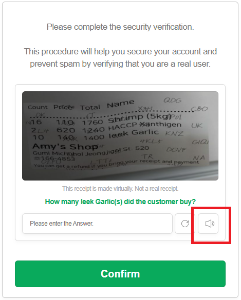
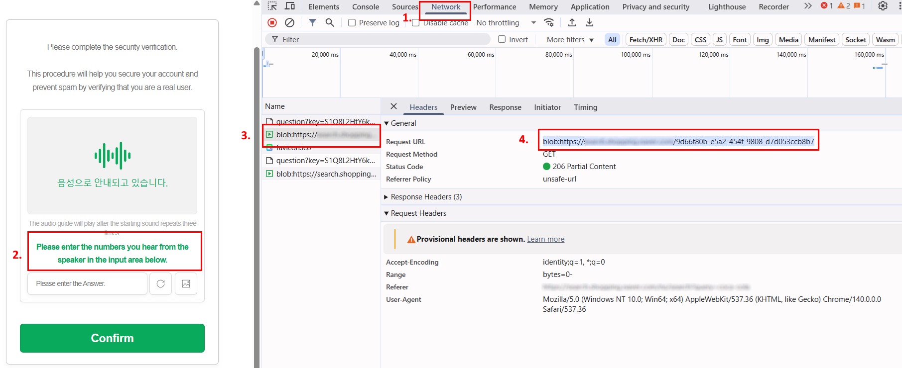
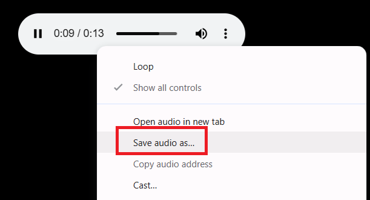

import Tabs from '@theme/Tabs';
import TabItem from '@theme/TabItem';
import ParamItem from '@theme/ParamItem';
import MethodItem from '@theme/MethodItem';
import MethodDescription from '@theme/MethodDescription'
import PriceBlock from '@theme/PriceBlock';
import PriceBlockWrap from '@theme/PriceBlockWrap';
import { ArticleHead } from '@site/src/theme/ArticleHead';

<ArticleHead slug="captchas/compleximage/bills_audio" />

# bills_audio


<PriceBlockWrap>
  <PriceBlock title="bills_audio" captchaId="complex-rec_bills_audio" />
</PriceBlockWrap>

:::warning **注意！**
此任务不需要使用代理服务器。
:::
<br />
`bills_audio` 音频验证码是“收据验证码”的音频版本，其中生成的图像或数据模拟收据，可能包含数字、金额和日期。在这种类型的任务中，用户需要听一段音频文件，并根据听到的信息输入正确的答案。该格式可能如下所示：

 

## 请求参数

<br />
<span style={{ fontSize: "15px", fontWeight: 700 }}>
> 重要提示：在创建任务之前，请直接获取 base64 音频，以避免在求解过程中出现错误（请参见章节 [获取音频并转换为 Base64](#获取音频并转换为-base64)）。
</span>
<br />

<TabItem value="proxyless" label="ComplexImageTask（无代理）" default className="bordered-panel">
    <ParamItem title="type" required type="string" />
    **ComplexImageTask**

---

<ParamItem title="class" required type="string" />
**recognition**

---

<ParamItem title="imagesBase64" required type="array" />
已进行 base64 编码的图片/音频数据。  
示例：`[ “UklGRnjuAwBXQVZFZm10...f/2f/9/6z/vf8MAAAA”]`

---

<ParamItem title="Task（metadata 内）" required type="string" />
任务名称：`"bills_audio"`<br />

---

<ParamItem title="PayloadType（metadata 内）" required type="string" />
发送到任务中的数据类型：`"Audio"`


</TabItem>

## 创建任务方法

<TabItem value="proxyless" label="ComplexImageTask（无代理）" default className="method-panel">
    <MethodItem>
    ```http
    https://api.capmonster.cloud/createTask
    ```
    </MethodItem>
    <MethodDescription>
      **请求**
```json
{
    "clientKey": "API_KEY",
    "task": {
        "type": "ComplexImageTask",
        "class": "recognition",
        "imagesBase64": [
            "UklGRnjuAwBXQVZFZm10...f/2f/9/6z/vf8MAAAA"
        ],
        "metadata": {
            "Task": "bills_audio",
            "PayloadType": "Audio"
        }
    }
}
```

**响应**

```json
{
    "errorId": 0,
    "taskId": 143998457
}
```

</MethodDescription>

</TabItem>

## 获取任务结果方法

<TabItem value="proxyless" label="ComplexImageTask（无代理）" default className="method-panel-full">
    <MethodItem>
    ```http
    https://api.capmonster.cloud/getTaskResult
    ```
    </MethodItem>
    <MethodDescription>
    **请求**
    ```json
    {
        "clientKey": "API_KEY",
        "taskId": 143998457
    }
    ```

**响应：** 结果包含音频中的数字。
```json
{
  "solution": {
      "answer": [6, 8, 4, 1, 2, 3],
      "metadata": {"AnswerType": "Text"}
  },
  "cost": 0.0008,
  "status": "ready",
  "errorId": 0,
  "errorCode": null,
  "errorDescription": null
}
```
</MethodDescription>

</TabItem>


## 获取音频并转换为 Base64

1. 打开验证码页面并启动 **DevTools（开发者工具）**，然后进入 **Network（网络）** 标签。
2. 通过点击相应按钮启用验证码的音频模式。
3. 在请求列表中找到类似如下的地址：
   `blob:https://example.com/3be79ac6-1b3d-43ef-9a8a-7ad8877b3606`
4. 复制该 URL 并在浏览器地址栏中打开 —— 验证码音频文件将以 **.wav** 格式打开。





5. 保存该文件，并使用任意方式将 **.wav** 文件转换为 **Base64** —— 例如使用 Node.js：

```JavaScript
const fs = require("fs");

// 源 .wav 文件路径
const filePath = "C:\\Users\\User\\Downloads\\file-acbe-4fb3-9f8e-f989ba6c7fde.wav";

const fileBuffer = fs.readFileSync(filePath);

// 转换为 Base64
const base64 = fileBuffer.toString("base64");

// 将 Base64 字符串保存到文本文件
fs.writeFileSync("output.txt", base64);

console.log("文件已成功转换为 Base64，并保存为 output.txt");
```

6. 将生成的 Base64 字符串用于 CapMonster Cloud 的任务请求中。


