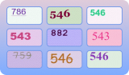

import Tabs from '@theme/Tabs';
import TabItem from '@theme/TabItem';
import ParamItem from '@theme/ParamItem';
import MethodItem from '@theme/MethodItem';
import MethodDescription from '@theme/MethodDescription'
import PriceBlock from '@theme/PriceBlock';
import PriceBlockWrap from '@theme/PriceBlockWrap';
import BlogLink from '@theme/BlogLink';
import { ArticleHead } from '@site/src/theme/ArticleHead';

<ArticleHead slug="captchas/compleximage/bls" />


# bls



<PriceBlockWrap>
  <PriceBlock  captchaId="complex-rec_bls" />
</PriceBlockWrap>

:::warning **注意！**
此任务不需要使用代理服务器。
:::
<br />

在请求中，必须提供 9 张 base64 格式的图片。<br />
此外，必须在 `metadata` 中传递 `TaskArgument` 参数值。

<BlogLink url="https://capmonster.cloud/zh/blog/news/bls-solve-extension" />

## 请求参数

<br />
<span style={{ fontSize: "15px", fontWeight: 700 }}>
> 重要提示：在创建任务之前请直接获取 base64 图片，以避免在解题过程中出现错误（参见章节 [如何获取 base64](#如何获取-base64)）。
</span>
<br />

<TabItem value="proxyless" label="ComplexImageTask（无代理）" default className="bordered-panel">
    <ParamItem title="type" required type="string" />
    **ComplexImageTask**

    ---

    <ParamItem title="class" required type="string" />
    **recognition**

    ---

    <ParamItem title="imagesBase64" required type="array" />
    由 base64 编码的图片数组。

    ---

    <ParamItem title="Task（在 metadata 中）" required type="string" />
    任务名称：`"bls_3x3"`

    ---

    <ParamItem title="TaskArgument（在 metadata 中）" required type="string" />
    需要在图片中找到的数字值。例如：`"123"`

</TabItem>

## 创建任务方法

<TabItem value="proxyless" label="ComplexImageTask（无代理）" default className="method-panel">
	<MethodItem>
		```http
		https://api.capmonster.cloud/createTask
		```
	</MethodItem>
	<MethodDescription>
      **请求**
      ```json
      {
        "clientKey":{{API_key}},
        "task": 
        {
          "type": "ComplexImageTask",
          "class": "recognition",
          "imagesBase64": [
            "image1_to_base64",
            "image2_to_base64",
            "image3_to_base64",
            "image4_to_base64",
            "image5_to_base64",
            "image6_to_base64",
            "image7_to_base64",
            "image8_to_base64",
            "image9_to_base64"
          ],
          "metadata": {
            "Task": "bls_3x3",
            "TaskArgument": "123"
          }
        }
      }
      ```

    	任务示例：

    	

    	传递已转换为 base64 的图片：

    	
    	
    	
    	
    	
    	
    	
    	
    	

    	对于此示例：`"TaskArgument": "546"`

    	**响应**
    	```json
    	{
    	  "errorId":0,
    	  "taskId":143998457
    	}
    	```
    </MethodDescription>

</TabItem>

## 获取任务结果方法

<TabItem value="proxyless" label="ComplexImageTask（无代理）" default className="method-panel-full">
	<MethodItem>
		```http
		https://api.capmonster.cloud/getTaskResult
		```
	</MethodItem>
	<MethodDescription>
		**请求**
		```json
		{
		  "clientKey":"API_KEY",
		  "taskId": 143998457
		}
		```
		**响应：**
		一个布尔值数组（`true` 或 `false`），表示每张图片中的数字是否与目标参数匹配。
```json
{
  "errorId": 0,
  "status": "ready",
  "errorCode": null,
  "errorDescription": null,
  "solution": {
    "answer": [true, true, false, false, true, false, false, true, true],
    "metadata": {
      "AnswerType": "Grid"
    }
  }
}      
```
</MethodDescription>

</TabItem>

## 替代解决方法（bls_text）

除了使用自动匹配模式（`bls_3x3`）外，你还可以对每张图片分别进行文本识别。该方法提供了更高的灵活性，并允许对处理流程进行更精细的控制。

此方法通过使用 `ImageToTextTask` 并结合 `bls_text` 模块来实现（*参见章节 [模块名称传递](/api/module-name.mdx)*）。在该模式下，**每张图片都会作为单独的验证码进行处理**，返回结果为识别出的文本值。

### 工作流程

1. 将验证码拆分为独立的图片（9 个网格元素）。
2. 将每张图片作为单独的 `ImageToTextTask` 提交。
3. 返回结果为识别出的文本（数字）。
4. 将得到的值与目标进行比较，以确定匹配的图片。

### 请求示例

<TabItem value="proxyless" label="ComplexImageTask（无代理）" default className="method-panel">
	<MethodItem>
		```http
		https://api.capmonster.cloud/createTask
		```
	</MethodItem>
	<MethodDescription>
      **请求**

```json
{
  "clientKey": "API_KEY",
  "task": {
    "type": "ImageToTextTask",
    "capMonsterModule": "bls_text",
    "body": "/9j/4AAQSkZJRgABAQAAAQABAAD/2wBDAA...CruPHGc8nk5z+HtRQB//9k="
  }
}
```

**响应示例**

```json
{
  "errorId": 0,
  "status": "ready",
  "errorCode": null,
  "errorDescription": null,
  "solution": {
    "text": "123"
  }
}
```

</MethodDescription>

</TabItem>

### 自动化 bls_text 解决示例

在此方法中，每张图片都会作为单独的 `ImageToTextTask` 提交，并使用 `bls_text` 模块。随后对识别结果进行收集和处理。你将为每张图片获得一个文本值，并可以自定义处理逻辑——例如，将结果与目标值（`target`）进行比较、过滤、组合结果，或根据你的使用场景实现任意自定义处理。

<details>
      <summary>显示代码（Node.js）</summary>
```javascript
const API_KEY = "API_KEY";
const CREATE_TASK_URL = "https://api.capmonster.cloud/createTask";
const GET_RESULT_URL = "https://api.capmonster.cloud/getTaskResult";

const target = "546";

// 9 张图片（每张以格式发送：" /9j/4AAQSkZJ...6UUAf/Z"）
const images = [
  "base64_img_1",
  "base64_img_2",
  "base64_img_3",
  "base64_img_4",
  "base64_img_5",
  "base64_img_6",
  "base64_img_7",
  "base64_img_8",
  "base64_img_9",
];

// 创建任务（单张图片）
async function createTask(imageBase64) {
  const payload = {
    clientKey: API_KEY,
    task: {
      type: "ImageToTextTask",
      capMonsterModule: "bls_text",
      body: imageBase64,
    },
  };

  console.log("=== REQUEST ===");
  console.log(JSON.stringify(payload, null, 2));

  const res = await fetch(CREATE_TASK_URL, {
    method: "POST",
    body: JSON.stringify(payload),
  });

  const data = await res.json();

  console.log("=== CREATE RESPONSE ===");
  console.log(JSON.stringify(data, null, 2));

  if (data.errorId !== 0) {
    throw new Error(data.errorDescription);
  }

  return data.taskId;
}

// 等待结果
async function getResult(taskId) {
  while (true) {
    const res = await fetch(GET_RESULT_URL, {
      method: "POST",
      body: JSON.stringify({
        clientKey: API_KEY,
        taskId,
      }),
    });

    const data = await res.json();

    if (data.errorId !== 0) {
      throw new Error(data.errorDescription);
    }

    if (data.status === "ready") {
      return data.solution.text;
    }

    await new Promise((r) => setTimeout(r, 1500));
  }
}

// 主逻辑
async function solveBlsText() {
  try {
    // 1. 创建任务
    const taskIds = await Promise.all(images.map((img) => createTask(img)));

    // 2. 获取结果
    const results = await Promise.all(taskIds.map((id) => getResult(id)));

    // 3. 后续处理，例如与目标值进行比较
    const answer = results.map((text) => text === target);

    console.log("RESULTS:", results);
    console.log("ANSWER:", answer);

    return answer;
  } catch (err) {
    console.error("ERROR:", err.message);
  }
}

solveBlsText();
```
</details>


## 如何获取 Base64

页面中的图片可以以 URL 形式存在，也可以已经被编码为 Base64 格式。要找到所需的值，请在验证码图片上右键，选择 **检查（Inspect）**，然后仔细查看 **Elements（元素）** 面板或网络请求 —— 在那里你可以找到图片 URL 或已编码的内容。

1. 在浏览器中打开显示验证码的网站。  
2. 右键点击验证码元素并选择 **检查（Inspect）**。


