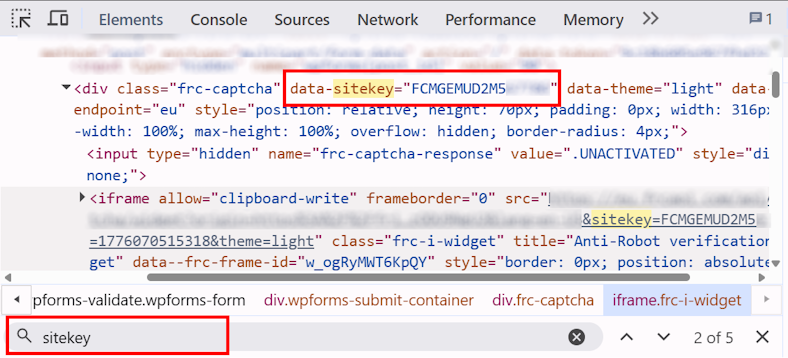
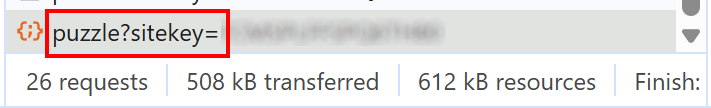

import Tabs from '@theme/Tabs';
import TabItem from '@theme/TabItem';
import ParamItem from '@theme/ParamItem';
import MethodItem from '@theme/MethodItem';
import ImageWrap from '@theme/ImageWrap';
import ImagesLayout from '@theme/ImagesLayout';
import MethodDescription from '@theme/MethodDescription'
import PriceBlock from '@theme/PriceBlock';
import PriceBlockWrap from '@theme/PriceBlockWrap';
import { ArticleHead } from '../../../../../src/theme/ArticleHead';

<ArticleHead slug="captchas/friendly-task" />

# Friendly Captcha

<PriceBlockWrap>
  <PriceBlock title="Friendly Captcha" captchaId="friendly"/>
</PriceBlockWrap>


:::warning **注意！**
CapMonster Cloud 默认通过内置代理工作——这些代理已包含在费用内。仅当网站不接受令牌或对内置服务的访问受限时，才需要指定您自己的代理。

如果代理按 IP 授权，请将地址 **65.21.190.34** 加入白名单。
:::

## 请求参数

<TabItem value="proxy" label="CustomTask (使用代理时)" className="bordered-panel">

  <ParamItem title="type" required type="string" />
  **CustomTask**

  ---

  <ParamItem title="class" required type="string" />
  **friendly**

   --- 

  <ParamItem title="websiteURL" required type="string" />
  包含验证码的页面完整 URL。

  ---

  <ParamItem title="websiteKey" required type="string" />
  Friendly Captcha 密钥（*请参阅章节 [如何查找 sitekey 值](#如何查找-sitekey-值)*）。
  
  ---

  <ParamItem title="apiGetLib (在 metadata 中)" required type="string" />
  JS 文件的链接。请根据验证码版本指定 JS 文件 URL：

* **V1:**
  `apiGetLib` = `https://cdn.jsdelivr.net/npm/friendly-challenge@X.Y.Z/widget.module.min.js`，其中 `X.Y.Z` 是从 `x-frc-client` 响应头中获取的客户端版本。

* **V2:**
  `apiGetLib` = 页面中加载的 `site.min.js` 文件 URL。

*更多信息请参阅章节 [创建任务方法](#创建任务方法) 和 [如何识别 Friendly Captcha 版本](#如何识别-friendly-captcha-版本)。*

  ---

<ParamItem title="userAgent" type="string" />
浏览器的 User-Agent。<br />
**请仅传递来自 Windows 操作系统的最新 UA。目前为**：`userAgentPlaceholder`

---

<ParamItem title="proxyType" required type="string" />
**http** - 常规 HTTP/HTTPS 代理；<br />
**https** - 当 http 不可用时使用（某些自定义代理必填）；<br />
**socks4** - SOCKS4 代理；<br />
**socks5** - SOCKS5 代理。

---

<ParamItem title="proxyAddress" required type="string" />
<p>
代理 IP 地址（IPv4/IPv6）。禁止使用：
- 透明代理
- 本地机器代理
</p>

---

<ParamItem title="proxyPort" required type="integer" />
代理端口

---

<ParamItem title="proxyLogin" required type="string" />
代理登录名

---

<ParamItem title="proxyPassword" required type="string" />
代理密码

</TabItem>
---

## 创建任务方法

使用 `metadata` 中的 `apiGetLib` 参数值，应与 Friendly Captcha 的版本对应。

**例如：**

对于 **V1**
  ```json
  "apiGetLib": "https://cdn.jsdelivr.net/npm/friendly-challenge@0.9.19/widget.module.min.js"
```

对于 **V2**

```json
"apiGetLib": "https://example.com/wp-content/plugins/friendly-captcha/public/vendor/v2/site.min.js?ver=0.1.25"
```

<br />
<Tabs className="full-width-tabs filled-tabs request-tabs" groupId="captcha-type">
  <TabItem value="proxyless" label="CustomTask（无代理）" default className="method-panel">
    <MethodItem>
    ```http
    https://api.capmonster.cloud/createTask
    ```
    </MethodItem>
    <MethodDescription>

  **请求**
  ```json
  {
    "clientKey": "API_KEY",
    "task": {
      "type": "CustomTask",
      "class": "friendly",
      "websiteKey": "FFMGEMAD2K3JJ35P",
      "websiteURL": "https://example.com",
      "userAgent": "userAgentPlaceholder",
      "metadata": {
		"apiGetLib":"https://cdn.jsdelivr.net/npm/friendly-challenge@0.9.19/widget.module.min.js"
	}
}
  ```

  **响应**
  ```json
  {
    "errorId": 0,
    "taskId": 407533077
  }
  ```
</MethodDescription>

  </TabItem>

<TabItem value="proxy" label="CustomTask（使用代理）" className="method-panel">
<MethodItem>
  ```http
  https://api.capmonster.cloud/createTask
  ```
</MethodItem>
<MethodDescription>
  
  **请求**
  ```json
  {
    "clientKey": "API_KEY",
    "task": {
      "type": "CustomTask",
      "class": "friendly",
      "websiteKey": "FFMGEMAD2K3JJ35P",
      "websiteURL": "https://example.com",
      "userAgent": "userAgentPlaceholder",
      "metadata": {
		"apiGetLib":"https://cdn.jsdelivr.net/npm/friendly-challenge@0.9.19/widget.module.min.js"
	},
      "proxyType": "http",
      "proxyAddress": "8.8.8.8",
      "proxyPort": 8080,
      "proxyLogin": "proxyLoginHere",
      "proxyPassword": "proxyPasswordHere"
    }
  }
  ```

  **响应**
  ```json
  {
    "errorId": 0,
    "taskId": 407533077
  }
  ```
</MethodDescription>

  </TabItem>
</Tabs>

## 获取任务结果方法

使用 [getTaskResult](../api/methods/get-task-result.mdx) 方法获取 Friendly Captcha 的解决结果。  
响应中的令牌格式取决于网站上使用的验证码版本：

**V1**: `"56a3727f1f9ae4f339c8e512913cd6f8.ac7W...MAKgAAAN+MAQArAAAAjxMBACwAAAB5QgAA.AgAB"`<br />

**V2**: `"AQQA.8Q2TbgK_..._pknXDweJjKT2qwmroOhHcZsU4dHyu-jaGIPx9k7432p_num13buuTu6n4lVA=="`

<TabItem value="proxyless" label="CustomTask（无代理）" default className="method-panel-full">
  <MethodItem>
      ```http
    https://api.capmonster.cloud/getTaskResult
    ```
  </MethodItem>
  <MethodDescription>

  **请求**
  ```json
  {
    "clientKey": "API_KEY",
    "taskId": 407533077
  }
```

**响应**

```json
{
  "errorId": 0,
  "errorCode": null,
  "errorDescription": null,
  "status": "ready",
  "solution": {
    "data": {
      "token": "56a3727f1f9ae4f339c8e512913cd6f8.ac7W...MAKgAAAN+MAQArAAAAjxMBACwAAAB5QgAA.AgAB"
    }
  }
}
```

  </MethodDescription>
</TabItem>
<br />
获取到的 token 值需要填入对应字段：

| 版本 | token 填充值字段                  |
| -- | ---------------------------- |
| V1 | `input.frc-captcha-solution` |
| V2 | `input.frc-captcha-response` |

## 如何查找 sitekey 值

* 对于 **V1**，可以在网络请求中通过关键词 `sitekey` 或 `puzzle?sitekey=` 进行过滤查找：


---

* 对于 **V2**，可以在网络请求或页面代码元素中搜索关键词 `sitekey` 或 `data-sitekey`：



## 如何识别 Friendly Captcha 版本

Friendly Captcha 主要有两种版本：**V1** 和 **V2**。
可以通过加载的脚本或网络请求来判断版本。

### Friendly Captcha V1

如果页面中存在以下脚本，则使用 V1：

```javascript
widget.min.js
widget.module.min.js
```

或在网络请求中出现 `puzzle?sitekey=`：



**要确定客户端版本，需要：**

1. 打开找到的 `puzzle?sitekey=...` 请求，并进入 **Headers → Request Headers**

2. 查找 `x-frc-client` 请求头：


该请求头包含网站使用的 Friendly Captcha 客户端版本：

```
x-frc-client: <version>
```

**示例值**：*0.9.14, 0.9.19* 等。

3. 确定 `x-frc-client` 版本后，将其填入 CDN 链接：

```
https://cdn.jsdelivr.net/npm/friendly-challenge@<VERSION>/widget.module.min.js
```

例如，如果 `x-frc-client = 0.9.14`，则使用：

```
https://cdn.jsdelivr.net/npm/friendly-challenge@0.9.14/widget.module.min.js
```

该链接需要在创建任务时传入 `apiGetLib` 参数。

---

### Friendly Captcha V2

如果网站加载了 `site.min.js`，则表示使用的是 **Friendly Captcha V2**。


在创建任务时，将 `site.min.js` 的链接传入 `apiGetLib` 参数：


### Friendly Captcha 版本自动识别

您可以在浏览器中使用以下方案来自动化识别 Friendly Captcha 的版本：

<details>
      <summary>显示代码</summary>
```javascript
(async function detectFriendlyCaptcha() {
  const result = {
    version: null,      
    clientVersion: null,
    indicators: [],
    siteMinJsLinks: []
  };

  const scripts = Array.from(document.scripts).map(s => s.src);

  for (const src of scripts) {
    if (!src) continue;

    if (src.includes("site.min.js")) {
      result.version = "V2";
      result.indicators.push("Found site.min.js");
      result.siteMinJsLinks.push(src);
    }

    if (src.includes("widget.min.js") || src.includes("widget.module.min.js")) {
      result.version = "V1";
      result.indicators.push("Found widget script");
    }

    const match = src.match(/friendly-challenge@(\d+\.\d+\.\d+)/);
    if (match) {
      result.clientVersion = match[1];
      result.version = "V1";
      result.indicators.push("Detected CDN version");
    }
  }

  const puzzleElements = document.querySelectorAll(
    '[id*="friendly"], [class*="frc"], iframe[src*="friendly"]'
  );

  if (puzzleElements.length > 0) {
    result.indicators.push("Found captcha DOM elements");
    if (!result.version) result.version = "V1";
  }

  const resources = performance.getEntriesByType("resource");

  for (const r of resources) {
    if (r.name.includes("puzzle?sitekey")) {
      result.version = "V1";
      result.indicators.push("Found puzzle?sitekey request");
    }
  }

  if (!result.version) {
    result.version = "Unknown (not detected)";
  }

  console.log("FriendlyCaptcha Detection Result:");
  console.log(result);

  return result;
})();
```
</details>