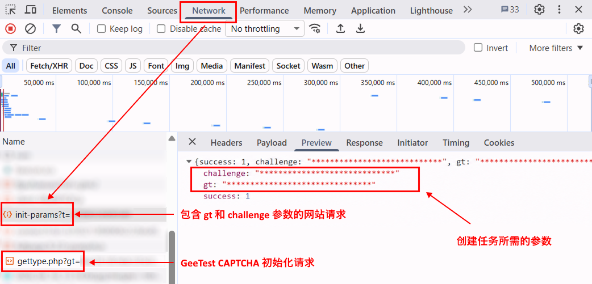

import Tabs from '@theme/Tabs';
import TabItem from '@theme/TabItem';
import ParamItem from '@theme/ParamItem';
import MethodItem from '@theme/MethodItem';
import ImageWrap from '@theme/ImageWrap';
import ImagesLayout from '@theme/ImagesLayout';
import MethodDescription from '@theme/MethodDescription'
import PriceBlock from '../../../../../src/theme/PriceBlock';
import PriceBlockWrap from '@theme/PriceBlockWrap';
import { ArticleHead } from '../../../../../src/theme/ArticleHead';

<ArticleHead slug="captchas/geetest-task" />

# GeeTest

<PriceBlockWrap>
  <PriceBlock title="GeeTestTask" captchaId="geetest"/>
</PriceBlockWrap>

 

:::warning **注意！**
* CapMonster Cloud 默认通过内置代理工作——这些代理已包含在费用内。仅当网站不接受令牌或对内置服务的访问受限时，才需要指定您自己的代理。

* 暂不支持带有 IP 授权的代理。
:::

## 对象结构

:::info

对于 **GeeTest V3**：
- `gt`、`challenge` 和 `geetestApiServerSubdomain` 参数可以在 GeeTest 初始化的 JavaScript 代码中传递，例如在 `initGeetest` 函数中。

- 某些参数也可能出现在页面的 HTML 代码或网络请求中。对于 GeeTest V3，必须在 CAPTCHA 初始化之前获取 `challenge` 值。


对于 **GeeTest V4**，`gt` 参数中传递的是 `captcha_id` 的值。


::: 

<br />

## <span style={{fontSize: '2.25rem'}}>GeeTest V3</span>

### <span style={{fontSize: '1.5rem'}}>任务示例</span>

以下是 CapMonster Cloud 当前支持的 GeeTest V3 任务类型示例：

<ImagesLayout gap="16px" columns={4}>
  <ImageWrap title="Intelligent mode"></ImageWrap>
  <ImageWrap title="Slide CAPTCHA"></ImageWrap>
  <ImageWrap title="Icon CAPTCHA"></ImageWrap>
  <ImageWrap title="Space CAPTCHA"></ImageWrap>
</ImagesLayout>

### <span style={{fontSize: '1.5rem'}}>请求参数</span>

<br />
<span style={{ fontSize: "15px", fontWeight: 700 }}>
> 重要提示：GeeTest V3 中的 `challenge` 参数是动态的。  
> 请在创建每个任务之前、且在页面上的 CAPTCHA 初始化之前获取新的值。CAPTCHA 加载后，之前获取的 `challenge` 将失效。
</span>
<br />

  <div className="bordered-panel">
    <ParamItem title="type" required type="string" />
    **GeeTestTask**

    ---

    <ParamItem title="websiteURL" required type="string" />
    <p>初始化验证码的页面地址。正确的 URL 通常会在向 `https://api-na.geetest.com/gettype.php` 发起请求时，通过 `Referer` 请求头传递。例如，您可能位于 `https://example.com#login` 页面，但实际上验证码的初始化是在 `https://example.com` 页面上执行的。</p>

    ---

    <ParamItem title="gt" required type="string" />
    域名的 GeeTest 标识密钥 `gt`。这是一个静态值，很少更新。

    ---

    <ParamItem title="challenge" required="required only for V3" type="string" />
    动态密钥。创建每个任务之前，都必须获取新的 `challenge` 值。<br />

    **重要：** 请在页面上的 CAPTCHA 初始化之前获取 `challenge`。<br />

如果 CAPTCHA 已经加载，获取到的值将失效。向 CapMonster Cloud API 发送该值时，将返回[错误](../api/api-errors.mdx) `ERROR_INVALID_TASK`，并提示参数无效。<br />

    ---

    <ParamItem title="version" required type="integer"/>
    3

    ---

    <ParamItem title="geetestApiServerSubdomain" type="string" />
    Geetest API 服务器的子域名（必须不同于 `api.geetest.com`）。 
	<br />可选参数。某些网站可能需要。

    ---

    <ParamItem title="geetestGetLib" type="string" />
    用于在页面上显示验证码的脚本路径。 
	<br />可选参数。某些网站可能需要。 
	<br />请以字符串形式发送 JSON。

    ---

    <ParamItem title="userAgent" type="string" />
    浏览器 User-Agent。请使用 CapMonster Cloud 当前支持的值：`userAgentPlaceholder`<br />

可通过以下地址获取最新值：[https://capmonster.cloud/api/useragent/actual](https://capmonster.cloud/api/useragent/actual)。

    ---

    <ParamItem title="proxyType" type="string" />
    **http** - 常规的 HTTP/HTTPS 代理；<br /> **https** - 仅当 "http" 不起作用时尝试此选项（某些自定义代理需要）；<br /> **socks4** - socks4 代理；<br /> **socks5** - socks5 代理。

    ---

    <ParamItem title="proxyAddress" type="string" />
<p>
  代理IPv4/IPv6地址。禁止使用：
    - 透明代理（客户端IP可见）；
    - 本地机器代理。
</p>

---

    ---

    <ParamItem title="proxyPort" type="integer" />
    代理端口。

    ---

    <ParamItem title="proxyLogin" type="string" />
    代理服务器登录名。

    ---

    <ParamItem title="proxyPassword" type="string" />
    代理服务器密码。
  </div>


### <span style={{fontSize: '1.5rem'}}>创建任务</span>

<Tabs className="full-width-tabs filled-tabs request-tabs" groupId="captcha-type">
	<TabItem value="proxyless" label="GeeTestTask（无代理）" default className="method-panel">
		<MethodItem>
			```http
			https://api.capmonster.cloud/createTask
			```
		</MethodItem>
		<MethodDescription>
			**请求示例**
```json
{
  "clientKey": "API_KEY",
  "task": {
    "type": "GeeTestTask",
    "websiteURL": "https://yourwebsite.com/page-with-geetest",
    "gt": "gt-value",
    "challenge": "challenge-value",
    "version": 3,
    "geetestApiServerSubdomain": "example.api.geetest.com"

  }
}
```
			**响应示例**
			```json
			{
			  "errorId":0,
			  "taskId":407533072
			}
			```
		</MethodDescription>
	</TabItem>
	
	<TabItem value="proxy" label="GeeTestTask（使用代理时）" className="method-panel">
		<MethodItem>
			```http
			https://api.capmonster.cloud/createTask
			```
		</MethodItem>
		<MethodDescription>
			**请求示例**
```json 
{
  "clientKey": "API_KEY",
  "task": {
    "type": "GeeTestTask",
    "websiteURL": "https://yourwebsite.com/page-with-geetest",
    "gt": "gt-value",
    "challenge": "challenge-value",
    "version": 3,
    "geetestApiServerSubdomain": "example.api.geetest.com",
    "userAgent": "userAgentPlaceholder",
    "proxyType": "your-proxy-type",
    "proxyAddress": "your-proxy-address",
    "proxyPort": 1234,
    "proxyLogin": "your-proxy-login",
    "proxyPassword": "your-proxy-password"
  }
}
```
			**响应示例**
			```json
			{
			  "errorId":0,
			  "taskId":407533072
			}
			```
		</MethodDescription>
	</TabItem>  
</Tabs>


使用 [getTaskResult](../api/methods/get-task-result.mdx) 方法获取 GeeTest 识别结果。根据系统负载，您将在 10 到 30 秒内收到响应。

### <span style={{fontSize: '1.5rem'}}>Get task result</span>

<div className="method-panel-full">
	<MethodItem>
		```http
		https://api.capmonster.cloud/getTaskResult
		```
	</MethodItem>
	<MethodDescription>
		**请求示例**
		```json
		{
		  "clientKey":"API_KEY",
		  "taskId": 407533072
		}
		```
		**响应示例**
```json
{
  "errorId": 0,
  "status": "ready",
  "solution": {
    "challenge": "0f759dd1ea6c4wc76cedc2991039ca4f23",
    "validate": "6275e26419211d1f526e674d97110e15",
    "seccode": "510cd9735583edcb158601067195a5eb|jordan"
  }
}
```
	</MethodDescription>
</div>

<br />

<table><tr>
<th><b>属性</b></th><th><b>类型</b></th><th><b>描述</b></th>
</tr>
<tr><td>challenge</td><td>String</td><td rowspan="3">在目标网站上提交表单时需要全部三个参数。</td></tr>
<tr><td>validate</td><td>String</td></tr>
<tr><td>seccode</td><td>String</td></tr>
</table>

### <span style={{fontSize: '1.5rem'}}>如何查找创建任务所需的所有参数</span>

#### <span style={{fontSize: '1.2rem'}}>手动方式</span>

1. 在浏览器中打开显示 GeeTest V3 的网站。
2. 打开开发者工具（**DevTools**），然后切换到 **Network** 选项卡。
3. 重新加载页面，以记录从页面加载开始时产生的网络请求。
4. 找到发送到目标网站服务器的请求，其响应中包含 GeeTest 参数，包括 `gt` 和 `challenge`。

必须在 **CAPTCHA 初始化之前** 获取 `challenge` 值，也就是在发送如下 GeeTest 请求之前：

```text
https://api.geetest.com/gettype.php?gt=...
```

在 CAPTCHA 初始化之前，网站可能会先从自己的服务器获取 GeeTest 参数。要找到当前有效的 `challenge` 值，请检查发送到目标网站域名的请求及其响应。



在某些情况下，网站会对从自身服务器获取的数据进行加密，因此 `challenge` 值可能不会以明文形式出现在响应中。此时，可以从 GeeTest 请求参数中获取该值，例如：

```text
https://api.geetest.com/get.php?gt=...
```

和/或：

```text
https://api.geevisit.com/ajax.php?gt=...
```


:::warning 重要：
使用此方式时，需要从请求中获取参数，并在请求发送之前 **阻止对 GeeTest API 的请求**。如果请求已经发送并且 CAPTCHA 已加载，则该请求中使用的 `challenge` 值将失效。
:::

获取当前有效的 `gt` 和 `challenge` 值后，使用它们在 CapMonster Cloud 中创建 GeeTest V3 任务。
<br />

#### <span style={{fontSize: '1.2rem'}}>自动方式</span>

GeeTest V3 参数可以通过两种方式自动获取。请根据目标网站的实现方式选择合适的方法。

**从网站服务器响应中获取参数**

如果网站服务器以明文形式返回 `gt` 和 `challenge`，请在创建任务之前再次发送相应请求。

例如：

```text
https://example.com/api/v1/captcha/gee-test/init-params
```

<Tabs className="full-width-tabs filled-tabs request-tabs">
  <TabItem value="js" label="JavaScript" default className="method-panel">
    <details>
      <summary>显示代码（浏览器内）</summary>

```js
async function getGeeTestV3Params() {
  // 将 URL 替换为您网站实际使用的请求，
  // 该请求的响应中应返回 gt 和 challenge
  const response = await fetch(
    "https://example.com/api/v1/captcha/gee-test/init-params"
  );

  if (!response.ok) {
    throw new Error(`Request failed: ${response.status}`);
  }

  const data = await response.json();

  const gt = data.gt;
  const challenge = data.challenge;

  if (!gt || !challenge) {
    throw new Error("无法获取 gt 或 challenge");
  }

  console.log({ gt, challenge });

  return { gt, challenge };
}

getGeeTestV3Params().catch(console.error);
```

    </details>

    <details>
      <summary>显示代码（Node.js）</summary>

```js
async function getGeeTestV3Params() {
  // 将 URL 替换为您网站实际使用的请求，
  // 该请求的响应中应返回 gt 和 challenge
  const response = await fetch(
    "https://example.com/api/v1/captcha/gee-test/init-params"
  );

  if (!response.ok) {
    throw new Error(`Request failed: ${response.status}`);
  }

  const data = await response.json();

  const gt = data.gt;
  const challenge = data.challenge;

  if (!gt || !challenge) {
    throw new Error("Missing gt or challenge");
  }

  console.log({ gt, challenge });

  return { gt, challenge };
}

getGeeTestV3Params().catch(console.error);
```

    </details>
  </TabItem>

  <TabItem value="python" label="Python" className="method-panel">
    <details>
      <summary>显示代码</summary>

```python
import requests


def get_geetest_v3_params():
    # 将 URL 替换为您网站实际使用的请求，
    # 该请求的响应中应返回 gt 和 challenge
    response = requests.get(
        "https://example.com/api/v1/captcha/gee-test/init-params"
    )
    response.raise_for_status()

    data = response.json()

    gt = data.get("gt")
    challenge = data.get("challenge")

    if not gt or not challenge:
        raise ValueError("无法获取 gt 或 challenge")

    print({
        "gt": gt,
        "challenge": challenge,
    })

    return gt, challenge


get_geetest_v3_params()
```

    </details>
  </TabItem>

  <TabItem value="csharp" label="C#" className="method-panel">
    <details>
      <summary>显示代码</summary>

```csharp
using System;
using System.Net.Http;
using System.Threading.Tasks;
using Newtonsoft.Json.Linq;

class Program
{
    static async Task GetGeeTestV3Params()
    {
        using var client = new HttpClient();

        // 将 URL 替换为您网站实际使用的请求，
        // 该请求的响应中应返回 gt 和 challenge
        var response = await client.GetAsync(
            "https://example.com/api/v1/captcha/gee-test/init-params"
        );

        response.EnsureSuccessStatusCode();

        var content = await response.Content.ReadAsStringAsync();
        var data = JObject.Parse(content);

        var gt = data["gt"]?.ToString();
        var challenge = data["challenge"]?.ToString();

        if (string.IsNullOrEmpty(gt) || string.IsNullOrEmpty(challenge))
        {
            throw new Exception("无法获取 gt 或 challenge");
        }

        Console.WriteLine($"GT: {gt}");
        Console.WriteLine($"Challenge: {challenge}");
    }

    static async Task Main()
    {
        await GetGeeTestV3Params();
    }
}
```

    </details>
  </TabItem>
</Tabs>
<br />

**从 GeeTest 请求中获取参数**

如果网站服务器响应中的 `challenge` 值不是以明文形式提供，请从相应的 GeeTest 请求中获取该值：

```text
https://api.geetest.com/get.php?gt=...&challenge=...
```

或：

```text
https://api.geevisit.com/ajax.php?gt=...&challenge=...
```

从查询参数中获取 `gt` 和 `challenge`，并在请求发送之前阻止该请求。

<Tabs className="full-width-tabs filled-tabs request-tabs">
  <TabItem value="js" label="JavaScript / TypeScript" default className="method-panel">
    <details>
      <summary>显示代码（Playwright）</summary>

```js
import { chromium } from "playwright";

async function getGeeTestV3Params(pageUrl) {
  const browser = await chromium.launch({ headless: false });
  const context = await browser.newContext();

  let params = null;

  await context.route("**/*", async (route) => {
    const requestUrl = route.request().url();

    if (
      requestUrl.includes("api.geetest.com/get.php") ||
      requestUrl.includes("api.geevisit.com/ajax.php")
    ) {
      const url = new URL(requestUrl);

      const gt = url.searchParams.get("gt");
      const challenge = url.searchParams.get("challenge");

      if (gt && challenge && !params) {
        params = { gt, challenge };
        console.log(params);
      }

      await route.abort();
      return;
    }

    await route.continue();
  });

  const page = await context.newPage();
  await page.goto(pageUrl);

  await page.waitForTimeout(5000);
  await browser.close();

  if (!params) {
    throw new Error("无法获取 gt 和 challenge");
  }

  return params;
}

getGeeTestV3Params(
  "https://example.com/page-with-geetest"
).catch(console.error);
```

    </details>
  </TabItem>

  <TabItem value="python" label="Python" className="method-panel">
    <details>
      <summary>显示代码（Playwright）</summary>

```python
import asyncio
from urllib.parse import urlparse, parse_qs

from playwright.async_api import async_playwright


async def get_geetest_v3_params(page_url):
    params = {}

    async with async_playwright() as p:
        browser = await p.chromium.launch(headless=False)
        context = await browser.new_context()

        async def handle_route(route):
            request_url = route.request.url

            if (
                "api.geetest.com/get.php" in request_url
                or "api.geevisit.com/ajax.php" in request_url
            ):
                query = parse_qs(urlparse(request_url).query)

                gt = query.get("gt", [None])[0]
                challenge = query.get("challenge", [None])[0]

                if gt and challenge and not params:
                    params["gt"] = gt
                    params["challenge"] = challenge
                    print(params)

                await route.abort()
                return

            await route.continue_()

        await context.route("**/*", handle_route)

        page = await context.new_page()
        await page.goto(page_url)

        await asyncio.sleep(5)
        await browser.close()

    if not params:
        raise RuntimeError("无法获取 gt 和 challenge")

    return params


asyncio.run(
    get_geetest_v3_params(
        "https://example.com/page-with-geetest"
    )
)
```

    </details>
  </TabItem>
</Tabs>

<br />


### <span style={{fontSize: '1.5rem'}}>使用 SDK 库</span>

<Tabs className="full-width-tabs filled-tabs request-tabs" groupId="captcha-type">
  <TabItem value="js" label="JavaScript / TypeScript" default className="method-panel">
  <details>
      <summary>显示代码（浏览器）</summary>
```js
// https://github.com/CapMonsterCloud/capmonster-nodejs-captcha-solver

import {
  CapMonsterCloudClientFactory,
  ClientOptions,
  GeeTestRequest
} from "@zennolab_com/capmonstercloud-client";

document.addEventListener("DOMContentLoaded", async () => {

  const API_KEY = "YOUR_API_KEY"; // 请指定您的 CapMonster Cloud API 密钥

  const client = CapMonsterCloudClientFactory.Create(
    new ClientOptions({ clientKey: API_KEY })
  );

  // 不使用代理的基础示例
  // CapMonster Cloud 会自动使用自己的代理
  let geetestRequest = new GeeTestRequest({
    websiteURL: "https://yourwebsite.com/page-with-geetest",
    gt: "your-gt-value",
    challenge: "your-challenge-value",
    version: 3,
  });

  // 使用您自己的代理的示例
  // 如果您想使用自己的代理，请取消注释此代码块
  /*
  const proxy = {
    proxyType: "https",
    proxyAddress: "123.45.67.89",
    proxyPort: 8080,
    proxyLogin: "username",
    proxyPassword: "password",
  };

  geetestRequest = new GeeTestRequest({
    websiteURL: "https://yourwebsite.com/page-with-geetest",
    gt: "your-gt-value",
    challenge: "your-challenge-value",
    version: 3,
    proxy,
    userAgent: "userAgentPlaceholder",
  });
  */

  // 如有需要，可以检查余额
  const balance = await client.getBalance();
  console.log("Balance:", balance);

  const result = await client.Solve(geetestRequest);
  console.log("Solution:", result.solution);
});
```
</details>

<details>
      <summary>显示代码（Node.js）</summary>
```javascript
// https://github.com/CapMonsterCloud/capmonster-nodejs-captcha-solver

const {
  CapMonsterCloudClientFactory,
  ClientOptions,
  GeeTestRequest,
} = require("@zennolab_com/capmonstercloud-client");

const API_KEY = "YOUR_API_KEY"; // 请指定您的 CapMonster Cloud API 密钥

async function solveGeeTest() {
  const client = CapMonsterCloudClientFactory.Create(
    new ClientOptions({ clientKey: API_KEY }),
  );

  // 不使用代理的基础示例
  // CapMonster Cloud 会自动使用自己的代理
  let geetestRequest = new GeeTestRequest({
    websiteURL: "https://yourwebsite.com/page-with-geetest",
    gt: "your-gt-value",
    challenge: "your-challenge-value",
    version: 3,
  });

  // 使用您自己的代理的示例
  // 如果您想使用自己的代理，请取消注释此代码块
  /*
  const proxy = {
    proxyType: "https",
    proxyAddress: "123.45.67.89",
    proxyPort: 8080,
    proxyLogin: "username",
    proxyPassword: "password",
  };

  geetestRequest = new GeeTestRequest({
    websiteURL: "https://yourwebsite.com/page-with-geetest",
    gt: "your-gt-value",
    challenge: "your-challenge-value",
    version: 3,
    proxy,
    userAgent: "userAgentPlaceholder",
  });
  */

  // 如有需要，可以检查余额
  const balance = await client.getBalance();
  console.log("Balance:", balance);

  const result = await client.Solve(geetestRequest);
  console.log("Solution:", result.solution);
}

solveGeeTest().catch(console.error);
```
</details>
  </TabItem>

  <TabItem value="python" label="Python" className="method-panel">
  <details>
      <summary>显示代码</summary>
```python
# https://github.com/CapMonsterCloud/capmonster-python-captcha-solver

import asyncio

from capmonstercloudclient import CapMonsterClient, ClientOptions
from capmonstercloudclient.requests import GeetestRequest
# 如果您计划使用自己的代理，请导入 ProxyInfo
from capmonstercloudclient.requests.proxy_info import ProxyInfo

API_KEY = "YOUR_API_KEY"  # 请指定您的 CapMonster Cloud API 密钥


async def solve_geetest():
    client = CapMonsterClient(
        options=ClientOptions(api_key=API_KEY)
    )

    # 不使用代理的基础示例
    # CapMonster Cloud 会自动使用自己的代理
    geetest_request = GeetestRequest(
        websiteUrl="https://yourwebsite.com/page-with-geetest",
        gt="your-gt-value",
        challenge="your-challenge-value",
        version=3,
    )

    # 使用您自己的代理的示例
    # 如果您想使用自己的代理，请取消注释此代码块
    """
    proxy = ProxyInfo(
        proxyType="https",
        proxyAddress="123.45.67.89",
        proxyPort=8080,
        proxyLogin="username",
        proxyPassword="password",
    )

    geetest_request = GeetestRequest(
        websiteUrl="https://yourwebsite.com/page-with-geetest",
        gt="your-gt-value",
        challenge="your-challenge-value",
        version=3,
        userAgent="userAgentPlaceholder",
        proxy=proxy,
    )
    """

    # 如有需要，可以检查余额
    balance = await client.get_balance()
    print("Balance:", balance)

    result = await client.solve_captcha(geetest_request)
    print("Solution:", result)


asyncio.run(solve_geetest())
```
    </details>
  </TabItem>

  <TabItem value="csharp" label="C#" className="method-panel">
  <details>
      <summary>显示代码</summary>
```csharp
// https://github.com/CapMonsterCloud/capmonster-dotnet-captcha-solver

using System;
using System.Threading.Tasks;
using Zennolab.CapMonsterCloud;
using Zennolab.CapMonsterCloud.Requests;

class Program
{
    static async Task Main(string[] args)
    {
        // 请指定您的 CapMonster Cloud API 密钥
        var clientOptions = new ClientOptions
        {
            ClientKey = "YOUR_API_KEY"
        };

        var cmCloudClient = CapMonsterCloudClientFactory.Create(clientOptions);

        // 不使用代理的基础示例
        // CapMonster Cloud 会自动使用自己的代理
        var geetestRequest = new GeeTestRequest
        {
            WebsiteUrl = "https://yourwebsite.com/page-with-geetest",
            Gt = "your-gt-value",
            Challenge = "your-challenge-value",
            Version = 3
        };

        // 使用您自己的代理的示例
        // 如果您想使用自己的代理，请取消注释此代码块
        /*
        geetestRequest = new GeeTestRequest
        {
            WebsiteUrl = "https://yourwebsite.com/page-with-geetest",
            Gt = "your-gt-value",
            Challenge = "your-challenge-value",
            Version = 3,
            UserAgent = "userAgentPlaceholder",

            Proxy = new ProxyContainer(
                "123.45.67.89",
                8080,
                ProxyType.Http,
                "username",
                "password"
            )
        };
        */

        // 如有需要，可以检查余额
        var balance = await cmCloudClient.GetBalanceAsync();
        Console.WriteLine("Balance: " + balance);

        var geetestResult = await cmCloudClient.SolveAsync(geetestRequest);

        Console.WriteLine($"""
Solution:
  Challenge: {geetestResult.Solution.Challenge}
  Validate:  {geetestResult.Solution.Validate}
  SecCode:   {geetestResult.Solution.SecCode}
""");
    }
}
```
    </details>
  </TabItem>  
</Tabs>


<br />

## <span style={{fontSize: '2.25rem'}}>GeeTest V4</span>

### <span style={{fontSize: '1.5rem'}}>可能的验证码变体</span>


### <span style={{fontSize: '1.5rem'}}>请求参数</span>

  <div className="bordered-panel">
    <ParamItem title="type" required type="string" />
    **GeeTestTask**

    ---

    <ParamItem title="websiteURL" required type="string" />
    解决验证码的页面地址。

    ---

    <ParamItem title="gt" required type="string" />
    域名的 GeeTest 标识密钥——参数 `captcha_id`。

    ---

    <ParamItem title="version" required type="integer"/>
    4

    ---

    <ParamItem title="geetestApiServerSubdomain" type="string" />
    Geetest API 服务器的子域名（必须不同于 `api.geetest.com`）。 <br />
	可选参数。某些网站可能需要。

    ---

    <ParamItem title="geetestGetLib" type="string" />
    用于在页面上显示验证码的脚本路径。 <br /> 
	可选参数。某些网站可能需要。	<br />
	请以字符串形式发送 JSON。
	
    ---

    <ParamItem title="initParameters" type="object" />
    版本 4 的附加参数，与 "riskType" 一起使用（例如 `slide`）。

    ---

    <ParamItem title="userAgent" type="string" />
    浏览器 User-Agent。请使用 CapMonster Cloud 当前支持的值：`userAgentPlaceholder`<br />

可通过以下地址获取最新值：[https://capmonster.cloud/api/useragent/actual](https://capmonster.cloud/api/useragent/actual)。

    ---

    <ParamItem title="proxyType" type="string" />
    **http** - 常规的 HTTP/HTTPS 代理；<br /> **https** - 仅当 "http" 不起作用时尝试此选项（某些自定义代理需要）；<br /> **socks4** - socks4 代理；<br /> **socks5** - socks5 代理。

    ---

    <ParamItem title="proxyAddress" type="string" />
    <p>IPv4/IPv6 代理 IP 地址。不允许使用：</p><p>- 使用主机名；</p><p>- 使用透明代理（可以看到客户端 IP）；</p><p>- 使用本地机器上的代理。</p>

    ---

    <ParamItem title="proxyPort" type="integer" />
    代理端口。

    ---

    <ParamItem title="proxyLogin" type="string" />
    代理服务器登录名。

    ---

    <ParamItem title="proxyPassword" type="string" />
    代理服务器密码。

  </div>

### <span style={{fontSize: '1.5rem'}}>Create task method</span>


<Tabs className="full-width-tabs filled-tabs request-tabs" groupId="captcha-type">
	<TabItem value="proxyless" label="GeeTestTask（无代理）" default className="method-panel">
		<MethodItem>
			```http
			https://api.capmonster.cloud/createTask
			```
		</MethodItem>
		<MethodDescription>
			**请求示例**
```json
{
  "clientKey": "API_KEY",
  "task": {
    "type": "GeeTestTask",
    "websiteURL": "https://yourwebsite.com/page-with-geetest",
    "gt": "captcha-id-value",
    "version": 4,
    "initParameters": {
      "riskType": "risk-type-value"
    }
  }
}
```
			**响应示例**
			```json
			{
			  "errorId":0,
			  "taskId":407533072
			}
			```
		</MethodDescription>
	</TabItem>

	<TabItem value="proxy" label="GeeTestTask (using proxy)" className="method-panel">
		<MethodItem>
			```http
			https://api.capmonster.cloud/createTask
			```
		</MethodItem>
		<MethodDescription>
			**请求示例**
  ```json
  {
    "clientKey": "API_KEY",
    "task": {
      "type": "GeeTestTask",
      "websiteURL": "https://yourwebsite.com/page-with-geetest",
      "gt": "captcha-id-value",
      "version": 4,
      "initParameters": {
        "riskType": "risk-type-value"
      },
      "proxyType": "your-proxy-type",
      "proxyAddress": "your-proxy-address",
      "proxyPort": 1234,
      "proxyLogin": "your-proxy-login",
      "proxyPassword": "your-proxy-password",
      "userAgent": "userAgentPlaceholder"
    }
  }
  ```
			**响应示例**
			```json
			{
			  "errorId":0,
			  "taskId":407533072
			}
			```
		</MethodDescription>
	</TabItem>
  
</Tabs>


使用 [getTaskResult](../api/methods/get-task-result.mdx) 方法获取 GeeTest 识别结果。根据系统负载，您将在 10 到 30 秒内收到响应。

### <span style={{fontSize: '1.5rem'}}>获取任务结果方法</span>

<div className="method-panel-full">
	<MethodItem>
		```http
		https://api.capmonster.cloud/getTaskResult
		```
	</MethodItem>
	<MethodDescription>
		**请求示例**
		```json
		{
		  "clientKey":"API_KEY",
		  "taskId": 407533072
		}
		```
		**响应示例**
```json
{
  "errorId": 0,
  "status": "ready",
  "solution": {
    "captcha_id": "f5c2ad5a8a3cf37192d8b9c039950f79",
    "lot_number": "bcb2c6ce2f8e4e9da74f2c1fa63bd713",
    "pass_token": "edc7a17716535a5ae624ef4707cb6e7e478dc557608b068d202682c8297695cf",
    "gen_time": "1683794919",
    "captcha_output": "XwmTZEJCJEnRIJBlvtEAZ662T...[cut]...SQ3fX-MyoYOVDMDXWSRQig56"
  }
}
```
	</MethodDescription>
</div>

<br />

<table>
<tr>
<th><b>属性</b></th><th><b>类型</b></th><th><b>描述</b></th>
</tr>
<tr>
<td>captcha_id</td><td>String</td><td rowspan="5">在目标网站提交表单时，这五个参数都是必需的。<br />input[name=captcha\_id]<br />input[name=lot\_number]<br />input[name=pass\_token]<br />input[name=gen\_time]<br />input[name=captcha\_output]</td>
</tr>
<tr><td>lot_number</td><td>String</td></tr>
<tr><td>pass_token</td><td>String</td></tr>
<tr><td>gen_time</td><td>String</td></tr>
<tr><td>captcha_output</td><td>String</td></tr>
</table>

### 如何查找任务创建所需的所有参数

#### 手动方式

1. 在浏览器中打开显示验证码的网站。
2. 打开开发者工具（DevTools），切换到 **Network** 选项卡。
3. 刷新页面（F5），以捕获所有网络请求。
4. 在搜索框（Filter）中输入 `load` 或 `captcha`，以快速找到所需请求。
5. 找到类似 `load?callback=...` 的请求 —— 通常其中包含验证码参数。
6. 点击该请求，并打开 **Payload** 选项卡以查看所需数据。


### 自动方法

一种方便的自动化获取所有必要参数的方式。
某些参数每次页面加载时都会重新生成，因此需要通过浏览器（普通或无头模式，如使用**Playwright**）提取它们。
由于动态参数值的有效期很短，获取后必须立即解决验证码。

:::warning **重要提示！**
提供的代码片段是用于熟悉参数提取的基本示例。具体实现将取决于验证码页面、其结构及使用的HTML元素/选择器。
:::

<Tabs className="full-width-tabs filled-tabs request-tabs">
  <TabItem value="js" label="JavaScript" default className="method-panel">
    <details>
      <summary>显示代码（浏览器中运行）</summary>

```js
(function() {
  function getQueryParams(url) {
    const params = new URLSearchParams(new URL(url).search);
    const captchaId = params.get('captcha_id');
    const riskType = params.get('risk_type');
    return { captchaId, riskType };
  }

  const observer = new PerformanceObserver((list) => {
    const entries = list.getEntriesByType('resource');
    entries.forEach((entry) => {
      if (entry.name.includes('https://gcaptcha4.geetest.com/load?')) {
        const { captchaId, riskType } = getQueryParams(entry.name);
        if (captchaId) {
          console.log('GeeTest v4 detected (via PerformanceObserver):');
          console.log({ captchaId, riskType });
        }
      }
    });
  });

  observer.observe({ type: 'resource', buffered: true });
})();
  ```
    </details>

    <details>
      <summary>显示代码（Node.js）</summary>

```js
import { chromium } from "playwright";

async function detectGeeTestV4(pageUrl) {
  const result = { version: null, data: {} };

  const browser = await chromium.launch({ headless: false });
  const context = await browser.newContext();
  const page = await context.newPage();

  page.on("response", async (response) => {
    const url = response.url();

    if (url.includes("https://gcaptcha4.geetest.com/load?")) {
      const urlParams = new URLSearchParams(url.split("?")[1]);
      const captchaId = urlParams.get("captcha_id");
      const riskType = urlParams.get("risk_type");

      if (captchaId && !result.version) {
        result.version = "v4";
        result.data = {
          captchaId: captchaId,
          riskType: riskType,
        };

        console.log("GeeTest v4 detected:");
        console.log(result.data);
      }
    }
  });

  await page.goto(pageUrl, { waitUntil: "networkidle" });
  await page.waitForTimeout(20000);

  if (!result.version) {
    console.log("error");
  }

  await browser.close();
  return result;
}

detectGeeTestV4("https://example.com").then((result) => {
  console.log(result);
});
```
    </details>
  </TabItem>

  <TabItem value="python" label="Python" className="method-panel">
    <details>
      <summary>显示代码</summary>

```python
import asyncio
from playwright.async_api import async_playwright
from urllib.parse import urlparse, parse_qs

async def detect_geetest_v4(page_url):
    result = {"version": None, "data": {}}

    async with async_playwright() as p:
        browser = await p.chromium.launch(headless=False)
        context = await browser.new_context()
        page = await context.new_page()

        async def on_request(request):
            url = request.url
            if "https://gcaptcha4.geetest.com/load?" in url:
                query = parse_qs(urlparse(url).query)
                captcha_id = query.get("captcha_id", [None])[0]
                risk_type = query.get("risk_type", [None])[0]

                if captcha_id and not result["version"]:
                    result["version"] = "v4"
                    result["data"] = {
                        "captchaId": captcha_id,
                        "riskType": risk_type
                    }

                    print("GeeTest v4 detected:")
                    print(result["data"])

        context.on("request", on_request)

        await page.goto(page_url, wait_until="networkidle")
        await asyncio.sleep(10)

        if not result["version"]:
            print("error")

        await browser.close()
        return result

asyncio.run(detect_geetest_v4("https://www.example.com"))
```
    </details>
  </TabItem>

  <TabItem value="csharp" label="C#" className="method-panel">
    <details>
      <summary>显示代码</summary>

```csharp
using System;
using System.Threading.Tasks;
using Microsoft.Playwright;
using System.Web;

class Program
{
    public static async Task Main(string[] args)
    {
        using var playwright = await Playwright.CreateAsync();
        var browser = await playwright.Chromium.LaunchAsync(new BrowserTypeLaunchOptions
        {
            Headless = false
        });

        var context = await browser.NewContextAsync();
        var page = await context.NewPageAsync();

        bool detected = false;

        page.Request += (_, request) =>
        {
            var url = request.Url;

            if (url.Contains("https://gcaptcha4.geetest.com/load?"))
            {
                var uri = new Uri(url);
                var queryParams = HttpUtility.ParseQueryString(uri.Query);
                var captchaId = queryParams.Get("captcha_id");
                var riskType = queryParams.Get("risk_type");

                if (!string.IsNullOrEmpty(captchaId) && !detected)
                {
                    detected = true;

                    Console.WriteLine("GeeTest v4 detected:");
                    Console.WriteLine($"CaptchaId: {captchaId}");
                    Console.WriteLine($"RiskType: {riskType}");
                }
            }
        };

        await page.GotoAsync("https://www.example.com/", new PageGotoOptions
        {
            WaitUntil = WaitUntilState.NetworkIdle
        });

        await Task.Delay(10000);

        await browser.CloseAsync();
    }
}
```
    </details>
  </TabItem>
</Tabs>

### <span style={{fontSize: '1.5rem'}}>使用 SDK 库</span>

<Tabs className="full-width-tabs filled-tabs request-tabs" groupId="captcha-type">
  <TabItem value="js" label="JavaScript / TypeScript" default className="method-panel">
  <details>
      <summary>显示代码（浏览器）</summary>
```js
// https://github.com/CapMonsterCloud/capmonster-nodejs-captcha-solver

import {
  CapMonsterCloudClientFactory,
  ClientOptions,
  GeeTestRequest
} from "@zennolab_com/capmonstercloud-client";

document.addEventListener("DOMContentLoaded", async () => {

  const API_KEY = "YOUR_API_KEY"; // 请指定您的 CapMonster Cloud API 密钥

  const client = CapMonsterCloudClientFactory.Create(
    new ClientOptions({ clientKey: API_KEY })
  );

  // 不使用代理的基础示例
  // CapMonster Cloud 会自动使用自己的代理
  let geetestRequest = new GeeTestRequest({
    websiteURL: "https://yourwebsite.com/page-with-geetest",
    gt: "your-gt-value",
    version: "4",
    initParameters: {
      riskType: "your-risk-type",
    },
  });

  // 使用您自己的代理的示例
  // 如果您想使用自己的代理，请取消注释此代码块
  /*
  const proxy = {
    proxyType: "https",
    proxyAddress: "123.45.67.89",
    proxyPort: 8080,
    proxyLogin: "username",
    proxyPassword: "password",
  };

  geetestRequest = new GeeTestRequest({
    websiteURL: "https://yourwebsite.com/page-with-geetest",
    gt: "your-gt-value",
    version: "4",
    initParameters: {
      riskType: "your-risk-type",
    },
    proxy,
  });
  */

  // 如有需要，可以检查余额
  const balance = await client.getBalance();
  console.log("Balance:", balance);

  const result = await client.Solve(geetestRequest);
  console.log("Solution:", result.solution);
});
```
    </details>

    <details>
      <summary>显示代码（Node.js）</summary>
```javascript
// https://github.com/CapMonsterCloud/capmonster-nodejs-captcha-solver

const {
  CapMonsterCloudClientFactory,
  ClientOptions,
  GeeTestRequest,
} = require("@zennolab_com/capmonstercloud-client");

const API_KEY = "YOUR_API_KEY"; // 请指定您的 CapMonster Cloud API 密钥

async function solveGeeTest() {
  const client = CapMonsterCloudClientFactory.Create(
    new ClientOptions({ clientKey: API_KEY }),
  );

  // 不使用代理的基础示例
  // CapMonster Cloud 会自动使用自己的代理
  let geetestRequest = new GeeTestRequest({
    websiteURL: "https://yourwebsite.com/page-with-geetest",
    gt: "your-gt-value",
    version: "4",
    initParameters: {
      riskType: "your-risk-type",
    },
  });

  // 使用您自己的代理的示例
  // 如果您想使用自己的代理，请取消注释此代码块
  /*
  const proxy = {
    proxyType: "https",
    proxyAddress: "123.45.67.89",
    proxyPort: 8080,
    proxyLogin: "username",
    proxyPassword: "password",
  };

  geetestRequest = new GeeTestRequest({
    websiteURL: "https://yourwebsite.com/page-with-geetest",
    gt: "your-gt-value",
    version: "4",
    initParameters: {
      riskType: "your-risk-type",
    },
    proxy,
  });
  */

  // 如有需要，可以检查余额
  const balance = await client.getBalance();
  console.log("Balance:", balance);

  const result = await client.Solve(geetestRequest);
  console.log("Solution:", result.solution);
}

solveGeeTest().catch(console.error);
```
</details>

  </TabItem>

  <TabItem value="python" label="Python" className="method-panel">
  <details>
      <summary>显示代码</summary>

```python
# https://github.com/CapMonsterCloud/capmonster-python-captcha-solver

import asyncio

from capmonstercloudclient import CapMonsterClient, ClientOptions
from capmonstercloudclient.requests import GeetestRequest
# 如果您计划使用自己的代理，请导入 ProxyInfo
from capmonstercloudclient.requests.proxy_info import ProxyInfo

API_KEY = "YOUR_API_KEY"  # 请指定您的 CapMonster Cloud API 密钥


async def solve_geetest():
    client = CapMonsterClient(
        options=ClientOptions(api_key=API_KEY)
    )

    # 不使用代理的基础示例
    # CapMonster Cloud 会自动使用自己的代理
    geetest_request = GeetestRequest(
        websiteUrl="https://yourwebsite.com/page-with-geetest",
        gt="your-gt-value",
        version="4",
        initParameters={
            "riskType": "your-risk-type",
        },
    )

    # 使用您自己的代理的示例
    # 如果您想使用自己的代理，请取消注释此代码块
    """
    proxy = ProxyInfo(
        proxyType="https",
        proxyAddress="123.45.67.89",
        proxyPort=8080,
        proxyLogin="username",
        proxyPassword="password",
    )

    geetest_request = GeetestRequest(
        websiteUrl="https://yourwebsite.com/page-with-geetest",
        gt="your-gt-value",
        version="4",
        initParameters={
            "riskType": "your-risk-type",
        },
        proxy=proxy,
        userAgent="userAgentPlaceholder",
    )
    """

    # 如有需要，可以检查余额
    balance = await client.get_balance()
    print("Balance:", balance)

    result = await client.solve_captcha(geetest_request)
    print("Solution:", result)


asyncio.run(solve_geetest())
```
    </details>
  </TabItem>

  <TabItem value="csharp" label="C#" className="method-panel">
  <details>
      <summary>显示代码</summary>
```csharp
// https://github.com/CapMonsterCloud/capmonster-dotnet-captcha-solver

using System;
using System.Collections.Generic;
using System.Threading.Tasks;
using Zennolab.CapMonsterCloud;
using Zennolab.CapMonsterCloud.Requests;

class Program
{
    static async Task Main(string[] args)
    {
        // 请指定您的 CapMonster Cloud API 密钥
        var clientOptions = new ClientOptions
        {
            ClientKey = "YOUR_API_KEY"
        };

        var cmCloudClient = CapMonsterCloudClientFactory.Create(clientOptions);

        // 不使用代理的基础示例
        // CapMonster Cloud 会自动使用自己的代理
        var geetestRequest = new GeeTestRequest
        {
            WebsiteUrl = "https://yourwebsite.com/page-with-geetest",
            Gt = "your-gt-value",
            Version = 4,
            InitParameters = new Dictionary<string, string>
            {
                { "riskType", "your-risk-type" }
            }
        };

        // 使用您自己的代理的示例
        // 如果您想使用自己的代理，请取消注释此代码块
        /*
        geetestRequest = new GeeTestRequest
        {
            WebsiteUrl = "https://yourwebsite.com/page-with-geetest",
            Gt = "your-gt-value",
            Version = 4,
            InitParameters = new Dictionary<string, string>
            {
                { "riskType", "your-risk-type" }
            },

            Proxy = new ProxyContainer(
                "123.45.67.89",
                8080,
                ProxyType.Http,
                "username",
                "password"
            )
        };
        */

        // 如有需要，可以检查余额
        var balance = await cmCloudClient.GetBalanceAsync();
        Console.WriteLine("Balance: " + balance);

        var geetestResult = await cmCloudClient.SolveAsync(geetestRequest);

        Console.WriteLine($"""
Solution:
  CaptchaId:     {geetestResult.Solution.CaptchaId}
  LotNumber:     {geetestResult.Solution.LotNumber}
  PassToken:     {geetestResult.Solution.PassToken}
  GenTime:       {geetestResult.Solution.GenTime}
  CaptchaOutput: {geetestResult.Solution.CaptchaOutput}
""");
    }
}
```
    </details>
  </TabItem>
</Tabs>


## app.gal\*\*.com 上的 GeeTest 解决方案特点

:::warning **注意！**
本节内容 **仅适用于 `app.gal**.com` 网站上的 GeeTest 验证码**。这些值不应在其他网站上使用。
:::

<details>
  <summary>何时使用 <code>challenge</code> 字段？</summary>

对于 **`app.gal**.com`** 网站，需要根据执行的操作指定 `challenge` 字段的值。如果未指定该字段，则默认使用 **`AddTypedCredentialItems`**，但这并不适用于所有场景。

`challenge` 可选值列表：

| `app.gal**.com` 网站上的操作 | challenge 值                 |
| ---------------------- | --------------------------- |
| 发送邮箱验证码                | `SendEmailCode`             |
| 确认操作（例如登录）             | `SendVerifyCode`            |
| 领取奖励                   | `ClaimUserTask`             |
| 打开神秘盒子                 | `OpenMysteryBox`            |
| 在 GGShop 购买            | `BuyGGShop`                 |
| 准备购买抽奖票                | `PrepareBuyGGRaffleTickets` |
| 添加凭据                   | `AddTypedCredentialItems`   |
| 创建报告工单                 | `CreateReportTicket`        |
| 参加活动                   | `PrepareParticipate`        |
| 更新凭据数据                 | `RefreshCredentialValue`    |
| 同步数据                   | `SyncCredentialValue`       |
| 社交登录                   | `GetSocialAuthUrl`          |

> `challenge` 的值必须与 DevTools 的网络请求（`Network` 标签）中看到的 `operationName` 一致。


</details>

<details>
  <summary>提交任务示例</summary>

```json
{
  "type": "GeeTestTask",
  "websiteURL": "https://app.gal**.com/accountSetting/social",
  "gt": "244bcb8b9846215df5af4c624a750db4",
  "challenge": "SendVerifyCode",
  "version": 3
}
```

> 注意：gal\*\*.com 的 GT key 始终为 `244bcb8b9846215df5af4c624a750db4`。可以将该值保持为默认。

</details>

<details>
  <summary>响应示例</summary>

```json
{
  "errorId": 0,
  "errorCode": null,
  "errorDescription": null,
  "solution": {
    "lot_number": "e0c84aab60867ad1316f8606d31ab58d2a54d8a4ca8e78b9339abd8ea62967cb",
    "captcha_output": "7DlZW2dul...cbEA5uIbwg==",
    "pass_token": "ce024389a0926e0d1081792c83e0c46f882084e45e95afa0e148fd03aed3ae10",
    "gen_time": "1753158042",
    "encryptedData": ""
  },
  "status": "ready"
}
```

`encryptedData` 字段在网站端通常为空，因为客户端逻辑会忽略它。虽然该值通过 WebAssembly 返回，但在实际中并未使用。

</details>