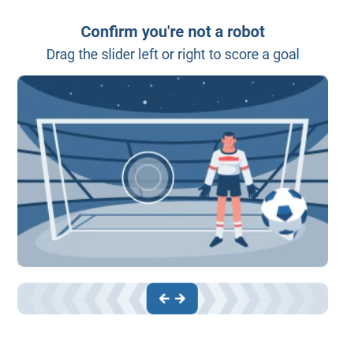
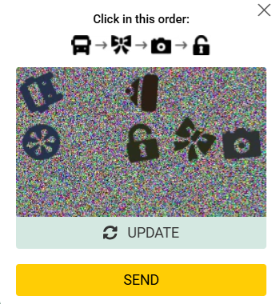
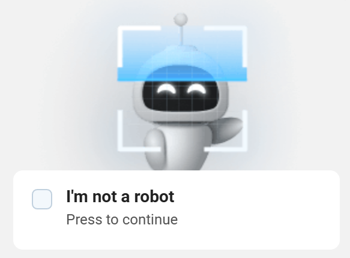

import Tabs from '@theme/Tabs';
import TabItem from '@theme/TabItem';
import ParamItem from '@theme/ParamItem';
import MethodItem from '@theme/MethodItem';
import ImageWrap from '@theme/ImageWrap';
import ImagesLayout from '@theme/ImagesLayout';
import MethodDescription from '@theme/MethodDescription';
import PriceBlock from '@theme/PriceBlock';
import PriceBlockWrap from '@theme/PriceBlockWrap';
import { ArticleHead } from '../../../../../src/theme/ArticleHead';

<ArticleHead slug="captchas/hunt-task" />

# Hunt Captcha

<PriceBlockWrap>
  <PriceBlock title="Hunt" captchaId="hunt"/>
</PriceBlockWrap>

Hunt CAPTCHA 是一种反机器人系统，会分析用户行为，并在检测到可疑活动时启动交互式验证。

## 任务示例

以下是目前 CapMonster Cloud 服务支持的 Hunt Captcha 任务类型示例：

<ImagesLayout gap="16px" columns={3}>
  <ImageWrap title="Puzzle CAPTCHA"></ImageWrap>
  <ImageWrap title="Click CAPTCHA"></ImageWrap>
  <ImageWrap title="Checkbox CAPTCHA"></ImageWrap>
</ImagesLayout>

CapMonster Cloud 支持：

- 生成 X-HD；
- 通过 `meta.token` 解决 CAPTCHA；
- 通过 `widgetUrl` 解决 CAPTCHA。

:::warning 注意：

执行此任务时，请使用**您自己的代理**。

:::

## 选择场景

| 场景 | `metadata` 中的参数 | 结果 |
| --- | --- | --- |
| 生成 X-HD | `apiGetLib` | X-HD |
| 通过 `meta.token` 解决 | `apiGetLib`, `data` | CAPTCHA 解决令牌 |
| 通过 `widgetUrl` 解决 | `apiGetLib`, `widgetUrl` | CAPTCHA 解决令牌 |


如果页面中可以获取完整的组件链接，请使用 `widgetUrl`。在此场景中，无需获取 X-HD 和 `meta.token`。

如果无法获取 `widgetUrl`，请先生成 X-HD，从网站获取 `meta.token`，然后使用 `data` 参数创建任务（*详情请参阅[通过 data 解决 Hunt CAPTCHA 的示例](#通过-data-解决-hunt-captcha-的示例)*）。


## 请求参数
<br />
<span style={{ fontSize: "15px", fontWeight: 700 }}>
>  重要：部分参数值是动态的，每次渲染包含 Hunt 的页面时都会发生变化。  
> 请在创建任务前立即提取这些参数，以避免解决过程中出现错误。
> 自动提取参数的示例请参阅[如何获取 widgetUrl](#如何获取-widgeturl)和[通过 data 解决 Hunt CAPTCHA 的示例](#通过-data-解决-hunt-captcha-的示例)。
</span>
<br />

<div className="bordered-panel">
<ParamItem title="type" required type="string" />
**CustomTask**

---

<ParamItem title="class" required type="string" />
**HUNT**

---

<ParamItem title="websiteURL" required type="string" />

使用 Hunt CAPTCHA 的页面完整 URL。

---

<ParamItem title="apiGetLib (位于 metadata 中)" required type="string" />

`api.js` 文件的完整链接。

示例：

```text
https://example.com/hd-api/external/apps/<app-hash>/api.js
```

在 DevTools 的 **Network** 选项卡中查找对 `api.js` 的请求。可使用 `hd-api` 或 `api.js` 进行搜索。

---

<ParamItem title="data（位于 metadata 中）" type="string" />

从网站获取的 `meta.token` 值。

**重要**：仅在通过 `meta.token` 解决 CAPTCHA 时传递。不要与 `widgetUrl` 同时使用。

---

<ParamItem title="widgetUrl（位于 metadata 中）" type="string" />

Hunt CAPTCHA 组件的完整 URL。

示例：

```text
https://captcha.example.com/widget?hash=<widget-hash>
```

**重要**：请传递完整链接，包括域名、路径和请求参数。不要与 `data` 同时使用。

---

<ParamItem title="userAgent" type="string" />
浏览器 User-Agent。请使用 CapMonster Cloud 当前支持的值：`userAgentPlaceholder`<br />

可通过以下地址获取最新值：[https://capmonster.cloud/api/useragent/actual](https://capmonster.cloud/api/useragent/actual)。

---

<ParamItem title="proxyType" required type="string" />
**http** - 常规 HTTP/HTTPS 代理；<br />
**https** - 当 http 不可用时使用（某些自定义代理必填）；<br />
**socks4** - SOCKS4 代理；<br />
**socks5** - SOCKS5 代理。

---

<ParamItem title="proxyAddress" required type="string" />
<p>
代理 IP 地址（IPv4/IPv6）。禁止使用：
- 透明代理
- 本地机器代理
</p>

---

<ParamItem title="proxyPort" required type="integer" />
代理端口

---

<ParamItem title="proxyLogin" required type="string" />
代理登录名

---

<ParamItem title="proxyPassword" required type="string" />
代理密码

</div>

## 创建任务的方法

使用 [createTask](/docs/api/methods/create-task/) 方法：

<MethodItem>

```http
https://api.capmonster.cloud/createTask
```

</MethodItem>
<br />


### 生成 X-HD

仅在 `metadata` 中传递 `apiGetLib`。

<div className="method-panel">
  <MethodDescription>

**请求示例**

```json
{
  "clientKey": "API_KEY",
  "task": {
    "type": "CustomTask",
    "class": "HUNT",
    "websiteURL": "https://yourwebsite.com/page-with-hunt",
    "metadata": {
      "apiGetLib": "https://example.com/hd-api/external/apps/<app-hash>/api.js"
    },
    "userAgent": "userAgentPlaceholder",
    "proxyType": "your-proxy-type",
    "proxyAddress": "your-proxy-address",
    "proxyPort": 1234,
    "proxyLogin": "your-proxy-login",
    "proxyPassword": "your-proxy-password"
  }
}
```

**响应示例**

```json
{
  "errorId": 0,
  "taskId": 407533072
}
```

  </MethodDescription>
</div>

### 通过 `meta.token` 解决

如果无法获取 `widgetUrl` 参数，请使用此方案。

#### 步骤 1：获取 X-HD

1. 创建任务时仅传递 `apiGetLib`。
2. 从 `getTaskResult` 响应中获取 X-HD。

#### 步骤 2：获取 `meta.token`

将获取到的 X-HD 发送到目标网站，例如在请求短信验证码时。

.png)

-1.png)

如果网站要求进行 CAPTCHA 验证，将返回类似以下内容的响应：

```json
{
  "errors": [
    {
      "code": "113",
      "title": "Captcha error"
    }
  ],
  "meta": {
    "token": "SITE_META_TOKEN"
  }
}
```

.png)

#### 步骤 3：解决 CAPTCHA

创建一个新任务，并传递：

- `apiGetLib`；
- 在 `data` 参数中传递获取到的 `meta.token`。

<div className="method-panel">
  <MethodDescription>

**请求示例**

```json
{
  "clientKey": "API_KEY",
  "task": {
    "type": "CustomTask",
    "class": "HUNT",
    "websiteURL": "https://example.com/page-with-hunt",
    "metadata": {
      "apiGetLib": "https://example.com/hd-api/external/apps/<app-hash>/api.js",
      "data": "SITE_META_TOKEN"
    },
    "userAgent": "userAgentPlaceholder",
    "proxyType": "your-proxy-type",
    "proxyAddress": "your-proxy-address",
    "proxyPort": 1234,
    "proxyLogin": "your-proxy-login",
    "proxyPassword": "your-proxy-password"
  }
}
```

**响应示例**

```json
{
  "errorId": 0,
  "taskId": 407533072
}
```

  </MethodDescription>
</div>


### 通过 `widgetUrl` 解决

如果页面中可以获取 Hunt CAPTCHA 组件的完整链接，请使用此场景。

无需获取 X-HD 和 `meta.token`。

#### 如何获取 `widgetUrl`

1. 打开包含 Hunt CAPTCHA 的页面。
2. 打开 DevTools，并切换到 **Network** 选项卡。
3. 执行会触发 CAPTCHA 的操作。
4. 使用 `widget` 或 `hash` 关键字查找请求。
5. 复制完整的 **Request URL**。
6. 将其传递到 `widgetUrl`（位于 `metadata` 内）。


<br />

:::warning 重要：

请在同一会话中、创建任务前立即获取当前有效的 `widgetUrl`。

不要只传递 `hash` 值：服务需要完整 URL。

:::

<div className="method-panel">
  <MethodDescription>

**请求示例**

```json
{
  "clientKey": "API_KEY",
  "task": {
    "type": "CustomTask",
    "class": "HUNT",
    "websiteURL": "https://example.com/page-with-hunt",
    "metadata": {
      "apiGetLib": "https://example.com/hd-api/external/apps/<app-hash>/api.js",
      "widgetUrl": "https://captcha.example.com/widget?hash=<widget-hash>"
    },
    "userAgent": "userAgentPlaceholder",
    "proxyType": "your-proxy-type",
    "proxyAddress": "your-proxy-address",
    "proxyPort": 1234,
    "proxyLogin": "your-proxy-login",
    "proxyPassword": "your-proxy-password"
  }
}
```

**响应示例**

```json
{
  "errorId": 0,
  "taskId": 407533072
}
```

  </MethodDescription>
</div>

## 获取任务结果的方法

使用 [getTaskResult](/docs/api/methods/get-task-result/) 方法获取 X-HD 指纹或 Hunt CAPTCHA 解决结果：

<MethodItem>

```http
https://api.capmonster.cloud/getTaskResult
```

</MethodItem>
<br />


<div className="method-panel-full">
  <MethodDescription>

**请求示例**

```json
{
  "clientKey": "API_KEY",
  "taskId": 407533072
}
```

**响应示例**

```json
{
  "errorId": 0,
  "status": "ready",
  "solution": {
    "data": {
      "token": "6IyDCCpDdSK...YGs1Wug/z/kLNSpjewI="
    }
  }
}
```

  </MethodDescription>
</div>
<br />

`solution.data.token` 的值取决于所选场景：

- 生成 X-HD 时，该字段包含 X-HD；
- 通过 `data` 解决时，该字段包含 CAPTCHA 解决令牌；
- 通过 `widgetUrl` 解决时，该字段包含 CAPTCHA 解决令牌。

## Cookie 的使用

:::warning 重要：
目标网站可能会使用特定 **Cookie** 管理会话。如果缺少这些 Cookie，或请求中未传递这些 Cookie，服务器可能会拒绝请求或要求重新验证。
:::

**从网站获取的 Cookie 示例：**

```text
platform_type=desktop; typeBetNames=full; _glhf=1234567890; coefview=0; visit=1-123abc012345d1be726746568edc62d9; fast_coupon=true;
v3fr=1; lng=en; flaglng=en; SESSION=12a3aea8cdcfdbb9e7df8ee99b526a84; auid=ab0dW2mqlz1Tjo2AAwplAg==; ggru=195; che_g=12abcede-691f-c7b2-d1e8-8488bc557d98
```


**Cookie 的一般工作原理：**

1. 首先打开网站页面，或向所需页面发送 GET 请求。这样服务器就可以初始化用户会话并设置必要的 Cookie。

2. 服务器通过响应头 `Set-Cookie` 返回 Cookie。这些 Cookie 可能包含会话标识符、安全参数和反机器人保护数据。

3. 请保存收到的 Cookie，因为后续请求会使用它们识别客户端。

4. 向 API 发送后续请求时，应在 `Cookie` 请求头中将 Cookie 传回服务器，以便服务器识别该请求属于同一会话。

5. 所有请求都应在同一会话中执行，并使用相同的 IP（或代理）和 User-Agent。否则，服务器可能会将请求视为可疑请求，并要求重新验证。

6. 部分 Cookie 可能在客户端生成，例如由页面中的 JavaScript 创建。在自动化或测试过程中，有时需要从浏览器中提取这些 Cookie，或以类似方式生成。


## 通过 `data` 解决 Hunt CAPTCHA 的示例

下面提供了通过 X-HD 和 `meta.token` 解决问题的完整示例。如果无法获取 `widgetUrl`，请使用此示例。

代码展示了如何：

* 打开网站页面时获取初始 Cookie；
* 生成可能在客户端创建的其他 Cookie；
* 通过 CapMonster Cloud 创建网站用于验证请求的**指纹（X-HD）**；
* 向网站 API 发送请求以触发操作，例如发送短信；
* 将获得的数据发送到 CAPTCHA 解决服务；
* 获取解决结果后，使用必要参数向 API 发送最终请求。

:::warning 重要：
请使用最新的 HTTP 请求头（详情请参阅[此部分](/docs/api/headers/)）以及[正确的 `User-Agent`](https://capmonster.cloud/api/useragent/actual)。
:::

<Tabs className="full-width-tabs filled-tabs request-tabs" groupId="captcha-type">

  <TabItem value="js" label="JavaScript" default className="method-panel">
<details>
      <summary>显示代码（Node.js）</summary>
```js
import { gotScraping } from "got-scraping";
import crypto from "crypto";

/* ================= CONFIG (建议保存在 .env 中) ================= */
// CapMonster Cloud API、网站和用户数据设置

const API_KEY = "YOUR_API_KEY"; // 您的 CapMonster Cloud API 密钥
const SOLVER_URL = "https://api.capmonster.cloud";

const BASE_URL = "https://example.com"; // 网站基础 URL
const API_GET_LIB =
  "https://example.com/hd-api/external/apps/a1047eab1035d58682a53557e0b2a75edbfd15fd/api.js"; // 网站的 api.js

const PHONE = "91123456789"; // 用于注册的电话号码（不含国家代码）
const COUNTRY_CODE = "54"; // 国家代码

const UA = "userAgentPlaceholder"; // 请求使用的 User-Agent

/* ================= 代理设置 ================= */

const PROXY_HOST = "proxyAddress";
const PROXY_PORT = 8080;
const PROXY_USER = "proxyLogin";
const PROXY_PASS = "proxyPassword";

const PROXY = `http://${PROXY_USER}:${PROXY_PASS}@${PROXY_HOST}:${PROXY_PORT}`;

/* ================= HEADERS ================= */
// HTTP 请求头
// htmlHeaders — 用于页面 GET 请求
// apiHeaders — 用于网站 API 请求

const htmlHeaders = {
  accept:
    "text/html,application/xhtml+xml,application/xml;q=0.9,image/avif,image/webp,image/apng,*/*;q=0.8,application/signed-exchange;v=b3;q=0.7",
  "accept-encoding": "gzip, deflate, br, zstd",
  "accept-language": "en-US,en;q=0.9,ru;q=0.8",
  "cache-control": "no-cache",
  pragma: "no-cache",
  priority: "u=0, i",
  "sec-ch-ua": `"Not:A-Brand";v="99", "Google Chrome";v="151", "Chromium";v="151"`,
  "sec-ch-ua-mobile": "?0",
  "sec-ch-ua-platform": `"Windows"`,
  "sec-fetch-dest": "document",
  "sec-fetch-mode": "navigate",
  "sec-fetch-site": "none",
  "sec-fetch-user": "?1",
  "upgrade-insecure-requests": "1",
  "user-agent": UA,
};

const apiHeaders = {
  accept: "application/vnd.api+json",
  "accept-encoding": "gzip, deflate, br, zstd",
  "accept-language": "en-US,en;q=0.9,ru;q=0.8",
  "cache-control": "no-cache",
  pragma: "no-cache",
  priority: "u=1, i",
  "content-type": "application/vnd.api+json",
  origin: BASE_URL,
  referer: BASE_URL + "/", // 网站当前有效的 referer
  "sec-ch-ua": `"Not:A-Brand";v="99", "Google Chrome";v="151", "Chromium";v="151"`,
  "sec-ch-ua-mobile": "?0",
  "sec-ch-ua-platform": `"Windows"`,
  "sec-fetch-dest": "empty",
  "sec-fetch-mode": "cors",
  "sec-fetch-site": "same-origin",
  "user-agent": UA,
  "x-requested-with": "XMLHttpRequest",
};

/* ================= UTILS ================= */
// 辅助函数

const delay = (ms) => new Promise((r) => setTimeout(r, ms));

function randomString(len = 20) {
  const chars =
    "ABCDEFGHIJKLMNOPQRSTUVWXYZabcdefghijklmnopqrstuvwxyz0123456789";
  let result = "";
  for (let i = 0; i < len; i++) {
    result += chars[Math.floor(Math.random() * chars.length)];
  }
  return result;
}

/* ================= CAPMONSTER CLOUD ================= */
// 创建任务并等待 CAPTCHA 解决结果

async function createTask(task) {
  const { body } = await gotScraping.post(`${SOLVER_URL}/createTask`, {
    json: { clientKey: API_KEY, task },
    responseType: "json",
  });

  if (body.errorId !== 0)
    throw new Error("createTask error: " + JSON.stringify(body));

  return body.taskId;
}

async function waitResult(taskId) {
  while (true) {
    const { body } = await gotScraping.post(`${SOLVER_URL}/getTaskResult`, {
      json: { clientKey: API_KEY, taskId },
      responseType: "json",
    });

    if (body.status === "ready")
      return body.solution?.token || body.solution?.data?.token;

    await delay(3000);
  }
}

/* ================= MAIN FLOW ================= */
// 带 CAPTCHA 的自动注册主流程

(async () => {
  try {
    // ---------------- STEP 1: 获取 Cookie ----------------
    console.log("STEP 1 — Getting cookies...");

    const base = await gotScraping.get(
      BASE_URL + "/registration?type=phone_reg", // 替换为网站当前有效的注册页面
      {
        headers: htmlHeaders,
        proxyUrl: PROXY,
      },
    );

    // 保存服务器返回的 Cookie
    let cookies = (base.headers["set-cookie"] || [])
      .map((c) => c.split(";")[0])
      .join("; ");

    // 生成在客户端创建的其他 Cookie
    const che_g = crypto.randomUUID();
    const ggru = randomString();

    cookies += `; che_g=${che_g}`;
    cookies += `; ggru=${ggru}`;

    console.log("Cookies:", cookies);

    // ---------------- STEP 2: 创建指纹 ----------------
    console.log("\nSTEP 2 — Creating fingerprint...");

    const fingerprintTaskId = await createTask({
      type: "CustomTask",
      class: "HUNT",
      websiteURL: BASE_URL + "/",
      userAgent: UA,
      metadata: { apiGetLib: API_GET_LIB },
      proxyType: "http",
      proxyAddress: PROXY_HOST,
      proxyPort: PROXY_PORT,
      proxyLogin: PROXY_USER,
      proxyPassword: PROXY_PASS,
    });

    const xhd = await waitResult(fingerprintTaskId);
    console.log("X-HD:", xhd);

    // ---------------- STEP 3: 发送短信请求 ----------------
    console.log("\nSTEP 3 — Trigger SMS...");

    const smsResp = await gotScraping.post(
      BASE_URL + "/web-api/api/web/registration/v2/sms", // 替换为网站当前有效的 API 端点
      {
        headers: { ...apiHeaders, cookie: cookies, "x-hd": xhd },
        json: {
          data: { attributes: { phone: PHONE, country_code: COUNTRY_CODE } },
        },
        proxyUrl: PROXY,
        responseType: "json",
      },
    );

    const metaToken = smsResp.body?.meta?.token;
    if (!metaToken) {
      console.log("SMS response:", smsResp.body);
      throw new Error("meta.token not received");
    }

    console.log("meta.token:", metaToken);

    // ---------------- STEP 4: 解决 CAPTCHA ----------------
    console.log("\nSTEP 4 — Solving Hunt captcha...");

    const solveTaskId = await createTask({
      type: "CustomTask",
      class: "HUNT",
      websiteURL: BASE_URL + "/",
      userAgent: UA,
      metadata: { apiGetLib: API_GET_LIB, data: metaToken },
      proxyType: "http",
      proxyAddress: PROXY_HOST,
      proxyPort: PROXY_PORT,
      proxyLogin: PROXY_USER,
      proxyPassword: PROXY_PASS,
    });

    const captchaToken = await waitResult(solveTaskId);
    console.log("Captcha token:", captchaToken);

    // ---------------- STEP 5: 最终请求 ----------------
    console.log("\nSTEP 5 — Sending final request...");

    const finalResp = await gotScraping.post(
      BASE_URL + "/api/web/registration/v2/sms", // 替换为网站当前有效的 API 端点
      {
        headers: { ...apiHeaders, cookie: cookies, "x-hd": xhd },
        body: JSON.stringify({
          data: {
            attributes: {
              phone: PHONE,
              country_code: parseInt(COUNTRY_CODE),
              captcha: captchaToken,
            },
          },
        }),
        proxyUrl: PROXY,
      },
    );

    console.log("\nFINAL RESPONSE HEADERS:", finalResp.headers);
    console.log("\nFINAL RESPONSE BODY:", finalResp.body);
  } catch (err) {
    console.error("\nFATAL ERROR:");
    console.error(err);
  }
})();
```
</details>
</TabItem>

  <TabItem value="python" label="Python" default className="method-panel">
<details>
      <summary>显示代码</summary>
```python
import requests
import uuid
import random
import string
import time

# ================= CONFIG (建议保存在 .env 中) =================
# CapMonster Cloud API、网站和用户数据设置

API_KEY = "YOUR_CAPMONSTER_API_KEY"  # Замените на ваш API-ключ CapMonster Cloud
SOLVER_URL = "https://api.capmonster.cloud"

BASE_URL = "https://example.com"  # 网站基础 URL
API_GET_LIB = "https://example.com/hd-api/external/apps/c1e24d5857463de4393e3f1489b00ebd4495da64/api.js"  # 替换为网站当前有效的 api.js 链接

PHONE = "9102345678"  # 用于注册的电话号码（不含国家代码）
COUNTRY_CODE = "7"  # 国家代码

UA = "userAgentPlaceholder"  # User-Agent

# ================= 代理设置 =================

PROXY_HOST = "proxyAdress" 
PROXY_PORT = 8080
PROXY_LOGIN = "proxyLogin"
PROXY_PASSWORD = "proxyPassword"

PROXY = f"http://{PROXY_LOGIN}:{PROXY_PASSWORD}@{PROXY_HOST}:{PROXY_PORT}"

proxies = {
    "http": PROXY,
    "https": PROXY
}

# ================= HEADERS =================
# HTTP 请求头
# html_headers — 用于普通页面 GET 请求
# api_headers — для запросов к API сайта

html_headers = {
    "accept": "text/html,application/xhtml+xml,application/xml;q=0.9,image/avif,image/webp,image/apng,*/*;q=0.8",
    "accept-encoding": "gzip, deflate, br, zstd",
    "accept-language": "en-US,en;q=0.9,ru;q=0.8",
    "cache-control": "no-cache",
    "pragma": "no-cache",
    "priority": "u=0, i",
    "sec-ch-ua": '"Not:A-Brand";v="99", "Google Chrome";v="151", "Chromium";v="151"',
    "sec-ch-ua-mobile": "?0",
    "sec-ch-ua-platform": '"Windows"',
    "sec-fetch-dest": "document",
    "sec-fetch-mode": "navigate",
    "sec-fetch-site": "none",
    "sec-fetch-user": "?1",
    "upgrade-insecure-requests": "1",
    "user-agent": UA
}

api_headers = {
    "accept": "application/vnd.api+json",
    "accept-encoding": "gzip, deflate, br, zstd",
    "accept-language": "en-US,en;q=0.9,ru;q=0.8",
    "cache-control": "no-cache",
    "pragma": "no-cache",
    "priority": "u=1, i",
    "content-type": "application/vnd.api+json",
    "origin": BASE_URL,
    "referer": BASE_URL + "/zh", # 替换为网站当前有效的 referer
    "sec-ch-ua": '"Not:A-Brand";v="99", "Google Chrome";v="151", "Chromium";v="151"',
    "sec-ch-ua-mobile": "?0",
    "sec-ch-ua-platform": '"Windows"',
    "sec-fetch-dest": "empty",
    "sec-fetch-mode": "cors",
    "sec-fetch-site": "same-origin",
    "user-agent": UA,
    "x-requested-with": "XMLHttpRequest"
}

# ================= UTILS =================
# 辅助函数

def delay(ms):
    """暂停指定毫秒数"""
    time.sleep(ms / 1000)

def random_string(length=20):
    """生成随机字符串（字母和数字）"""
    chars = string.ascii_letters + string.digits
    return ''.join(random.choice(chars) for _ in range(length))

# ================= CAPMONSTER CLOUD =================
# 用于操作 CapMonster Cloud 的函数（创建任务并等待 CAPTCHA 解决结果）

def create_task(task):
    """在 CapMonster Cloud 中创建任务"""
    r = requests.post(
        SOLVER_URL + "/createTask",
        json={
            "clientKey": API_KEY,
            "task": task
        }
    )

    data = r.json()

    if data["errorId"] != 0:
        raise Exception("createTask error: " + str(data))

    return data["taskId"]

def wait_result(task_id):
    """等待任务结果"""
    while True:
        r = requests.post(
            SOLVER_URL + "/getTaskResult",
            json={
                "clientKey": API_KEY,
                "taskId": task_id
            }
        )
        data = r.json()

        if data["status"] == "ready":
            solution = data.get("solution", {})
            return solution.get("token") or solution.get("data", {}).get("token")

        delay(3000)

# ================= SESSION =================
# 创建 requests 会话，以便在请求之间保留 Cookie

session = requests.Session()

# ================= MAIN =================
# 带 CAPTCHA 的自动注册主流程

try:

    # ---------------- STEP 1: 获取 Cookie ----------------
    print("STEP 1 — Getting cookies")

    r = session.get(
        BASE_URL + "/zh/registration?type=phone", # 替换为网站当前有效的注册页面
        headers=html_headers,
        proxies=proxies
    )

    # 保存服务器返回的 Cookie
    cookies = "; ".join([f"{c.name}={c.value}" for c in session.cookies])

    # 生成在客户端创建的其他 Cookie
    che_g = str(uuid.uuid4())
    ggru = random_string()
    cookies += f"; che_g={che_g}"
    cookies += f"; ggru={ggru}"

    print("Cookies:", cookies)

    # ---------------- STEP 2: 创建指纹 ----------------
    print("\nSTEP 2 — Creating fingerprint")

    fingerprint_task = create_task({
        "type": "CustomTask",
        "class": "HUNT",
        "websiteURL": BASE_URL + "/zh/",
        "userAgent": UA,
        "metadata": {
            "apiGetLib": API_GET_LIB
        },
        "proxyType": "http",
        "proxyAddress": PROXY_HOST,
        "proxyPort": PROXY_PORT,
        "proxyLogin": PROXY_LOGIN,
        "proxyPassword": PROXY_PASSWORD
    })

    # Получаем результат (X-HD), который нужен 用于网站 API 请求
    xhd = wait_result(fingerprint_task)
    print("X-HD:", xhd)

    # ---------------- STEP 3: 发送短信请求 ----------------
    print("\nSTEP 3 — Trigger SMS")

    sms_resp = session.post(
        BASE_URL + "/web-api/api/web/registration/v2/sms", # 替换为网站当前有效的 API 端点
        headers={**api_headers, "cookie": cookies, "x-hd": xhd},
        json={
            "data": {
                "attributes": {
                    "phone": PHONE,
                    "country_code": COUNTRY_CODE
                }
            }
        },
        proxies=proxies
    )

    print("Status:", sms_resp.status_code)

    try:
        sms_data = sms_resp.json()
    except:
        print("Server returned non JSON:")
        print(sms_resp.text)
        raise Exception("Invalid JSON response")

    meta_token = sms_data.get("meta", {}).get("token")
    if not meta_token:
        print("SMS response:", sms_data)
        raise Exception("meta.token not received")

    print("meta.token:", meta_token)

    # ---------------- STEP 4: 解决 CAPTCHA ----------------
    print("\nSTEP 4 — Solving captcha")

    solve_task = create_task({
        "type": "CustomTask",
        "class": "HUNT",
        "websiteURL": BASE_URL + "/zh/",
        "userAgent": UA,
        "metadata": {
            "apiGetLib": API_GET_LIB,
            "data": meta_token
        },
        "proxyType": "http",
        "proxyAddress": PROXY_HOST,
        "proxyPort": PROXY_PORT,
        "proxyLogin": PROXY_LOGIN,
        "proxyPassword": PROXY_PASSWORD
    })

    captcha_token = wait_result(solve_task)
    print("Captcha token:", captcha_token)

    # ---------------- STEP 5: 最终请求 ----------------
    print("\nSTEP 5 — Final request")

    final = session.post(
        BASE_URL + "/web-api/api/web/registration/v2/sms", # 替换为网站当前有效的 API 端点
        headers={**api_headers, "cookie": cookies, "x-hd": xhd},
        json={
            "data": {
                "attributes": {
                    "phone": PHONE,
                    "country_code": int(COUNTRY_CODE),
                    "captcha": captcha_token
                }
            }
        },
        proxies=proxies
    )

    print("\nFINAL STATUS:", final.status_code)

    try:
        print(final.json())
    except:
        print(final.text)

except Exception as e:
    print("\nFATAL ERROR")
    print(e)
```
</details>
  </TabItem>

</Tabs>

## 使用 SDK 库

<Tabs className="full-width-tabs filled-tabs request-tabs" groupId="captcha-type1">
  <TabItem value="nodejs" label="JavaScript（浏览器）" className="method-panel">

<details>
<summary>生成 X-HD 参数</summary>

```js
// https://github.com/CapMonsterCloud/capmonster-nodejs-captcha-solver

import {
  CapMonsterCloudClientFactory,
  ClientOptions,
  HuntRequest
} from "@zennolab_com/capmonstercloud-client";

document.addEventListener("DOMContentLoaded", async () => {

  const API_KEY = "YOUR_API_KEY"; // 请指定您的 CapMonster Cloud API 密钥

  const client = CapMonsterCloudClientFactory.Create(
    new ClientOptions({ clientKey: API_KEY })
  );

  // 要解决 HUNT，必须使用您自己的代理
  const proxy = {
    proxyType: "http",
    proxyAddress: "123.45.67.89",
    proxyPort: 8080,
    proxyLogin: "username",
    proxyPassword: "password",
  };

  const huntRequest = new HuntRequest({
    websiteURL: "https://yourwebsite.com/page-with-hunt",
    userAgent: "userAgentPlaceholder",
    metadata: {
      apiGetLib: "your-api-get-lib-url",
    },
    proxy,
  });

  // 如有需要，可以检查余额
  const balance = await client.getBalance();
  console.log("Balance:", balance);

  const result = await client.Solve(huntRequest);
  console.log("Solution:", result.solution);
});
```

</details>

<details>
<summary>解决 CAPTCHA</summary>

```js
// https://github.com/CapMonsterCloud/capmonster-nodejs-captcha-solver

import {
  CapMonsterCloudClientFactory,
  ClientOptions,
  HuntRequest
} from "@zennolab_com/capmonstercloud-client";

document.addEventListener("DOMContentLoaded", async () => {

  const API_KEY = "YOUR_API_KEY"; // 请指定您的 CapMonster Cloud API 密钥

  const client = CapMonsterCloudClientFactory.Create(
    new ClientOptions({ clientKey: API_KEY })
  );

  // 要解决 HUNT，必须使用您自己的代理
  const proxy = {
    proxyType: "http",
    proxyAddress: "123.45.67.89",
    proxyPort: 8080,
    proxyLogin: "username",
    proxyPassword: "password",
  };

  const huntRequest = new HuntRequest({
    websiteURL: "https://yourwebsite.com/page-with-hunt",
    userAgent: "userAgentPlaceholder",
    metadata: {
      apiGetLib: "your-api-get-lib-url",
      data: "your-site-meta-token",
    },
    proxy,
  });

  // 如有需要，可以检查余额
  const balance = await client.getBalance();
  console.log("Balance:", balance);

  const result = await client.Solve(huntRequest);
  console.log("Solution:", result.solution);
});
```

</details>
</TabItem>

<TabItem value="nodejs1" label="Node.js" className="method-panel">

<details>
<summary>生成 X-HD 参数</summary>

```js
// https://github.com/CapMonsterCloud/capmonster-nodejs-captcha-solver

const {
  CapMonsterCloudClientFactory,
  ClientOptions,
  HuntRequest,
} = require("@zennolab_com/capmonstercloud-client");

const API_KEY = "YOUR_API_KEY"; // 请指定您的 CapMonster Cloud API 密钥

async function solveHunt() {
  const client = CapMonsterCloudClientFactory.Create(
    new ClientOptions({ clientKey: API_KEY }),
  );

  // 要解决 HUNT，必须使用您自己的代理
  const proxy = {
    proxyType: "http",
    proxyAddress: "123.45.67.89",
    proxyPort: 8080,
    proxyLogin: "username",
    proxyPassword: "password",
  };

  const huntRequest = new HuntRequest({
    websiteURL: "https://yourwebsite.com/page-with-hunt",
    userAgent: "userAgentPlaceholder",
    metadata: {
      apiGetLib: "your-api-get-lib-url",
    },
    proxy,
  });

  // 如有需要，可以检查余额
  const balance = await client.getBalance();
  console.log("Balance:", balance);

  const result = await client.Solve(huntRequest);
  console.log("Solution:", result.solution);
}

solveHunt().catch(console.error);
```

</details>

<details>
<summary>解决 CAPTCHA</summary>

```js
// https://github.com/CapMonsterCloud/capmonster-nodejs-captcha-solver

const {
  CapMonsterCloudClientFactory,
  ClientOptions,
  HuntRequest,
} = require("@zennolab_com/capmonstercloud-client");

const API_KEY = "YOUR_API_KEY"; // 请指定您的 CapMonster Cloud API 密钥

async function solveHunt() {
  const client = CapMonsterCloudClientFactory.Create(
    new ClientOptions({ clientKey: API_KEY }),
  );

  // 要解决 HUNT，必须使用您自己的代理
  const proxy = {
    proxyType: "http",
    proxyAddress: "123.45.67.89",
    proxyPort: 8080,
    proxyLogin: "username",
    proxyPassword: "password",
  };

  const huntRequest = new HuntRequest({
    websiteURL: "https://yourwebsite.com/page-with-hunt",
    userAgent: "userAgentPlaceholder",
    metadata: {
      apiGetLib: "your-api-get-lib-url",
      data: "your-site-meta-token",
    },
    proxy,
  });

  // 如有需要，可以检查余额
  const balance = await client.getBalance();
  console.log("Balance:", balance);

  const result = await client.Solve(huntRequest);
  console.log("Solution:", result.solution);
}

solveHunt().catch(console.error);
```

</details>
</TabItem>

  <TabItem value="python" label="Python" className="method-panel">

<details>
<summary>生成 X-HD 参数</summary>

```python
# https://github.com/CapMonsterCloud/capmonster-python-captcha-solver

import asyncio

from capmonstercloudclient import CapMonsterClient, ClientOptions
from capmonstercloudclient.requests import HuntCustomTaskRequest
from capmonstercloudclient.requests.proxy_info import ProxyInfo

API_KEY = "YOUR_API_KEY"  # 请指定您的 CapMonster Cloud API 密钥


async def solve_hunt():
    client = CapMonsterClient(
        options=ClientOptions(api_key=API_KEY)
    )

    # 要解决 HUNT，必须使用您自己的代理
    proxy = ProxyInfo(
        proxyType="http",
        proxyAddress="123.45.67.89",
        proxyPort=8080,
        proxyLogin="username",
        proxyPassword="password",
    )

    hunt_request = HuntCustomTaskRequest(
        websiteUrl="https://yourwebsite.com/page-with-hunt",
        userAgent="userAgentPlaceholder",
        metadata={
            "apiGetLib": "https://example.com/hd-api/external/apps/<app-hash>/api.js",
        },
        proxy=proxy,
    )

    # 如有需要，可以检查余额
    balance = await client.get_balance()
    print("Balance:", balance)

    result = await client.solve_captcha(hunt_request)
    print("Solution:", result)


asyncio.run(solve_hunt())
```

</details>

<details>
<summary>解决 CAPTCHA</summary>

```python
# https://github.com/CapMonsterCloud/capmonster-python-captcha-solver

import asyncio

from capmonstercloudclient import CapMonsterClient, ClientOptions
from capmonstercloudclient.requests import HuntCustomTaskRequest
from capmonstercloudclient.requests.proxy_info import ProxyInfo

API_KEY = "YOUR_API_KEY"  # 请指定您的 CapMonster Cloud API 密钥


async def solve_hunt():
    client = CapMonsterClient(
        options=ClientOptions(api_key=API_KEY)
    )

    # 要解决 HUNT，必须使用您自己的代理
    proxy = ProxyInfo(
        proxyType="http",
        proxyAddress="123.45.67.89",
        proxyPort=8080,
        proxyLogin="username",
        proxyPassword="password",
    )

    hunt_request = HuntCustomTaskRequest(
        websiteUrl="https://yourwebsite.com/page-with-hunt",
        userAgent="userAgentPlaceholder",
        metadata={
            "apiGetLib": "https://example.com/hd-api/external/apps/<app-hash>/api.js",
            "data": "your-site-meta-token",
        },
        proxy=proxy,
    )

    # 如有需要，可以检查余额
    balance = await client.get_balance()
    print("Balance:", balance)

    result = await client.solve_captcha(hunt_request)
    print("Solution:", result)


asyncio.run(solve_hunt())
```

</details>
  </TabItem>

  <TabItem value="csharp" label="C#" className="method-panel">

<details>
<summary>生成 X-HD 参数</summary>

```csharp
// https://github.com/CapMonsterCloud/capmonster-dotnet-captcha-solver

using System;
using System.Threading.Tasks;
using Newtonsoft.Json;
using Zennolab.CapMonsterCloud;
using Zennolab.CapMonsterCloud.Requests;

class Program
{
    static async Task Main(string[] args)
    {
        // 请指定您的 CapMonster Cloud API 密钥
        var clientOptions = new ClientOptions
        {
            ClientKey = "YOUR_API_KEY"
        };

        var cmCloudClient = CapMonsterCloudClientFactory.Create(clientOptions);

        // 要解决 HUNT，必须使用您自己的代理
        var huntRequest = new HuntCustomTaskRequest(
            "https://example.com/hd-api/external/apps/<app-hash>/api.js"
        )
        {
            WebsiteUrl = "https://yourwebsite.com/page-with-hunt",
            UserAgent = "userAgentPlaceholder",

            Proxy = new ProxyContainer(
                "123.45.67.89",
                8080,
                ProxyType.Http,
                "username",
                "password"
            )
        };

        // 如有需要，可以检查余额
        var balance = await cmCloudClient.GetBalanceAsync();
        Console.WriteLine("Balance: " + balance);

        var huntResult = await cmCloudClient.SolveAsync(huntRequest);

        Console.WriteLine("Solution:");
        Console.WriteLine(
            JsonConvert.SerializeObject(
                huntResult.Solution,
                Formatting.Indented
            )
        );
    }
}
```

</details>

<details>
<summary>解决 CAPTCHA</summary>

```csharp
// https://github.com/CapMonsterCloud/capmonster-dotnet-captcha-solver

using System;
using System.Threading.Tasks;
using Newtonsoft.Json;
using Zennolab.CapMonsterCloud;
using Zennolab.CapMonsterCloud.Requests;

class Program
{
    static async Task Main(string[] args)
    {
        // 请指定您的 CapMonster Cloud API 密钥
        var clientOptions = new ClientOptions
        {
            ClientKey = "YOUR_API_KEY"
        };

        var cmCloudClient = CapMonsterCloudClientFactory.Create(clientOptions);

        // 要解决 HUNT，必须使用您自己的代理
        var huntRequest = new HuntCustomTaskRequest(
            "https://example.com/hd-api/external/apps/<app-hash>/api.js",
            "your-site-meta-token"
        )
        {
            WebsiteUrl = "https://yourwebsite.com/page-with-hunt",
            UserAgent = "userAgentPlaceholder",

            Proxy = new ProxyContainer(
                "123.45.67.89",
                8080,
                ProxyType.Http,
                "username",
                "password"
            )
        };

        // 如有需要，可以检查余额
        var balance = await cmCloudClient.GetBalanceAsync();
        Console.WriteLine("Balance: " + balance);

        var huntResult = await cmCloudClient.SolveAsync(huntRequest);

        Console.WriteLine("Solution:");
        Console.WriteLine(
            JsonConvert.SerializeObject(
                huntResult.Solution,
                Formatting.Indented
            )
        );
    }
}
```

</details>
  </TabItem>
</Tabs>